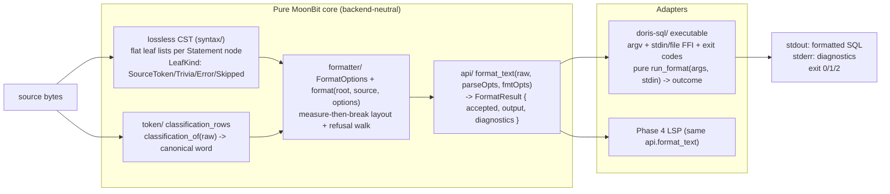

# Phase 3: Formatting and Safe Edits - Research

**Researched:** 2026-08-04
**Domain:** Lossless-CST-driven canonical SQL formatting, safe-edit refusal, and a native CLI adapter (MoonBit)
**Confidence:** HIGH for formatter architecture, refusal contract, and CLI mechanics (probe-verified against the pinned toolchain this session); MEDIUM for Doris-specific layout/style details that require corpus experiments

## Summary

Phase 3 delivers a deterministic, configurable canonical formatter over the Phase 1/2 lossless CST, plus a thin native `doris-sql format` CLI. The formatter is a **token-layout engine over the CST's flat leaf lists**, not an AST regenerator: it walks each statement node's ordered leaves, rewrites only keyword-token spelling, and rewrites only inter-token whitespace/newlines — comments, hints, quoted identifiers, string literals, and error material are never modified. Keyword case rewriting keys off the existing versioned `classification_rows` table in `token/token.mbt` (`classification_of`, token.mbt:450) — every word with a classification row renders in its canonical uppercase spelling; hints are lexer `Comment` trivia and are untouched by construction.

The critical engineering constraints discovered this session (all probe-verified with the pinned `moon 0.1.20260724` toolchain in `/tmp/mb-probe`):
1. **`@ffi` does not exist** on this toolchain ("Package ffi not found"), and `moonbitlang/core` has **no `fs` package** — file/stdin IO in the native CLI MUST be hand-rolled libc FFI (`extern "c"` + `#borrow`).
2. **MoonBit native `String` is UTF-16** (`moonbit_string_t = uint16_t*`) — a `String` passed to libc `fopen` is garbage; the CLI must pass `@utf8.encode(path)` as `Bytes` (which maps to `uint8_t*` data).
3. **`#borrow(param)` annotations on pointer FFI parameters are mandatory** (build fails without them), placed BEFORE the `extern "c"` declaration.
4. **Exit codes work** via `extern "c" fn probe_exit(code : Int) = "exit"`; stdin via POSIX `read(0, buf, n)`; stderr via `write(2, …)`; stdout via `println` (no `eprintln` exists).
5. **`moon test` runs test blocks inside executable packages** — D-40's moon-test-driven CLI tests can live in the CLI package, provided the CLI logic is factored into a pure `run_format(args, stdin_bytes) -> (exit_code, stdout, stderr)` function (no process-spawn exists in core).
6. An executable package dir named `doris-sql/` builds a binary literally named `doris-sql.exe`; `moon build --target native --release` outputs to `_build/native/release/build/<pkg>/<pkg>.exe`; `moon run <pkg> -- args` works for dev.

**Primary recommendation:** Create `formatter/` (library: `FormatOptions`, `FormatResult`, `format(root, source, options)` over the CST — imports only `syntax/`, `source/`, `token/`), extend `api/` with `format_text(raw, parse_options, format_options)` (mirrors `parse`, api.mbt:273, one internal parse, same `ParseResult`-style primitive result), and add a `doris-sql/` executable package whose pure `run_format` is moon-test driven. Refuse (D-33) by walking the CST for `Error`/`Skipped`/`Missing` nodes and `SourceError`/`SourceSkipped` leaves (syntax.mbt:2-44); emit a new `DORIS-FORMAT-001` diagnostic namespace (DORIS-PARSE-001..007 are taken). Idempotence is achieved by construction: use **measure-then-break** list layout (break decisions depend only on the token sequence, never on the running column), which cannot oscillate.

## Project Constraints (from CLAUDE.md)

Actionable directives the planner MUST honor (extracted from `/opt/source/Fathom/.claude/CLAUDE.md`):

| Directive | Constraint for Phase 3 |
|---|---|
| MoonBit single core, one implementation for Native + Wasm/JS | `formatter/` must be pure and backend-neutral (no IO, no FFI); all IO stays in the CLI executable package. |
| 源码保真: CST 节点必须保留 Span 与 trivia;格式化和后续编辑不能丢失注释、空白或换行 | Formatter must never drop/move comment bytes (D-36); trivia handling is a first-class contract with tests. |
| 解析策略: 手写递归下降 + Pratt;语句级 panic-mode 恢复 | Formatter relies on the existing CST shape (flat leaf lists per Statement); no parser changes allowed unless required and reviewed. |
| 覆盖基准: 官方文档为语法权威;版本化关键字分类 | Keyword case rewriting reuses the audited `classification_rows` table — never a second keyword list. |
| 语义边界: Parser 只负责语法 | Formatter is syntax-only; no catalog/name resolution. |
| 交付顺序: 先 SELECT 工业级,再 DML/DDL、格式化和生态 | Phase 3 formats the Phase 2 statement surface (SELECT/DML/DDL); formatting must not silently accept syntax the parser rejects. |
| GSD Workflow Enforcement: 直接 repo 编辑必须走 GSD workflow | All edits happen through planned tasks; research makes no source edits. |
| Pin toolchain (moon 0.1.20260724), use `moon.mod`/`moon.pkg` DSL, keep core dependency-light | CLI adds only libc FFI in the executable package; core packages gain no new third-party deps. |
| Printer 保持纯无损 replay (`print_lossless` 契约不变, D-27) | `printer/` is read-only this phase; the formatter is a separate package consuming the same CST. |

<user_constraints>
## User Constraints (from CONTEXT.md)

### Locked Decisions
### 格式化 API 与配置形态
- **D-25:** 配置形态为 `FormatOptions` 结构体(new 构造器 + 字段),沿用 Phase 1 `ParseOptions` 模式,不做字符串/JSON 配置解析。
- **D-26:** 配置字段仅限 FMT-02 的 6 项:keyword case、indent、line width、comma style、newline style、trailing newline;不增加额外配置项。
- **D-27:** 独立 `formatter/` moon 包消费无损 CST;`printer/` 保持纯无损 replay 不动,`print_lossless` 契约不变。
- **D-28:** keyword case 在 token 级实现:只重拼写关键字 token 文本,trivia、注释、提示词(hint)文本原样保留。

### 默认格式与策略
- **D-29:** 默认 keyword case 为 UPPERCASE(SQL 惯例,与 Doris 文档示例一致)。
- **D-30:** 默认缩进 2 空格,默认行宽 100 列。
- **D-31:** 默认 comma 风格为 trailing comma(多行列表)。
- **D-32:** 换行风格跟随输入(`\r\n` 输入保留 `\r\n`,默认 `\n`);trailing newline 默认补齐一个(输入无 trailing newline 时补,有则保留)。

### 安全与幂等契约 (FMT-03)
- **D-33:** 含 error/missing/skipped 节点的树**拒绝格式化**:返回结构化错误(含诊断),绝不对 error 树静默输出格式化结果。
- **D-34:** `format(format(x)) == format(x)` 对全部 corpus fixtures 与畸形/恢复输入测试,作为 CI 契约。
- **D-35:** 对支持输入,格式化输出必须重新解析成功且无新增诊断,测试断言。
- **D-36:** trivia/hint 为 token 级保留;格式器只重排 token 间空白与换行,永不移动注释文本。

### CLI 交付 (FMT-04)
- **D-37:** `doris-sql format` 为 native 可执行薄层(文件/stdin 输入),调用 api core,不在 CLI 实现格式逻辑。
- **D-38:** CLI 只做 IO/参数解析/退出码;格式与诊断逻辑全在 core;与 Phase 4 LSP 共享同一 core 入口。
- **D-39:** exit codes:0=成功;1=解析失败或格式化拒绝;2=用法错误。
- **D-40:** CLI 通过 moon test 集成测试驱动(覆盖文件/stdin/退出码/拒绝路径),非仅手工验证。

### Claude's Discretion
- 具体格式化算法(换行决策、子句缩进层级)、formatter 内部函数分解、CLI 参数细节(如 `--keyword-case` 覆盖、`--no-trailing-newline`)由 planner 决定,前提是上述 D-25..D-40 契约被保留。

### Deferred Ideas (OUT OF SCOPE)
None — discussion stayed within the Phase 3 boundary. LSP formatting edits, Wasm/JS format facade, and editor integrations remain in Phase 4; comment-aware reflow (moving comments between positions) and incremental formatting remain v2.
</user_constraints>

<phase_requirements>
## Phase Requirements

| ID | Description | Research Support |
|----|-------------|------------------|
| FMT-01 | Deterministic canonical rendering distinct from exact lossless replay, documented behavior for supported Doris syntax | `formatter.format` as a separate operation from `printer.print_lossless` (printer.mbt:28, untouched); documented layout rules per statement kind (Pattern 1-4); snapshot goldens per corpus fixture. |
| FMT-02 | 6 configurable dimensions (keyword case, indent, line width, comma style, newline style, trailing newline) with comments+hints attached to intended regions | `FormatOptions` with exactly 6 fields mirroring `ParseOptions` (api.mbt:64,273); token-level case rewrite via `classification_of` (token.mbt:450); comment attachment rule = "newline in original trivia → own line" (Pattern 3); hints are lexer Comment trivia (token.mbt:496-508, `is_trivia` 521) so never rewritten/moved. |
| FMT-03 | Idempotent output, output reparses, refuses/reports unsafe transformations on error trees | Measure-then-break layout (idempotent by construction, Pattern 2); refusal walk of `Error`/`Skipped`/`Missing`/`SourceError`/`SourceSkipped` (syntax.mbt:2-44, `is_error`/`is_skipped`/`is_missing`); `DORIS-FORMAT-001` structured diagnostic; corpus-driven idempotence+reparse harness (Pattern 6) mirroring `metadata_fixture_replay_ok` (test/parser_test.mbt:473). |
| FMT-04 | `doris-sql format` over file/stdin; formatted SQL + diagnostics; non-zero status for invalid input | Executable package `pkgtype(kind: "executable")` probe-verified; libc FFI file/stdin (probe-verified); `api.format_text` shared core entry; exit 0/1/2 via `extern "c" fn ... = "exit"` (probe-verified); moon-test-driven pure `run_format` (probe-verified `moon test` in executable packages). |
</phase_requirements>

## Architectural Responsibility Map

| Capability | Primary Tier | Secondary Tier | Rationale |
|------------|-------------|----------------|-----------|
| Keyword case rewriting | API/Core (formatter/) | token/ (classification table) | Token-level rewrite is a pure CST+classification transform; no IO or protocol involved. |
| Layout (indent, line width, commas, newlines) | API/Core (formatter/) | — | Deterministic single-pass transform over CST leaves; must be shared by CLI (Phase 3) and LSP (Phase 4) so it belongs in core, not the adapter. |
| Comment/hint attachment | API/Core (formatter/) | — | Attachment rule reads original trivia (newline presence); same rule must apply in LSP formatting later. |
| Refusal / structured errors | API/Core (formatter/ + api/) | CLI (exit-code mapping) | Refusal detection is a CST property (core); the CLI only maps it to exit code 1. |
| File/stdin IO | CLI (doris-sql/ executable) | — | libc FFI is native-only; must never enter core (Wasm/JS targets cannot use it). |
| Arg parsing + exit codes | CLI (doris-sql/ executable) | — | D-38: CLI owns IO/args/exit codes only; D-39 exit semantics tested via moon test. |
| Reparse + idempotence verification | Test tier (test/ + CLI tests) | — | D-34/D-35 are CI contracts, asserted by tests; not a runtime cost in the format path. |
| LSP formatting edits (ECO-02) | Phase 4 adapter | api/ (format_text) | This phase only keeps the core callable per-document and byte-offset based (D-01); range-edit computation is Phase 4. |

## Standard Stack

### Core
| Library | Version | Purpose | Why Standard |
|---------|---------|---------|--------------|
| `moonbitlang/core` (builtin `Bytes`, `println`) | `0.10.5+5e7afb0c0` at `/opt/moonbit/lib/core` [VERIFIED: toolchain probe] | Compiler-builtin `Bytes` (byte arrays), stdout `println` | `Bytes` maps to `uint8_t*` in native FFI (verified via generated C and runtime header); no import needed. |
| `moonbitlang/core/buffer` | same core [VERIFIED: probe] | `@buffer.Buffer::Buffer(size_hint=…)`, `write_bytes(BytesView)`, `to_bytes() -> Bytes` | Verified linear output accumulation — the formatter's output buffer; avoids printer's per-leaf `output + bytes` allocation pattern. |
| `moonbitlang/core/env` | same core [VERIFIED: probe] | `@env.args() -> Array[String]` (arg[0] = exe path) | Verified argv access for the CLI; also `get_env_var`. |
| `moonbitlang/core/encoding/utf8` | same core [VERIFIED: probe] | `@utf8.encode(String) -> Bytes` | Required because native MoonBit `String` is UTF-16 (`moonbit_string_t = uint16_t*`, moonbit.h:321) — libc paths/messages must be UTF-8 `Bytes`. |
| libc (fopen/fread/fclose/read/write/exit) | glibc via `/usr/bin/gcc` [VERIFIED: probe] | File read, stdin read, stderr write, exit codes | The ONLY available IO surface — no `@ffi`, no core `fs`, no `eprintln` on this toolchain [VERIFIED: probe + core listing]. |

### Supporting
| Library | Version | Purpose | When to Use |
|---------|---------|---------|-------------|
| `moonbitlang/core/argparse` | same core [VERIFIED: package listing] | `FlagArg`/`OptionArg`/`PositionArg`/`Matches` CLI parsing | Optional; recommend hand-rolled parsing for this 3-flag CLI to keep exit-code semantics (D-39) fully explicit — argparse exits 0 itself on `--help` (`print_and_exit_success`, runtime_exit.mbt:24-26) and adds rendering machinery a thin CLI does not need. |
| `moonbitlang/core/json` | same core | Diagnostic/result serialization | Not needed this phase; Phase 4 LSP/facade decision. |

### Alternatives Considered
| Instead of | Could Use | Tradeoff |
|------------|-----------|----------|
| Hand-rolled libc FFI for file/stdin | `moonbitlang/x/fs` | `x` is NOT installed offline (`/opt/moonbit/lib` contains only core) and is experimental per STACK.md; libc FFI is ~40 lines, probe-verified, native-only. |
| Hand-rolled arg parsing | `@argparse` | argparse is in core and full-featured, but owns help/exit behavior; hand-rolled gives exact D-39 exit codes with zero surprises. |
| Measure-then-break layout | Prettier-style doc/IR with backtracking | Doc-IR is overkill for flat-leaf CST and risks non-idempotence (Pitfall 1); measure-then-break is provably idempotent. |

**Installation:** No new packages. All dependencies are already-pinned `moonbitlang/core` packages present at `/opt/moonbit/lib/core` (offline). The CLI adds only libc symbols via `extern "c"` declarations in the executable package — no link flags, no C sources.

**Version verification:**
```bash
moon version          # moon 0.1.20260724 (5f1406a 2026-07-24) — pinned in moon.mod
ls /opt/moonbit/lib/core/{buffer,env,encoding/utf8,argparse}  # present [VERIFIED]
```

## Package Legitimacy Audit

**No external packages are installed by this phase** — every dependency is an already-pinned `moonbitlang/core` package physically present at `/opt/moonbit/lib/core` and probe-verified this session. The seam (`gsd-tools` / `research-plan`, `package-legitimacy check`) is unavailable in this offline environment (no local gsd-core install), and all search providers are disabled in `.planning/config.json`. No registry installs occur, so there is no slopsquatting surface: the only "new" code is local MoonBit source in `formatter/`, `api/`, and `doris-sql/`.

| Package | Registry | Age | Downloads | Source Repo | Verdict | Disposition |
|---------|----------|-----|-----------|-------------|---------|-------------|
| (none — core only, already pinned) | n/a | n/a | n/a | github.com/moonbitlang/core | OK | Approved — no installs |

**Packages removed due to [SLOP] verdict:** none
**Packages flagged as suspicious [SUS]:** none — planner adds no `checkpoint:human-verify` install gates this phase.

## Architecture Patterns

### System Architecture Diagram



Data flow: one parse produces the CST; the formatter walks each Statement node's leaves in source order; keyword leaves are re-spelled via `classification_of`; trivia is re-emitted (never re-spelled); layout emits the canonical byte stream; the api layer serializes diagnostics. The CLI is a pure function `run_format(args, input_bytes) -> (exit_code, stdout_bytes, stderr_bytes)`; `fn main` only wires argv/stdin/file/stdout/stderr/exit to it — this keeps D-40 testable with `moon test` (probe-verified that executable packages run test blocks).

### Recommended Project Structure

```
formatter/                  # NEW library — D-27
├── moon.pkg                # imports: source, token, syntax (one-way; NO api/parser/printer)
├── options.mbt             # KeywordCase/CommaStyle/NewlineStyle enums, FormatOptions (6 fields),
│                           #   FormatOptions::default/new + field accessors (ParseOptions mirror)
├── error.mbt               # FormatError (Unknown* / Invalid* / InvalidTree), FormatDiagnostic,
│                           #   FormatResult { accepted, output, diagnostics, source_byte_length }
├── refuse.mbt              # tree_walk_refusal(root): Error/Skipped/Missing + SourceError/Skipped scan
├── case.mbt                # rewrite_keyword(raw) -> Bytes via @token.classification_of
├── layout.mbt              # Layout struct (buffer, column, indent, newline bytes),
│                           #   clause tables per statement kind, list measure-then-break,
│                           #   comment attachment rule, trailing-newline policy
└── format.mbt              # pub fn format(root, source, options) -> FormatResult
api/                        # EXTEND (api.mbt)
└── api.mbt                 # + FormatOptions re-export, format_text(raw, parse_options, fmt_options)
                            #   -> Result[FormatResult, ParseError] (mirrors parse, api.mbt:273)
doris-sql/                  # NEW executable package — D-37 (dir name = binary name, probe-verified)
├── moon.pkg                # pkgtype(kind: "executable"); imports api, env, buffer, encoding/utf8
├── ffi.mbt                 # extern "c" fopen/fread/fclose/read/write/exit with #borrow
├── args.mbt                # parse_args(args) -> Command | UsageError  (pure)
├── run.mbt                 # run_format(command, stdin_bytes) -> (exit_code, stdout, stderr) (pure)
└── main.mbt                # fn main: argv -> stdin/file bytes -> run_format -> IO -> exit
test/
├── formatter_test.mbt      # NEW: corpus-driven idempotence + reparse + refusal + layout goldens
└── moon.pkg                # + formatter import (test package already imports api/parser/printer/...)
```

### Pattern 1: Formatter walks the flat-leaf CST with per-statement clause tables

**What:** The CST stores each statement as a `Statement` node wrapping one family node (`Select`, `Insert`, `Update`, `Delete`, `Merge`, `CreateTable`, …) whose children are **flat, ordered leaves** (trivia + tokens) — the parser builds them via `segment_children_for_events`/`leaf_for_token` (parser.mbt:3188-3196), where `Whitespace|Newline|Comment|Bom → SourceTrivia`, `Error → SourceError`, `Unknown → SourceSkipped`, everything else `SourceToken`. There is **no per-token TokenKind and no keyword-vs-identifier role stored in the CST** — leaves carry only kind + span (syntax.mbt:2-44).

**When to use:** Always — this is the formatter's only input contract (D-27). Do not invent a second tree; do not modify `printer/`.

**Consequences for design:**
- Token roles (keyword/identifier/literal/symbol) are re-derived from the raw bytes via `source.slice(leaf.span)` and `@token.classification_of` (token.mbt:450) plus byte-shape checks (`(`, `,`, `;`, `=`, quotes…). This is deterministic and parser-consistent because the classification table is the parser's own keyword authority (D-13/D-14).
- Statement-kind clause tables (e.g., `Select → [FROM, WHERE, GROUP, HAVING, ORDER, LIMIT, QUALIFY, WINDOW, UNION, JOIN, ON, INTO, EXCEPT]`) decide hard line breaks. Clause words are matched case-insensitively against the raw token bytes, mirroring the parser's `consume_word` (parser.mbt:300-306).

```moonbit
// Source: verified in-repo CST shape (syntax/syntax.mbt:2-44, parser/parser.mbt:3188-3196)
// Sketch: formatter/layout.mbt — per-kind clause break table
fn clause_breaks(kind : @syntax.SyntaxKind) -> Array[Bytes] {
  match kind {
    @syntax.SyntaxKind::Select => [b"FROM", b"WHERE", b"GROUP", b"HAVING", b"ORDER", b"LIMIT",
      b"QUALIFY", b"WINDOW", b"UNION", b"JOIN", b"ON", b"INTO", b"EXCEPT"]
    @syntax.SyntaxKind::Insert => [b"INTO", b"VALUES", b"SELECT", b"PARTITION", b"WITH", b"LABEL"]
    @syntax.SyntaxKind::Update => [b"SET", b"FROM", b"WHERE", b"ORDER", b"LIMIT", b"JOIN", b"ON"]
    @syntax.SyntaxKind::Delete => [b"FROM", b"PARTITION", b"PARTITIONS", b"USING", b"WHERE",
      b"ORDER", b"LIMIT", b"JOIN", b"ON"]
    @syntax.SyntaxKind::Merge => [b"INTO", b"USING", b"ON", b"WHEN", b"THEN", b"UPDATE", b"SET",
      b"DELETE", b"INSERT", b"VALUES", b"AND"]
    @syntax.SyntaxKind::CreateTable | _ => [b"CREATE", b"TABLE", b"ENGINE", b"KEY", b"COMMENT",
      b"PARTITION", b"DISTRIBUTED", b"ROLLUP", b"PROPERTIES", b"LIKE", b"AS", b"SELECT", b"ORDER"]
  }
}
```
Layout rule: a clause keyword in the table forces `newline + indent(level)` before it when it is **not** the first token of the statement. All other inter-token whitespace collapses to a single space, except at commas (Pattern 2) and comments (Pattern 3).

### Pattern 2: Measure-then-break list layout — idempotence by construction

**What:** The single most important correctness decision. Column-driven breaking ("if column+len > width, break") is **not idempotent in general**: breaking changes subsequent columns, so a second pass can make different decisions (Prettier documents exactly this heuristic non-determinism). Instead, decide breaks from the **token sequence alone**:

1. For every `( … )`-delimited, comma-separated list (select list, VALUES rows, column lists, PROPERTIES, PARTITION lists, function args…), compute the flat single-line length from the leaf spans (sum of token lengths + `, ` separators, no emission needed).
2. If the whole list fits within `line_width`, emit it on one line.
3. If not, emit each item on its own line at `indent+1`; comma style decides separator placement (end of line vs start of next line).
4. Single-item lists and token runs inside an expression are **never** broken internally — a long expression stays on one line (bounded; respects the ParseLimits spirit of bounded work — no reflow recursion, single forward pass).

Because the decision function reads only the token sequence (not the running column), `format(format(x))` sees the identical token sequence and makes the identical decisions → idempotence holds structurally. Trailing newline and newline-style policies (Pattern 4) are idempotent by construction.

```moonbit
// Source: design sketch (this research); output-buffer mechanics probe-verified (@buffer.Buffer)
struct Layout {
  buf : @buffer.Buffer
  mut column : Int
  indent_level : Int
  newline : Bytes        // "\n" or "\r\n" (Pattern 4)
  options : FormatOptions
}

fn Layout::emit(self : Layout, text : Bytes) -> Unit {
  self.buf.write_bytes(text)
  self.column = self.column + text.length()
}

fn Layout::break_line(self : Layout) -> Unit {
  self.buf.write_bytes(self.newline)
  self.buf.write_bytes(@utf8.encode(" ".repeat(self.options.indent() * self.indent_level)))
  self.column = self.options.indent() * self.indent_level
}
```
**Trailing comma (D-31) mechanics:** `Trailing` = comma at end of each item line; `Leading` = comma at start of the following item line. Both are whitespace-adjacent comma placements and are syntax-identical in SQL — **except** a comma after the LAST item, which is only valid where the Doris grammar accepts a trailing comma. The reparse gate (D-35) decides empirically: emit last-item comma only where a probe shows `parse(x + ",")` succeeds; elsewhere the last item has no comma. This is self-verifying — a wrong choice fails the D-35 test immediately.

### Pattern 3: Comment and hint attachment — "newline in original trivia ⇒ own line"

**What:** D-36 requires token-level preservation of trivia/hints and forbids moving comment text. The deterministic attachment rule reads the ORIGINAL source, never the layout:

- Between consecutive significant tokens, examine the trivia run in the source. If it contains a newline → the following comment (if any) goes on its own line at the current indent, and a line break is forced after it (required for `--`/`#` line comments, which would otherwise swallow the rest of the line).
- If the trivia run has no newline (inline) → the comment stays inline after the preceding token, separated by a single space; a line comment then forces a line break after itself.
- Block comments (`/* … */`) keep the same inline/own-line posture; `/*+ hint */` blocks are lexer `Comment` trivia (token.mbt:496-508, `Token::is_trivia` 521; 02-01-SUMMARY: "`/*+ hint */` blocks (lexer trivia, preserved as leaves)") and receive identical treatment.
- Comment BYTES are always emitted verbatim — the formatter never rewrites them (D-28/D-36) and never moves them relative to their neighboring significant tokens beyond the newline-presence rule above.

**When to use:** Always. This is the "comments and hints remain attached to the intended source regions" (FMT-02) mechanism.

**Example** (source → formatted, default options):
```
input:  select a /* keep */ ,b -- trailing\nfrom t
output: SELECT a /* keep */, b -- trailing\nFROM t\n
```

### Pattern 4: Newline style and trailing-newline policy mechanics

**What (D-32):**
- Newline style: `FollowInput` default. Mechanism: scan the source bytes once for the first occurrence of `\r\n`; if found, the emitted newline is `\r\n`, else `\n` (verified: `@source.LineIndex` already treats CRLF as one line break, source.mbt:40-55). `NewlineStyle::Lf | Crlf` overrides.
- Trailing newline: default on. Output ends with exactly one newline when enabled; zero when disabled. "补齐一个…有则保留" is implemented as normalize-to-exactly-one (add if missing, collapse 2+ to 1) — this is the only reading that keeps `format(format(x))` trivially idempotent for both policy values.

```moonbit
// Sketch: formatter/layout.mbt
fn detect_newline(source : @source.SourceText, style : NewlineStyle) -> Bytes {
  match style {
    Lf => b"\n"
    Crlf => b"\r\n"
    FollowInput => if source.bytes().contains(b"\r\n") { b"\r\n" } else { b"\n" }
  }
}

fn finalize(output : Bytes, newline : Bytes, trailing : Bool) -> Bytes {
  let trimmed = output.strip_suffix(newline)  // then strip again if 2+ (normalize)
  if trailing { trimmed + newline } else { trimmed }
}
```

### Pattern 5: Refusal path — structured error on error trees (D-33)

**What:** Before any layout, walk the CST (one pass over `SyntaxNode.children()`):
- Refuse if any node kind is `Error`, `Skipped`, or `Missing` (syntax.mbt:2-26, `is_error`/`is_skipped`/`is_missing` ~196-204), or any leaf kind is `SourceError` or `SourceSkipped` (syntax.mbt:28-32).
- This automatically covers: unsupported statements (`DORIS-PARSE-007` Error nodes), version-invalid syntax (`version_invalid_node` wraps the token in a `SourceError` leaf, parser.mbt:365-371), malformed/incomplete input (Missing nodes), invalid encoding (SourceError), resource-skipped tails (Skipped), and unknown material (SourceSkipped).
- On refusal: `FormatResult { accepted: false, output: b"", diagnostics: [FormatDiagnostic] }` with a new stable code **`DORIS-FORMAT-001`**, message `"refusing to format a tree containing error/missing/skipped material"`, `expected_class: "format"`, and the span of the first offending node. Diagnostic codes DORIS-PARSE-001..007 are taken and DORIS-PARSE-008+ reserved — use the new `DORIS-FORMAT-###` namespace.

**Diagnostic shape:** mirror `PrimitiveDiagnostic` exactly (api.mbt:170-178): `severity, code, message, expected_class, start_byte, end_byte, statement_id`. The refusal path must never panic — every `source.slice` failure becomes a refusal diagnostic, not a crash.

**CLI rendering:** parse diagnostics AND format diagnostics are printed to **stderr** (verified `write(2, …)` FFI); stdout carries only the formatted SQL on success. Exit mapping (D-39): 0 = accepted (stdout has formatted SQL); 1 = parse failure (any `DORIS-PARSE-*` diagnostic) or refusal (`DORIS-FORMAT-001`); 2 = usage error (unknown flag, missing `--profile`, missing file, bad option value — stderr message, no SQL output).

### Pattern 6: Corpus-driven idempotence + reparse harness (D-34/D-35) and CLI tests (D-40)

**What:** Mirror the Phase 2 embedded-fixture contract exactly — runtime tests do NOT read the disk (test/parser_test.mbt:463-505 `EmbeddedManifestFixture` + `metadata_fixture_replay_ok`; STATE.md: "runtime tests do not load the files"). New `test/formatter_test.mbt` holds an embedded `FormatterFixture { fixture_id, raw, profile, feature_introduction, expected_valid, expected_golden }` list mirroring the 44-row manifest (31 disk fixture files verified: corpus/doris-{2.1,3.x,4.x}/*.sql):

- For every fixture with `expected_valid: true`: (1) `parse_with_metadata` → `format` → `format(format(x)) == format(x)`; (2) `parse(format(x))` succeeds with **zero** diagnostics (D-35, since supported input parses clean); (3) golden snapshot of the formatted output (`moon test --update` to refresh, reviewed per Phase 2 Pitfall 7).
- For every `expected_error`/malformed/version-negative fixture: `format` returns `accepted: false` with a `DORIS-FORMAT-001` diagnostic — refusal, never output.
- Malformed-input idempotence (D-34's "畸形/恢复输入"): these inputs REFUSE, so the idempotence contract applies to accepted inputs only; the refusal assertions are the malformed-input half of D-34.

**CLI tests (D-40):** because no process-spawn exists in core, factor the CLI as pure `run_format(command, stdin_bytes) -> CliOutcome { exit_code : Int, stdout : Bytes, stderr : Bytes }` in the `doris-sql/` package; `fn main` is a thin wrapper (argv → bytes → run_format → IO). Moon test blocks in the executable package (probe-verified: `Total tests: 1, passed: 1`) then cover: file input (read via the FFI helper into bytes, feed to `run_format`), stdin input, exit 0/1/2, refusal path, CRLF preservation, `--profile` required (2), bad option value (2). Optionally one process-level smoke script (not moon test) runs the built binary with real pipes as a manual gate.

### Anti-Patterns to Avoid
- **Column-driven line breaking:** breaking when `column + len > width` is not idempotent (breaks shift columns between passes). Use measure-then-break (Pattern 2).
- **Reconstructing SQL from a re-parsed semantic model:** the formatter must consume the CST once and emit once; re-parsing inside layout re-introduces the AST-regeneration anti-pattern (ARCHITECTURE.md Anti-Pattern 2).
- **Formatting error trees by "best effort":** D-33 is absolute — no partial output, no guessing.
- **Passing MoonBit `String` to libc:** UTF-16 in native; always `@utf8.encode` first (probe-verified).
- **Greedy single `Bytes` concatenation in a loop:** `output + bytes` per leaf is quadratic; use `@buffer.Buffer` (probe-verified linear).

## Don't Hand-Roll

| Problem | Don't Build | Use Instead | Why |
|---------|-------------|-------------|-----|
| Keyword set for case rewriting | A second keyword list in formatter/ | `@token.classification_of` (token.mbt:450) + `classification_rows` (D-13/D-14 single source of truth, 116 rows) | Two keyword lists drift; the table is audited, versioned, case-insensitive, and already the parser's authority. |
| Trailing-comma legality per context | Guessing from memory or generic SQL behavior | The parser itself as the probe (reparse gate, D-35) | Doris acceptance is the contract; a wrong guess fails the idempotence/reparse test instantly. |
| Generic doc/IR layout engine (Prettier-style) | A full doc-IR with group/break/indent commands and backtracking | Per-statement clause tables + list measure-then-break (Patterns 1-2) | The CST is flat and coarse; a doc-IR adds machinery without adding layout power and risks non-idempotence. |
| Comment attachment heuristics | Position heuristics ("comment near X means Y") | Newline-presence rule (Pattern 3) | Deterministic, attachment-preserving, matches D-36. |
| CLI file/stdin IO | A third-party IO package (none exists offline) | ~40 lines of `extern "c"` libc FFI (probe-verified) | Only option on this toolchain; verified correct for file, stdin, stderr, exit. |

**Key insight:** the formatter's trust surface is small precisely because it reuses the parser's own classification authority and the parser's own CST; the only genuinely new algorithm is layout, and it is kept trivially idempotent by construction.

## Common Pitfalls

### Pitfall 1: Infinite reflow / non-idempotent line breaking
**What goes wrong:** `format(format(x)) != format(x)`; or worst case, pathological oscillation.
**Why it happens:** Break decisions that depend on the current output column are stateful across passes — a break changes columns, which changes the next pass's decisions.
**How to avoid:** Measure-then-break: decide from the token sequence only (whole-list-fits check via summed leaf spans); never break inside expressions; single forward pass, no backtracking (Pattern 2).
**Warning signs:** any idempotence test failure; golden snapshots that differ between runs.

### Pitfall 2: Comment or hint loss / movement (D-36)
**What goes wrong:** a comment disappears, merges into the wrong line, or its text is case-rewritten.
**Why it happens:** treating comments as ordinary tokens, or re-emitting them from a normalized model; hint text rewritten by a naive "uppercase all words" pass.
**How to avoid:** comments/hints are `SourceTrivia` leaves — emit verbatim, rewrite only `SourceToken` leaves via `classification_of`; attachment rule reads original trivia newlines (Pattern 3). The corpus fixtures' `--` provenance headers (verified in corpus/doris-4.x/*.sql) are built-in comment tests.
**Warning signs:** golden diff showing comment text changed; hint `/*+ STREAMING */` rendered as `/*+ streaming */`.

### Pitfall 3: \r\n corruption
**What goes wrong:** CRLF input becomes LF-only output, or mixed endings.
**Why it happens:** the formatter always emits `"\n"`, or splits lines on `\r` and `\n` separately.
**How to avoid:** detect `\r\n` in the source once and emit that as the newline (Pattern 4); never emit `\r` except as part of the newline. `@source.LineIndex` already treats CRLF as one break (source.mbt:31-46) — reuse that convention.
**Warning signs:** idempotence/reparse tests on CRLF fixtures; byte-level goldens.

### Pitfall 4: Span breakage / invalid CST output
**What goes wrong:** formatted output cannot be re-parsed, or the formatter panics on a malformed tree.
**Why it happens:** layout assumes a well-formed CST; or output violates the parser's invariants (e.g., trailing comma where illegal, missing separator).
**How to avoid:** refusal walk before layout (Pattern 5); every output byte is either an original leaf byte or a whitespace/newline from the fixed alphabet `{ " ", "\t"?, "\n", "\r\n" }`; reparse gate in tests (D-35). Never emit a token that isn't a verbatim leaf slice.
**Warning signs:** D-35 test failure; panic in formatter on malformed input.

### Pitfall 5: Native CLI IO pitfalls
**What goes wrong:** garbage paths (UTF-16 Strings to libc), build failure on unannotated FFI pointers, wrong exit codes.
**Why it happens:** MoonBit native `String` is UTF-16 (`moonbit_string_t = uint16_t*`, moonbit.h:321); `#borrow` is mandatory for pointer params on this toolchain (build fails with `unannotated_ffi`); `@ffi` does not exist here.
**How to avoid:** `@utf8.encode` for all libc strings; `#borrow(param)` before every extern declaration with pointer params (verified pattern); explicit `extern "c" fn ... = "exit"` for D-39 codes; `write(2, …)` for stderr (no `eprintln`).
**Warning signs:** `Package ffi not found`; `unannotated_ffi` build errors; `exit` codes not propagating.

### Pitfall 6: Idempotence false positives
**What goes wrong:** the idempotence test passes but the formatter is not actually deterministic (e.g., compares trimmed strings).
**Why it happens:** `==` on `String`/`Bytes` with normalization; or tests that skip malformed inputs entirely.
**How to avoid:** byte-exact `Bytes` equality on the full output (no trim), mirroring `print_result(result) == raw` (test/parser_test.mbt:15-16); assert refusal for malformed inputs so the "idempotence over malformed inputs" half of D-34 is the refusal assertion, not a skipped test.
**Warning signs:** tests that format only a subset; goldens updated without review.

### Pitfall 7: Formatter/parser contract drift
**What goes wrong:** the formatter's clause tables drift from the parser's grammar (a clause the parser accepts gets no break table entry, or vice versa).
**Why it happens:** two independent sources of grammar knowledge.
**How to avoid:** clause tables are the only duplicated knowledge — keep them in ONE file with a comment linking each keyword to the parser's `consume_word` usage; the D-35 reparse gate catches omissions (unformatted clause still parses, but layout quality degrades); snapshot goldens per statement family catch regressions.
**Warning signs:** new statement families landing without layout coverage.

## Code Examples

All toolchain-verified snippets below were compiled and executed with the pinned `moon 0.1.20260724` this session (probe module `/tmp/mb-probe`).

### Common Operation 1: Native executable package + exit code (D-37/D-39)
```moonbit
// doris-sql/moon.pkg
pkgtype(kind: "executable")
import {
  "fathom/doris-sql/api" @api,
  "moonbitlang/core/env" @env,
  "moonbitlang/core/buffer" @buffer,
  "moonbitlang/core/encoding/utf8" @utf8,
}

// doris-sql/ffi.mbt — probe-verified: builds and runs on this toolchain
#cfg(any(target="native", target="llvm"))
#borrow(ptr)
extern "c" fn read_fd(fd : Int, ptr : Bytes, count : Int) -> Int = "read"
#cfg(any(target="native", target="llvm"))
#borrow(ptr)
extern "c" fn write_fd(fd : Int, ptr : Bytes, count : Int) -> Int = "write"
#cfg(any(target="native", target="llvm"))
extern "c" fn exit_process(code : Int) = "exit"

// doris-sql/main.mbt — thin wrapper; all logic lives in pure run_format (moon-testable)
fn main {
  let args = @env.args()          // verified: arg[0] = executable path
  let outcome = run_format(parse_args(args), read_stdin())
  if outcome.stdout.length() > 0 { print(outcome.stdout.to_string()) }  // verified println
  if outcome.stderr.length() > 0 { ignore(write_fd(2, outcome.stderr, outcome.stderr.length())) }
  exit_process(outcome.exit_code) // verified: propagates (EXIT=7 probe)
}
```
Build/run (all probe-verified):
```bash
moon build --target native --release   # binary: _build/native/release/build/doris-sql/doris-sql.exe
moon run doris-sql -- --profile 4.x file.sql   # dev run with args (probe-verified)
moon test                                # runs test blocks inside executable packages (probe-verified)
```

### Common Operation 2: stdin + file read via libc FFI (probe-verified byte-for-byte)
```moonbit
fn read_all_fd(fd : Int) -> Bytes {
  let chunk = Bytes::new(4096)
  let out = @buffer.Buffer::Buffer(size_hint=4096)
  let mut more = true
  while more {
    let got = read_fd(fd, chunk, 4096)
    if got <= 0 { more = false } else {
      out.write_bytes(chunk[0:got])
      if got < chunk_size { more = false }
    }
  }
  out.to_bytes()
}

#cfg(any(target="native", target="llvm"))
#borrow(path, mode)
extern "c" fn open_file(path : Bytes, mode : Bytes) -> Int64 = "fopen"
#cfg(any(target="native", target="llvm"))
#borrow(ptr)
extern "c" fn read_file_chunk(ptr : Bytes, size : Int, count : Int, handle : Int64) -> Int = "fread"

fn read_file(path : String) -> Bytes? {
  let handle = open_file(@utf8.encode(path), b"rb")   // String is UTF-16 — MUST encode to Bytes
  if handle == 0L { return None }
  // loop read_file_chunk(buf, 1, 4096, handle) into @buffer.Buffer, then close
  Some(bytes)
}
```
Verified runtime: `file-ok=b"hello from file\x0a"`, `stdin-len=28 stdin=b"SELECT x FROM t;\x0asecond line"`, `EXIT=3` via `exit_process(3)`.

### Common Operation 3: Keyword case rewrite keyed on the classification table (D-28)
```moonbit
// Source: verified in-repo authority — token/token.mbt:450 classification_of + rows 307-447
// Sketch: formatter/case.mbt
fn rewrite_keyword(raw : Bytes) -> Bytes {
  match @token.classification_of(raw) {
    Some(entry) => entry.word   // canonical spelling — every row is UPPERCASE by construction
    None => raw                 // identifiers, literals, symbols, quoted names: unchanged
  }
}
```
Why this is safe (verified): `classification_of` is case-insensitive (token.mbt:450-460); every row's canonical `word` is uppercase; rewriting to uppercase never changes parse validity (parser accepts keywords case-insensitively via `consume_word`/`bytes_equal_ci`, parser.mbt:150-162,300-306); quoted identifiers and string literals carry their delimiters in the raw bytes so they never match the table; hints are `Comment` trivia leaves and are never passed to this function (Pattern 3). Identifiers whose spelling coincides with a NonReserved/Contextual word (e.g., a column named `view`, `comment`) ARE uppercased — parse-neutral, but documented behavior (Assumption A4).

### Common Operation 4: Refusal scan (D-33) — verified in-repo kinds
```moonbit
// Source: syntax/syntax.mbt:2-44 (kinds verbatim), syntax.mbt:196-204 (is_error/is_skipped/is_missing)
fn first_unsafe_element(root : @syntax.SyntaxNode) -> @syntax.SyntaxElement? {
  for child in root.children() {
    let bad = match child {
      @syntax.SyntaxElement::ChildNode(node) =>
        node.is_error() || node.is_skipped() || node.is_missing() ||
        (first_unsafe_element(node) is Some(_))
      @syntax.SyntaxElement::Leaf(leaf) =>
        leaf.kind is @syntax.LeafKind::SourceError ||
        leaf.kind is @syntax.LeafKind::SourceSkipped
    }
    if bad { return Some(child) }
  }
  None
}
```

## State of the Art

| Old Approach | Current Approach | When Changed | Impact |
|--------------|------------------|--------------|--------|
| Format = normalized AST re-emission (sqlglot-style) | Lossless-CST-aware formatting (Prettier/rustfmt lineage: format the concrete tree, preserve comments) | Long-standing | The differentiator here is byte-level trivia preservation + reparse contract; Phase 1/2 research locked this direction (ARCHITECTURE.md, SUMMARY.md Pitfall 5). |
| Column-tracking break heuristics | Measure-then-break / structural decisions | Prettier documented heuristic non-determinism | Choose structural decisions to guarantee idempotence (this phase's CI contract, D-34). |
| Hard-coded keyword lists per tool | Versioned, audited classification table (D-13/D-14) | Phase 2 | Case rewriting inherits the audited table instead of a second list. |

**Deprecated/outdated:**
- `@ffi` stdin helpers: not present on `moon 0.1.20260724` — use POSIX `read`/`write` FFI [VERIFIED: build error "Package ffi not found"].
- `moonbitlang/x/fs`: experimental and not installed offline; not needed (libc FFI is 40 lines) [VERIFIED: `/opt/moonbit/lib` contains core only].

## Assumptions Log

| # | Claim | Section | Risk if Wrong |
|---|-------|---------|---------------|
| A1 | Doris generally rejects a trailing comma after the last item in select/column lists; "trailing comma" style therefore means comma-at-end-of-line with no last-item comma unless a probe proves acceptance | Pattern 2 | If Doris accepts trailing commas somewhere, the formatter would under-use the style — reparse gate makes the failure mode a missed style, not a broken contract. |
| A2 | Newline-style "follows input" = any `\r\n` in the document ⇒ all output newlines `\r\n` (mixed-ending inputs normalize to CRLF) | Pattern 4 | Mixed-ending files get normalized; deterministic but may surprise — document it. |
| A3 | Trailing-newline policy "补齐一个…有则保留" = normalize to exactly one trailing newline (2+ collapse to 1) | Pattern 4 | If the intended semantics are "preserve exact count", the normalization is a behavior change — both are idempotent; confirm in discuss-phase. |
| A4 | Tokens matching a classification row are uppercased even when used as identifiers (NonReserved/Contextual words like `view`, `comment`, `label`) | Pattern/Code 3 | Parse-neutral (case-insensitive classification) but rewrites non-keyword tokens, a strict-reading violation of D-28 "只重拼写关键字"; if unacceptable, the formatter needs per-position grammar awareness (mini-parser — high cost, not recommended). |
| A5 | Line width is counted in bytes of the emitted tokens | Pattern 2 | Non-ASCII comments/literals count more columns than displayed; byte offsets are the D-01 canonical coordinate — acceptable for v1, LSP display conversion is Phase 4. |
| A6 | `--` line comments may appear inline after code and are preserved inline (Doris follows MySQL convention) | Pattern 3 | If Doris rejects inline `--`, fixtures will show it; the rule still preserves whatever the input had. |
| A7 | Keyword case rewriting is profile-independent (all profiles share the case-insensitive classification table) | Code 3 | [VERIFIED] — `classification_of` has no profile parameter (token.mbt:450); `introduced_profile` is audit metadata only (token.mbt:297-300). |
| A8 | Layout clause tables (Pattern 1) are the only grammar knowledge duplicated outside `parser/` | Pattern 1 | Drift risk is mitigated by the D-35 reparse gate + per-family goldens; keep tables in one file. |

## Open Questions (RESOLVED)

1. **Which comma contexts accept a trailing comma in Doris?**
   - What we know: the reparse gate (D-35) makes any wrong choice a test failure; the default is comma-at-end-of-line without a last-item comma (A1).
   - What's unclear: whether any Doris context (e.g., VALUES rows, PROPERTIES, PARTITION lists) legally accepts a trailing comma after the last item.
   - Recommendation: during implementation, run an empirical probe (`parse` with/without trailing comma per context) and record the result in a formatter test comment; needs web verification once connectivity returns.
   - **RESOLVED:** empirical per-context reparse probe, outcome recorded in a formatter test comment — planned in 03-02 Task 2; flagged assumption A1.

2. **Exact CLI flag surface and whether `--profile` is required.**
   - What we know: D-37..D-39 lock thin-ness, exit codes, shared core; CORE-01 forbids silent profile fallback; recommended: `doris-sql format --profile <2.1|3.x|4.x> [--keyword-case upper|lower] [--indent N] [--line-width N] [--comma-style trailing|leading] [--newline-style follow|lf|crlf] [--no-trailing-newline] [file|-]`, `--profile` required (exit 2 otherwise).
   - What's unclear: whether a default profile should exist (recommend NO, per CORE-01).
   - Recommendation: planner's discretion (CONTEXT.md Claude's Discretion); the above is the minimal safe set.
   - **RESOLVED:** exact flag surface with required --profile (exit 2 otherwise) locked as the flagged assumption in 03-04.

3. **`format_text` in api vs direct `formatter.format` as the CLI entry.**
   - What we know: api currently serializes `PrimitiveNode` (api.mbt:180-192) and does NOT expose the `SyntaxNode`; `formatter.format` needs the `SyntaxNode` (D-27).
   - Recommendation: `api.format_text(raw, parse_options, format_options)` performs the single internal parse (mirroring api.mbt:273), formats the in-memory `SyntaxNode`, and returns `FormatResult` with primitive diagnostics — this is the shared Phase 4 core entry (D-38). Planner may instead expose a `formatter.format_text(raw, …)` that imports parser directly; api re-export is cleaner for the facade.
   - **RESOLVED:** api.format_text chosen as the shared Phase 4 core entry — planned in 03-01; flagged assumption (research Open Q3).

4. **Blank-line policy between statements in multi-statement documents.**
   - Recommendation: each statement on its own line at column 0, `;` at end of the statement line, one newline between statements; document-level leading/trailing comments preserved by Pattern 3. Confirm against the 4.x-script fixture goldens.
   - **RESOLVED:** statement-per-line at column 0 with one newline between statements — planned in 03-02 Task 3.

5. **Whether the formatter should expose per-statement output offsets now (for ECO-02).**
   - Recommendation: cheap to record (`Array[Int]` of output byte offsets per statement) and directly serves Phase 4 range edits; include if the planner judges the extra surface acceptable, otherwise defer — Phase 4 can re-derive offsets by re-scanning output.
   - **RESOLVED:** statement_offsets recorded in FormatResult — planned in 03-01 Task 2.

## Environment Availability

Step 2.6 was executed (phase has external dependencies: native toolchain + libc).

| Dependency | Required By | Available | Version | Fallback |
|------------|------------|-----------|---------|----------|
| `moon` toolchain | Everything | ✓ | `moon 0.1.20260724 (5f1406a 2026-07-24)` (moon.mod pin) | — |
| gcc/cc (native linker) | `moon build --target native` | ✓ | `/usr/bin/gcc` (`/opt/moonbit/bin/cc -> /usr/bin/gcc`) | — |
| `moonbitlang/core` (buffer/env/utf8/argparse/json) | formatter, CLI | ✓ | `0.10.5+5e7afb0c0` at `/opt/moonbit/lib/core` | — |
| libc (`fopen/fread/fclose/read/write/exit`) | CLI IO | ✓ | glibc (probe-verified) | — |
| `@ffi` package | (attempted) | ✗ | — | POSIX `read`/`write` FFI (probe-verified) |
| `moonbitlang/core/fs` | (attempted) | ✗ | — | libc FFI (probe-verified) |
| Network (web providers, gsd seam) | research only | ✗ | — | Offline-verified toolchain + in-repo evidence; flagged web items in Open Questions (RESOLVED) |

**Missing dependencies with no fallback:** none — all phase-critical mechanisms probe-verified.
**Missing dependencies with fallback:** `@ffi`/core `fs` → libc FFI (verified working).

## Security Domain

`security_enforcement: true` (config.json) and `security_asvs_level: 1` — section required.

### Applicable ASVS Categories

| ASVS Category | Applies | Standard Control |
|---------------|---------|-----------------|
| V2 Authentication | no | n/a — no authentication surface (offline pure library + CLI) |
| V3 Session Management | no | n/a — no sessions |
| V4 Access Control | no | n/a — CLI takes an explicit file path argument like any native tool; no elevated operations |
| V5 Input Validation | yes | `FormatOptions::new` validates all 6 fields (negative `indent`, non-positive `line_width` → `FormatError::Invalid*`, mirroring `ParseError::InvalidLimit` api.mbt:48-62); input size bounded by `ParseLimits.max_bytes` (default 8 MiB, parser.mbt:38-44); unknown enum ids rejected (mirror `UnknownProfile`/`UnknownMode`); refusal scan before layout so no malformed CST is ever processed |
| V6 Cryptography | no | n/a — no crypto |

### Known Threat Patterns for {stack}

| Pattern | STRIDE | Standard Mitigation |
|---------|--------|---------------------|
| DoS via pathological nesting/long input | DoS | Reuse parser resource caps (8 MiB max_bytes, recursion/recovery/diagnostic budgets, parser.mbt:38-44) at the format entry; formatter is a single forward pass with no recursion-based reflow — linear in leaves (Pattern 2). |
| Crash/panic on malformed CST (formatting a recovered tree) | Tampering | D-33 refusal scan precedes any layout (Pattern 5); all `source.slice` failures become refusal diagnostics, never panics; output alphabet restricted to original leaf bytes + whitespace/newline (Pitfall 4). |
| Memory blowup in output accumulation | DoS | `@buffer.Buffer` linear accumulation (probe-verified); output size is O(input) (whitespace rewrites only). |
| Determinism/poisoned golden (idempotence subversion) | Tampering | D-34 byte-exact idempotence + D-35 reparse as CI gates; snapshot updates reviewed (Phase 2 Pitfall 7). |
| CLI misuse / confusing errors | Spoofing (informational) | D-39 exit codes 0/1/2 with diagnostics on stderr; usage errors exit 2 with a message; no partial SQL on refusal (stdout empty). |

## Sources

### Primary (HIGH confidence)
- [VERIFIED: toolchain probe, this session] `/tmp/mb-probe` — executable `pkgtype(kind: "executable")` build, `moon build --target native --release`, `moon run <pkg> -- args`, `moon test` in executable packages, `@env.args()`, libc fopen/fread/fclose/read/write/exit FFI, `#borrow` requirement, UTF-16 String, exit-code propagation, stderr separation, hyphenated package dir → `doris-sql.exe`.
- [VERIFIED: code, this session] `/opt/moonbit/lib/core` package inventory (no `fs`, no `ffi`; has `argparse`, `env`, `buffer`, `encoding/utf8`), `pkg.generated.mbti` APIs, `/opt/moonbit/include/moonbit.h:321-322` (`moonbit_string_t = uint16_t*`, `moonbit_bytes_t = uint8_t*`), `argparse/runtime_exit*.mbt` exit pattern.
- [VERIFIED: code, this session] `syntax/syntax.mbt:2-44` (`SyntaxKind`/`LeafKind`/`SyntaxElement` verbatim), `token/token.mbt:450,496-521` (`classification_of`, `TokenKind`, `is_trivia`), `parser/parser.mbt:38-44,88,3114-3143,3188-3196,3317+` (`ParserLimits::default`, `ParserDiagnostic`, `finish_statement`, `leaf_for_token`, `parse_segment`), `api/api.mbt:48-62,64,170-192,273` (`ParseError`, `ParseOptions::new`, `PrimitiveDiagnostic`, `ParseResult`, `parse`), `printer/printer.mbt:28` (`print_lossless`), `test/parser_test.mbt:1,463-505` (`parse_strict`, `EmbeddedManifestFixture`, `metadata_fixture_replay_ok`), `source/source.mbt:40-55` (LineIndex CRLF), `moon.mod`, `test/moon.pkg`, `.planning/config.json` (nyquist_validation=false, security_enforcement=true).
- [VERIFIED: corpus] `corpus/manifest.tsv` (44 fixture rows + header), `corpus/doris-{2.1,3.x,4.x}/*.sql` (31 files with `--` provenance headers), embedded fixtures in `test/corpus_test.mbt`.
- [CITED: prior artifacts] 02-01-SUMMARY (hints = lexer trivia), 02-PATTERNS (classification table 116 rows at token.mbt:307-447), RESEARCH/STACK.md (v0.10.5 evidence, executable conventions), 03-CONTEXT.md (D-25..D-40).

### Secondary (MEDIUM confidence)
- [CITED: project research] `.planning/research/ARCHITECTURE.md` (printer/formatter separation, Anti-Pattern 2, milestone 3), `SUMMARY.md` (Pitfall 5 formatter trust failure, Phase 3 research flag), `PITFALLS.md` (formatter determinism/comment ownership), `FEATURES.md` (deterministic printer baseline).

### Tertiary (LOW confidence; validate when connectivity returns)
- [ASSUMED] Doris trailing-comma acceptance per context (A1), inline `--` comment convention (A6), Prettier/sqlfluff layout conventions (State of the Art) — all gated by the D-35 reparse contract and corpus goldens, so no assumption can silently ship.

## Metadata

**Confidence breakdown:**
- Standard stack: HIGH — no new packages; every mechanism probe-verified on the pinned toolchain this session.
- Architecture: HIGH for the CST-walk formatter, refusal, and CLI design (all grounded in verified in-repo CST shape + verified toolchain mechanics); MEDIUM for Doris-specific layout style details (clause tables, comma contexts) that need corpus goldens.
- Pitfalls: HIGH — the listed failure modes either occurred in probes (UTF-16, `@ffi` absence, `#borrow`, exit codes) or are structurally forced (non-idempotent column breaking).

**Research date:** 2026-08-04
**Valid until:** 2026-09-03 (30 days; re-verify toolchain behavior after any `moon` upgrade — the CLI FFI section is toolchain-version-sensitive)
