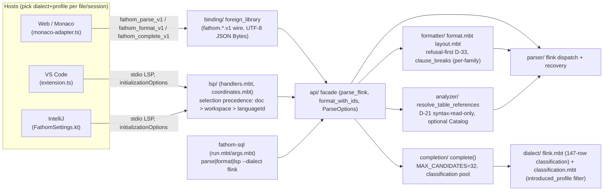

# Phase 13: Toolchain and Editor Packaging - Research

**Researched:** 2026-08-10
**Domain:** Flink toolchain propagation (formatter, completion, analyzer, CLI/LSP, JS/linear-Wasm, Web/Monaco, VS Code, IntelliJ)
**Confidence:** HIGH (all in-repo integration points read this session; external-toolchain facts marked)

<user_constraints>
## User Constraints (from CONTEXT.md)

### Locked Decisions

- **D-01:** Flink formatter 覆盖 **Phase 11 解析器可产出的全部 Flink 语句族**（SELECT/INSERT/UPDATE/DELETE/EXPLAIN/SHOW/DESCRIBE/ANALYZE、CREATE TABLE/VIEW/CATALOG/DATABASE/FUNCTION、Window TVF、MATCH_RECOGNIZE）。layout 表（`clause_breaks`/`statement_family`/`layout_statement`）必须覆盖每个 Flink 族；未覆盖族视为编程缺口 → 按不安全处理，沿用 refusal-first：`accepted=false`、空输出、恰好一条 `FATHOM-FORMAT-001`（D-33），绝无部分输出。refusal-first、idempotence（`format(format(x)) == format(x)`）、`statement_offsets`、keyword case 改写（D-28 单表纪律）全部延续；Doris 输出零漂移（先跑冻结 baseline，无 `--update`）。**Reversibility:** costly — formatter 输出是公共契约，已发布族的布局改动需兼容性维护。
- **D-02:** Flink 补全候选**复用 `dialect/flink.mbt` 分类表作为唯一候选池**（延续 D-28 "no second keyword list" 纪律，不建补全专用表）；per-profile gating 用 `introduced_profile` 按 `flink-1.20.5 < flink-2.1.3 < flink-2.3.0` 引入顺序镜像 Doris `profile_allows`。`completion_context` 扩展 Flink 上下文：statement-start、DDL 头（CREATE/DROP/ALTER…）、WATERMARK、PARTITIONED BY、Window TVF 函数名（TUMBLE/HOP/CUMULATE/SESSION）、MATCH_RECOGNIZE（PATTERN/DEFINE/MEASURES/…）。保持有界（`MAX_CANDIDATES=32`）、纯语法、`CompletionItem` source-range edit（start_byte/end_byte/new_text）不变；无 catalog。**Reversibility:** reversible。
- **D-03:** 扩展既有 `resolve_table_references` 走查至 Flink 语句族（Insert/Update/Delete/CreateTable/CreateView 的 Flink leading-prefix 形态），保持 D-21 只读 syntax-view 纪律（analyzer 不 import parser/token/lexer/api/source；parser 永不 import analyzer；负门禁维持）与可选 catalog（无 catalog → 空结果、parser validity 字节不变，ANLY-01）。表级解析与 Doris 当前最小范围对齐（D-22/D-24）；column/identifier 级引用解析与类型诊断按 D-24 顺延 v2 — TOOL-03 的 "column, and identifier references" 以"受支持引用 = 目标表引用"为边界并在文档标注。**Reversibility:** one-way — `resolve_table_references` 是公共 API，扩展会改变返回集合语义，发布后需迁移。
- **D-04:** 新增 `fathom_complete_v1(raw, dialect, profile, cursor_byte)` 导出 + `fathom.complete.v1` 信封，镜像 `fathom_parse_v1`/`fathom_format_v1`（dialect 紧跟 raw，A4；返回 UTF-8 JSON Bytes）。这是 NAME-02 锁定的四个命名空间（parse/format/error/capabilities）之外的**新增稳定 wire 契约**，须在 schema、文档、命名门禁（check_naming.py 中立性）显式登记。Web/Monaco 与 JS/linear-Wasm 宿主由此获得与 LSP 相同的补全面。**Reversibility:** one-way — wire schema 发布后变更需 schema 迁移。
- **D-05:** Web/VS Code/IntelliJ 三宿主保持静态常量模式，将扁平 profile 列表改为 **(dialect, profile) 二元组校验**：doris → `2.1/3.x/4.x`；flink → `flink-2.3.0/flink-2.1.3/flink-1.20.5`。profile 下拉/校验随所选 dialect 切换（选 flink 才出现 flink 值）。服务端（`binding.validate_dialect_profile` / LSP `validate_selection`）仍权威校验（纵深防御，宿主侧失败也显式报错而非回退）。不动态拉取、不共享跨宿主 JSON 定义（避免宿主耦合与网络依赖，离线优先）。**Reversibility:** reversible。
- **D-06:** 保持已锁定选择模型（D-01/D-02/D-03）：workspace/session 默认（LSP initializationOptions / CLI `--dialect` `--profile` / VS Code `fathom.dialect` / IntelliJ FathomSettings）+ 每文件 LSP `didOpen`/`didChange` dialect/profile 扩展字段覆盖（已实现）。本阶段只让 flink 值通过各宿主校验并让 per-file 覆盖在 flink 文件上生效；不引入自动检测、不加按扩展名猜测（D-01 禁）。**Reversibility:** one-way — 选择传输契约（didOpen extension fields / initializationOptions）是 LSP 公共契约。
- **D-07:** LSP 的 flink format 从 `-32603 not-implemented` 换成真实 `@api.format_with_ids` 路径；flink completion 从 `-32602` 拒绝换成真实 `@completion.complete` 结果（`CompletionItem` → LSP `textEdit` UTF-16 range + `newText`，复用 `completion_item_json` 与 `binding` coordinates）。CLI `fathom-sql format --dialect flink` 走 `@api.format_with_ids`，退出码沿用 D-39（0 accepted / 1 refusal / 2 usage）；UTF-16 转换沿用 `binding.coordinates`。Doris 既有 LSP/CLI 行为零漂移。**Reversibility:** costly — LSP 行为契约（错误 vs 空数组 vs 真实结果）是宿主依赖面。
- **D-08:** 复用既有 harness：VS Code 真 extension-host 验证（`vscode/scripts/host-verify.mjs`，Phase 4 ECO-07 模式）；IntelliJ Gradle 构建 + LSP 启动 smoke（`gradlew` + 配置 flink 后启动 `fathom-lsp`）；Web Chromium smoke（Phase 4 ECO-06 模式：monaco-adapter 单测 + 浏览器断言）。每个宿主验收：打开 flink 文件 → 选择 flink dialect/profile → 收到诊断（支持处验证 format/completion）。CI 增加三宿主最终打包 smoke job；全程离线（无网络/FE/cluster/DB，PARITY-03 纪律）。**Reversibility:** reversible。

### Claude's Discretion
（`--auto` 模式：所有灰区由 Claude 依据既有决策链选择推荐项，无用户自由输入；D-01..D-08 覆盖全部灰区，无 "you decide"。）

### Deferred Ideas (OUT OF SCOPE)
- 完整 ANAL-01 name resolution（column/identifier 级引用解析）与类型诊断 → v2（D-24 既定；TOOL-03 仅目标表引用）
- catalog 感知补全（表/列名补全、hover、语义 tokens）→ TOOL-FUTURE-01
- 自动方言检测（即使 opt-in）→ 未来阶段
- 显式跨方言转换（transpile）→ CONVERT-FUTURE-01
- Wasm GC 作为一等兼容承诺 → TARGET-FUTURE-01
- 动态 profile 拉取（宿主运行时从 capabilities 获取）→ 本阶段选静态二元组（D-05）；如需多方言扩张再评估
</user_constraints>

<phase_requirements>
## Phase Requirements

| ID | Description | Research Support |
|----|-------------|------------------|
| TOOL-01 | Flink canonical formatting via the refusal-first contract; unsafe trees refuse with no partial output | D-01; `formatter/format.mbt` refusal path (FATHOM-FORMAT-001) already reusable; `formatter/layout.mbt` `clause_breaks`/`statement_family`/`layout_statement` must gain a Flink-family completeness gate (§3.1) |
| TOOL-02 | Bounded Flink syntax completion (keywords, DDL, WATERMARK, Window TVF, MATCH_RECOGNIZE contexts) with safe source-range edits | D-02; `completion/completion.mbt` skeleton reusable; Flink branch + `completion_context` extension; **candidate-pool gap identified (§3.2)** |
| TOOL-03 | Syntax-only Flink analyzer with optional catalog; parser validity independent of catalog | D-03; `analyzer/analyzer.mbt` `resolve_table_references`/`leading_prefix_end` extension (§3.3); D-21 boundary verified (`analyzer/moon.pkg` imports only `fathom/sql/syntax`) |
| TOOL-04 | Neutral CLI + Native LSP end to end for Flink (parse/format/lsp, diagnostics, formatting, completion, UTF-16, per-file dialect) | D-06/D-07; `fathom-sql/run.mbt` `run_format` already calls `@api.format_with_ids` with no flink guard; `lsp/handlers.mbt` `formatting_result`/`completion_result` swap rejection for real paths (§3.4) |
| TOOL-05 | Same dialect-aware API/schema/LSP from JS/linear-Wasm, Web/Monaco, VS Code, IntelliJ; hosts pick Doris or Flink per file/session | D-04/D-05/D-08; `binding/exports.mbt`+`binding/moon.pkg` new `fathom_complete_v1` export registry; `web/src/monaco-adapter.ts`, `vscode/src/extension-contract.ts`, `jetbrains/.../FathomSettings.kt` (dialect,profile) pairs (§3.5) |

</phase_requirements>

## Summary

Phase 13 is the final v2.0 phase: it propagates the already-shipped Flink grammar/CST (Phase 10/11) and the corpus/parity gates (Phase 12) through every neutral toolchain surface — formatter (TOOL-01), completion (TOOL-02), analyzer (TOOL-03), CLI/LSP (TOOL-04), and JS/linear-Wasm + Web/Monaco + VS Code + IntelliJ hosts (TOOL-05). No new Flink grammar or lexical capability is added; every sub-requirement is an *adapter* problem over the existing dialect-aware `api`/`binding`/`completion`/`analyzer`/`formatter`/`lsp` packages. The five locked decisions D-01..D-08 are all implementable with the existing in-repo machinery; the phase introduces exactly **one new public wire contract** (`fathom_complete_v1` / `fathom.complete.v1`, D-04) that must be registered in `binding/schema.mbt`, `binding/moon.pkg`, `docs/API.md`, and the `check_naming.py` naming gate.

**Primary recommendation:** Plan four waves. (1) **Core toolchain** — Flink formatter completeness gate (D-01), Flink completion Flink-branch + context extension (D-02), Flink analyzer extension (D-03); each with parity-approved snapshot/test additions. (2) **Wire + CLI/LSP** — `fathom_complete_v1` export + envelope (D-04), `fathom-sql format --dialect flink` real path + exit-code matrix, LSP format/completion swap (D-07). (3) **Hosts** — (dialect, profile) pair validation in Web/VS Code/IntelliJ + flink profile values (D-05) + per-file override verification (D-06). (4) **Packaging smoke** — three-host final smoke + CI job (D-08). The single biggest risk is that the Flink formatter currently formats every Flink statement through the Doris layout tables with **no completeness guard** — unhandled families (e.g. `CreateCatalog`, `ShowStatement`) silently single-line instead of refusing; D-01's "uncovered family = programming gap = refusal" rule requires an explicit covered-family table.

## Architectural Responsibility Map

| Capability | Primary Tier | Secondary Tier | Rationale |
|------------|-------------|----------------|-----------|
| Flink canonical formatting | Backend core (`formatter/`) | LSP/CLI/binding adapters relay `FormatResult` | Refusal-first and idempotence are core contracts (D-33/D-34); adapters only serialize/diagnose |
| Flink bounded completion | Backend core (`completion/`) | LSP (`completion_result`/`completion_item_json`) + `binding` wire | Candidate pool/gating/`MAX_CANDIDATES` live in the core; UTF-16 conversion at the adapter |
| Flink table-reference resolution | Backend core (`analyzer/`) | API callers (LSP deferred) | Read-only syntax-view walk, optional catalog; never part of parser validity (D-21) |
| `fathom.complete.v1` wire contract | Binding (`binding/` foreign_library) | JS/linear-Wasm + Web hosts | One ABI for all hosts, mirroring `fathom_parse_v1`/`fathom_format_v1` |
| Host dialect/profile selection | Editor host (client) | LSP server (`validate_selection`) remains authoritative | Hosts validate statically (D-05); server re-validates (defense in depth, D-06) |
| Per-file dialect override | LSP server (`handlers.mbt`) | Hosts pass `didOpen`/`didChange` extension fields | Already implemented (Phase 9 D-01); Phase 13 only lets flink values pass |

## Standard Stack

### Core
| Library | Version | Purpose | Why Standard |
|---------|---------|---------|--------------|
| MoonBit toolchain | `moon 0.1.20260724 (5f1406a 2026-07-24)` in `moon.mod`; CI pins `latest` and logs it | Compile Native + JS + linear-Wasm from one core | Repo-wide policy (CLAUDE.md/STACK.md); feature flags `rr_moon_mod,rr_moon_pkg` |
| `moonbitlang/core` | json/utf8/buffer/debug packages (in use) | Wire JSON, UTF-8 encode/decode, buffers | Already imported by `binding/`, `formatter/`, `completion/`, `lsp/` |
| `fathom/sql/api` | 0.1.0 | Shared parse/format facade (D-38) | Single entry for LSP + CLI + wire; `ParseOptions::new` already accepts flink profiles |

### Supporting (hosts, all already pinned)
| Library | Version | Purpose | When to Use |
|---------|---------|---------|-------------|
| monaco-editor | `0.56.0` (`web/package.json:14`) | Web demo editor | Web/Monaco host only |
| vscode-languageclient | `10.1.0` (`vscode/package.json:52`) | VS Code LSP client | VS Code host only |
| @vscode/test-electron | `^2.5.2` (registry latest 3.1.0) | Real extension-host smoke | `vscode/scripts/host-verify.mjs` |
| @vscode/vsce | `3.9.2` | Extension packaging (release-only) | `vsce package` |
| IntelliJ Platform Gradle Plugin | `2.18.1` (`jetbrains/build.gradle.kts:7`) | IntelliJ plugin build/verify/publish | `jetbrains/` only |
| Kotlin JVM | `2.4.10` (`build.gradle.kts:6`) | Plugin sources | `jetbrains/` only |
| LSP4IJ | `0.20.1` (`build.gradle.kts:44`) | LSP integration for IntelliJ | `jetbrains/` only |

**Version verification:** All host versions above were read from their in-repo manifests this session and cross-checked against `npm view` for the npm packages (`vscode-languageclient 10.1.0`, `@vscode/vsce 3.9.2`, `monaco-editor 0.56.0` — all match). No *new* external package is introduced by Phase 13; the phase extends in-repo MoonBit packages.

### Alternatives Considered
| Instead of | Could Use | Tradeoff |
|------------|-----------|----------|
| Reuse `dialect/flink.mbt` as the only completion pool (D-02/D-28) | A dedicated completion keyword list | Would violate the single-keyword-table discipline and risk D-28 audit failure; the table extension is the sanctioned path |
| Static (dialect, profile) pairs in hosts (D-05) | Runtime `fathom_capabilities_v1()` pull | D-05 explicitly rejects dynamic pull (offline-first, host decoupling) |
| Extend the existing four `fathom.*.v1` namespaces for completion | New `fathom.complete.v1` | D-04 locks the new namespace; keeping completion inside `fathom.parse.v1` would overload a parse envelope |

**Installation:**
```bash
# No new packages for the MoonBit core. Host deps are already pinned:
# web: monaco-editor@0.56.0   vscode: vscode-languageclient@10.1.0, @vscode/test-electron@^2.5.2, @vscode/vsce@3.9.2
# jetbrains: IntelliJ Platform Gradle Plugin 2.18.1, Kotlin 2.4.10, LSP4IJ 0.20.1 (Gradle resolves offline from cache)
```

## Package Legitimacy Audit

> Phase 13 introduces **no new external runtime packages**. It extends in-repo MoonBit packages and reuses already-pinned host dependencies. The legitimacy gate is therefore a *confirmation* audit, not a new-install gate.

| Package | Registry | Age | Downloads | Source Repo | Verdict | Disposition |
|---------|----------|-----|-----------|-------------|---------|-------------|
| monaco-editor 0.56.0 | npm | mature | high | microsoft/monaco-editor | OK | Approved (already pinned) |
| vscode-languageclient 10.1.0 | npm | mature | high | microsoft/vscode-languageserver-node | OK | Approved (already pinned) |
| @vscode/vsce 3.9.2 | npm | mature | high | microsoft/vscode-vsce | OK | Approved (release-only) |
| @vscode/test-electron ^2.5.2 | npm | mature | high | microsoft/vscode-test-electron | OK | Approved (dev/harness only) |
| LSP4IJ 0.20.1 | Gradle | mature | high | redhat-developer/lsp4ij | OK | Approved (already pinned) |

*Registry existence verified via `npm view` this session; source-repo and download-signal assessments are `[ASSUMED]` from training knowledge (no web search run in this read-only session). No `[SLOP]` packages were introduced; no `[SUS]` flags to gate.*

## Architecture Patterns

### System Architecture Diagram



**Entry points** (left): Web/VS Code/IntelliJ hosts and the CLI/LSP all funnel through the same `binding`/`api` facade. **Processing stages**: host selects (dialect, profile) → facade validates → parser builds the Flink CST → formatter/completion/analyzer operate over it. **Decision points**: `binding.validate_dialect_profile` (server-authoritative), `formatter.format` refusal-first, `completion.profile_allows` + context gate. **Boundary**: analyzer is read-only over `@syntax.SyntaxNode` and never re-enters the parser (D-21).

### Recommended Project Structure
```
formatter/layout.mbt      # ADD flink covered-family table + completeness gate (D-01)
completion/completion.mbt # ADD Flink branch in complete(), flink completion_context arms (D-02)
analyzer/analyzer.mbt     # ADD Flink leading_prefix_end arms + CreateView (D-03)
binding/exports.mbt       # ADD #export_name("fathom_complete_v1") (D-04)
binding/schema.mbt        # ADD fathom.complete.v1 envelope + validate_schema_version entry (D-04)
binding/moon.pkg          # ADD fathom_complete_v1 to js + wasm export lists (D-04)
lsp/handlers.mbt          # REMOVE flink -32603/-32602 rejections; real paths (D-07)
fathom-sql/run.mbt        # flink format already real; add exit-code matrix tests
web/src/monaco-adapter.ts # (dialect, profile) pairs + complete() (D-05)
vscode/src/extension-contract.ts # (dialect, profile) pairs (D-05)
jetbrains/.../FathomSettings.kt # per-dialect ALLOWED_PROFILES + ComboBox switch (D-05)
parity/flink_format_test.mbt    # NEW flink-format snapshot namespace (D-01)
.github/workflows/ci.yml        # ADD three-host packaging smoke job (D-08)
```

### Pattern 1: Refusal-first Flink formatter completeness gate (D-01)
**What:** A table enumerating the Flink statement families the layout knows how to format. Any `statement_family(node)` result not in the table is treated as an uncovered programming gap and routed to the existing refusal path — `accepted=false`, empty output, exactly one `FATHOM-FORMAT-001`.
**When to use:** Extending `formatter/layout.mbt`. Today `clause_breaks` returns `[]` for every Flink family other than the shared Doris ones (`_ => []`, `layout.mbt:260`), and `layout_statement` silently emits a single line — exactly the silent-Doris-layout hazard the CONTEXT flags.
**Example (sketch, mirrors `formatter/format.mbt:17-25` refusal wiring):**
```moonbit
// formatter/layout.mbt — new completeness gate
fn flink_statement_covered(family : @syntax.SyntaxKind) -> Bool {
  match family {
    Select | Insert | Update | Delete | ExplainStatement | ShowStatement |
    DescribeStatement | AnalyzeStatement | CreateTable | CreateView |
    CreateCatalog | CreateDatabase | CreateFunction | AlterTable |
    DropCatalog | DropDatabase | DropTable | DropView | DropFunction |
    SetOption | UseStatement => true
    _ => false
  }
}
// layout_statement: if context.dialect is Flink && !flink_statement_covered(family) {
//   out.failed = Some(first_child_of(node)); return   // -> refusal_diagnostic in format.mbt
// }
```
*Note: this sketch is a proposal built on `format.mbt:11-25`/`refuse.mbt:10-27` conventions; the executor must place the refusal through `out.failed` so `format()` converts it to `FATHOM-FORMAT-001` with empty output.*

### Pattern 2: Flink completion = existing skeleton + Flink context arms (D-02)
**What:** `complete()` already builds `dialect_context`, lexes editor-mode, computes `cursor_replacement`, runs a two-pass priority loop over `classification_entries(dialect_context)` filtered by `profile_allows` and `context_accepts`. Adding Flink is a *Flink branch* in `complete()` that constructs the Flink `DialectContext` (like `api.ParseOptions::new`'s Flink arm at `api.mbt:66-103`) and a `completion_context` extension that returns Flink context strings.
**When to use:** Extending `completion/completion.mbt`. The per-profile gating for Flink is **already free**: `classification_entries(flink_context)` filters rows by `introduced_profile` through `flink_row_visible` (`classification.mbt:78-89`), so the existing `profile_allows` loop becomes a no-op for Flink only if we mirror Doris — but see the candidate-pool gap below.
**Example (context arms, `completion/completion.mbt:78-107` style):**
```moonbit
// Proposed new context strings produced by completion_context under Flink:
// "statement-start"  // before any significant token
// "ddl-header"       // last == CREATE|DROP|ALTER
// "watermark"        // last == WATERMARK
// "partitioned-by"   // previous/last == PARTITIONED|BY
// "window-tvf"       // last == FROM|JOIN at table position (TUMBLE/HOP/CUMULATE/SESSION)
// "match-recognize"  // inside MATCH_RECOGNIZE(...) -> PATTERN|DEFINE|MEASURES
```
*Each arm then flows through the existing `context_accepts`/`context_preferred`/`prefix_matches` pipeline unchanged.*

### Pattern 3: Analyzer Flink arms (D-03)
**What:** `resolve_table_references` walks Statement children, matches body kinds, calls `target_table_name` which uses `leading_prefix_end` to skip the statement's leading keywords, then joins dotted identifier tokens. Adding Flink means extending `leading_prefix_end` for the Flink shapes and adding `CreateView` to the matched-kind list (`analyzer.mbt:262-296`).
**When to use:** Extending `analyzer/analyzer.mbt`. The Flink parser produces the same `Insert`/`Update`/`Delete`/`CreateTable` kinds plus `CreateView` (`parser.mbt:4140-4240` dispatch). `leading_prefix_end` already handles `INSERT [OVERWRITE] [TABLE]|INTO`, `UPDATE`, `DELETE FROM`, `CREATE [TEMPORARY] [EXTERNAL] TABLE [IF NOT EXISTS]` — the gaps are **`UPSERT INTO`** (the parser maps `UPSERT` to `Insert`, `parser.mbt:4196`) and **`CreateView`** (not currently matched at `analyzer.mbt:276-283`).

### Anti-Patterns to Avoid
- **Silently formatting Flink families with Doris layout**: `clause_breaks` returning `[]` is not a refusal today — the formatter emits a single line. Never ship a "works by accident" family; every Flink family must be either in the covered table or refused.
- **A second completion keyword list**: building a completion-specific list violates D-28 and the naming/parity audits; extend `dialect/flink.mbt` rows (with provenance) instead.
- **Host-side dynamic profile pull / shared JSON**: D-05 forbids it; keep static per-host constants with the server authoritative.
- **Silent fallback on host validation failure**: hosts must surface an explicit error (like the existing `MISSING_SELECTION`), never coerce a profile.

## Don't Hand-Roll

| Problem | Don't Build | Use Instead | Why |
|---------|-------------|-------------|-----|
| UTF-16 byte↔position conversion | A second converter in `web/` or LSP | `binding/coordinates.mbt` (`byte_to_position`/`position_to_byte`/`span_to_range`) already handles CRLF-as-one-break, 4-byte→2-units, conservative invalid-UTF-8 | One coordinate policy (the existing LSP/web paths already reuse it) |
| Keyword classification | A Flink keyword table in `completion/` | `dialect/flink.mbt` rows + `classification_entries` (profile-filtered) | D-28 single-table discipline; release-provenance rows |
| Flink profile validation in hosts | Hand-rolled per-host lists that drift | `binding.validate_dialect_profile` (server) + static (dialect, profile) pairs (host, D-05) | Server stays authoritative; hosts are defense-in-depth |
| JSON wire serialization | A hand-built completion JSON writer | `binding/json.mbt` `stringify(Json)` + a new `completion_result_json` mirroring `format_result_json` | Escaping/byte-array conventions already frozen |

**Key insight:** every Phase 13 capability already has a proven in-repo implementation for Doris. The cost of "hand-rolling" is not building the mechanism — it is *failing to reuse the mechanism* and creating a second, drifting convention.

## Common Pitfalls

### Pitfall 1: Flink formatter silently uses Doris layout
**What goes wrong:** A valid Flink `CREATE CATALOG c WITH (...)` or `SHOW TABLES` formats as a single line with no clause breaks — no refusal, no error.
**Why it happens:** `clause_breaks(kind)` covers only Doris families (`layout.mbt:171-218`); every Flink-specific family falls to `_ => []`; `layout_statement` still runs (`layout.mbt:857-873`).
**How to avoid:** Add the covered-family gate (Pattern 1) and refuse uncovered families. Add a completeness test asserting that *every* SyntaxKind the Flink parser can emit as a statement family is either covered or refuses.
**Warning signs:** A flink-format fixture for `CreateCatalog`/`ShowStatement` returns `accepted=true` with single-line output.

### Pitfall 2: D-02 candidate pool is missing the required Flink words
**What goes wrong:** Completion in `statement-start` under flink offers only `SELECT/WITH/INSERT/UPDATE/DELETE/SET/VALUES/CREATE/...` and **not** `ALTER/DROP/SHOW/DESCRIBE/EXPLAIN/ANALYZE/USE/RESET`; WATERMARK / PARTITIONED / TVF names / PRIMARY KEY / CATALOG / DATABASE / FUNCTION contexts produce no candidates.
**Why it happens:** The 147-row `flink_classification_rows` table is scoped to "production/conflict words" (`dialect/flink.mbt:92-95`) and does not contain the statement verbs, DDL nouns, WATERMARK, PARTITIONED, `TUMBLE/HOP/CUMULATE/SESSION`, or `PRIMARY/ENFORCED/COMPUTED/METADATA/VIRTUAL/CONNECTOR` words the D-02 contexts require (verified by grep this session — only `CREATE/INSERT/UPDATE/DELETE/SET/VALUES/INTO/TABLE/MATERIALIZED/MATCH_RECOGNIZE/MATCH_NUMBER/MEASURES/PATTERN/DEFINE/PARTITION/PARTITIONS/DISTRIBUTED/COLUMN/COLUMNS/FUNCTIONS/CALL` of the family-relevant set are present).
**How to avoid:** Extend `flink_classification_rows` with the missing words, each with `source` = pinned release grammar path and the *correct* `classification` kind. Additive `NonReserved` rows are parse-neutral (the word was already an identifier); **`Reserved` additions change parse behavior and will break the frozen flink-grammar/flink-lexical snapshots** unless the change is pre-declared in `approved-changes.md`. If the planner wants to avoid touching the frozen table, the fallback is to let `context_accepts` allow only words already present — which fails SC2 for the named contexts and should be rejected.
**Warning signs:** `@completion.complete(b"", "flink", "flink-2.3.0", 0)` returns items missing `SHOW`/`DROP`/`ALTER`/`CREATE` alternatives the parser actually accepts at statement start.

### Pitfall 3: Forgetting to register the new wire contract in all four places
**What goes wrong:** `fathom_complete_v1` exists in `exports.mbt` but the JS/Wasm artifact does not export it (`binding/moon.pkg` link lists), or the schema validator rejects `fathom.complete.v1`, or `check_naming.py`/docs are stale.
**Why it happens:** D-04 touches four independent registries: `#export_name` (exports.mbt), `options(link: {js, wasm}.exports)` (moon.pkg), `validate_schema_version` (schema.mbt), and docs/API.md + naming inventory.
**How to avoid:** Treat the new export as a five-file change set in one task; extend `parity/export_smoke_test.mbt` to assert the new export round-trips and the envelope carries `fathom.complete.v1`.
**Warning signs:** `moon build --target js binding` succeeds but the built `binding.js` lacks `fathom_complete_v1`.

### Pitfall 4: LSP behavioral contract change for flink format/completion
**What goes wrong:** A host that depended on `-32603`/`-32602` to disable format/completion buttons now receives real edits/results; a formatter refusal now publishes diagnostics + empty edit array (existing Doris behavior).
**Why it happens:** D-07 replaces the rejection sentinels with real paths — the LSP surface is the host-facing contract (costly reversibility).
**How to avoid:** Keep Doris byte-for-byte (frozen baseline first), test the exact response shapes (error vs empty array vs real edit/results) for flink, and verify the VS Code/IntelliJ hosts handle all three.
**Warning signs:** `lsp/completion_test.mbt` / `selection_test.mbt` fail on flink cases because `-32602` is asserted.

### Pitfall 5: Host smoke scripts assert the OLD flat profile list
**What goes wrong:** D-05 changes `PROFILES`/`SUPPORTED_PROFILES`/`ALLOWED_PROFILES` to (dialect, profile) pairs, but `web/scripts/offline-smoke.mjs` (asserts `['2.1','3.x','4.x']`), `vscode/scripts/launch-smoke.mjs`, and `jetbrains/scripts/source-smoke.py` (asserts `listOf("2.1","3.x","4.x")` and the factory initialization keys) all pin the flat list.
**Why it happens:** The harnesses are contract checks — they fail fast on any drift, including legitimate D-05 changes.
**How to avoid:** Update the harness assertions in the *same* change set as the host constants (the "same-commit rule" precedent, STATE.md), and add flink profile values to each harness.

## Code Examples

Verified patterns from official/in-repo sources:

### Common Operation 1: Adding a primitive wire export (blueprint = `binding/exports.mbt:30-34`)
```moonbit
#export_name("fathom_complete_v1")
pub fn fathom_complete_v1(raw : Bytes, dialect : String, profile : String, cursor_byte : Int) -> Bytes {
  // A4 export order: raw first, dialect second (mirror fathom_parse_v1).
  match @completion.complete(raw, dialect, profile, cursor_byte) {
    Ok(result) => json_bytes(completion_result_json(result))
    Err(error) => json_bytes(completion_error_json(error))
  }
}
```
*Proposed signature; shape mirrors `fathom_parse_v1` (`binding/exports.mbt:30-34`) and `fathom_format_v1` (`binding/exports.mbt:38-72`). `completion_result_json` is new, mirroring `format_result_json` (`binding/schema.mbt:113-133`) with `schema_version: "fathom.complete.v1"` and the item fields `label/detail/start_byte/end_byte/new_text`.*

### Common Operation 2: Flink branch in `complete()` (blueprint = `api.ParseOptions::new` Flink arm, `api/api.mbt:79-103`)
```moonbit
// completion/completion.mbt complete() — replace the Phase-9 rejection
//   @dialect.Dialect::Flink => return Err(UnknownProfile(profile_id~))
// with a Flink context construction mirroring api.ParseOptions::new's arm:
@dialect.Dialect::Flink => {
  match @dialect.FlinkProfile::from_id(profile_id) {
    Some(profile) => {
      let metadata = profile.metadata()
      { dialect: dialect, profile_id: profile_id,
        exact_release: metadata.exact_release,
        feature_introduction: metadata.feature_introduction }
    }
    None => return Err(UnknownProfile(profile_id~))
  }
}
```
*The rest of `complete()` (lex editor-mode, `cursor_replacement`, two-pass priority, `MAX_CANDIDATES`) is dialect-agnostic and unchanged.*

### Common Operation 3: LSP flink completion → real textEdit (already the shared shape, `lsp/handlers.mbt:495-545`)
```moonbit
// completion_item_json already emits:
//   { "label", "kind": 14.0, "detail",
//     "textEdit": { "range": {start:{line,character},end:{line,character}}, "newText" } }
// The range comes from diagnostic_range(raw, start_byte, end_byte) which uses
// @binding.span_to_range (UTF-16). D-07 only removes the flink Err->-32602
// mapping in completion_result so flink results flow through unchanged.
```

### Common Operation 4: Host (dialect, profile) validation (blueprint = `web/src/monaco-adapter.ts:88-95`)
```ts
// web/src/monaco-adapter.ts — D-05
export const PROFILES_BY_DIALECT = Object.freeze({
  doris: ['2.1', '3.x', '4.x'],
  flink: ['flink-2.3.0', 'flink-2.1.3', 'flink-1.20.5'],
});
validateSelection(dialect, profile) {
  const allowed = PROFILES_BY_DIALECT[dialect];
  if (!DIALECTS.includes(dialect) || !allowed || !allowed.includes(profile)) {
    throw new Error(MISSING_SELECTION);
  }
}
```

## State of the Art

| Old Approach | Current Approach | When Changed | Impact |
|--------------|------------------|--------------|--------|
| flink format → `-32603 not-implemented` (LSP) | real `@api.format_with_ids` path (D-07) | Phase 13 | Hosts can format Flink documents |
| flink completion → `UnknownProfile` / `-32602` | real `@completion.complete` results (D-02/D-07) | Phase 13 | Flink editing intelligence |
| flink format at the wire → accepted only because Select shares Doris layout | covered-family gate + refusal for uncovered families (D-01) | Phase 13 | No silent Doris layout for Flink DDL |
| Four `fathom.*.v1` namespaces (NAME-02) | + `fathom.complete.v1` (D-04) | Phase 13 | New stable wire contract beyond the four |
| Host flat profile lists (Doris-only) | (dialect, profile) pairs incl. flink (D-05) | Phase 13 | Per-file flink selection in every host |
| FATHOM-PARSE-008 retired, `parse_flink` real (Phase 11 D-06) | analyzer/completion/formatter follow | already shipped | Toolchain now lags only the adapter work |

**Deprecated/outdated:**
- `FATHOM-PARSE-008`: retired and vacant; must never be reused (`api/api.mbt:230-268` comment, STATE.md D-06).
- The Phase-9-era "flink is a legal selection but every toolchain path rejects it" posture (LSP `-32603`/`-32602`, completion `UnknownProfile`, formatter silent) is the exact surface Phase 13 removes.

## Assumptions Log

| # | Claim | Section | Risk if Wrong |
|---|-------|---------|---------------|
| A1 | The 147-row flink classification table is the *complete* candidate pool after extension — i.e., D-02 requires adding missing words to that table, not a second list | Common Pitfalls / TOOL-02 | If the planner instead adds a completion-only list, D-28 audit and naming/parity gates may reject it |
| A2 | Adding NonReserved rows to `flink_classification_rows` is parse-neutral and will not move the frozen flink-grammar/flink-lexical snapshots | Common Pitfalls 2 | A word classified Reserved that Calcite does not reserve would change acceptance and break snapshots |
| A3 | `UPSERT INTO` maps to `SyntaxKind::Insert` in the parser, so the analyzer's `leading_prefix_end` needs an `UPSERT` arm | TOOL-03 | If the parser emits a different kind, the analyzer match arm must be adjusted |
| A4 | LSP hosts tolerate the flink format/completion behavior change (error → real results) without client-side crash | Common Pitfalls 4 | A host that only handles the rejection may render errors on flink documents |
| A5 | No network/FE/cluster/DB is required by any Phase 13 smoke (PARITY-03); all host harnesses run offline | D-08 / Environment | If a harness accidentally pulls a remote artifact, the offline gate fails |
| A6 | MoonBit `#export_name` primitive ABI accepts `Bytes`/`String`/`Int` arguments for the new `cursor_byte: Int` parameter on both JS and linear-Wasm | TOOL-05 / research flag 1 | If `Int` (i32) differs on wasm, the wasm host signature must be revisited |

## Open Questions (RESOLVED)

> All three open questions below are **RESOLVED** — the recommendations are adopted by the Phase 13 plans (see inline markers).

1. **D-02 candidate-pool completeness** — the 147-row table lacks many words the required contexts need (see Pitfall 2). Which is sanctioned: (a) extend `flink_classification_rows` with provenance-annotated NonReserved/Reserved rows (keeps single-table discipline), or (b) accept a weaker completion surface? **Recommendation:** (a); it is the only option that satisfies SC2 while honoring D-28. The planner should add a task to extend the table with a provenance audit test (mirroring `flink_classification... **RESOLVED → (a)**, implemented by 13-02-PLAN.md Task 2 (table extension + provenance audit; NonReserved rows parse-neutral, frozen snapshots proven byte-identical).
2. **`UPSERT` analyzer arm** — confirm the parser's `Insert` kind for `UPSERT INTO` and add it to `leading_prefix_end`; also confirm whether Flink `INSERT OVERWRITE ... PARTITION (...)` needs a partition-skip arm before the table name. **Recommendation:** extend `leading_prefix_end` with `UPSERT` and `OVERWRITE ... PARTITION` skip, covered by analyzer fixtures. **RESOLVED → adopted** by 13-03-PLAN.md Task 1 (UPSERT INTO + INSERT OVERWRITE partition-skip arms, parser.mbt:4196 maps UPSERT→Insert).
3. **Flank TVF/MATCH_RECOGNIZE completion depth** — SC2 names "Window TVF 函数名（TUMBLE/HOP/CUMULATE/SESSION）" and "MATCH_RECOGNIZE（PATTERN/DEFINE/MEASURES/…）". These words are *non-reserved* (TVF names) or *reserved* (MR family, already in the table). The non-reserved TVF names are absent from the table → covered by Open Question 1. MATCH_RECOGNIZE sub-clause completion beyond PATTERN/DEFINE/MEASURES is catalog/scope-bound → explicitly deferred (TOOL-FUTURE-01). **Recommendation:** scope MATCH_RECOGNIZE completion to the four reserved clause words already in the table. **RESOLVED → adopted** by 13-02-PLAN.md (match-recognize arm limited to PATTERN/DEFINE/MEASURES/MATCH_NUMBER; sub-clause flagged-unverified probe).

## Environment Availability

> The phase is code/config-only for the MoonBit core and uses already-pinned host toolchains. Only the host smoke harnesses depend on external runtimes.

| Dependency | Required By | Available | Version | Fallback |
|------------|------------|-----------|---------|----------|
| `moon` toolchain | all MoonBit builds | ✓ (repo + CI) | `0.1.20260724` locally; CI pins `latest` | CI installs via official installer |
| Node.js | web/vscode harnesses, npm | ✓ | — | — |
| VS Code + `@vscode/test-electron` | `vscode/scripts/host-verify.mjs` real extension-host | ✓ (STATE.md records VS Code 1.132.0 + harness verified) | — | skip host-verify on non-desktop, rely on launch-smoke |
| JDK 21 + Gradle | `jetbrains/` build/test/verify | ✓ (CI `setup-java@v5`) | Gradle wrapper | — |
| Xvfb :99 | VS Code extension-host headless | ✓ (host-verify harness) | — | — |
| Flink cluster / Doris FE / DB / network | none | ✗ (intentionally) | — | PARITY-03 offline discipline — smokes must not require them |

**Missing dependencies with no fallback:** none for the required Phase 13 surface.
**Missing dependencies with fallback:** a machine without VS Code runs only `vscode/scripts/launch-smoke.mjs` (static) and skips `host-verify.mjs`; CI runs the real extension-host per ECO-07/STATE.md.

## Validation Architecture

> Skipped by config: `.planning/config.json` sets `workflow.nyquist_validation: false`. The phase still requires behavioral verification through the existing test/parity/host-smoke stack (ROADMAP Phase 13 Validation), summarized below for the planner.

- **Doris zero-drift (PARITY-01):** run the frozen baseline (`moon test --package parity`, `scripts/baseline_diff.py --frozen-only`) *before* and *after* every change; no `--update` without an `approved-changes.md` register entry (D-08).
- **Flink format (TOOL-01):** new `parity/flink_format_test.mbt` snapshot namespace `flink-format.{fixture}.flink-2.3.0.strict.json` mirroring `flink_grammar_test.mbt` (`parity/flink_grammar_test.mbt:9-16,647-679`); per-fixture idempotence `format(format(x))==format(x)` + zero-diagnostic reparse + refusal assertions, reusing `test/formatter_test.mbt:1376-1433` oracle shape.
- **Flink completion (TOOL-02):** unit tests in `completion/` (like `lsp/completion_test.mbt`) asserting boundedness (≤32), profile gating per `introduced_profile`, context arms, and source-range edits; plus a wire test in `parity/export_smoke_test.mbt` for `fathom_complete_v1`.
- **Analyzer (TOOL-03):** extend `analyzer_test.mbt` for flink Insert/Update/Delete/CreateTable/CreateView target resolution with a `StaticCatalog`, and a no-catalog case asserting empty results + unchanged parser validity.
- **CLI/LSP (TOOL-04):** `fathom-sql/cli_test.mbt` flink format exit-code matrix (0 accepted / 1 refusal / 2 usage); `lsp/selection_test.mbt` + `lsp/completion_test.mbt` flink document flows with UTF-16 assertions.
- **Hosts (TOOL-05):** `web/src/main.test.ts` monaco-adapter (dialect,profile) pairs + `fathom_complete_v1`; `vscode/scripts/host-verify.mjs` new flink mode; `jetbrains` Gradle `test` + `verifyPlugin` + `buildPlugin` + LSP launch smoke; CI job wiring all three.

### Test Framework
| Property | Value |
|----------|-------|
| Framework | MoonBit built-in tests (`moon test`), snapshot via `@test.T::snapshot`; Node `node:test` for web adapter; JUnit4/Kotlin for IntelliJ; `@vscode/test-electron` for VS Code |
| Config file | `moon.pkg` per package; `.github/workflows/ci.yml` job matrix |
| Quick run | `moon test --target native --package completion --package analyzer` |
| Full suite | `moon test --target native --package test --package parity --package lsp --package api` + JS/wasm parity jobs + host harnesses |

### Wave 0 Gaps
- [ ] `parity/flink_format_test.mbt` — new flink-format snapshot namespace (TOOL-01)
- [ ] `completion/` flink unit tests + `parity/export_smoke_test.mbt` `fathom_complete_v1` (TOOL-02/05)
- [ ] `analyzer/` flink fixtures (TOOL-03)
- [ ] `lsp/` flink format/completion behavior tests (TOOL-04)
- [ ] Three-host (dialect, profile) + flink smoke assertions (TOOL-05)

## Security Domain

> `security_enforcement: true` in `.planning/config.json` (ASVS L1).

### Applicable ASVS Categories
| ASVS Category | Applies | Standard Control |
|---------------|---------|-----------------|
| V2 Authentication | no | in-process library, no auth surface (docs/API.md "Authentication: Not applicable") |
| V3 Session Management | no | no sessions |
| V4 Access Control | no | no multi-tenant boundary |
| V5 Input Validation | yes | `ParseOptions::new` / `FormatOptions::new` closed-enum validation; `binding.validate_dialect_profile`; `cursor_byte` bounds-checked in `complete()` (`InvalidCursor`); `max_bytes` 8 MiB cap |
| V6 Cryptography | no | no cryptographic material handled |

### Known Threat Patterns for {MoonBit toolchain + JS/Wasm + editors}
| Pattern | STRIDE | Standard Mitigation |
|---------|--------|---------------------|
| Oversized completion input / unbounded work | DoS | `MAX_CANDIDATES=32`; `ParseLimits` budgets; `InvalidCursor`/`InputTooLarge` structured errors |
| Malformed UTF-8 / invalid JSON input at the JS/Wasm boundary | Tampering | raw input stays `Bytes`; output via `Json::string`/`byte_array_json`; `@utf8.decode_lossy` for labels; the Native JSON boundary rejects invalid UTF-8 before coordinate conversion (`binding/coordinates.mbt:1-4`) |
| Host-side selection coercion / silent fallback | Tampering | server-authoritative `validate_selection`; hosts surface explicit `MISSING_SELECTION`/config errors; no default dialect (D-02) |
| Refusal masking | Spoofing | parse diagnostics prepended, `FATHOM-FORMAT-001` never masks them (T-03-01, asserted in `test/formatter_test.mbt:200-234`) |

## Sources

### Primary (HIGH confidence — all read this session)
- `.planning/phases/13-toolchain-and-editor-packaging/13-CONTEXT.md` — locked decisions D-01..D-08, canonical refs, code context.
- `formatter/format.mbt` (refusal-first, `find_first_unsafe`, `refusal_diagnostic`), `formatter/layout.mbt` (`clause_breaks` 150-260, `statement_family` 273-292, `layout_statement` 824-873), `formatter/refuse.mbt`, `formatter/error.mbt`, `formatter/options.mbt`, `formatter/moon.pkg`.
- `completion/completion.mbt` (`complete` 145-207, `profile_allows` 57-65, `completion_context` 78-107, `MAX_CANDIDATES` 25), `completion/moon.pkg`.
- `analyzer/analyzer.mbt` (`resolve_table_references` 263-303, `leading_prefix_end` 168-220, `target_table_name` 241-260), `analyzer/moon.pkg` (imports only `fathom/sql/syntax`).
- `api/api.mbt` (`ParseOptions::new` 79-103, `parse_flink` 512-549, `format_text`/`format_with_ids` 566-640), `api/moon.pkg`.
- `lsp/handlers.mbt` (`formatting_result` 421-458, `completion_result` 505-545, `completion_item_json` 495-503, `resolve_selection_with_source` 299-360, `initialize_selection` 362-403), `lsp/coordinates.mbt`, `lsp/selection_test.mbt`, `lsp/completion_test.mbt`.
- `fathom-sql/run.mbt` (`run_format` 24-77), `fathom-sql/args.mbt` (`is_valid_dialect_profile`), `fathom-sql/main.mbt`.
- `binding/exports.mbt`, `binding/schema.mbt` (`validate_schema_version`, `validate_dialect_profile`, `format_result_json`), `binding/coordinates.mbt`, `binding/json.mbt`, `binding/moon.pkg` (js/wasm export lists).
- `dialect/flink.mbt` (classification rows 98-260, provenance test 283-299), `dialect/classification.mbt` (`flink_row_visible` 78-89, `classification_entries`).
- `syntax/syntax.mbt` (SyntaxKind incl. Flink families 20-48).
- `parser/parser.mbt` (flink dispatch 4140-4240, create/alter/drop form kinds 4089-4137).
- `web/src/monaco-adapter.ts`, `web/src/main.ts`, `web/src/main.test.ts`, `web/scripts/offline-smoke.mjs`, `web/package.json`.
- `vscode/src/extension-contract.ts`, `vscode/src/extension.ts`, `vscode/package.json`, `vscode/scripts/host-verify.mjs`, `vscode/scripts/launch-smoke.mjs`.
- `jetbrains/src/main/kotlin/fathom/jetbrains/sql/FathomSettings.kt`, `FathomSettingsConfigurable.kt`, `FathomLanguageServerFactory.kt`, `jetbrains/build.gradle.kts`, `jetbrains/scripts/source-smoke.py`.
- `parity/export_smoke_test.mbt`, `parity/flink_grammar_test.mbt` (snapshot runner 647-679), `test/formatter_test.mbt` (refusal/idempotence oracle 1376-1433, dialect selection 1678-1707), `parity/__snapshot__/` layout.
- `.github/workflows/ci.yml`, `.github/workflows/jetbrains-plugin.yml`, `.github/workflows/fathom-native-release.yml`.
- `docs/API.md`, `docs/CONFIGURATION.md`, `moon.mod`, `.planning/config.json`.

### Secondary (MEDIUM confidence)
- npm registry via `npm view` (vscode-languageclient 10.1.0, @vscode/vsce 3.9.2, monaco-editor 0.56.0, @vscode/test-electron 3.1.0) — confirms pinned versions are current on the registry.
- MoonBit toolchain policy notes in `moon.mod` + `CLAUDE.md`/`STACK.md` (v0.10.5 docs line; `moon 0.1.20260724`).

### Tertiary (LOW confidence)
- [ASSUMED] MoonBit `#export_name` primitive ABI exact argument mapping for the new `cursor_byte: Int` on linear-Wasm — to be confirmed by the first `moon build --target wasm binding` in execution (the existing four exports prove the pattern for `Bytes`/`String`/`Int`/`Bool`, so confidence is high in practice).

## Metadata

**Confidence breakdown:**
- Standard stack: HIGH — every library/version read from in-repo manifests this session and cross-checked on npm.
- Architecture: HIGH — all integration points (formatter/completion/analyzer/binding/lsp/hosts) read directly; patterns mirror existing shipped code.
- Pitfalls: HIGH for the silent-layout and candidate-pool gaps (grep-verified); MEDIUM for LSP host-tolerance assumptions ([ASSUMED] A4).

**Research date:** 2026-08-10
**Valid until:** 2026-09-09 (in-repo contracts stable; host npm versions fast-moving but already pinned)
