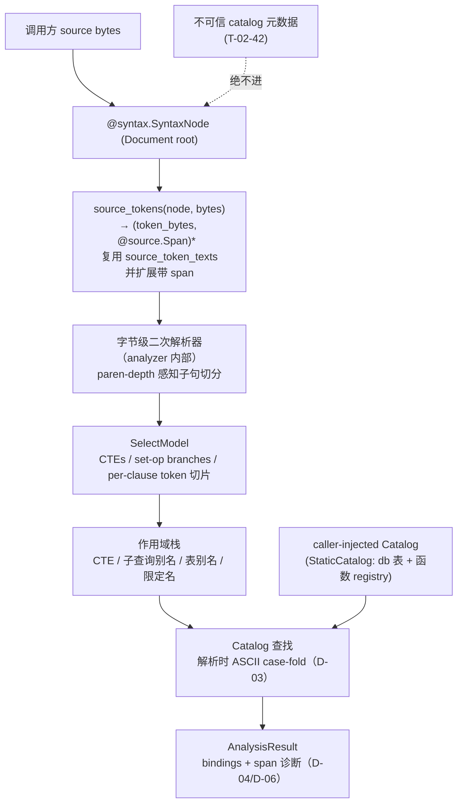

# Phase 5: Closeout and Analysis Foundation — Research

**Researched:** 2026-08-10
**Domain:** MoonBit catalog 名字解析与类型诊断（ANAL-01）+ v1.0 遗留验证收尾（CLOSE-01/02）
**Confidence:** HIGH（全部核心结论均直接读源文件验证）

## Summary

本阶段把 `analyzer/` 从最小 catalog 边界（D-22：表级 `resolve_table_references`，无类型、无诊断）扩展为可用的 catalog 名字解析与类型诊断（ANAL-01），并正式收尾 CLOSE-01/02 两项已核实证据。

**核心事实（本 session 直接读源验证）：** Doris Select 语句在 CST 中是**平铺 token-leaf 流**——`parser.mbt` `finish_statement`/`segment_children_for_events` 把语句的每个 token 映射为一个 `SyntaxLeaf`（`leaf_for_token`，parser.mbt:3851-3858），`syntax.SyntaxKind` 只有粗粒度 `Select`（syntax.mbt:2-58），**没有**子句/表项/限定名细分节点。`SyntaxLeaf` 只携带 `LeafKind`（SourceToken/Trivia/Error/Skipped）+ span，**不携带 TokenKind**（syntax.mbt:55-58），因此 analyzer 只能按 token 的**原始字节**分类——这正是 D-01「analyzer 侧对恢复的 token 流做轻量二次解析」的实证依据。analyzer 现成的 `source_token_texts`（analyzer.mbt:147）、`bytes_equal_ci`（analyzer.mbt:87）、`utf8_to_string`（analyzer.mbt:111）可直接复用。

**D-05 的 one-way 门：** 现 `Catalog` trait 只有 `table(Self, String) -> TableInfo?`（analyzer.mbt:40-42），仓库内唯一实现者是 `StaticCatalog`（analyzer.mbt:46-48）+ `test/analyzer_test.mbt` 的 trait-dispatch helper。MoonBit `open trait` 无默认方法，**新增方法即破坏外部实现者**——本阶段必须一次定形 trait 全貌（保留 `table`，新增 db 作用域查询 + 函数注册表），与唯一实现者同提交迁移。

**Primary recommendation:** 在 `analyzer/` 内部新增字节级二次解析器（复用 `source_token_texts` 并扩展为带 span 的 `source_tokens`），按括号深度切分顶层子句、构建 `SelectModel` 与作用域栈，对 catalog 做解析时 ASCII case-fold 查找，产出可序列化的 `AnalysisResult`（`start_byte`/`end_byte` 平铺 span，镜像 `api.PrimitiveDiagnostic`，api.mbt:305-313）；CLOSE-01/02 只做证据核实与 traceability 更新。

<user_constraints>
## User Constraints (from CONTEXT.md)

### Locked Decisions
- **D-01:** ANAL-01 分析模型在 analyzer 侧对恢复的 token 流做轻量二次解析，在 `analyzer/` 内部建立自己的分析模型，不依赖 CST 细分节点；覆盖顶层子句切分（SELECT 列表 / FROM+JOIN / WHERE / GROUP BY / HAVING / QUALIFY / ORDER BY / LIMIT）、括号深度感知、`AS` 别名、限定名 `db.table.col`、`*` 与 `table.*`。不新增 `SyntaxKind`、不改 parser（Phase 12 冻结硬门禁 + D-21）。保持 D-21：analyzer 只 import `syntax` + 调用方 source bytes，不 import parser/token/lexer/api/source；parser 永不 import analyzer；`parser/moon.pkg` 负门禁维持。Reversibility: costly。
- **D-02:** ANAL-01 语句覆盖以 SELECT 为核心（SELECT 列表、FROM/JOIN 表引用与别名、WHERE/GROUP BY/HAVING/ORDER BY/QUALIFY 内列引用、CTE 作用域、子查询作用域、集合运算 UNION/EXCEPT/INTERSECT）；DML 沿用既有走查并扩展（INSERT/UPDATE/DELETE/MERGE 目标表已在 `resolve_table_references`，本阶段把列级引用扩展到 SET/WHERE/VALUES）；CREATE VIEW 体表引用纳入解析。其他语句族不在范围。Reversibility: costly。
- **D-03:** 标识符大小写不敏感匹配采用解析时 ASCII case-fold（镜像 `parser.mbt` `bytes_equal_ci` 与 analyzer 现有实现）：catalog key/display 名保持作者原样、不构造期归一化；解析时折叠比较，binding 保留源码拼写 + span；带引号（backtick/双引号）标识符精确匹配、保留大小写（ROADMAP SC4）。StaticCatalog 现有 case-sensitive 文档标注随本决策更新为 case-insensitive 匹配语义。Reversibility: reversible。
- **D-04:** 类型诊断深度：binding 携带类型（列 → `ColumnInfo.data_type`；函数调用 → catalog 函数签名返回类型）；诊断覆盖未知表/未知列/未知函数、歧义非限定引用、函数实参数目不匹配。不做表达式级类型合一/推导/字面量传播（ANAL-02 出界）。类型诊断作为 analyzer 独立诊断通道输出，不进入语法诊断通道（语法 `valid` 与 catalog 无关，ANLY-01 不变）。Reversibility: costly。
- **D-05:** Catalog 契约扩展：(a) namespace 维度——`db.table`/`db.table.column` 限定名解析，`Catalog` trait 增加 db 作用域查询路径，StaticCatalog 获得 db 作用域表；(b) 函数注册表——`FunctionInfo`（name、param types、return type），支持函数调用名字解析与元数检查。视图定义展开顺延 LINE-01（Phase 7）。现有 `Catalog::table` 走查 API 保留（`resolve_table_references` 行为不变）。Reversibility: **one-way**。
- **D-06:** ANAL-01 以 MoonBit library API 交付：`fathom/sql/analyzer` 返回结构化 `AnalysisResult`（bindings + 带 span 的诊断），配套文档与测试（`_test.mbt` 快照）。结果记录设计为可序列化（plain records + `@source.Span`），使后续 wire 导出成本低。本阶段不新增 `fathom.analyze.v1` wire 导出、不新增 CLI 子命令。Reversibility: costly。
- **D-07:** CLOSE-01/02 本阶段仅正式核实并记录证据 + 更新 traceability（REQUIREMENTS/STATE/验证文档），不重跑 VS Code host 验证、不重跑 wasm parity（已在 2026-08-06 核实并在 CI 中持续执行）。Reversibility: reversible。

### Claude's Discretion
（`--auto` 模式：所有灰区由 Claude 依据既有决策链（D-21..D-24、Phase 12 冻结基线、ANLY-01）选择推荐项，无用户自由输入；D-01..D-07 覆盖全部灰区，无 "you decide"。）

### Deferred Ideas (OUT OF SCOPE)
- 视图定义展开（view body → 列解析）→ LINE-01（Phase 7 血缘前置）
- 完整类型推导 / 表达式级类型合一 / 字面量传播 → ANAL-02（出界）
- wire 导出 `fathom.analyze.v1` / CLI 子命令 → Phase 6（Lint 消费同一模型）或首个宿主消费时
- catalog 感知补全、hover、语义 tokens → TOOL-FUTURE-01（backlog）
- 增量解析与定向 CST 重构 → EDIT-01（Phase 8，benchmark-gated）
</user_constraints>

<phase_requirements>
## Phase Requirements

| ID | Description | Research Support |
|----|-------------|------------------|
| CLOSE-01 | 用户在装有 VS Code 的机器上验证已交付扩展（真 extension-host 3 模式：diagnostics/format/completion/4.x-merge、2.1 MERGE 传播、unavailable-server fallback） | 证据已在仓库：`vscode/scripts/host-verify.mjs`（现 4 模式，含 Phase 13 新增 flink 模式）；STATE.md Deferred Items 2026-08-06 核实记录；REQUIREMENTS.md CLOSE-01 已标记 Complete。本阶段仅记录核实 + traceability（D-07）。 |
| CLOSE-02 | Release CI 含 linear-Wasm 运行时执行步骤（`moon test --target wasm --package parity`，字节一致） | 证据已在仓库：`.github/workflows/ci.yml` `linear-wasm-parity` job（moon build --target wasm binding/parity + wasm/native/js 三目标 parity + `scripts/compare_backends.py` digest）；STATE.md 2026-08-06 记录；REQUIREMENTS.md CLOSE-02 Complete。仅记录核实 + traceability（D-07）。 |
| ANAL-01 | 用户获得 catalog 支撑的 Doris 表/列/函数/作用域名字解析与类型诊断（限定/非限定引用、别名、CTE、子查询、带 catalog 星号展开），大小写不敏感匹配遵循 Doris 语义，每个 binding 保留源码 span | D-01 二次解析模型（RQ1）、D-03 解析时 ASCII case-fold（RQ2）、D-04 类型诊断通道（RQ3）、D-05 db+函数 registry 扩展（RQ4）、D-06 `AnalysisResult` 公共面（RQ5）。详见下文 RQ1–RQ7。 |
</phase_requirements>

## Architectural Responsibility Map

| Capability | Primary Tier | Secondary Tier | Rationale |
|------------|-------------|----------------|-----------|
| SELECT/DML 分析模型构建（token 恢复 → 子句切分 → SelectModel） | API/Backend（analyzer 包） | — | 纯库内计算；只消费 `@syntax.SyntaxNode` + 调用方 source bytes，无 IO/网络（D-21） |
| 名字解析（表/列/函数/作用域） | API/Backend（analyzer 包） | — | 在 analyzer 内部走作用域栈 + catalog 查找；不依赖浏览器/SSR/DB 层 |
| Catalog 元数据注入 | 调用方（caller-injected） | — | catalog 是外部注入、不可信数据（T-02-42）；只被 analyzer 消费，绝不进入 parser validity channel（ANLY-01） |
| 类型诊断（binding 类型 + 存在性/歧义/元数） | API/Backend（analyzer 包） | — | 独立诊断通道；不做表达式级合一（ANAL-02 出界） |
| 大小写策略（解析时 ASCII case-fold） | API/Backend（analyzer 包） | — | 纯匹配策略，`bytes_equal_ci` 现成实现；quoted 精确匹配 |
| 公共消费面（`AnalysisResult` MoonBit library API） | API/Backend（analyzer 包） | — | 可序列化 plain records；wire/CLI/LSP 面 Phase 6 再接（D-06） |
| Closeout 证据核实与 traceability | 工具链/CI | 文档 | CLOSE-01/02 证据在 vscode 脚本 + ci.yml + STATE/REQUIREMENTS 中，仅记录核实 |

## Standard Stack

### Core
本阶段**零新增外部依赖**——完全复用既有 MoonBit 核心资产：

| Library / Asset | Version / 位置 | Purpose | Why Standard |
|---------|---------|---------|--------------|
| `moonbitlang/core`（builtin） | `0.1.20260728+5e7afb0c0`（moon.mod 记录 toolchain `moon 0.1.20260724`） | String/Array/Map/Bytes/Char 基础类型 | analyzer 唯一隐式依赖；无需新 import |
| `fathom/sql/syntax` | 仓库内 | `SyntaxNode`/`SyntaxLeaf`/`SyntaxKind`/`@source.Span` read-view | D-21：analyzer 唯一显式 import（analyzer/moon.pkg:1-3） |
| `analyzer/analyzer.mbt` 既有 helper | `source_token_texts`(147)、`bytes_equal_ci`(87)、`utf8_to_string`(111) | token 字节恢复、ASCII case-fold、UTF-8 解码 | 二次解析直接复用，不新增 import |
| `@source.Span`（`source/source.mbt`） | `Span::checked`(15-20) | checked half-open byte span；binding 的 span 语义来源 | CST 节点/叶子 span 的基础设施 |

### Supporting（测试与文档）
| Library | Version | Purpose | When to Use |
|---------|---------|---------|-------------|
| `@test.Test` + `t.write`/`t.snapshot` | 内置（parity 先例） | AnalysisResult golden 快照 | D-06「_test.mbt 快照」；沿用 parity/flink_grammar_test.mbt:677-680 模式 |
| `test/` 包（`test/analyzer_test.mbt`） | 仓库内 | 集成测试：parse → analyze → 断言 | 需要 parser 产 CST 的测试都放这里（analyzer 自身不能 import parser） |

### Alternatives Considered
| Instead of | Could Use | Tradeoff |
|------------|-----------|----------|
| analyzer 内二次解析（D-01） | 新增 `SyntaxKind` 细分节点 | 违反 Phase 12 冻结 Doris parser 硬门禁、改变线缆契约（D-01 已锁死） |
| 解析时 ASCII case-fold（D-03） | 构造期归一化 catalog keys | 丢失作者 display 名；per-dialect 策略本阶段过度设计（D-03 已锁死） |
| `AnalysisResult` 平铺 `start_byte`/`end_byte` | 公共签名直接使用 `@source.Span` 类型 | 需 import `source`，违反 D-01「不 import source」；平铺 Int 与 `api.PrimitiveDiagnostic` 约定一致且更序列化友好 |

**Version verification:** 本阶段不引入新包。既有栈版本已核实：`moon.mod` 记录 `moon 0.1.20260724`（[VERIFIED: moon.mod:5-7]）；核心依赖 `moonbitlang/core 0.1.20260728+5e7afb0c0`（[CITED: .claude/CLAUDE.md GSD:stack]）。

## Package Legitimacy Audit

> **N/A** — 本阶段不安装任何外部包（ANAL-01 是纯 MoonBit 库内实现，D-21 约束下 analyzer 零新增依赖；CLOSE-01/02 为证据核实）。无 [SLOP]/[SUS] 项。`npm view`/`pip index` 无需执行。

## Architecture Patterns

### System Architecture Diagram



### Recommended Project Structure

```
analyzer/
├── moon.pkg            # 保持 import 仅 "fathom/sql/syntax"（D-21 负门禁）
├── analyzer.mbt        # 既有：ColumnInfo/TableInfo/Catalog/StaticCatalog/resolve_table_references
├── analysis.mbt        # [新增] AnalysisResult/Binding/AnalysisDiagnostic/FunctionInfo（D-05/D-06）
├── select_model.mbt    # [新增] 二次解析：ClauseKind/SelectCore/SelectModel/CteDef（D-01）
├── select_parser.mbt   # [新增] token 恢复(带 span) + 括号深度子句切分 + 限定名/别名解析
├── resolve.mbt         # [新增] 作用域栈 + catalog 查找 + binding 生成 + 类型诊断（D-03/D-04）
└── analyzer_wbtest.mbt # [可选] 纯 helper 白盒单测（子句切分/case-fold/标识符解码，不依赖 parser）
test/
├── analyzer_test.mbt   # 既有（ANLY-01/D-21 边界测试）—— 继续承载集成测试
└── analyzer_anal01_test.mbt # [新增] parse→analyze 集成 + @test 快照（D-06）
docs/API.md             # §Optional Name-Resolution API 更新（新 API + case policy + 类型诊断范围）
```

### Pattern 1: 从平铺 CST 恢复「token 字节 + span」（D-01 二次解析的输入）

**What:** 现有 `source_token_texts`（analyzer.mbt:147-165）只返回 `Array[Bytes]`，丢弃 span。ANAL-01 的 binding/诊断需要 span，因此扩展一个孪生 helper 返回 `(Bytes, @source.Span)` 对——逻辑与现实现一致（只收 `LeafKind::SourceToken`，跳过 trivia/error/skipped），仅把 `leaf.span` 一并带出。

**When to use:** 每次对一个 Statement body 节点（`SyntaxKind::Select`/`Insert`/`Update`/`Delete`/`Merge`/`CreateView`）做分析前。

**Example（基于现有实现的推荐扩展）:**
```moonbit
// Source: analyzer/analyzer.mbt:147-165（既有 source_token_texts，仅返回 Bytes）
fn source_token_texts(node : @syntax.SyntaxNode, source_bytes : Bytes) -> Array[Bytes] {
  // ...for element in node.children() { Leaf(leaf) if leaf.kind is SourceToken
  //     => texts.push(source_bytes[start:end].to_owned()) }...
}
// 推荐：新增孪生 helper，返回 (text, span) 对
fn source_tokens(node : @syntax.SyntaxNode, source_bytes : Bytes) -> Array[(Bytes, @source.Span)] {
  // 相同遍历；LeafKind::SourceToken 时 push ((text_bytes, leaf.span))
}
```

### Pattern 2: 字节级 token 分类 + 括号深度子句切分（D-01 核心）

**What:** CST 叶子**不带 TokenKind**（syntax.mbt:55-58 只有 LeafKind），所以 analyzer 必须按 token 原始字节分类。由于 CST 已被 lexer 预切分：字符串/注释是单 leaf（`'` 开头），括号深度只需对**整 token 字节等于 `(`/`)`** 的叶子计数——**永不重扫 leaf 内部字节**，天然免疫「关键字在字符串内」陷阱。

**When to use:** 对 Select 语句的 token 流做顶层子句切分。curated 关键字集合须与 parser 的 Reserved 词分类一致（corpus/keywords.tsv 与 dialect/ `is_clause_keyword` 是权威来源）。

**Example（镜像 completion.mbt 的 word_is/bytes_equal_ci 字节式关键字检测）:**
```moonbit
// Source: completion/completion.mbt:56-64（同款字节式折叠比较；analyzer 已有 bytes_equal_ci）
fn word_is(word : Bytes, expected : Bytes) -> Bool {
  word.length() == expected.length() && bytes_equal_ci(word, expected)
}
// 推荐：括号深度感知切分
fn clause_break(tok : Bytes, depth : Int, prev : Bytes, prev2 : Bytes) -> ClauseKind? {
  if depth != 0 { return None }           // 只在深度 0 判定子句边界
  if word_is(tok, b"FROM") { Some(From) }
  else if word_is(tok, b"WHERE") { Some(Where) }
  else if word_is(tok, b"GROUP") { Some(GroupBy) }          // 期待后续 BY
  else if word_is(tok, b"HAVING") { Some(Having) }
  else if word_is(tok, b"QUALIFY") { Some(Qualify) }
  else if word_is(tok, b"ORDER") { Some(OrderBy) }          // 期待后续 BY
  else if word_is(tok, b"LIMIT") { Some(Limit) }
  else if word_is(tok, b"WINDOW") { Some(Window) }
  else if word_is(tok, b"UNION") { Some(SetOpUnion) }
  else { None }
}
```
注意：`GROUP`/`ORDER` 需看后继是否 `BY`；`AS` 是上下文相关（别名），不做顶层子句边界；JOIN 修饰词（`LEFT/RIGHT/FULL/CROSS/NATURAL/INNER`）是 FROM 段内部结构。

### Pattern 3: 作用域栈与限定名解析（D-02/D-04/D-05）

**What:** 二次解析建立 `SelectModel { ctes, branches }`，随后按 SELECT 语义走作用域栈：CTE 名 → 子查询别名 → 表别名 → catalog 表（默认 db / 显式 db）。限定名按「`.` 分隔的 1..3 段」判定：3 段 = `db.table.col`，2 段 = `alias.col` 或 `db.table`，1 段 = `col` 或 `table`。`t.*`/`*` 的星号展开只对已解析的表/别名做（D-05「带 catalog 的星号展开」）。

**When to use:** FROM 段（表/别名/JOIN）、SELECT 列表/WHERE/GROUP BY/HAVING/QUALIFY/ORDER BY 内的列引用、函数调用 `name(...)`。

### Anti-Patterns to Avoid
- **在 analyzer 内重造 lexer/重扫字符串：** CST 已切分，字符串/注释是单 leaf；`'` 开头即非标识符。重扫 leaf 内部字节会把关键字判定拖回字符串内容。
- **把 clause 关键字当列名/别名吞掉：** `SELECT order FROM t` 中 `order` 是列名但 `ORDER` 是 Reserved 关键字——切分须只在 `ORDER BY` 连用、且按 parser 关键字分类判定，否则 `SELECT order` 会被误切。带引号 `` `order` `` 永不判为关键字（quoted 精确匹配，D-03）。
- **一次性改 `Catalog::table` 签名：** 会破坏 `resolve_table_references` 现有行为（D-05 明文保留）；应保留 `table` 并新增方法。
- **公共 API 泄漏 `@source.Span` 类型名：** 命名该类型需 `import "fathom/sql/source"`，违反 D-01「不 import source」。用 `start_byte`/`end_byte` Int 平铺。

## Don't Hand-Roll

| Problem | Don't Build | Use Instead | Why |
|---------|-------------|-------------|-----|
| 从 CST 恢复 token 字节 | 新写一遍叶子遍历 | 既有 `source_token_texts`（analyzer.mbt:147）+ 扩展孪生 `source_tokens` | 边界（trivia/error/skipped 过滤、span 校验）已验证 |
| ASCII 大小写折叠 | 新写 case 折叠 | `bytes_equal_ci`（analyzer.mbt:87）/ `String::equal_ignore_ascii_case` | D-03 镜像 parser 实现；builtin string_methods 提供（见 RQ2） |
| UTF-8 标识符解码 | import `@encoding/utf8` | 既有 `utf8_to_string`（analyzer.mbt:111） | D-21 约束下不自带新依赖 |
| catalog 索引 | 自定义 hash index | builtin `Map[String, _]` | 仓库先例（StaticCatalog.tables）；规模小 |
| span 校验/切片 | 重写 half-open span 逻辑 | `@source.Span::checked` + leaf.span | 仓库统一 checked span 语义 |
| 快照 golden | 手写比对 | `@test.Test` + `t.write`/`t.snapshot` | parity 既有模式，`moon test --update` 是唯一写路径 |

**Key insight:** 本阶段「不 hand-roll」的本质是**复用 analyzer 既有字节级 helper 与仓库 snapshot/Map/Span 基建**——新增量只在二次解析的结构层（子句切分 + 作用域栈），而这一层恰好是 CST 细分节点给不了的、必须在 analyzer 内部补的一小段逻辑。

## Common Pitfalls

### Pitfall 1: 关键字/括号被字符串与带引号标识符污染
**What goes wrong:** 子句切分把 `'FROM'` 字符串或 `` `where` `` 标识符里的词误判为子句边界；括号计数被 `'(foo)'` 字符串里的括号破坏。
**Why it happens:** 若按「扫描文本」实现切分就会踩；CST 叶子其实已把字符串/注释切成单 leaf。
**How to avoid:** 只对**整 token 字节**做 `word_is`/`bytes_equal_ci` 判定，`'` 开头叶子直接归为字面量，`` ` ``/`"` 开头叶子归为 quoted 标识符（永不作关键字、永不计括号）。
**Warning signs:** `SELECT 'FROM'` 出现 FROM 子句边界；`WHERE a = '(' ` 括号深度失衡。

### Pitfall 2: 集合运算与 `* EXCEPT` 的歧义
**What goes wrong:** D-02 列了 UNION/EXCEPT/INTERSECT，但**冻结 Doris parser 只有 UNION 顶层链**——`parse_query` 只 `while consume_word(cursor, b"UNION")`（parser.mbt:1863-1868）；Doris 的 `EXCEPT` 是投影修饰符（`SELECT * EXCEPT(age)` / `ALL EXCEPT (cols)`，parser.mbt:1637-1645, 1767-1770）；`INTERSECT` 不在当前 Doris 接受集（Flink CompoundQuery 专属）。
**Why it happens:** D-02 的措辞宽于 parser 实际接受面。
**How to avoid:** 二次解析在深度 0 切 `UNION [ALL|DISTINCT]` 分支；`* EXCEPT (...)` 作为投影内部结构处理；**INTERSECT/EXCEPT-as-set-op 以 parser 接受为准**——analyzer 只解析 parser 产出的 token 流，越界词按「无法分析/requires-verification」处理，不虚构分支。
**Warning signs:** 对 `SELECT a INTERSECT SELECT b` 假设存在两个 select core。

### Pitfall 3: 表别名与限定名歧义
**What goes wrong:** `db.table.col`（3 段）vs `alias.col`（2 段）vs 裸 `col`；别名解析把 `FROM t AS x` 的 `x` 当列、或把 `SELECT x.col` 的 `x` 当表名。
**Why it happens:** 限定名第一段既可能是 db 也可能是别名/表。
**How to avoid:** 作用域栈先建表/别名集合；限定名解析时**首段查别名 → 查表（默认 db）→ 查 db**；FROM 段别名优先。
**Warning signs:** JOIN 里 `ON t1.id = t2.id` 两侧都解析到同一张表。

### Pitfall 4: CTE 作用域泄漏 / 嵌套子查询穿透
**What goes wrong:** 内层子查询的列被外层解析；CTE 名遮蔽真实表。
**How to avoid:** 每进入 `(SELECT ...)` 或 CTE 体新建作用域帧，退出即弹出；CTE 名加入可见表集合；同名时按内层优先。
**Warning signs:** `WITH c AS (...) SELECT ...` 里 `c` 解析到 catalog 表而非 CTE。

### Pitfall 5: Catalog trait 扩展的 one-way 门（D-05）
**What goes wrong:** 发布后给 `open trait Catalog` 加方法会破坏一切外部实现者。
**How to avoid:** 本阶段一次定形（保留 `table` + 新增 `table_in_db` + `function`），与唯一实现者 StaticCatalog + 测试 helper 同提交迁移；把 trait 视为发布即冻结的公共契约。
**Warning signs:** 计划里出现「先加一个方法，以后再加」。

### Pitfall 6: `AnalysisResult` 公共形状后续变更（D-06）
**What goes wrong:** bindings/diagnostics 记录字段后续增删，Phase 6 Lint 消费方与文档同步破裂。
**How to avoid:** 记录字段与 `api.PrimitiveDiagnostic`（api.mbt:305-313）同构：`code/message/start_byte/end_byte`；bindings 用 `name/resolved_to/kind/start_byte/end_byte/data_type`；snapshot 锁定。
**Warning signs:** 计划里写「先出个简易结构，wire 时再改」。

### Pitfall 7: 对错误/恢复树直接分析
**What goes wrong:** 语句 body 可能是 `Error` 节点或含 `Missing` 子节点（finish_statement 在未解析/尾随 token 时 push Missing，parser.mbt:3807-3809）；分析器对其产生误导性 bindings。
**How to avoid:** 入口先检查 body kind 非 `Select`/DML 族则跳过；解析出 Error/Missing 的语句产生空 bindings + 一条「requires complete parse」诊断（镜像 formatter D-33 refusal 哲学），绝不 panic。
**Warning signs:** 对 `SELECT 1 +` 输出完整绑定。

## Code Examples

### 例 1: 现有 Catalog trait（D-05 扩展基线，逐字引用）
```moonbit
// Source: analyzer/analyzer.mbt:40-42（verbatim）
pub(open) trait Catalog {
  table(Self, String) -> TableInfo?
}
```
```moonbit
// Source: analyzer/analyzer.mbt:46-48（verbatim）
pub struct StaticCatalog {
  tables : Map[String, TableInfo]
}
```
**推荐扩展（保留 `table`，新增 db 与函数路径，StaticCatalog 同提交迁移）:**
```moonbit
pub(open) trait Catalog {
  table(Self, String) -> TableInfo?                       // 保留：默认/当前 db 作用域（resolve_table_references 行为不变）
  table_in_db(Self, db : String, name : String) -> TableInfo?  // 新增：db.table 限定名路径
  function(Self, String) -> FunctionInfo?                 // 新增：函数注册表
}
pub(all) struct FunctionInfo {
  name : String
  param_types : Array[String]
  return_type : String
  min_arity : Int   // 元数检查：实参个数 < min 或 > param_types.length() 报不匹配
}
pub struct StaticCatalog {
  tables : Map[String, TableInfo]                     // 既有：默认 db（语义更新为 case-insensitive 匹配）
  db_tables : Map[String, Map[String, TableInfo]]     // 新增：db 作用域表
  functions : Map[String, FunctionInfo]               // 新增：函数注册表
}
```

### 例 2: 现有 parse 结果形状（D-06 AnalysisResult 对齐基线，逐字引用）
```moonbit
// Source: api/api.mbt:305-313（verbatim）
pub struct PrimitiveDiagnostic {
  pub severity : String
  pub code : String
  pub message : String
  pub expected_class : String
  pub start_byte : Int
  pub end_byte : Int
  pub statement_id : UInt
}
```
**推荐 AnalysisResult（平铺 byte span，不 import source）:**
```moonbit
pub(all) enum BindingKind { Table, Column, Function, Cte, Alias }
pub(all) struct Binding {
  kind : BindingKind
  name : String            // 源码拼写（保留大小写，D-03）
  resolved_to : String     // catalog/作用域中的解析目标（作者 display 名）
  data_type : String       // D-04：列 → ColumnInfo.data_type；函数 → FunctionInfo.return_type
  start_byte : Int
  end_byte : Int
}
pub(all) struct AnalysisDiagnostic {
  code : String            // 独立 analyzer 诊断 code（不进入 FATHOM-PARSE/语法通道）
  message : String
  start_byte : Int
  end_byte : Int
}
pub(all) struct AnalysisResult {
  bindings : Array[Binding]
  diagnostics : Array[AnalysisDiagnostic]
}
```
> **D-01/D-06 交互（研究结论）：** D-06 写「plain records + `@source.Span`」，但 D-01 明文「不 import parser/token/lexer/api/**source**」。命名 `@source.Span` 类型必须 import source。推荐：记录携带 `start_byte`/`end_byte` Int（即 `@source.Span` 的两个字段值，与 `api.PrimitiveDiagnostic` 完全一致），满足「可序列化」且不破坏 D-01。若团队坚持公共签名用真 `@source.Span` 类型，需要显式修订 D-01——这本身是 one-way 公共面变更，建议本阶段就用平铺 Int 定案。

### 例 3: 快照测试模式（D-06「_test.mbt 快照」，沿用 parity 先例）
```moonbit
// Source: parity/flink_grammar_test.mbt:677-680（verbatim 模式）
fn flink_grammar_snapshot_test(t : @test.Test, content : String, filename : String) -> Unit raise SnapshotError {
  t.write(content)
  t.snapshot(filename=filename)
}
// 推荐：test/analyzer_anal01_test.mbt 中
test "analyzer-anal01 select-basic doris-4.x" {
  let t = @test.Test("analyzer-anal01 select-basic doris-4.x")
  analyzer_snapshot_test(t, analyze_json(b"SELECT a, b FROM db.t", catalog), "analyzer.select-basic.json")
}
```

## State of the Art

| Old Approach | Current Approach | When Changed | Impact |
|--------------|------------------|--------------|--------|
| analyzer 只做表级 `resolve_table_references`（D-22/D-24） | ANAL-01 全量 catalog 名字解析 + 类型诊断 | 本阶段（Phase 5） | 从「无类型无诊断」到「binding 携带类型 + 存在性/歧义/元数诊断」 |
| `StaticCatalog` case-sensitive keys（文档标注） | 解析时 ASCII case-fold 匹配（quoted 精确） | 本阶段（D-03） | ROADMAP SC4：case policy documented；quoted keep exact case |
| Catalog trait 仅 `table(Self, String)` | + db 作用域 + 函数注册表 | 本阶段（D-05，one-way） | `db.table`/`db.table.column` 限定名解析与函数调用检查成为可能 |

**Deprecated/outdated:**
- `StaticCatalog` 的「case-sensitive keys」文档标注：D-03 更新为 case-insensitive 匹配语义（analyzer.mbt:45 注释 + test/analyzer_test.mbt:33-34 断言需同步改）。
- D-24「完整 ANAL-01 顺延 v2」：现已到达本阶段（v3.0 Phase 5），docs/API.md §Optional Name-Resolution API 的「deferred to v2 (D-24)」表述需更新。

## Closeout（D-07）：证据核实与 traceability

**结论：CLOSE-01/02 证据全部 in-repo，本阶段不重跑、不新实现。**

- **CLOSE-01 证据（[VERIFIED: 本 session 读文件]）：**
  - `vscode/scripts/host-verify.mjs` 使用 `@vscode/test-electron` 启动真实 VS Code extension host；现含 4 个隔离模式（functional doris-4.x / profile doris-2.1 / flink flink-2.3.0 / fallback bad path），每个模式断言 host 干净退出。
  - STATE.md Deferred Items 2026-08-06 记录：「installed VS Code 1.132.0 + @vscode/test-electron host harness；3 real-extension-host modes passed（diagnostics/format/completion/4.x-merge；2.1 MERGE DORIS-PARSE-006 profile propagation；unavailable-server fallback）；Fixed real bug: client requires LogOutputChannel `{log:true}`」。
  - REQUIREMENTS.md CLOSE-01 已标记 `[x] ... VERIFIED 2026-08-06`。
- **CLOSE-02 证据（[VERIFIED: .github/workflows/ci.yml:69-140]）：**
  - `linear-wasm-parity` job：`moon build --target wasm binding` + `moon build --target wasm parity` → `moon test --target wasm --package parity`（线性 Wasm 运行时执行）→ native/js 交叉核对 → `python3 scripts/compare_backends.py`（三目标字节 digest，只读不写 snapshot）。
  - REQUIREMENTS.md CLOSE-02 `[x] ... moon test --target wasm --package parity (12/12, linear-Wasm runtime execution) + native cross-check`。
  - CI 中持续执行（无 `--update`），故「不重跑」成立。
- **本阶段最小工作（D-07）：**
  1. 在 REQUIREMENTS.md Traceability / 验证记录中把 CLOSE-01/02 从「Complete (verified 2026-08-06)」升级为正式核实的 traceability 条目（引用 host-verify.mjs 与 ci.yml job 名、脚本路径、2026-08-06 记录行）。
  2. 在阶段验证文档（PLAN/VERIFICATION 或 STATE）中记录「证据已核实 + 引用路径」，不重跑。
  3. 无需新增代码、无需新增测试。

## Don't Hand-Roll（Closeout 专项）

| Problem | Don't Build | Use Instead | Why |
|---------|-------------|-------------|-----|
| 重跑 VS Code host 验证 | 新脚本/新环境 | 引用既有 `vscode/scripts/host-verify.mjs` + 2026-08-06 记录 | 已核实且依赖真实 VS Code 环境，重跑无新增信息（D-07） |
| 重跑 linear-Wasm parity | 本地重跑 | 引用 ci.yml `linear-wasm-parity` job + compare_backends.py | CI 持续执行；无 `--update`；重跑不改变 traceability 结论（D-07） |

## Assumptions Log

| # | Claim | Section | Risk if Wrong |
|---|-------|---------|---------------|
| A1 | Doris 带引号标识符（backtick/双引号）在 CST 中是一个 SourceToken 叶子，`source_token_texts` 返回含引号的原始字节，analyzer 需按首字节（`` ` ``/`"`）识别并精确匹配 | RQ2 / Pattern 2 | 若 lexer 把 backtick 拆成多 token，引号剥离逻辑需调整——但 formatter_test.mbt:1045 证明 `` `group` `` 可 round-trip，[ASSUMED] 为单 leaf |
| A2 | MoonBit builtin `String` 有 `equal_ignore_ascii_case`、无 `to_lowercase`（仓库研究记录） | RQ2 | 若 pinned core 已引入 `to_lowercase`，case 实现可选 API 更多；但现有 `bytes_equal_ci` 已够用，风险低 |
| A3 | 冻结 Doris parser 不接受顶层 `INTERSECT`/`EXCEPT` 集合运算（仅 UNION 链 + `* EXCEPT` 投影修饰符） | RQ1 / Pitfall 2 | 若某 profile 实际接受 INTERSECT（corpus 未覆盖），二次解析的 set-op 分支需扩展；plan 按 parser 接受面实现即可 |
| A4 | 分析错误/恢复树时「空 bindings + requires-complete-parse 诊断」是正确语义（镜像 formatter D-33） | Pitfall 7 | 若产品要求对半成品 SQL 也出部分绑定，需放宽——但 ANAL-01 是 catalog 语义分析，错误树上出绑定无意义 |

## Open Questions

1. **INTERSECT/EXCEPT 作为顶层集合运算的实际 parser 接受面？**
   - What we know: `parse_query` 只循环 `UNION`（parser.mbt:1863-1868）；Doris 的 `EXCEPT` 是投影修饰符（parser.mbt:1637-1645, 1767-1770）；`INTERSECT` 未在当前 Doris parser 找到接受路径。
   - What's unclear: D-02 措辞含 INTERSECT/EXCEPT，可能指未来 parser 覆盖，或文档级集合运算。
   - Recommendation: plan 按 parser 实际接受面实现（UNION 链 + `* EXCEPT` 投影）；对 INTERSECT/EXCEPT-as-set-op 预留 `SetOp` 分支类型但以「parser 未接受则不产出分支」为边界，避免对恢复树虚构结构。
2. **`AnalysisResult` 的 span 载体：平铺 Int vs 真 `@source.Span` 类型？**
   - What we know: D-01 明文「不 import source」，D-06 写「plain records + @source.Span」。
   - What's unclear: 二者张力——命名 `@source.Span` 必须 import source。
   - Recommendation: 用 `start_byte`/`end_byte` Int 平铺（与 `api.PrimitiveDiagnostic` 一致，可序列化，D-01 合规）；如需真类型须显式修订 D-01。
3. **analyzer 诊断 code 命名空间？**
   - What we know: 语法诊断用 `FATHOM-PARSE-###`，类型/名字诊断是独立通道（D-04）。
   - What's unclear: 是否 mint `FATHOM-ANALYZE-###` 或复用 schema 错误族。
   - Recommendation: 本阶段仅 MoonBit library 返回结构化诊断（无 wire），code 用 analyzer 内部稳定字符串（如 `"unknown-table"`/`"unknown-column"`/`"unknown-function"`/`"ambiguous-reference"`/`"function-arity"`），Phase 6 wire 化时再决定 `FATHOM-ANALYZE-*` 编码（避免本阶段过早 mint 公共 code）。

## Environment Availability

| Dependency | Required By | Available | Version | Fallback |
|------------|------------|-----------|---------|----------|
| MoonBit toolchain (`moon`) | ANAL-01 构建/测试 | ⚠ 未直接探测（本环境 `moon version` 超时） | moon.mod 记录 `0.1.20260724` | CI 用官方 installer 固定 `latest` 并记录版本（ci.yml）；本地开发沿用仓库既有 toolchain |
| `moon test` / `moon check` | 分析器测试 | ⚠ 同上 | — | 以仓库既有 `moon test --target native --package test ... analyzer` 全矩阵为准（ci.yml:66-67） |
| VS Code + `@vscode/test-electron` | CLOSE-01 | ✓（2026-08-06 已核实 1.132.0） | 1.132.0 | 本阶段不重跑（D-07） |
| linear-Wasm CI | CLOSE-02 | ✓（ci.yml `linear-wasm-parity` 持续执行） | — | 本阶段不重跑（D-07） |
| Python 3.11（CI compare_backends） | CLOSE-02 证据 | ✓（CI setup） | 3.11 | 本阶段不执行（D-07） |

**Missing dependencies with no fallback:** 无（ANAL-01 零外部依赖；CLOSE 两项已有证据）。

## Validation Architecture

> `workflow.nyquist_validation` 在 `.planning/config.json` 中为 **`false`**，按模板跳过完整 Validation Architecture 节。以下仅记录测试约定（RQ7），供 plan 的验收步骤使用。

### 测试约定（RQ7，D-06「_test.mbt 快照」）
- **集成测试位置：** `test/analyzer_test.mbt`（既有，已 import analyzer/api/parser/source/syntax/dialect，test/moon.pkg:1-8）。ANAL-01 的 parse→analyze 测试与快照加在这里（或新增 `test/analyzer_anal01_test.mbt`）。analyzer 自身不能 import parser，故需 parser 的测试只能放 test/。
- **断言风格：** 嵌入式 raw bytes + `@api.parse_with_ids(raw, "doris", "4.x", "strict")` 或 `@parser.parse_with_limits(source, doris_context("4.x"), Strict, ParserLimits::default())`（test/analyzer_test.mbt:53-58, 100-108）；`assert_eq` 断言 bindings/diagnostics。
- **快照风格：** `@test.Test("...")` + `t.write(content)` + `t.snapshot(filename)`（parity/flink_grammar_test.mbt:677-680）；`moon test --update` 是唯一写路径，CI 无 `--update`。
- **ANLY-01 负门禁（必须继续锁定）：** 同一 bytes 带/不带 catalog 的 parse 结果逐字段相等（test/analyzer_test.mbt:51-63, 181-192）；`parser/moon.pkg` 永不 import analyzer（parser/moon.pkg:1-7 现状；D-21 负门禁由 test 包断言）。
- **D-03 断言更新：** test/analyzer_test.mbt:33-34 的「Keys are case-sensitive for now」断言需随 D-03 改为 case-insensitive 匹配断言（`lookup("T")` 命中 `t`），并新增 quoted 精确匹配用例。

## Security Domain

> `workflow.security_enforcement: true`（config.json），按模板包含本节。ASVS level 1。本阶段为进程内库，无网络/IO/认证/会话面。

### Applicable ASVS Categories

| ASVS Category | Applies | Standard Control |
|---------------|---------|-----------------|
| V2 Authentication | no | 无认证面（纯库） |
| V3 Session Management | no | 无会话状态（analyzer 无状态；catalog 每次调用注入） |
| V4 Access Control | no | 无权限模型（catalog 由调用方注入，不可信） |
| V5 Input Validation | yes | 输入是 parser 产出的 CST 叶子 + 调用方 bytes；标识符/关键字判定一律整 token 字节比较；二次解析加自身括号深度上限，防病态嵌套栈溢出 |
| V6 Cryptography | no | 无加密 |

### Known Threat Patterns for {MoonBit analyzer}

| Pattern | STRIDE | Standard Mitigation |
|---------|--------|---------------------|
| 病态嵌套括号导致二次解析栈溢出 | DoS | 复用 parser 已有的有界恢复产物；二次解析器自带深度上限（超过则产出「requires complete parse」诊断而非递归） |
| catalog 元数据被注入恶意 data_type/name | Tampering | T-02-42：catalog 不可信、只被 analyzer 消费；`data_type`/`name` 一律作不透明 String 处理，永不执行、永不格式化进语法通道 |
| 错误/恢复树上出误导性绑定 | Spoofing | 入口检查 body kind；Error/Missing 语句产出空 bindings + 明确诊断（镜像 D-33 refusal） |
| 二次解析泄漏到语法 valid 通道 | Tampering | ANLY-01：analyzer 诊断是独立通道，语法 `valid` 与 catalog 无关（test/analyzer_test.mbt 持续断言） |

## Sources

### Primary (HIGH confidence — 本 session 直接读源文件)
- `analyzer/analyzer.mbt:23-48, 87-165, 171-336` — ColumnInfo/TableInfo/Catalog/StaticCatalog、bytes_equal_ci、utf8_to_string、source_token_texts、leading_prefix_end、target_table_name、resolve_table_references（D-21/D-22/D-24 现状）
- `analyzer/moon.pkg:1-3` — import 仅 `"fathom/sql/syntax"`（D-21 负门禁）
- `syntax/syntax.mbt:2-58` — 粗粒度 `SyntaxKind` 枚举 + `LeafKind`（无 TokenKind、无子句细分）
- `parser/parser.mbt:3777-3958` — `finish_statement`/`leaf_for_token`/`segment_children_for_events`（平铺 token-leaf 流实证）
- `parser/parser.mbt:1330-1446, 1447-1600, 1613-1870` — `parse_table_ref`/`parse_from`/`parse_select_core`/`parse_query`（Doris SELECT 子句顺序与 UNION 链；EXCEPT 投影修饰符）
- `parser/moon.pkg:1-7` — import 无 analyzer（D-21 负门禁现状）
- `api/api.mbt:297-326` — PrimitiveNode/PrimitiveDiagnostic/ParseResult（AnalysisResult 对齐基线）
- `source/source.mbt:15-20` — `Span::checked`（checked half-open span）
- `test/analyzer_test.mbt:14-35, 51-63, 100-192` — analyzer 边界测试、case-sensitive 断言、ANLY-01 字节一致性
- `completion/completion.mbt:56-64` — `word_is`/`bytes_equal_ci` 字节式关键字检测（二次解析的 in-repo 类比）
- `parity/flink_grammar_test.mbt:677-680` — `@test.Test` + `t.write`/`t.snapshot` 快照模式
- `vscode/scripts/host-verify.mjs:1-50` — 4 隔离模式真 extension-host（CLOSE-01 证据）
- `.github/workflows/ci.yml:69-140` — `linear-wasm-parity` job（CLOSE-02 证据）
- `.planning/STATE.md` Deferred Items — CLOSE-01/02 2026-08-06 核实记录
- `.planning/REQUIREMENTS.md` — CLOSE-01/02 Complete、ANAL-01 全文
- `.planning/config.json` — `workflow.nyquist_validation: false`、`workflow.security_enforcement: true`
- `moon.mod:5-7` — name `fathom/sql`、moon 0.1.20260724

### Secondary (MEDIUM confidence — 仓库研究/执行记录引用)
- `.planning/milestones/v1.0-research/STACK.md:230` — pinned core `String` 有 `to_lower`/`equal_ignore_ascii_case`/`replace_all`、**无** `to_lowercase`/`to_uppercase`
- `.planning/milestones/v1.0-phases/02-doris-completeness-and-corpus/02-03-SUMMARY.md:188` — `String.to_lowercase` 在 pinned core 不可用
- `.planning/milestones/v1.0-research/ARCHITECTURE.md` — analyzer 独立包 + parser 不 import analyzer 的五层边界

### Tertiary (LOW confidence — 训练知识，未本 session 验证)
- MoonBit `open trait` 无默认方法的精确语义（影响 D-05 迁移成本叙述）——仓库实现（StaticCatalog 显式 impl）佐证，但 trait 默认方法支持状态未直接验证

## Metadata

**Confidence breakdown:**
- Standard stack: HIGH — 全部复用仓库内既有资产，零新依赖
- Architecture: HIGH — 二次解析/作用域栈/catalog 扩展均直接读 parser/analyzer/syntax 实证
- Pitfalls: HIGH — 每个 pitfall 对应具体 parser 行为（UNION 链、EXCEPT 投影、叶子无 TokenKind）
- Closeout 证据: HIGH — host-verify.mjs 与 ci.yml job 本 session 直接读文件核实

**Research date:** 2026-08-10
**Valid until:** 2026-08-30（稳定仓库/冻结 parser；随 Phase 12 冻结基线长期有效；INTERSECT 接受面若 parser 变化需复审）

## RESEARCH COMPLETE
