# Phase 6: Lint and Fingerprint — Research

**Researched:** 2026-08-10
**Domain:** Doris 专属 Lint 规则集 + 安全无损 autofix（LINT-01）；跨 Native/JS/linear-Wasm 稳定的 SQL 指纹与归一化（FING-01）
**Confidence:** HIGH（Lint 安全闸、fingerprint 哈希事实、wire/CLI 扩展点全部直接读源文件验证；仅 MoonBit `UInt64` 运算 API 细节与 FNV-1a 测试向量为 [ASSUMED]，需执行器验证）

## Summary

本阶段交付两个并行能力（v3.0 分析层，`--auto` 全自动决策）：**LINT-01** Doris 专属 Lint 规则集（SQLFluff 风格注册表：稳定码 `FATHOM-LINT-0xx`、per-rule enable/disable、可配置 severity）+ 安全无损 autofix（最小 span edits、按 formatter D-33 拒绝绝对拒绝 error 树）；**FING-01** 稳定 SQL 指纹与归一化形式（折叠空白/关键字大小写/注释，保留标识符拼写、字面量内容、引号风格，`UInt64` FNV-1a 哈希跨三目标一致）。

**核心事实（本 session 直接读源验证）：** CST 叶子只携带 `LeafKind`（SourceToken/Trivia/Error/Skipped）+ span，**不携带 TokenKind**（syntax.mbt:55-58），因此 lint/fingerprint 只能按 token **原始字节**分类——关键字大小写折叠必须走 `@dialect.classification_of`（classification.mbt:99-106，D-28 纪律，建第二关键字表会被 Phase 9 naming gate 与 D-28 双重拒绝）。formatter 的 `first_unsafe_element`（refuse.mbt:6-17）与 `rewrite_keyword_case`（case.mbt:21-35）是 lint autofix 安全闸与 fingerprint 关键字折叠的**现成模板**，直接复用。`binding/schema.mbt` 的 `validate_schema_version`（schema.mbt:20-28）当前接受恰好 5 个命名空间，schema v2 bump = **纯加法**：新增 `fathom.lint.v1` / `fathom.fingerprint.v1` 两个常量，现有 5 个不受影响。

**关键陷阱（研究 Pitfall V4 + 本 session 补充）：** fingerprint 必须归一化 **CST 而非序列化 JSON**（与 schema 版本漂移无关）；哈希必须用 **`UInt64`**（core 无 hash 包、`Hasher` 是 xxHash32 非 64-bit、`Int` 在 Wasm/C 是 32-bit 而 JS 是 number，只有 `UInt64` 固定 64-bit——STACK.md 已核实）。**新增 wire 序列化陷阱：** `UInt64` 指纹若用 `Json::number(x.to_double())`（现 schema.mbt 模式）会在 JS 宿主丢失 2^53 以上精度——**必须序列化为十进制 JSON string**。Lint autofix 的"保留格式"承诺要求**最小 span edits**，绝不做整文档重排（整文档重排 = 复用 format 输出，破坏 D-03 的"局部替换"承诺）。

**Primary recommendation:** 新建 `lint/` 与 `fingerprint/` 两个独立库（D-01）：`lint/` 消费 syntax read views + `first_unsafe_element`（D-33）+ 可选 `AnalysisResult`（analyzer 增强规则，无 catalog 静默跳过，ANLY-01）；`fingerprint/` 只消费 syntax + dialect 的 `classification_of`（D-28），产出 `(UInt64, normalized_bytes)`。`api/` 新增 `lint_text`/`fix_text`/`fingerprint_text` 共享核心入口（仿 `format_text`，api.mbt:566-580）；`binding/` 新增两个 wire 导出 + envelope（仿 `fathom_parse_v1`，exports.mbt:30-34）并做 schema v2 bump；`fathom-sql` 新增 `lint`/`fingerprint` 子命令（D-39 退出码 0/1/2）；`parity/` 新增 fingerprint 跨目标一致性测试（复用 compare_backends.py 三目标机制）。

<user_constraints>
## User Constraints (from CONTEXT.md)

### Locked Decisions

- **D-01:** 新增独立库 `lint/` 与 `fingerprint/`（对应研究 ARCHITECTURE 的 analysis 包布局）。`fingerprint/` 直接走读 CST（不 import analyzer，无 catalog 依赖），关键字大小写折叠只消费 `@token.classification_of`（D-28 纪律，不建第二关键字表）。`lint/` 消费 syntax + formatter 安全编辑工具（复用 `formatter/refuse.mbt` 的 `first_unsafe_element`，D-33），analyzer 增强规则可选、在无 catalog 时静默跳过（ANLY-01 纪律：语法 valid 通道永不改变）。parser 永不 import lint/fingerprint（D-21/D-27 单向纪律延续）。**Reversibility:** costly — 包边界是公共模块结构；收窄依赖需迁移 import。
- **D-02:** 初始规则集为**聚焦集合（约 6–8 条）**，SQLFluff 风格注册表：每条规则 = 稳定码（`FATHOM-LINT-0xx`，命名中立、D-04 纪律）、名称、类别、默认 severity、fixable 标记、适用 profile。规则必须可确定性地从 CST（+ profile gate）+ 可选 analyzer（有 catalog 时）判定，不引入语义猜测。候选方向供 research 落地：未加引号保留字作标识符、版本门禁语法 advisory（构造需较新 profile）、顶层 `SELECT *` 缺 LIMIT、analyzer 增强的列引用/歧义规则、Doris 已废弃语法。**Reversibility:** costly — 规则码是公共契约；发布后重编号破坏下游配置。
- **D-03:** Autofix 产出**最小 span edits**（violation 局部替换，绝不重排整文档——整文档重排会破坏"保留格式"承诺）。安全闸：复用 formatter `first_unsafe_element`（D-33）——树含 error/missing/skipped 材料 → `accepted=false`、空输出、恰好一个拒绝诊断，绝不部分编辑。每个 fix 后必须 round-trip 断言（应用 fix 后 untouched 字节不变、reparse 干净）。**Reversibility:** one-way — autofix 编辑语义是安全承诺；若后续改为整文档重排需重新定义安全边界并迁移断言。
- **D-04:** SQLFluff 风格 per-rule 配置：默认注册表 + per-rule enable/disable + severity（error/warning/info）。配置载体 = **API `LintOptions` 结构** + CLI `--rule <code>=<severity|off>` 覆盖；**不引入配置文件**（新能力，超出本阶段）。CLI 退出码沿用 D-39 模式：0 = 无超过阈值发现，1 = 有发现（findings 输出），2 = 用法/配置错误。**Reversibility:** reversible — 配置键可增删。
- **D-05:** Phase 5 D-06 的"有真实宿主消费时再接"在此兑现：新增 `fathom-sql lint` 子命令 + `fathom_lint_v1` wire 导出（`fathom.lint.v1` 命名空间）+ "schema v2 bump"（ROADMAP depends-on 明文；`binding/schema.mbt` `validate_schema_version` 扩接受新命名空间，D-09 纪律）。`api/` 增加 `lint_text` 序列化入口（研究 ARCHITECTURE 约定）。**LSP code actions 顺延**（TOOL-FUTURE-01），本阶段不做 LSP 面。**Reversibility:** one-way — wire 命名空间是公开 ABI；发布后改名需迁移所有宿主。
- **D-06:** 归一化折叠**仅 syntactic trivia**：空白折叠为单空格分隔、关键字 ASCII 小写（经 `@token.classification_of`，D-28）、注释整体剔除。**保留**：标识符拼写与大小写（含带引号标识符）、字面量内容、引号风格。归一化走读 CST 产生 canonical bytes（研究 Pitfall V4：normalize the CST, not the serialized JSON），与 schema 版本漂移无关。**Reversibility:** one-way — 归一化语义决定指纹值；改动会改变所有已发布指纹，需版本迁移。
- **D-07:** 本地实现 **FNV-1a 64-bit** 纯函数哈希（canonical bytes → `UInt64`），零依赖、跨目标确定。依据（STACK.md 已核实）：core **无 `hash` 包**、`Hasher` 是 xxHash32（非 64-bit）；`Int` 在 Wasm/C 是 32-bit、JS 是 number，**只有 `UInt64` 固定 64-bit**——满足 FING-01 跨 Native/JS/linear-Wasm 一致。不用 `moonbitlang/x` crypto（实验性，且 policy 要求核心零实验依赖）。**Reversibility:** one-way — 哈希算法决定指纹值；换算法破坏全部已发布指纹。
- **D-08:** 交付面：`fathom-sql fingerprint` 子命令（输出指纹 UInt64 + 可选归一化文本）+ `fathom_fingerprint_v1` wire 导出（`fathom.fingerprint.v1`，进 validate_schema_version v2 bump）+ `fingerprint/` MoonBit 包 `fingerprint_text(raw, dialect, profile) -> (UInt64, normalized_bytes)`。**parity/ 新增跨目标一致性测试**：同一 fixture 在 native/js/wasm 产出相同 UInt64（复用 compare_backends.py / 现有三目标 parity 机制，Phase 12 D-03 纪律）。**Reversibility:** costly — API 形状与测试面扩展触及公共边界。

### Claude's Discretion
（`--auto` 模式：全部灰区由 Claude 依据既有决策链——D-04/D-09（命名空间）、D-21/D-27/D-28/D-33（依赖与安全纪律）、D-39（CLI 退出码）、Phase 12 parity 纪律、v3.0 研究（UInt64/无 hash 包/CST 归一化）——选择推荐项；D-01..D-08 覆盖全部灰区，无 "you decide"。）

### Deferred Ideas (OUT OF SCOPE)
- LSP code actions（lint 修复/指纹 LSP 诊断）→ TOOL-FUTURE-01（backlog，catalog-aware 语义智能）
- Lint 规则插件市场/外部规则 → LINT-02
- 配置文件（lint/fingerprint 的 yaml/json 配置）→ 首个真实多用户团队采纳需求出现时再评估
- 指纹语义折叠扩展（标识符 case-fold / 字面量归一化）→ 明确反需求（FING-01 要求保留），永不默认
- 列级血缘 → LINE-01（Phase 7）；增量解析 → EDIT-01（Phase 8，benchmark-gated）
</user_constraints>

<phase_requirements>
## Phase Requirements

| ID | Description | Research Support |
|----|-------------|------------------|
| LINT-01 | 用户可运行 Doris 专属 Lint 规则集，稳定规则码、per-rule enable/disable、可配置 severity（SQLFluff 风格注册表）；autofix 保留注释/trivia/格式、按 formatter D-33 原则拒绝 error 树的 unsafe 编辑，每个 fix 通过 round-trip 断言 | D-02 规则注册表模型（RQ1）、D-03 autofix 最小 span edits + `first_unsafe_element` 安全闸（RQ2）、D-04 `LintOptions` + CLI `--rule` 覆盖（RQ3）、D-05 `fathom_lint_v1` + schema v2 bump（RQ4）。详见 RQ1–RQ4 与 Architecture Patterns |
| FING-01 | 用户可生成稳定 SQL 指纹与归一化形式——跨空白/关键字大小写/注释稳定；保留标识符拼写、字面量内容、引号风格；`UInt64` 哈希在 Native/JS/linear-Wasm 三目标一致 | D-06 CST 归一化语义（RQ5）、D-07 FNV-1a 64-bit 零依赖哈希（RQ6）、D-08 交付面 + parity 跨目标测试（RQ7）。详见 RQ5–RQ7 与 Architecture Patterns |
</phase_requirements>

## Architectural Responsibility Map

| Capability | Primary Tier | Secondary Tier | Rationale |
|------------|-------------|----------------|-----------|
| Lint 规则注册表与稳定码（SQLFluff 风格） | API/Backend（`lint/` 包） | — | 纯库内静态数据 + 按码分发；无 IO/网络/catalog（D-01） |
| Lint CST 走查与规则判定（语法规则） | API/Backend（`lint/` 包） | — | 只消费 `@syntax.SyntaxNode` read views + `@dialect.classification_of`；不 import analyzer/parser（D-01/D-21） |
| Lint autofix 安全编辑 | API/Backend（`lint/` 包） | formatter 安全编辑工具（`first_unsafe_element`） | D-33 拒绝绝对复用；最小 span edits，绝不整文档重排（D-03） |
| Lint analyzer 增强规则（列引用/歧义/元数） | API/Backend（`analyzer/` 可选） | — | 仅当调用方注入 `AnalysisResult`/catalog 时激活；无 catalog 静默跳过（ANLY-01），语法 valid 通道永不改变 |
| Lint severity 配置面 | API/Backend（`LintOptions`） | CLI `--rule` 标志 | API struct + CLI 覆盖；不引入配置文件（D-04） |
| Fingerprint CST→canonical 归一化 | API/Backend（`fingerprint/` 包） | — | 走读 CST 折叠 trivia + `classification_of` 关键字折叠；保留标识符/字面量/引号（D-06） |
| Fingerprint FNV-1a 64-bit 哈希 | API/Backend（`fingerprint/` 包） | — | 纯函数 `UInt64`；零依赖、跨目标确定（D-07，STACK.md 已核实） |
| Lint/Fingerprint wire 与 CLI 消费面 | 适配层（`binding/` + `fathom-sql/`） | — | `fathom.lint.v1`/`fathom.fingerprint.v1` + `lint`/`fingerprint` 子命令；D-39 退出码（D-05/D-08） |
| 跨目标 parity 证明 | 工具链/CI（`parity/` + `compare_backends.py`） | — | fingerprint fixture 在 native/js/wasm 三目标字节一致（D-08，Phase 12 D-03 纪律） |

## Standard Stack

### Core
本阶段**零新增外部依赖**——完全复用既有 MoonBit 核心资产与仓库内模块：

| Library / Asset | Version / 位置 | Purpose | Why Standard |
|---------|---------|---------|--------------|
| `moonbitlang/core`（builtin） | `0.1.20260728+5e7afb0c0`（moon.mod 记录 toolchain `moon 0.1.20260724`） | Bytes/String/Array/Map 基础类型；`UInt64` 固定 64-bit 整数 | fingerprint FNV-1a 哈希的宿主类型；lint 结果数组；零新增依赖 |
| `fathom/sql/syntax` | 仓库内 | `SyntaxNode`/`SyntaxLeaf`/`SyntaxElement`/`SyntaxKind` read views | lint/fingerprint 的 CST 走查输入（D-01）；`SourceToken` leaf 是唯一 token 信息源 |
| `fathom/sql/dialect` | 仓库内 | `classification_of(context, raw) -> KeywordEntry?`（classification.mbt:99-106） | 关键字大小写折叠的唯一关键字来源（D-28），不建第二关键字表 |
| `fathom/sql/source` | 仓库内 | `SourceText`/`Span`/`slice`（source.mbt:8-14, 96-104） | autofix 编辑与 fingerprint 归一化的字节切片基础 |
| `formatter/refuse.mbt` `first_unsafe_element` | 仓库内（refuse.mbt:6-17） | error/missing/skipped 材料递归扫描 | lint autofix 安全闸直接复用（D-33），无需重写 |
| `formatter/case.mbt` `rewrite_keyword_case` | 仓库内（case.mbt:21-35） | 关键字 ASCII 大小写折叠模板 | fingerprint 关键字折叠的现成实现模式（D-28） |
| `formatter/format.mbt` `FormatResult`/`refusal_diagnostic` | 仓库内（format.mbt:6-65, 145-154） | `accepted/output/diagnostics` 拒绝模型 | lint `FixResult` 镜像同一拒绝契约（D-03） |
| `analyzer/analysis.mbt` `AnalysisResult`/`AnalysisDiagnostic` | 仓库内（analysis.mbt:34-59） | analyzer 增强规则的消费模型 | D-06 预留；无 catalog 时静默跳过（ANLY-01） |

### Supporting（测试与文档）
| Library | Version | Purpose | When to Use |
|---------|---------|---------|-------------|
| `@test.Test` + `t.write`/`t.snapshot` | 内置（parity 先例） | Lint findings / fingerprint canonical 快照 | 独立 snapshot 命名空间（Pitfall 7）；`moon test --update` 是唯一写路径 |
| `scripts/compare_backends.py` + `parity/__snapshot__` | 仓库内（Phase 12） | 三目标字节一致聚合报告 | fingerprint 跨 native/js/wasm 一致性证明（D-08） |
| `test/` 包（`test/` moon.pkg） | 仓库内 | parse → lint/fingerprint 集成测试 | lint/fingerprint 不能 import parser，集成测试放 test/ 或 parity/ |

### Alternatives Considered
| Instead of | Could Use | Tradeoff |
|------------|-----------|----------|
| lint/fingerprint 新建独立库（D-01） | 塞进 `api/` 或复用 `analyzer/` | 违反 D-01 包布局与 D-21/D-27 单向依赖；analyzer 会引入 catalog 依赖 |
| fingerprint 关键字折叠用 `classification_of`（D-28） | 复制 keyword 表到 fingerprint/ | Pitfall 14：复制会漂移；D-28 明文禁止第二关键字表 |
| fingerprint 哈希用本地 FNV-1a 64-bit（D-07） | core `Hasher`（xxHash32）/ `moonbitlang/x` crypto | xxHash32 非 64-bit 不满足 FING-01；x/crypto 实验性违反核心零实验依赖 policy |
| lint autofix 用最小 span edits（D-03） | 整文档重排（复用 format 输出） | 整文档重排破坏"保留格式"承诺；D-03 已锁死 |
| fingerprint 序列化为十进制 JSON string | `Json::number(x.to_double())` | `to_double()` 在 UInt64 > 2^53 时丢精度，JS 宿主读到舍入值（本 session 新发现） |
| wire 导出走 binding `fathom_*_v1`（D-05/D-08） | 直接在 lint/fingerprint 包内 `#export_name` | Pitfall 17：export 必须在产出 artifact 的包中声明；binding/ 是既有 foreign_library 宿主 |

**Version verification:** 本阶段不引入新包。既有栈版本已核实：`moon.mod` 记录 `moon 0.1.20260724`（[VERIFIED: moon.mod:5-7]）；核心依赖 `moonbitlang/core 0.1.20260728+5e7afb0c0`（[CITED: .claude/CLAUDE.md GSD:stack]）。`UInt64` 固定 64-bit 跨 Native/JS/Wasm 的事实来自 v1.0 STACK.md 对 MoonBit FFI 文档的本 session 核实（[CITED: .planning/milestones/v1.0-research/STACK.md:229]）。

## Package Legitimacy Audit

> **N/A** — 本阶段**零新增外部包**（D-01/D-07 明确零依赖：fingerprint 用本地 FNV-1a、lint 复用仓库内 formatter 安全工具）。无 [SLOP]/[SUS] 项，无 `npm view`/`pip index` 需执行。`moonbitlang/x` crypto 被 D-07 明确排除（实验性依赖，policy 禁止进核心）。

## Architecture Patterns

### System Architecture Diagram

```mermaid
flowchart TD
    subgraph LINT["LINT-01 flow"]
        A1["调用方 source bytes"] --> B1["@api.parse (内部, 仿 format_text)"]
        B1 --> C1["lint/ run_rules(root, source, context, analysis?, overrides)"]
        C1 --> D1["CST 走查: statement_family + source token bytes"]
        D1 --> E1["@dialect.classification_of 关键字判定 (D-28)"]
        E1 --> F1["LintFinding[] (code/severity/span/fix?)"]
        F1 --> G1["api/lint_text → LintResult (findings 报告)"]
        F1 --> H1["api/fix_text: 安全闸 first_unsafe_element (D-33)"]
        H1 --> I1["accepted=true → 最小 span edits → output"]
        H1 --> J1["error/missing/skipped → accepted=false, 空输出, FATHOM-LINT-000"]
        K1["可选 analyzer AnalysisResult (有 catalog)"] -. 增强规则 .-> C1
    end

    subgraph FING["FING-01 flow"]
        A2["调用方 source bytes"] --> B2["@api.parse (内部, 仿 format_text)"]
        B2 --> C2["fingerprint/ normalize(root, source, context)"]
        C2 --> D2["CST 走查: 折叠 trivia / 注释剔除 / 关键字 ASCII 小写 (classification_of)"]
        D2 --> E2["canonical bytes (保留标识符/字面量/引号)"]
        E2 --> F2["fingerprint/ fnv1a64(canonical) → UInt64"]
        F2 --> G2["api/fingerprint_text → FingerprintResult"]
        G2 --> H2["wire: 十进制 string + normalized bytes"]
        H2 --> I2["parity/ 三目标 UInt64 一致 (compare_backends.py)"]
    end
```



### Recommended Project Structure

```
lint/                            # [新增] 独立库（D-01）
├── moon.pkg                     # import: syntax + dialect + source（不 import parser/analyzer，D-21）
├── rules.mbt                    # [新增] 规则注册表：LintRule 元数据 + FATHOM-LINT-0xx 稳定码
├── registry.mbt                 # [新增] 默认注册表 + LintOptions 覆盖解析（D-02/D-04）
├── engine.mbt                   # [新增] run_rules：CST 走查 + statement_family 分发 + analyzer 增强接入
├── fixes.mbt                    # [新增] apply_fixes：最小 span edits + first_unsafe_element 安全闸（D-03）
└── lint_test.mbt                # [新增] 白盒单测（规则判定 / 覆盖 / autofix round-trip）

fingerprint/                     # [新增] 独立库（D-01）
├── moon.pkg                     # import: syntax + dialect + source（不 import analyzer，无 catalog，D-01）
├── normalize.mbt                # [新增] CST → canonical bytes（D-06：trivia 折叠 + 关键字小写 + 注释剔除）
├── hash.mbt                     # [新增] FNV-1a 64-bit 纯函数（D-07：canonical → UInt64）
└── hash_test.mbt                # [新增] FNV-1a 测试向量 + 归一化不变量

api/                             # [扩展]
├── api.mbt                      # 新增 lint_text / fix_text / fingerprint_text（仿 format_text，api.mbt:566-580）
└── (类型再导出)                  # LintOptions/LintResult/FixResult/FingerprintResult 类型别名（D-38 模式）

binding/                         # [扩展] schema v2 bump（D-05/D-08）
├── schema.mbt                   # validate_schema_version 扩接受 fathom.lint.v1 / fathom.fingerprint.v1
├── exports.mbt                  # 新增 fathom_lint_v1 / fathom_fingerprint_v1（仿 fathom_parse_v1，exports.mbt:30-34）
├── json.mbt                     # 新增 lint_result_json / fingerprint_result_json（UInt64 十进制 string！）
└── moon.pkg                     # js/wasm exports 列表 + import lint/fingerprint（经 api）

fathom-sql/                      # [扩展] D-39 退出码
├── args.mbt                     # subcommand 白名单 + --rule 覆盖 + --fix / --normalized 标志
├── run.mbt                      # run_lint / run_fingerprint：0=无发现/成功, 1=有发现/parse失败, 2=用法错误
├── main.mbt                     # 分发 lint / fingerprint
└── cli_test.mbt                 # 新增子命令退出码矩阵

parity/                          # [扩展] 跨目标一致性（D-08）
├── fingerprint_parity_test.mbt  # 同一 fixture → 三目标相同 fingerprint 十进制 string
├── run_js.mbt / run_wasm.mbt    # 冒烟调用 fathom_lint_v1 / fathom_fingerprint_v1
└── moon.pkg                     # js/wasm targets 配置不动

docs/
├── API.md                       # 新增 Lint / Fingerprint 公共 API 章节（commit_docs: true）
└── zh-CN/API.md                 # 同步中文版
```

### Pattern 1: SQLFluff 风格规则注册表（D-02）

**What:** 静态规则元数据表 + 按稳定码分发的判定逻辑分离。注册表是**公共契约**（规则码发布即冻结，D-02 costly），判定逻辑是内部实现。

**When to use:** 规则集初始化与 per-rule 配置。规则码 `FATHOM-LINT-0xx` 命名中立（D-04，通过 `scripts/check_naming.py`）。

**推荐初始 8 条规则（覆盖 D-02 全部候选方向）:**

| 码 | 名称 | 类别 | 默认 severity | fixable | 判定来源 | 判定确定性 |
|----|------|------|--------------|---------|---------|-----------|
| FATHOM-LINT-001 | unquoted-reserved-word | style | warning | ✅ | CST + `classification_of`（保留字出现于标识符位置） | 高（需上下文检测，见 Pitfall 2） |
| FATHOM-LINT-002 | version-gated-syntax | advisory | info | ❌ | CST + profile gate（构造需较新 profile） | 高（`DorisFeature` introduced_profile 元数据） |
| FATHOM-LINT-003 | select-star-without-limit | safety | warning | ❌ | CST（Select 族 + `*` 投影 + 无 LIMIT token） | 高（token 序列直接判定） |
| FATHOM-LINT-004 | unknown-table | correctness | error | ❌ | analyzer（有 catalog） | 高（`AnalysisDiagnostic` "unknown-table" 映射） |
| FATHOM-LINT-005 | unknown-column | correctness | error | ❌ | analyzer（有 catalog） | 高（"unknown-column" 映射） |
| FATHOM-LINT-006 | ambiguous-reference | correctness | warning | ❌ | analyzer（有 catalog） | 高（"ambiguous-reference" 映射） |
| FATHOM-LINT-007 | function-arity | correctness | error | ❌ | analyzer（有 catalog） | 高（"function-arity" 映射） |
| FATHOM-LINT-008 | deprecated-syntax | deprecation | info | ❌ | CST + 版本化废弃词表（corpus 驱动） | 中（废弃词表需 corpus 维护） |

**说明：** 004–007 是 analyzer 增强规则——只在调用方注入 `AnalysisResult`（即提供 catalog）时激活，无 catalog 时**静默跳过**（ANLY-01）；wire/CLI 无 catalog，因此 wire 面只会跑 001/002/003/008。映射 analyzer 诊断到 FATHOM-LINT 码时保留其 span（`AnalysisDiagnostic` 已带 `start_byte`/`end_byte`，analysis.mbt:40-46）。

**Example（注册表元数据形状，镜像 `KeywordCase::from_id` 的 from_id 约定，options.mbt:104-110）:**
```moonbit
pub(all) enum LintSeverity { Error, Warning, Info } derive(Eq, @debug.Debug)
pub(all) enum RuleSetting { Disabled, Severity(LintSeverity) } derive(Eq, @debug.Debug)

pub(all) struct LintRule {
  pub code : String            // "FATHOM-LINT-001"
  pub name : String            // "unquoted-reserved-word"
  pub category : String        // "style" | "safety" | "correctness" | "advisory" | "deprecation"
  pub default_severity : LintSeverity
  pub fixable : Bool
  pub applies_to : String      // profile 范围，如 "2.1+"
  pub enabled : Bool           // 默认 true
}

pub fn LintSeverity::from_id(id : String) -> LintSeverity? {
  match id { "error" => Some(Error) "warning" => Some(Warning) "info" => Some(Info) _ => None }
}
```

### Pattern 2: Lint CST 走查 + statement_family 分发（D-02）

**What:** 复用 formatter 的语句族分发（layout.mbt:329-335）：Document root → Statement 节点 → 首个非 Statement 子节点 = family。规则引擎按 family 分发到各规则的判定函数，判定函数消费 `source_token_texts`-风格 token 序列 + span + `classification_of`。

**When to use:** 每条 CST 规则（001/002/003/008）对一个 Statement body 判定前。

**Example（statement_family 复用，verbatim from formatter/layout.mbt:329-335）:**
```moonbit
/// The first ChildNode under a Statement node that is not itself Statement.
fn statement_family(node : @syntax.SyntaxNode) -> @syntax.SyntaxKind? {
  for child in node.children() {
    match child {
      @syntax.SyntaxElement::ChildNode(child_node) => {
        if !(child_node.kind() is @syntax.SyntaxKind::Statement) {
          return Some(child_node.kind())
        }
      }
      @syntax.SyntaxElement::Leaf(_) => ()
    }
  }
  None
}
```

**规则 003 判定示例（`SELECT *` 缺 LIMIT，token 序列直接判定）:** 对 `SyntaxKind::Select` 族，扫描 `source_token_texts`：select 列表存在裸 `*`（或 `t.*`）且整个语句**无** `LIMIT` token（字节级 `bytes_equal_ci`，镜像 analyzer.mbt:87）→ 命中；带 `LIMIT` 或非顶层（存在 `(` 深度）跳过。

### Pattern 3: Lint autofix 最小 span edits + D-33 安全闸（D-03）

**What:** autofix 是**独立于报告**的操作：`fix_text` 先跑 `first_unsafe_element`（D-33 拒绝绝对），树含 error/missing/skipped → `accepted=false`、空输出、**恰好一个** `FATHOM-LINT-000` 拒绝诊断，绝不部分编辑。安全通过后对每个 fixable finding 生成最小 span edit（violation 局部替换），按源码顺序应用，重叠 edit 跳过并标记不可修复。

**When to use:** 每次 autofix 调用（CLI `--fix` / wire `fathom_lint_v1 fix=true`）。

**关键点：**
- **拒绝码：** `FATHOM-LINT-000` 保留为引擎级拒绝诊断（镜像 `FATHOM-FORMAT-001`，format.mbt:145-154），规则码从 001 起——避免与规则码混淆。
- **round-trip 断言：** `api/fix_text` 应用 edits 后**重新 parse 输出**，reparse 不干净 → 拒绝（防御纵深）；"untouched 字节不变"由测试在 edit span 之外逐字节比对。
- **规则 001 的 fix：** 把保留字标识符用反引号包裹（`` `word` ``）——Doris 标识符位置都接受反引号名，最小 span 替换即安全。
- **绝不整文档重排：** 即使多个 finding 相邻，也只替换各自 span，不做 doc-level 重排（D-03 明文）。

**Example（安全闸直接复用，verbatim from formatter/refuse.mbt:6-17）:**
```moonbit
/// Recursive scan for material that must never be formatted (D-33): Error /
/// Skipped / Missing nodes and SourceError / SourceSkipped leaves
/// (syntax.mbt:30-37 predicates 123-137). Returns the first unsafe element in
/// document order, mirroring the printer's recursive element walk (printer.mbt:
/// 5-34) with a read-only verdict instead of byte emission.
pub fn first_unsafe_element(root : @syntax.SyntaxNode) -> @syntax.SyntaxElement? {
  for child in root.children() {
    let bad = match child {
      @syntax.SyntaxElement::ChildNode(node) =>
        node.is_error() || node.is_skipped() || node.is_missing() ||
        (first_unsafe_element(node) is Some(_))
      @syntax.SyntaxElement::Leaf(leaf) =>
        leaf.kind is @syntax.LeafKind::SourceError ||
        leaf.kind is @syntax.LeafKind::SourceSkipped
    }
    if bad {
      return Some(child)
    }
  }
  None
}
```

### Pattern 4: Fingerprint CST→canonical 归一化（D-06，Pitfall V4）

**What:** 走读 CST 产生 canonical bytes，**不是**序列化 JSON（与 schema 版本漂移无关）。对每个 leaf：
- `SourceTrivia`：`Comment` → **整体剔除**（不产生字节）；`Whitespace`/`Newline` → 折叠为**单空格分隔**（仅在两个已发射 token 之间发射一个 `0x20`；文档首/尾 trivia 不产生字节）；`Bom` → 剔除。
- `SourceToken`：若 `classification_of(context, raw)` 命中（D-28，裸未加引号词才命中）→ 发射 ASCII 小写 canonical word；否则 → **原样发射**（标识符拼写/大小写、字面量内容、引号风格全保留）。
- `SourceError`/`SourceSkipped` → **原样发射**（总函数：任何输入都可产生稳定指纹；但仅在有效语句上语义有意义——见 Open Question 3）。

**When to use:** 每次 `fingerprint_text` 调用。

**Example（关键字折叠模板 verbatim from formatter/case.mbt:21-35）:**
```moonbit
/// Case-selected keyword rewrite (D-26 keyword_case dimension): Upper renders
/// the canonical classification word (D-29), Lower renders its ASCII case-fold
/// (SQL keywords are ASCII; every classification word is uppercase by
/// construction). None is not a KeywordCase value, so every word is rewritten
/// to one of the two canonical spellings. Identifiers, quoted names, strings,
/// comments, and hints are never rewritten: classification_of only matches a
/// bare unquoted word, so any token whose raw bytes are not a plain word
/// (quoted `SELECT`, string literals, punctuation) passes through unchanged.
pub fn rewrite_keyword_case(context : @dialect.DialectContext, raw : Bytes, case : KeywordCase) -> Bytes {
  match case {
    KeywordCase::Upper => rewrite_keyword(context, raw)
    KeywordCase::Lower => {
      match @dialect.classification_of(context, raw) {
        Some(entry) => ascii_case_fold(entry.word)
        None => raw
      }
    }
  }
}
```
fingerprint 关键字折叠就是 `rewrite_keyword_case(context, raw, KeywordCase::Lower)` 的语义——**唯一区别**是 whitespace 折叠为单空格而非 formatter 的布局规则。

**归一化不变量（快照锁定）：** 以下输入对必须产生**相同** canonical bytes：`SELECT a, b` vs `select\n a , b` vs `SELECT /*c*/ a, b`；以下输入对必须产生**不同** canonical：`SELECT "A"` vs `SELECT 'A'`（引号风格）、`SELECT a` vs `SELECT A`（标识符大小写）、`SELECT 'x'` vs `SELECT 'y'`（字面量内容）。

### Pattern 5: FNV-1a 64-bit 纯函数哈希（D-07）

**What:** 本地实现 FNV-1a 64-bit：offset basis `0xcbf29ce484222325`、prime `0x100000001b3`（标准公开常量，trusted），对 canonical bytes 逐字节 `hash = (hash XOR byte) * prime`（64-bit 环绕乘法）。`UInt64` 固定 64-bit 跨 Native/JS/Wasm（STACK.md 已核实），满足 FING-01 SC4。

**When to use:** 每次对 canonical bytes 求指纹。

**Example（推荐形状——`UInt64` 运算 API 细节 [ASSUMED]，见 Open Question 1）:**
```moonbit
const FNV1A_OFFSET_BASIS : UInt64 = 0xcbf29ce484222325UL  // [ASSUMED] MoonBit UInt64 字面量后缀，执行器核实
const FNV1A_PRIME : UInt64 = 0x100000001b3UL              // [ASSUMED]

pub fn fnv1a64(bytes : Bytes) -> UInt64 {
  let mut hash : UInt64 = FNV1A_OFFSET_BASIS
  for i in 0 ..< bytes.length() {
    hash = hash lxor bytes[i].to_uint64()
    hash = hash * FNV1A_PRIME   // 必须是 64-bit 环绕乘法（UInt64 语义），执行器核实
  }
  hash
}
```

**测试向量（[ASSUMED]，执行器须对照独立 FNV 实现核实）：** `fnv1a64(b"") = 0xcbf29ce484222325`（空串 = offset basis）；`fnv1a64(b"a") = 0xaf63dc4c8601ec8c`。发布前必须锁定这两个向量为快照，防止跨目标/跨 toolchain 的乘法语义漂移。

### Anti-Patterns to Avoid

- **在 lint/fingerprint 内复制关键字表：** Pitfall 14（复制会漂移）；关键字判定一律走 `@dialect.classification_of`（D-28，Phase 9 naming gate 亦扫描重复表）。
- **autofix 做整文档重排：** D-03 明文禁止——整文档重排破坏"保留格式"承诺；只做 violation 局部 span 替换。
- **对 error 树部分编辑：** D-33 拒绝绝对是安全承诺；error/missing/skipped → 空输出 + 单拒绝诊断，绝不"尽量输出"（Pitfall 12 / 技术债表）。
- **fingerprint 归一化序列化 JSON：** Pitfall V4——JSON 含 schema 版本/节点 ID，schema bump 会改变指纹；必须归一化 CST。
- **fingerprint 折叠标识符大小写/字面量：** FING-01 明文"保留"；语义折叠是明确反需求（CONTEXT Deferred），永不默认。
- **`UInt64` 指纹用 `Json::number(to_double())`：** 2^53 以上丢精度，JS 宿主读到舍入值；必须十进制 JSON string（本 session 新发现，见 Code Examples 例 3）。
- **把 FNV-1a 当安全哈希：** 非加密哈希，可构造碰撞；只能用于缓存/差异/CI 标识，**绝不**用于防篡改/认证（见 Security Domain）。

## Don't Hand-Roll

| Problem | Don't Build | Use Instead | Why |
|---------|-------------|-------------|-----|
| error/missing/skipped 材料扫描 | 新写递归 unsafe 扫描 | `formatter/refuse.mbt` `first_unsafe_element`（refuse.mbt:6-17） | D-33 既有实现已验证；lint autofix 安全闸直接复用 |
| 关键字大小写折叠 | 复制 keyword 表 | `@dialect.classification_of` + `ascii_case_fold`（case.mbt:21-35） | D-28 单源纪律；classification 表已版本化/profile 感知 |
| 语句族分发 | 重写 CST 结构推断 | `statement_family`（layout.mbt:329-335）同款遍历 | 已处理的 Statement 包装/非 Statement 子节点边界 |
| 解析 + 校验流程 | lint/fingerprint 各自再写 parse | `api/format_text` 同款内部 parse（api.mbt:566-580） | ParseLimits/dialect-first 校验/InvalidSyntaxTree 门禁统一 |
| FNV-1a 哈希 | 引入 `moonbitlang/x` crypto 或 core `Hasher` | 本地纯函数 `fnv1a64`（UInt64） | core 无 hash 包、Hasher 是 xxHash32、x/crypto 实验性（D-07） |
| 跨目标 parity | 手写三目标比对 | `scripts/compare_backends.py` + `parity/__snapshot__` | Phase 12 既有机制；只新增 fingerprint fixture 命名空间 |
| wire 序列化 | 在 lint/fingerprint 包内 `#export_name` | `binding/exports.mbt` `fathom_*_v1` 模式 | Pitfall 17：export 必须在产出 artifact 的包声明 |
| `UInt64` → JSON | `Json::number(x.to_double())` | 十进制 `String` 序列化 | to_double 丢 2^53 以上精度；JS 宿主读舍入值 |

**Key insight:** 本阶段"不 hand-roll"的本质是**复用 formatter 的 D-33 安全闸 + D-28 关键字单源 + api 的统一 parse 流程 + binding 的 wire 模板 + Phase 12 的 parity 机制**——新增量只在两条纯逻辑链：lint 规则判定（CST 走查）与 fingerprint 归一化（CST→canonical→UInt64）。

## Common Pitfalls

### Pitfall 1: Lint autofix 破坏注释/trivia/格式（D-03 核心承诺）
**What goes wrong:** "替换 token 范围"的 fix 误删/移动了前导/尾随注释、hint、换行风格；或 fix 重叠。
**Why it happens:** 若按"文本范围替换"而非"SourceToken leaf span 替换"实现；或对 error 树做部分编辑。
**How to avoid:** 只替换 `LeafKind::SourceToken` 的 span（trivia 是独立 leaf，天然不重叠）；入口先跑 `first_unsafe_element`（D-33）；`api/fix_text` 应用后重新 parse 验证（防御纵深）；重叠 edit 跳过并标记。
**Warning signs:** fix 后 `format(format(x))` 漂移；注释相对被编辑 token 移动；round-trip 断言失败。

### Pitfall 2: 保留字标识符规则的上下文判定误判
**What goes wrong:** `SELECT order FROM t` 中 `order` 是列名（应 flag），但 `ORDER BY` 中 `ORDER` 是关键字（不应 flag）；把子句关键字当标识符或反之。
**Why it happens:** CST 叶子无 TokenKind、无位置角色（syntax.mbt:55-58）；"保留字作标识符"需要**位置感知**，纯 token 序列不够。
**How to avoid:** 复用 analyzer 二次解析的子句切分思路（select_parser.mbt 的 ClauseKind）定位标识符位置，或退化为"保留字未被相邻关键字上下文解释"的启发式；两条路径都要正反例测试（`SELECT order` flag；`ORDER BY` 不 flag；`` SELECT `order` `` 不 flag——quoted 永不判关键字）。
**Warning signs:** 对 `SELECT order FROM t ORDER BY x` 同时误报 `ORDER`；对带引号 `` `select` `` 误报。

### Pitfall 3: Fingerprint 跨后端漂移（Int 宽度 + 序列化精度）
**What goes wrong:** 用 `Int`/`Int64` 做哈希中间值 → JS（number/2^53）与 Native/Wasm（32/64-bit）结果不同；或用 `Json::number(to_double())` 序列化 UInt64 → 2^53 以上丢精度。
**Why it happens:** `Int` 在 Wasm/C 是 32-bit、JS 是 number（STACK.md:229）；`to_double()` 非精确。
**How to avoid:** 哈希全程用 `UInt64`（固定 64-bit，D-07）；wire 序列化为十进制 JSON string；parity 测试在 native/js/wasm 三目标断言**同一十进制 string**。
**Warning signs:** 同一 fixture 在 `moon build --target js` 与 `--target wasm` 指纹不同；指纹含 `.0` 或以 e 记数。

### Pitfall 4: Fingerprint 归一化折叠了语义
**What goes wrong:** 折叠带引号标识符大小写、字符串字面量内容、或引号风格 → 两个语义不同的查询（`"A"` vs `'A'`，`'x'` vs `'y'`）得到同一指纹。
**Why it happens:** 把"归一化"理解过宽；D-06 只允许折叠 syntactic trivia。
**How to avoid:** 只折叠 whitespace/关键字大小写/注释；标识符/字面量/引号**原样发射**；不变量快照（见 Pattern 4）锁定"必须不同"的对。
**Warning signs:** 语义不同查询指纹相同；指纹随标识符大小写变化（应保留，所以"变化"是正确行为——测试方向要写对）。

### Pitfall 5: Schema v2 bump 破坏既有 wire 消费者（Pitfall V6）
**What goes wrong:** `validate_schema_version` 改错（如删除旧命名空间）或 envelope 字段与既有模式冲突 → 已 pin `fathom.parse.v1`/`fathom.format.v1` 的宿主（LSP/JS/Web）崩溃。
**Why it happens:** 把 bump 当"替换"而非"加法"。
**How to avoid:** bump = **纯加法**：保留现有 5 个命名空间，新增 `fathom.lint.v1`/`fathom.fingerprint.v1` 两个常量；`binding/export_smoke_test.mbt` 断言旧命名空间仍可用；docs/API.md 同步。
**Warning signs:** parity 测试在新增 result kind 后失败；旧客户端 schema-tag 不匹配。

### Pitfall 6: wire 面误暴露 analyzer 增强规则
**What goes wrong:** CLI/wire 面（无 catalog）宣称会跑 unknown-table/column 规则，结果静默不输出 → 用户困惑"规则没生效"。
**Why it happens:** 规则注册表含 catalog-backed 规则，但 wire 无 catalog。
**How to avoid:** wire/CLI 面只跑 CST 规则（001/002/003/008）；catalog-backed 规则（004-007）在无 catalog 时静默跳过（ANLY-01）；文档明示"semantic 规则需要 catalog，wire 面不提供"。findings 可带 `requires_catalog: true` 标记供库调用方区分。
**Warning signs:** CLI 输出含 unknown-table 之类的语义发现；或文档承诺了 wire 不提供的规则。

## Code Examples

### 例 1: Lint 结果模型（镜像 `FormatResult` 拒绝契约，D-03）
```moonbit
// Source: formatter/error.mbt:42-49（verbatim，镜像目标）
pub(all) struct FormatResult {
  pub accepted : Bool
  pub output : Bytes
  pub diagnostics : Array[FormatDiagnostic]
  pub statement_offsets : Array[Int]
}
```
**推荐 Lint 结果模型（`api/` 类型别名，`pub(all)` 镜像）:**
```moonbit
pub(all) struct LintFinding {
  pub code : String           // FATHOM-LINT-0xx
  pub severity : String       // "error" | "warning" | "info"
  pub message : String
  pub start_byte : Int
  pub end_byte : Int
  pub statement_id : UInt
  pub fix : LintEdit?         // fixable 规则的候选 edit；None = 不可修复
}
pub(all) struct LintEdit {
  pub start_byte : Int
  pub end_byte : Int
  pub new_text : Bytes
}
pub(all) struct LintResult {
  pub accepted : Bool         // 报告模式恒 true；fix 模式=false 表示拒绝
  pub findings : Array[LintFinding]
  pub output : Bytes          // fix 模式：应用 edit 后的 source；报告模式：空
  pub diagnostics : Array[LintDiagnostic]  // 拒绝诊断 FATHOM-LINT-000（D-33）
}
```
字段形状对齐 `api.PrimitiveDiagnostic`（api.mbt:305-313，平铺 `start_byte`/`end_byte` Int + `statement_id` UInt），与 `FormatDiagnostic` 同构。

### 例 2: `validate_schema_version` v2 bump 基线（verbatim from binding/schema.mbt:20-28）
```moonbit
pub fn validate_schema_version(version : String) -> Result[Unit, SchemaError] {
  match version {
    PARSE_SCHEMA_VERSION |
    FORMAT_SCHEMA_VERSION |
    COMPLETE_SCHEMA_VERSION |
    "fathom.error.v1" |
    "fathom.capabilities.v1" => Ok(())
    _ => Err(UnsupportedSchemaVersion(version~))
  }
}
```
**推荐扩展（纯加法）：**
```moonbit
pub const LINT_SCHEMA_VERSION : String = "fathom.lint.v1"
pub const FINGERPRINT_SCHEMA_VERSION : String = "fathom.fingerprint.v1"
// validate_schema_version 的 match 增加：
//   LINT_SCHEMA_VERSION | FINGERPRINT_SCHEMA_VERSION => Ok(())
// 现有 5 个命名空间保持不变（Pitfall V6：加法非替换）。
```

### 例 3: `UInt64` 指纹的 wire 序列化——必须十进制 string
```moonbit
// Source: binding/schema.mbt:107（verbatim，现有 number 序列化模式）
//   "source_byte_length": Json::number(result.source_byte_length.to_double()),
// ⚠️ 该模式对 UInt64 指纹不安全：to_double() 在 > 2^53 时丢精度。
// 推荐（fingerprint_result_json）：
//   "fingerprint": Json::string(result.fingerprint.to_string()),  // 十进制 string
//   "normalized": byte_array_json(result.normalized),             // 与 source_bytes 同约定
```

### 例 4: wire 导出模板（verbatim from binding/exports.mbt:30-34，A4 顺序：raw → dialect → profile）
```moonbit
#export_name("fathom_parse_v1")
pub fn fathom_parse_v1(raw : Bytes, dialect : String, profile : String, mode : String) -> Bytes {
  match @api.parse_with_ids(raw, dialect, profile, mode) {
    Ok(result) => json_bytes(parse_result_json(result))
    Err(error) => parse_error_bytes(error)
  }
}
```
**推荐 `fathom_lint_v1`（overrides 为 UTF-8 JSON bytes，`[]` = 默认注册表）：**
```moonbit
#export_name("fathom_lint_v1")
pub fn fathom_lint_v1(
  raw : Bytes, dialect : String, profile : String, mode : String,
  overrides : Bytes, fix : Bool,
) -> Bytes {
  // dialect/profile 先校验（Pitfall 6，T-09-10）；fix=false → findings 报告，
  // fix=true → autofix 结果（D-33 拒绝 → fathom.lint.v1 accepted=false + FATHOM-LINT-000）。
  // 无 catalog → analyzer 增强规则静默跳过（ANLY-01），仅 CST 规则输出。
}
#export_name("fathom_fingerprint_v1")
pub fn fathom_fingerprint_v1(raw : Bytes, dialect : String, profile : String, mode : String) -> Bytes {
  // fathom.fingerprint.v1 envelope：fingerprint=十进制 string + normalized 字节数组
  // + dialect/profile/exact_release 元数据（D-09：消费者只能在同 selection 内比较指纹）。
}
```
`binding/moon.pkg` 的 js + wasm `exports` 列表各增加 `fathom_lint_v1`/`fathom_fingerprint_v1`；`parity/run_js.mbt`/`run_wasm.mbt` 冒烟调用二者（确认 Int/Bytes 参数 ABI，Pitfall 8）。

### 例 5: CLI 子命令与 D-39 退出码（仿 `run_format`，run.mbt:34-90）
```moonbit
// D-39 退出码映射：
// lint:   0 = 无超过阈值发现；1 = 有 findings（stderr 渲染）；2 = 用法/配置错误（--rule 值非法）
//         --fix: 0 = 全部 fix 应用且 reparse 干净；1 = 拒绝(FATHOM-LINT-000) 或残留不可 fix findings；2 = 用法错误
// fingerprint: 0 = 成功（stdout 指纹 UInt64 + 可选 --normalized 文本）；1 = parse 失败（stderr 诊断）；2 = 用法错误
// args.mbt: subcommand 白名单 parse|format|lsp 增加 lint|fingerprint；
//   --rule <code>=<severity|off> 可重复（UnknownValue 当 code/severity 非法 → exit 2）；
//   --fix / --normalized 布尔标志；Command 结构新增 overrides: Array[RuleOverride] / fix: Bool / normalized: Bool。
```

## State of the Art

| Old Approach | Current Approach | When Changed | Impact |
|--------------|------------------|--------------|--------|
| 指纹哈希用 `Int`/`Int64` | `UInt64` FNV-1a | v3.0 FING-01（STACK.md:229 已核实 Int 宽度不一致） | 跨 Native/JS/Wasm 固定 64-bit，满足 SC4 parity |
| 归一化基于序列化 JSON | 归一化 CST canonical bytes | v2 research Pitfall V4 | 与 schema 版本漂移解耦；schema bump 不改指纹值 |
| 关键字大小写折叠用独立表 | `@dialect.classification_of` 单源 | D-28（Phase 9 命名中立） | 防复制漂移（Pitfall 14）；profile 感知分类 |
| Lint 无注册表/无 severity 配置 | SQLFluff 风格注册表 + `LintOptions` per-rule 配置 | v3.0 LINT-01 | 稳定码 + enable/disable + error/warning/info |
| autofix 整文档重排 | 最小 span edits + D-33 拒绝绝对 | D-03 | 保留"局部替换 + 保留格式"承诺；error 树零部分编辑 |
| wire 序列化 `UInt64` 用 `Json::number(to_double())` | 十进制 JSON string | 本 session 新识别（schema.mbt:107 模式） | 防 2^53 精度丢失；JS 宿主读精确值 |

**Deprecated/outdated:**
- `Json::number(x.to_double())`（schema.mbt:107 模式）用于 **UInt64 指纹**：2^53 以上丢精度，JS 宿主读到舍入值——fingerprint wire 必须十进制 string（`Json::string(value.to_string())`）。

## Assumptions Log

> 所有 `[ASSUMED]` 声明汇总。planner 与 discuss-phase 需在执行前确认这些项。

| # | Claim | Section | Risk if Wrong |
|---|-------|---------|---------------|
| A1 | MoonBit `UInt64` 字面量后缀为 `UL`、`*` 运算符是 64-bit 环绕乘法（`fnv1a64` 依赖） | Pattern 5 / RQ6 | 若 `*` 是 checked（溢出 panic）或后缀不同，FNV-1a 中间值/结果错误或编译失败——跨目标指纹全盘错误；执行首任务必须 `moon check` + 探针验证 |
| A2 | FNV-1a 测试向量 `fnv1a64(b"a") = 0xaf63dc4c8601ec8c`（空串 = offset basis 是定义性事实） | Pattern 5 / RQ6 | 若向量记错，快照锁定错误基准；须对照独立 FNV 实现核实后再作快照 |
| A3 | `lint/` 与 `fingerprint/` 可安全 import `fathom/sql/dialect` + `fathom/sql/source`（D-01 只禁止 import analyzer/parser） | Architecture Patterns | 若 moon 包可见性/依赖方向限制，需调整 import 面；不影响 parser 永不反向 import 的 D-21 负门禁 |
| A4 | 仓库 `scripts/compare_backends.py` + `parity/__snapshot__` 机制可直接扩展 fingerprint fixture（无需改 harness） | Pattern 5 / parity 推荐 | 若 harness 对 fixture 形状有硬编码，需小幅扩展；Phase 12 已证明可加 flink-grammar 独立命名空间（先例） |

## Open Questions (RESOLVED)

> 全部 Open Question 均已被 06-01..06-04 plans 承接：**OQ1（UInt64 环绕乘法语义）与 OQ2（FNV-1a 测试向量）为 execution-time probe，由 06-01 Task 1 首任务验证**；OQ3 总函数原样发射（06-01 Task 1）、OQ4 api 解析 + fingerprint 纯归一化（06-01 Task 2）、OQ5 整文档单指纹（06-01 normalize 语义）、OQ6 窄规则降级（06-02 Task 2 显式注明）均已定案。本 section 保留原始问题与 recommendation 供追溯。

1. **UInt64 环绕乘法语义（关键，阻塞 RQ6 落地）** — **execution-time probe，06-01 Task 1 首任务验证**
   - What we know: `UInt64` 固定 64-bit 跨 Native/JS/Wasm（STACK.md:229）；FNV-1a 需要对 prime `0x100000001b3` 的 64-bit 环绕乘。
   - What's unclear: moon 0.1.20260724 上 `UInt64` 的 `*` 是否默认环绕（unsafe/checked 语义）；是否存在显式 `wrapping_mul` API；字面量后缀是 `UL` 还是其他。
   - Recommendation: planner 首任务加最小 `moon check`/探针测试，锁定 `*` 行为并快照空串向量；若 `*` 非环绕，改用显式 wrapping 乘法（手工 `+`/移位 或 core 提供的 wrapping API）。
2. **FNV-1a 测试向量核实** — **execution-time probe，06-01 Task 1 首任务验证**
   - What we know: offset basis `0xcbf29ce484222325` 与 prime `0x100000001b3` 是 trusted 常量；空串哈希 = offset basis 是 FNV 定义性事实。
   - What's unclear: `fnv1a64(b"a") = 0xaf63dc4c8601ec8c` 来自训练记忆（[ASSUMED]）。
   - Recommendation: 执行器用独立 FNV 实现核对后锁为快照；任何漂移先查 `UInt64` 乘/异或语义，再查向量。
3. **error 树上 fingerprint 的行为**
   - What we know: D-06 只锁定 trivia 折叠语义；FING-01 措辞 "supported Doris statements" 未定义 error 树行为。
   - What's unclear: error/missing/skipped 叶子应原样发射（我推荐：是——总函数、确定性、可用于缓存/CI），还是像 formatter D-33 一样拒绝。
   - Recommendation: 采用**总函数 + 原样发射** error 材料（任何输入都可哈希）；文档明示"仅在有效语句上语义有意义"。若产品要求更强保证可改为拒绝（仿 D-33），但会改变"任何输入都可哈希"的契约。
4. **`fingerprint_text` 的命名与分层（D-08 与 integration points 表述差异）**
   - What we know: D-08 说 `fingerprint/` 包有 `fingerprint_text(raw, dialect, profile) -> (UInt64, normalized_bytes)`；canonical refs 又说 `api/` 新增 `fingerprint_text`。
   - What's unclear: 解析职责放哪（fingerprint/ 直接 import parser 自解析，还是 api/ 解析后传 CST）。
   - Recommendation: 与 `format_text`（api 解析 + formatter 纯 CST）一致——`fingerprint/` 只做纯归一化+哈希（`normalize(root, source, context)` + `fnv1a64`），`api/fingerprint_text(raw, parse_options)` 负责解析并调用；避免 api↔fingerprint 循环依赖。命名冲突由 planner 在实现时定夺（api 入口用 `fingerprint_text`，fingerprint 包内函数用 `normalize`/`fnv1a64`）。
5. **多语句输入的指纹粒度**
   - What we know: D-08 签名是单 `UInt64` + normalized bytes（整输入一指纹）。
   - What's unclear: 多语句文档（`SELECT 1; SELECT 2`）是整文档一指纹（`;` 分隔符保留为 symbol token）还是每语句一指纹。
   - Recommendation: 采用**整文档单指纹**（匹配 D-08 签名、实现最简、`;` 保留）；每语句粒度作为后续增量 API（不改变已发布指纹值）。
6. **保留字标识符规则（FATHOM-LINT-001）的上下文判定**
   - What we know: CST 叶子无 TokenKind、无位置角色（syntax.mbt:55-58）；"保留字作标识符"需要位置感知。
   - What's unclear: 复用 Phase 5 analyzer 子句切分思路 vs 退化为"保留字未被相邻关键字上下文解释"的启发式。
   - Recommendation: 先实现"子句边界内标识符位置"检测（轻量版 select_parser 思路）；正反例锁定（`SELECT order` flag、`ORDER BY` 不 flag、`` SELECT `order` `` 不 flag）。该规则是 8 条中**最高实现成本**，若时间受限可先降级为"保留字 token 出现在投影项首位"的窄规则。

## Runtime State Inventory

> 本阶段以**新建包**为主（greenfield），但 schema v2 bump 触及既有 wire 契约（`validate_schema_version` 的接受集）——按"迁移/契约变更"审查，逐类明确。

| Category | Items Found | Action Required |
|----------|-------------|------------------|
| Stored data | None — 无数据库/数据存储；fingerprint 值不持久化于仓库 | 无 |
| Live service config | 无 UI/数据库内配置。既有 wire 消费者（web facade、`parity/`、docs 代码字符串）pin 现 5 个命名空间——`validate_schema_version` 保持加法（Pitfall V6） | 纯加法扩展；不改旧命名空间 |
| OS-registered state | None — 无 Task Scheduler/pm2/systemd 注册包含 lint/fingerprint 字符串 | 无 |
| Secrets/env vars | None — 无新 secret/env；CLI 新增标志不读环境变量 | 无 |
| Build artifacts | `binding/moon.pkg` js+wasm exports 列表（新增 2 个导出）→ 宿主 artifact 需重建；`fathom-sql` 可执行包新增 2 个子命令 → 二进制重发 | 重建 binding + fathom-sql 产物；parity runner 冒烟新导出 |

**Nothing found in category:** Stored data / OS-registered state / Secrets — 均为 None（验证方式：本 session 读源确认无相关注册/存储路径；lint/fingerprint 是纯库内计算，无运行时持久化）。

## Environment Availability

| Dependency | Required By | Available | Version | Fallback |
|------------|------------|-----------|---------|----------|
| MoonBit toolchain（`moon`/`moonc`） | 全部构建/测试 | ✓（[VERIFIED: moon.mod:5-7] 记录 `moon 0.1.20260724`；CI 装 `latest` 并记版本） | 0.1.20260724 | CI 记录版本；执行器先 `moon version` 确认 |
| Python 3（stdlib） | `scripts/compare_backends.py` 跨目标聚合 | ✓（[VERIFIED: .github/workflows/ci.yml] CI 用 3.11） | 3.11（CI） | compare_backends.py 是 stdlib-only |
| Git | 仓库/CI | ✓（[VERIFIED: 仓库内 .git + ci.yml checkout]） | — | — |
| 网络（MoonBit 安装器） | CI 首次安装 | CI-only（ci.yml 唯一网络步骤） | — | 本地已装 toolchain 离线开发 |
| FNV-1a 独立参考实现 | 测试向量核实 | ✗（本 session bash 不可用，未探测） | — | 用公开 FNV 网页向量 + `moon test` 快照；见 Open Question 2 |

**Missing dependencies with no fallback:**
- 无（本阶段零外部运行时/服务依赖；唯一"缺失"是 FNV-1a 独立参考实现的核实，可用公开测试向量 + 快照替代）。

**Missing dependencies with fallback:**
- 实时环境探测（bash wedged）：本 session **未执行** `command -v`/`moon version` 探测；planner 首任务应 `moon version` + `python3 --version` 确认与 moon.mod/ci.yml 记录一致（防御 toolchain 漂移）。

## Validation Architecture

> **Skipped** — `.planning/config.json` `workflow.nyquist_validation` 显式为 `false`，按输出契约省略本 section。测试策略以既有仓库纪律为准：`_test.mbt` 快照 + parity 跨目标 + round-trip 不变量（见 Architecture Patterns 与 Common Pitfalls）。

## Security Domain

> `security_enforcement: true`（config.json），`security_asvs_level: 1`。适用类别与威胁如下。

### Applicable ASVS Categories

| ASVS Category | Applies | Standard Control |
|---------------|---------|-----------------|
| V2 Authentication | no | 无认证面（纯库内函数 + CLI 本地 stdin/file） |
| V3 Session Management | no | 无会话状态 |
| V4 Access Control | no | 无授权/多租户边界 |
| V5 Input Validation | yes | 复用 `ParseLimits`（max_bytes 8 MiB 等，api.mbt:9-15）；lint/fingerprint 不新增无界循环（每条规则单次 CST 走查）；autofix edit span 必须经 `@source.Span::checked` 校验（source.mbt:15-20），绝不越界 |
| V6 Cryptography | no（FNV-1a 非加密） | FNV-1a 是**非加密**哈希——仅作标识/缓存/差异用；文档明示不可作 MAC/防篡改/抗碰撞 |

### Known Threat Patterns for {lint + fingerprint}

| Pattern | STRIDE | Standard Mitigation |
|---------|--------|---------------------|
| 超大/恶意输入耗尽资源 | DoS | `ParseLimits` 已限 max_bytes/max_tokens/max_recursion/max_recovery/max_diagnostics；lint 规则与 fingerprint 归一化是**线性单次走查**，无嵌套放大；`fnv1a64` 逐字节 O(n)，n ≤ 输入上限 |
| SQL 字符串注入 lint 消息/JSON | Tampering | findings/诊断携带源码派生文本时结构化编码 + 长度上限（镜像 Pitfall "把 SQL 字符串拼入日志/JSON"）；引用原文截断并保留 span |
| autofix 越界编辑破坏源码 | Tampering | edit span 只替换 `SourceToken` leaf span + `Span::checked` 校验；`api/fix_text` 应用后 reparse 验证（防御纵深）；重叠 edit 拒绝 |
| 指纹碰撞导致缓存误命中 | Spoofing（非安全级） | FNV-1a 可构造碰撞——文档明示用途边界（缓存/差异/CI 标识，非安全）；若未来需要抗碰撞改用强哈希（edge 层评估 `moonbitlang/x` crypto，不进核心） |
| wire JSON 注入/精度破坏 | Tampering | `UInt64` 指纹用十进制 string（非 number）——同时防 2^53 精度丢失与 JSON 数字解析歧义 |

## Sources

### Primary (HIGH confidence)
- 仓库源码（本 session 直接读源）：`formatter/refuse.mbt:6-17`（`first_unsafe_element`）、`formatter/format.mbt:6-65,145-154`（`FormatResult`/`refusal_diagnostic`）、`formatter/case.mbt:21-35`（`rewrite_keyword_case`）、`formatter/layout.mbt:329-335`（`statement_family`）、`dialect/classification.mbt:99-106`（`classification_of`）、`api/api.mbt:305-313,566-580`（`PrimitiveDiagnostic`/`format_text`）、`analyzer/analysis.mbt:34-59`（`AnalysisResult`/`AnalysisDiagnostic`/`Binding`）、`analyzer/resolve.mbt:1382-1391`（`analyze` 签名）、`binding/schema.mbt:20-28,87`（`validate_schema_version`/number 序列化）、`binding/exports.mbt:30-34`（`fathom_parse_v1` 模板）、`binding/moon.pkg`（js/wasm exports 列表）、`fathom-sql/args.mbt`/`run.mbt`/`main.mbt`（CLI 分发 + D-39）、`parity/parity_test.mbt`/`run_js.mbt`/`run_wasm.mbt`（跨目标机制）、`source/source.mbt:8-20,96-104`（`Span`/`slice`）、`syntax/syntax.mbt:55-58,187-189`（`LeafKind`/`is_error`）、`moon.mod:5-7`（toolchain pin）
- `.planning/phases/06-lint-and-fingerprint/06-CONTEXT.md`（D-01..D-08 锁定决策）
- `.planning/REQUIREMENTS.md`（LINT-01/FING-01 全文）
- `.planning/milestones/v1.0-research/ARCHITECTURE.md`（analysis 包布局、lint/ 走 formatter-safe、fingerprint/ 归一化 CST、schema v2 bump）
- `.planning/milestones/v1.0-research/STACK.md:227-232`（无 hash 包、Hasher=xxHash32、Int vs UInt64、LinkedHashMap、moonbitlang/x crypto）
- `.planning/milestones/v1.0-research/PITFALLS.md` §Pitfall V2（autofix 破坏注释）、§Pitfall V4（指纹跨后端漂移与语义折叠）、§Pitfall V6（schema 版本泄漏）、v1 Pitfall 14/17
- `.planning/milestones/v1.0-research/FEATURES.md`（SQLFluff 规则注册表/bundles/severity 配置、FING-01 交叉后端）

### Secondary (MEDIUM confidence)
- `.planning/milestones/v1.0-research/SUMMARY.md`（FING-01 必须 UInt64、LINT-01 SQLFluff 风格、构建顺序 B：FING-01 + LINT-01 并行）
- `.planning/milestones/v1.0-research/STACK.md` v2 section（LinkedHashMap 确定性、`moon bench` 门禁——本阶段不涉及）
- `.planning/phases/05-closeout-and-analysis-foundation/05-RESEARCH.md`（Phase 5 研究结构与二次解析模式，lint analyzer 增强复用的先例）

### Tertiary (LOW confidence)
- FNV-1a 测试向量（`b""` = offset basis；`b"a"` = 0xaf63dc4c8601ec8c）——标准公开 FNV 规范向量，[ASSUMED]，执行器须对照独立实现核实
- MoonBit `UInt64` 字面量后缀/环绕乘法运算符——[ASSUMED]，见 Open Question 1

## Metadata

**Confidence breakdown:**
- Standard stack: HIGH — 零新增依赖；复用点全部读源验证（refuse.mbt/case.mbt/schema.mbt/exports.mbt）
- Architecture: HIGH — 包布局（lint//fingerprint/）、CST 归一化、wire/CLI 扩展点与既有 `format_text`/`fathom_parse_v1` 模式逐一对齐；仅 `UInt64` 运算 API 细节为 [ASSUMED]
- Pitfalls: HIGH — D-33 拒绝、Pitfall V4/V6、naming gate、schema bump 加法原则均来自读源 + 研究文档；`UInt64` wire 精度为新识别陷阱（读 schema.mbt 发现）

**Research date:** 2026-08-10
**Valid until:** 2026-08-17（MoonBit toolchain 快速演进；`UInt64` 运算语义须在执行首任务核实）
