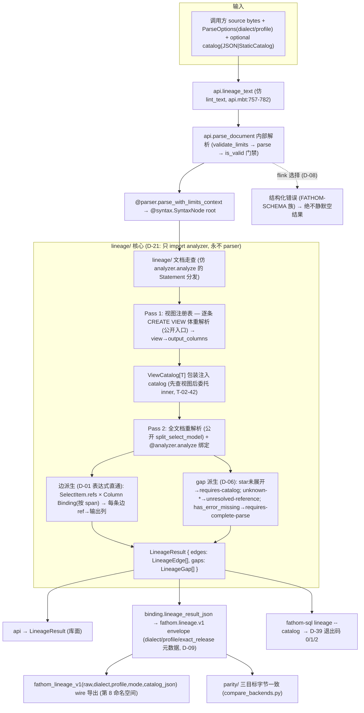

# Phase 7: Column Lineage (LINE-01) — Research

**Researched:** 2026-08-11
**Domain:** 基于 ANAL-01 解析结果的列级血缘（source→target 边 + 显式 gap 报告）；Doris-only；跨 SELECT/INSERT/CTE/UNION/视图展开
**Confidence:** HIGH（analyzer 公开面、select-model 可见性、INSERT/EXCEPT 解析形态、wire/CLI/parity 扩展点全部本 session 直接读源验证；仅 gap 派生规则细节与视图注册表合并语义为 [ASSUMED]，需执行器确认）

## Summary

本阶段交付 **LINE-01 列级血缘**：消费 Phase 5 ANAL-01 的解析/绑定结果，构建 source→target 列级边（D-01 表达式直通模型：投影表达式内**每个已解析列引用**各贡献一条边到该输出列），跨 SELECT/INSERT/CTE/UNION/视图展开；每边携带**源列引用 span + 目标输出列 span**（平铺 Int 字节偏移）；无 catalog 时对未解析引用与 `*` 展开**诚实报告 gap，绝不伪造边**（SC2）。

**核心事实（本 session 直接读源验证）：** `analyzer/` 的 `analyze`（resolve.mbt:1382-1386）已经对文档内**每个语句体**（Select/Insert/Update/Delete/Merge/CreateView）做完整解析与名字解析，产出带平铺 `start_byte`/`end_byte` span 的 `Binding` 数组 + 独立通道的 `AnalysisDiagnostic`（analysis.mbt:22-59）。血缘**不需要重写解析**。但 `SelectModel`/`SelectItem`/`NameRef` 等结构化模型**全部是包私有**（select_model.mbt:11-107 无 `pub`），`analyze` 的公开面只有 `analyze`/`resolve_table_references` 两个泛型函数 + `pub(all)` 数据类型——**血缘必须先在 analyzer 打开一个 lineage-facing 公开面**（Wave 0）。此外有两处**解析层缺口**：INSERT 的尾随 SELECT 体当前不被 `analyze_dml_body` 分析（resolve.mbt:1256-1264 只解析目标表 + 列清单）；`* EXCEPT (cols)` 的排除列当前被 `build_select_item` 剥离但不参与星号展开（select_parser.mbt:408-434）——这两处需要 analyzer 扩展或显式 gap。

**关键陷阱（研究 Pitfall V1/V3/V6 + 本 session 补充）：** catalog 大小写折叠（`StaticCatalog::lookup` 解析期 ASCII case-fold，引号标识符字节复核，analyzer.mbt:117-128）；`*` 无 catalog 时 `expand_star` **静默产出零列**（resolve.mbt:388 起）——分析器**不发出任何诊断**，血缘必须自己检测星号未展开并生成 `requires-catalog` gap；schema v2 bump = **纯增第 8 命名空间** `fathom.lineage.v1`（schema.mbt:20-28）；边/ gap 的**顺序是公共契约**（三目标字节 parity 需要确定性迭代——STACK.md 已核实 `Map` = LinkedHashMap，catalog 列顺序 = 调用方 JSON 顺序）。**D-04 的"集合运算 EXCEPT/INTERSECT"与当前 analyzer 不符**：Doris `EXCEPT` 是**投影修饰符**（`SELECT * EXCEPT (cols)`，parser.mbt:1637-1646），`INTERSECT` 不在 Doris 接受集（select_parser.mbt:10-13），`SelectModel.branches` 只承载 **UNION 链**。

**Primary recommendation:** 新建 `lineage/` 独立库（D-21：只 import `analyzer/`，永不 parser）。Wave 0 在 analyzer 打开最小 lineage-facing 公开面（`pub(all)` select-model 类型 + 公开重解析入口）；Wave 1 `lineage/` 核心：文档走查 + 视图注册表（`ViewCatalog[T]` 包装注入 catalog）+ 边/ gap 派生；Wave 2 `api.lineage_text(raw, parse_options, catalog?)`；Wave 3 `fathom.lineage.v1`（第 8 命名空间）+ `fathom-sql lineage --catalog <file>`（D-39 0/1/2）；Wave 4 parity 三目标字节一致 + docs。

<user_constraints>
## User Constraints (from CONTEXT.md)

### Locked Decisions

- **D-01:** 血缘边为**列级 source→target 边**，投影表达式按**表达式直通**建模：输出列的表达式内**每个已解析列引用**各自贡献一条边到该输出列。`SELECT a + b AS x FROM t` → 两条边 `t.a → x`、`t.b → x`；`SELECT a AS x FROM t` → 一条边 `t.a → x`。函数调用表达式同样按实参列引用展开（`upper(c) AS u` → `t.c → u`）。不做表达式级 taint/中间表达式节点（区别于 "column→expression→column" 图，那是 LINE-02 级扩展）。每条边携带**源列引用 span + 目标输出列 span**（平铺 Int 字节偏移，D-01/D-06 纪律）。**Reversibility:** costly — 边语义是公共契约；若后续改为中间表达式节点图需迁移既有消费方。
- **D-02:** 表达式中的列引用通过 ANAL-01 的 `NameRef`/绑定复用：`SelectItem.refs` 已含每个引用；血缘边复用 Binding 的 `resolved_to` 归属表。未解析的列引用（unknown-column 诊断）→ 对应位置产生 `unresolved-reference` gap（D-07），不产生边。
- **D-03:** 视图展开采用**同文档 CREATE VIEW 体解析 → 内存视图注册表**（view → 输出列映射），兑现 Phase 5 D-05 顺延；基表/外部列元数据来自注入 catalog。不在文档内定义的视图：有 catalog 列元数据（视图作为表）则展开，否则产生 `requires-catalog` gap。CTE 展开复用 analyzer 现有作用域栈（CteDef 已解析），不新写 CTE 引擎。**Reversibility:** one-way — 视图注册表语义决定 `INSERT INTO ... SELECT ... FROM v` 的边；若后续改为外部视图服务需迁移。
- **D-04:** 集合运算（UNION/EXCEPT/INTERSECT）按**位置列映射**：输出列 i 继承各分支第 i 列（UNION 输出列名取首分支，Phase 5 `SelectModel.branches` 既有约定）。INSERT 形态：`INSERT INTO t(c1,c2) SELECT ...` 目标列列表与 SELECT 输出按位置对齐；`INSERT INTO t VALUES (...)`/无列列表形式按目标表列序；`INSERT INTO t SET` 按列名。所有 INSERT 目标表来自 `resolve_table_references` 既有走查。**Reversibility:** costly — 列映射规则是公开语义；改动影响既有血缘结果。
- **D-05:** catalog 注入延续 T-02-42（调用方拥有元数据、analyzer 只消费）：`lineage_text`/wire 导出接受**可选 catalog 参数**，CLI `lineage` 子命令加 `--catalog <file>`（JSON）；缺省/未提供时**所有 `*` 展开与外部视图按 gap 报告**，绝不合成边（SC2）。MoonBit 库 API 直接接受 catalog trait（与 `analyze` 一致）。**Reversibility:** one-way — wire 签名是公开 ABI；发布后增删 catalog 参数需迁移宿主。
- **D-06:** Gap 模型为**独立 gaps 列表**（与 edges 分离）：codes = `requires-catalog`（`*`/`table.*` 无 catalog 列元数据、外部视图无元数据）、`unresolved-reference`（unknown-table/column 的引用）、`requires-complete-parse`（error/missing 树，D-33 拒绝哲学，复用 `has_error_missing`）。每个 gap 携带 span。有 catalog 时 `*` 展开为真实边；`table.*` 仅当该表已解析且 catalog 提供列元数据才展开，否则 `requires-catalog` gap。**Reversibility:** one-way — gap codes 是公共契约；重命名破坏下游过滤。
- **D-07:** 交付面完整对齐 Phase 6 模式：新 `lineage/` MoonBit 包（D-21：只 import `analyzer/`，永不 import parser）+ `api.lineage_text` 序列化入口 + `fathom.lineage.v1` wire 导出（envelope 含 dialect/profile 元数据，D-09 纪律；`validate_schema_version` 增加第 8 命名空间）+ `fathom-sql lineage` 子命令（D-39 退出码 0/1/2）+ `parity/` 跨目标一致性（native/js/linear-wasm 字节一致）+ `docs/API.md` 章节。**Reversibility:** one-way — wire 命名空间是公开 ABI。
- **D-08:** 方言门禁：本阶段 **Doris-only**（LINE-01 按 Doris 需求定义）。flink 选择 → 显式不支持错误（FATHOM-SCHEMA 族，复用 D-04/D-05 纪律——不新造 `FATHOM-LINE-*`、不建 `fathom.lineage.flink` 命名空间），绝不静默空结果。**Reversibility:** reversible — 后续加 Flink 血缘为增量。

### Claude's Discretion
（`--auto` 模式：全部灰区由 Claude 依据既有决策链——D-21（analyzer 依赖纪律）、Phase 5 D-01/D-06（AnalysisResult/平铺 span）、Phase 5 D-05（视图展开顺延）、Phase 6 D-04/D-05/D-06（wire 命名空间 + schema v2 bump + 无 catalog 面纪律）、ANLY-01（语法 valid 通道不变）、T-02-42（catalog 调用方注入）、ROADMAP SC2（无 catalog 诚实 gap）、研究 Pitfall V1/V3/V6（catalog 大小写、视图/CTE/`*` 断裂、schema bump）——选择推荐项；D-01..D-08 覆盖全部灰区，无 "you decide"。）

### Deferred Ideas (OUT OF SCOPE)
- 跨库/跨 catalog 血缘联邦 → LINE-02（backlog）
- 表达式级 taint / column→expression→column 中间节点图 → LINE-02 级扩展（D-01 反面）
- Flink 血缘 → 后续阶段（本阶段 Doris-only，D-08）
- LSP 血缘可视化 / semantic tokens / hover → TOOL-FUTURE-01（backlog）
- 视图定义持久化 / 外部视图服务 → catalog 演进（无 catalog 运行时纪律）
</user_constraints>

<phase_requirements>
## Phase Requirements

| ID | Description | Research Support |
|----|-------------|------------------|
| LINE-01 | 用户可检查受支持的查询与视图的列级数据血缘（SELECT/INSERT/CTE/集合运算/视图展开，边带源码位置）；无 catalog 时未解析引用与 `*` 展开产生显式 "requires catalog" gap 而非伪造边 | RQ1 analyzer 复用面 + Wave-0 公开面（AnalysisResult/Binding/SelectModel）；RQ2 边派生（D-01 表达式直通 + span 关联）；RQ3 视图注册表 + ViewCatalog；RQ4 INSERT/CTE/UNION 位置映射 + 解析层缺口；RQ5 gap 派生（requires-catalog / unresolved-reference / requires-complete-parse）；RQ6 wire/CLI/parity 交付面（fathom.lineage.v1 + lineage 子命令 + 三目标 parity）。详见 Architecture Patterns |

## Architectural Responsibility Map

| Capability | Primary Tier | Secondary Tier | Rationale |
|------------|-------------|----------------|-----------|
| SELECT/CTE/UNION 解析模型与名字解析（绑定 + span） | API/Backend（`analyzer/`） | — | ANAL-01 既有 `analyze`/`resolve_model`；血缘直接复用，零重写（RQ1） |
| 视图注册表（CREATE VIEW 体 → 输出列） | API/Backend（`lineage/`） | `analyzer/` 公开的 CREATE VIEW 体重解析入口 | 同文档视图按序分析成 view→columns 映射；经 `ViewCatalog[T]` 包装注入 catalog（RQ3） |
| 边派生（投影 ref → 输出列） | API/Backend（`lineage/`） | — | D-01 表达式直通：SelectItem.refs × Binding（按 span 关联）→ 每条边（RQ2） |
| INSERT 位置列映射 / UNION 分支映射 | API/Backend（`lineage/`） | `analyzer/` 公开的 token 切片工具 | `INSERT INTO t(c1,c2) SELECT ...` 尾 SELECT 需 lineage 侧重解析（RQ4） |
| Gap 派生（honest 报告） | API/Backend（`lineage/`） | analyzer 诊断通道（ANLY-01） | requires-catalog / unresolved-reference / requires-complete-parse 独立 gaps 列表（RQ5/D-06） |
| Catalog 注入与视图合并 | API/Backend（`lineage/` ViewCatalog + `api` 可选 StaticCatalog） | — | 泛型 `T: Catalog` 走查 + `ViewCatalog[T]` 先查视图后委托注入 catalog（T-02-42） |
| Wire / CLI 消费面 | 适配层（`binding/` + `fathom-sql/`） | — | `fathom.lineage.v1`（第 8 命名空间）+ `lineage --catalog` 子命令；D-39 0/1/2（RQ6/D-07/D-08） |
| 跨目标 parity 证明 | 工具链/CI（`parity/` + `compare_backends.py`） | — | 同 fixture 在 native/js/wasm 边/gap 字节一致（RQ6，Phase 12 D-03 纪律） |

## Standard Stack

### Core
本阶段**零新增外部运行时依赖**——完全复用既有 MoonBit 核心资产与仓库内模块（同 Phase 6 D-01/D-07 纪律）：

| Library / Asset | Version / 位置 | Purpose | Why Standard |
|---------|---------|---------|--------------|
| `moonbitlang/core`（builtin） | `0.1.20260728+5e7afb0c0`（moon.mod 记录 toolchain `moon 0.1.20260724`） | Bytes/String/Array/Map 基础；`Map` = LinkedHashMap（确定性迭代，STACK.md 已核实） | 边/ gap 数组、视图注册表；确定性序列化 |
| `fathom/sql/analyzer` | 仓库内 | `analyze`/`resolve_table_references` + `pub(all)` 数据模型（Binding/AnalysisResult/ColumnInfo/TableInfo/Catalog/StaticCatalog） | ANAL-01 解析结果即血缘输入（D-02）；D-21 单向依赖 |
| `fathom/sql/syntax` | 仓库内 | `SyntaxNode` read views（经 analyzer 间接消费） | `analyze(node, source_bytes, catalog)` 的输入 |
| `fathom/sql/api` | 仓库内 | `parse_document` 内部解析 + `lint_text`/`fingerprint_text` 共享核心入口模板 | `lineage_text` 仿此（含可选 catalog 参数） |
| `fathom/sql/binding` | 仓库内 | envelope JSON + `validate_schema_version`（schema.mbt:20-28）+ `#export_name` wire 导出 + `@json` | `fathom.lineage.v1` 第 8 命名空间纯增（Pitfall V6）；catalog JSON 解析落点 |
| `fathom/sql/fathom-sql` | 仓库内 | CLI 子命令分发 + D-39 退出码 | `lineage` 子命令 + `--catalog <file>` 仿 lint/fingerprint |
| `parity/` + `scripts/compare_backends.py` | 仓库内 | 三目标字节一致聚合 | lineage 跨 native/js/wasm parity 证明 |

### Supporting（测试与文档）
| Library | Version | Purpose | When to Use |
|---------|---------|---------|-------------|
| `@mtest.Test` + `t.write`/`t.snapshot` | 内置 | 边/gap 快照 golden（test/analyzer_anal01_test.mbt:86-90 先例） | 锁定边/gap 结构与顺序；`moon test --update` 唯一写路径 |
| `test/` 包（test/moon.pkg） | 仓库内 | parse → lineage 集成测试（analyzer_anal01_test.mbt 模式） | lineage 不能 import parser（D-21），集成测试放 test/ |
| `parity/__snapshot__` + `baseline_test.mbt` | 仓库内 | 跨目标快照树 digest | lineage parity fixture 字节一致 |

### Alternatives Considered
| Instead of | Could Use | Tradeoff |
|------------|-----------|----------|
| lineage 建独立 `lineage/` 包（D-07） | 塞进 `analyzer/` 或 `api/` | 违反 D-07 包布局；analyzer 会承载血缘语义，D-21 边界模糊 |
| 血缘复用 `analyze` 的扁平 bindings + 按 span 关联 SelectModel（推荐） | 重写一条 lineage 专用解析管线 | 复用现有作用域栈/CTE/限定名/引号语义（Pitfall 4 等已处理）；零解析重写（RQ1） |
| 视图合并经 `ViewCatalog[T]` 包装（推荐） | 枚举注入 catalog 条目合并进新 StaticCatalog | `Catalog` 是 open trait，调用方可自实现；StaticCatalog 字段私有无可枚举访问器——包装器是唯一通用方案（RQ3） |
| INSERT 尾 SELECT 由 lineage 侧调公开重解析入口 | 扩展 `analyze_dml_body` 直接分析 SELECT 尾 | 后者改动 ANAL-01 行为面（one-way）；前者保持 analyze 契约不变（RQ4） |
| wire 序列化走 binding（推荐，Phase 6 先例） | 直接在 lineage/ 内 `#export_name` | Pitfall 17：export 必须在产出 artifact 的包中声明；binding/ 是既有 foreign_library 宿主 |

**Version verification:** 本阶段不引入新包。既有栈版本已核实：`moon.mod` 记录 `moon 0.1.20260724`（[VERIFIED: moon.mod:5-8]）；核心依赖 `moonbitlang/core 0.1.20260728+5e7afb0c0`（[CITED: .claude/CLAUDE.md GSD:stack]）。`Map` = LinkedHashMap 确定性迭代来自 v1.0 STACK.md（[CITED: .planning/milestones/v1.0-research/STACK.md]）。

## Package Legitimacy Audit

> **N/A** — 本阶段**零新增外部包**（D-01/D-05 明确零运行时依赖；`lineage/` 只 import `analyzer/` + 间接 syntax/source/core）。无 [SLOP]/[SUS] 项，无 `npm view`/`pip index` 需执行。catalog JSON 解析复用 `binding/` 既有的 `@json`（Phase 6 已评估）。

## Architecture Patterns

### System Architecture Diagram



### Recommended Project Structure

```
analyzer/                        # [扩展] Wave 0 —— lineage-facing 公开面（只增不改既有行为）
├── select_model.mbt             # pub(all) SelectModel/SelectCore/SelectItem/FromItem/CteDef/NameRef/TokenSlice
├── select_parser.mbt            # 公开 source_tokens / split_select_model（或薄 pub 包装）
├── resolve.mbt                  # 公开 CREATE VIEW 体切片 / INSERT 尾 SELECT 定位辅助（或 lineage 侧用公开 token 工具重实现）
└── analysis.mbt                 # （不变）Binding/AnalysisDiagnostic/AnalysisResult 已 pub(all)

lineage/                         # [新增] 独立库（D-07/D-21）
├── moon.pkg                     # import: analyzer（+ syntax/source 间接）；永不 import parser（D-21 负门禁）
├── model.mbt                    # [新增] LineageEdge / LineageGap / LineageResult（平铺 Int span，可序列化）
├── views.mbt                    # [新增] 视图注册表构建 + ViewCatalog[T] 包装（view→columns 优先）
├── edges.mbt                    # [新增] 边派生：模型走查 × Binding(span) 关联 → 每投影 ref 一条边（D-01）
├── gaps.mbt                     # [新增] gap 派生：star未展开→requires-catalog; 诊断映射; has_error_missing（D-06）
├── insert.mbt                   # [新增] INSERT 目标列清单 + 尾 SELECT 位置映射；VALUES/无列清单按 catalog 列序
├── lineage_test.mbt             # [新增] 白盒单测（边/gap 派生、视图/CTE/UNION/INSERT、确定性）

api/                             # [扩展]
├── api.mbt                      # lineage_text(raw, parse_options, catalog: StaticCatalog?)（仿 lint_text）+ 类型再导出
└── moon.pkg                     # + analyzer + lineage import

binding/                         # [扩展] schema v2 bump（Pitfall V6）
├── schema.mbt                   # LINEAGE_SCHEMA_VERSION + validate_schema_version 第 8 命名空间（纯增）
├── exports.mbt                  # fathom_lineage_v1(raw,dialect,profile,mode,catalog_json)（仿 fathom_lint_v1）
├── json.mbt                     # lineage_result_json（edges/gaps 序列化；源/目标列名 + span）
├── catalog_json.mbt             # [新增] catalog JSON → StaticCatalog（tables/db_tables/functions；@json）
└── moon.pkg                     # js/wasm exports 列表 + fathom_lineage_v1

fathom-sql/                      # [扩展] D-39 退出码
├── args.mbt                     # subcommand 白名单 + "lineage" + --catalog <file> 标志
├── run.mbt                      # run_lineage：0=envelope, 1=parse失败/拒绝, 2=用法/配置错误（含坏 catalog JSON）
├── main.mbt                     # 分发 lineage
└── cli_test.mbt                 # lineage 退出码矩阵

parity/                          # [扩展] 跨目标一致性
├── lineage_parity_test.mbt      # 同 fixture → 三目标相同 edges/gaps 字节（仿 fingerprint_parity_test.mbt）
├── run_js.mbt / run_wasm.mbt    # 冒烟调用 fathom_lineage_v1
└── moon.pkg                     # targets 配置不动

test/                            # [扩展]
├── lineage_test.mbt             # parse → lineage 集成测试（仿 analyzer_anal01_test.mbt）+ 快照 golden
└── moon.pkg                     # + lineage import

docs/
├── API.md                       # Lineage Entry Points + Wire Exports 第 8 导出（commit_docs: true）
└── zh-CN/API.md                 # 同步中文版
```

### Pattern 1: 复用 analyze + 按 span 关联 SelectModel（RQ1/RQ2）

**What:** 血缘不重写解析。`@analyzer.analyze(node, bytes, catalog)` 已产出全文档扁平 `Binding[]`（含 Column 绑定，span 唯一）；`lineage/` 用公开的 `split_select_model` 重解析各 SELECT 体得到 `SelectModel`，然后**按 span 关联**：每个 `SelectItem.refs` 中的 `NameRef`，其 `start_byte`/`end_byte` 与某条 `BindingKind::Column` 绑定匹配 → 该绑定是源；`SelectItem.alias`（或单 ref / star 绑定）→ 目标输出列。

**When to use:** 每个 SELECT-family 语句体（顶层 SELECT、CTE 体、子查询体、CREATE VIEW 体、INSERT 尾 SELECT）的边派生。

**关键点（已验证事实）：**
- `Binding` 的 `start_byte`/`end_byte` 是 token 原样 span（analysis.mbt:34-42）；同一 token 运行内唯一，故 span 关联可靠。
- 目标输出列 span：别名项 → `alias_slice` span；单 ref 无别名 → ref span；star → star span（星号展开的 Column 绑定共享 star span，name = 展开列名）。
- `SELECT a + b AS x` → 两条边（`a` 绑定 + `b` 绑定 → `x`），符合 D-01。
- **不需要 statement_id**（Binding 无 statement_id）；span 关联即可，文档序迭代天然确定。

**Example（目标 span 判定，形状自 select_model.mbt:51-62 推导）:**
```moonbit
/// 每条投影边的目标 = 该 SelectItem 的输出列。
/// - 有别名: name=alias, span=alias_slice（select_model.mbt:53-54）
/// - 无别名单 ref: name=该 ref 的 Column 绑定 name, span=ref span
/// - star: name=每个星号展开的 Column 绑定 name, span=star span
/// - 无别名多 ref 表达式（如 `SELECT a + b`）: 输出列取 resolve 侧
///   `resolved_refs[0]`（resolve.mbt:834-839），目标 span=item 表达式 span
```

### Pattern 2: 视图注册表 + ViewCatalog[T] 包装（RQ3/D-03）

**What:** 同文档 CREATE VIEW 按文档序分析体 → `view → output_columns` 注册表；`lineage/` 走查用 `ViewCatalog[T]` 包装注入 catalog（先查注册表，未中则委托 `inner`），使 `FROM v` 解析到视图列。外部视图由注入 catalog 的 `TableInfo` 提供；两者皆缺 → `requires-catalog` gap（D-03）。

**When to use:** 视图展开；视图链（`CREATE VIEW v1 ...; CREATE VIEW v2 AS SELECT a FROM v1`）按序累积注册表。

**关键点：**
- 注入 catalog 是 `pub(open) trait Catalog`（analyzer.mbt:44-50），调用方自实现——**不能枚举其条目合并成新 StaticCatalog**（StaticCatalog 字段私有）。`ViewCatalog[T]` 泛型包装是唯一通用方案。
- `table_in_db`/`function` 直接委托 inner（视图只出现在默认库命名空间）。
- 大小写：视图名查找沿用解析期 ASCII case-fold（D-03），引号字节复核（Pitfall V1）。

**Example（包装器形状，trait 方法签名自 analyzer.mbt:44-50）:**
```moonbit
/// 视图优先于 catalog 表的可见性：同名视图 shadow 同名表（CTE 优先于
/// catalog 的同一约定，Pitfall 4）。
pub struct ViewCatalog[T] {
  views : Map[String, Array[ColumnInfo]]
  inner : T
}

pub impl[T : Catalog] Catalog for ViewCatalog[T] with table(self, name) {
  // 1) 视图注册表 case-fold 命中 -> 视图输出列 TableInfo
  // 2) 未中 -> self.inner.table(name)
}
pub impl[T : Catalog] Catalog for ViewCatalog[T] with table_in_db(self, db, name) {
  self.inner.table_in_db(db, name)
}
pub impl[T : Catalog] Catalog for ViewCatalog[T] with function(self, name) {
  self.inner.function(name)
}
```

### Pattern 3: INSERT 位置列映射（RQ4/D-04，含解析层缺口）

**What:** `INSERT INTO t(c1,c2) SELECT ... FROM u` → SELECT 输出列 i 按位置映射到目标列 i；无列清单按 catalog 表列序（需 catalog，缺则 `requires-catalog` gap）；`VALUES (...)` 行字面量无列引用 → 无 source 边。目标表名经 `resolve_table_references` 既有走查。

**已验证的解析层事实（关键）：**
- Doris `parse_insert`（parser.mbt:1997-2051）接受：`INSERT [OVERWRITE TABLE|INTO] qualified_name [PARTITION(...)] [WITH LABEL x] [(col,...)] VALUES ... | query`。**无 `INSERT ... SET` 形式**——D-04 的 "INSERT INTO t SET 按列名" 不在 Doris 接受集，本阶段无需实现（Update/Merge 的 SET 在 analyzer 已处理，resolve.mbt:1217-1255）。
- `analyze_dml_body` 的 Insert 臂（resolve.mbt:1256-1264）**只解析目标表 + 括号列清单 refs**，**不分析尾随 SELECT 体** → 血缘必须自己在 INSERT token 切片中定位 `VALUES`/`SELECT`/`WITH`，对 SELECT 体走公开重解析入口（RQ1），再位置映射。
- `VALUES (...)` 多行：目标列名来自显式列清单（无需 catalog）或 catalog 列序（需 catalog）；行内无列 refs → 无边。

**When to use:** 每个 `SyntaxKind::Insert` 语句体。

### Pattern 4: Gap 派生（RQ5/D-06，honest gaps ≠ 伪造边）

**What:** gaps 是独立列表（与 edges 分离），三个锁定码：`requires-catalog` / `unresolved-reference` / `requires-complete-parse`，每个带 span。

**派生规则（推荐，[ASSUMED] 需执行器确认）：**
| 情形 | gap code | 依据 |
|------|----------|------|
| star 项未展开出任何列（无 catalog 列元数据；`expand_star` 静默零列） | `requires-catalog` | D-06；`expand_star` 无诊断（resolve.mbt:388 起）——**血缘必须自检星号** |
| FROM/JOIN 表引用未解析（unknown-table），且**未注入 catalog** | `requires-catalog`（无法区分表 vs 外部视图） | D-03 "外部视图无元数据" |
| FROM/JOIN 表引用未解析（unknown-table），且**已注入 catalog** | `unresolved-reference` | D-06 "unknown-table 的引用" |
| 列/函数引用未解析（unknown-column / unknown-function / ambiguous-reference） | `unresolved-reference` | D-06 |
| 语句体含 error/missing 材料 | `requires-complete-parse` | D-33；复用 `has_error_missing`（resolve.mbt:69-90） |

**注意：** 分析器的 `requires-complete-parse` 诊断（`analyze_select_body`/`analyze_dml_body`/`analyze_create_view_body` 均含 refusal 分支，resolve.mbt:1017-1043, 1188-1216, 1295-1314）直接映射同码 gap。ambiguous-reference 无独立 gap 码 → 映射 `unresolved-reference`（决策点，见 Open Question 2）。

### Pattern 5: Wire/CLI/parity 交付面（RQ6/D-07/D-08）

**What:** 完全对齐 Phase 6 模板：
- **schema v2 bump（纯增，Pitfall V6）：** `binding/schema.mbt:20-28` 的 `validate_schema_version` 增加 `fathom.lineage.v1` 分支，既有 7 命名空间分支不动。
- **wire 导出：** `fathom_lineage_v1(raw, dialect, profile, mode, catalog_json : Bytes)`（仿 `fathom_lint_v1`，exports.mbt；`catalog_json` 空 = 无 catalog）。注册进 `binding/moon.pkg` js/wasm exports 列表（Pitfall 3/8）。
- **envelope：** `fathom.lineage.v1` 含 dialect/profile/exact_release 元数据（D-09）+ `edges` + `gaps` 数组。每条 edge `{source_name, source_resolved_to, source_start_byte, source_end_byte, target_name, target_start_byte, target_end_byte}`；每个 gap `{code, message, start_byte, end_byte}`。span 是 Int 字节偏移（`Json::number(x.to_double())`，Phase 6 json.mbt:7-12 先例）。
- **CLI：** `fathom-sql lineage --dialect doris --profile <id> [--catalog <file>] [file|-]`。D-39：0 = envelope 输出；1 = parse 失败；2 = 用法/配置错误（缺 dialect/profile、坏 --catalog 路径、catalog JSON 非法、flink 选择）。
- **Flink 门禁（D-08）：** `lineage_text`/wire/CLI 对 flink 选择返回结构化错误（FATHOM-SCHEMA 族，推荐 `FATHOM-SCHEMA-003` + 明确 message "lineage is Doris-only"；CLI exit 2），**绝不静默空结果**。
- **parity：** `parity/lineage_parity_test.mbt` 断言同 fixture 在三目标产出**相同边/gap 字节**（仿 fingerprint_parity_test.mbt:10-32 硬编码期望值）；`run_js.mbt`/`run_wasm.mbt` 冒烟调用 `fathom_lineage_v1`；`compare_backends.py` 自动纳入 `moon test --target {t} --package parity`。

### Pattern 6: 边/gap 派生中的确定性（parity 前置）

**What:** 边/gap 数组顺序是公共契约（三目标字节一致 + 快照 golden）。顺序来源全部确定性：文档语句序 → `SelectModel` 分支/CTE 序 → `SelectItem` 序 → `refs` 序；star 展开按 scope entry 序 × catalog 列序（catalog 列序 = 调用方 JSON 顺序）。`Map` = LinkedHashMap（STACK.md），视图注册表迭代稳定。

**When to use:** 每次序列化；parity 测试前。

## Don't Hand-Roll

| Problem | Don't Build | Use Instead | Why |
|---------|-------------|-------------|-----|
| SELECT 体/CTE/子查询/UNION 的结构化解析 | lineage 内重写 clause splitter | analyzer 公开的 `split_select_model`（select_parser.mbt:1150-1152） | 既有括号深度/子查询组/OVER 跳过/别名检测已处理（Pitfall 1/2/3）；重写会漂移 |
| 名字解析（作用域栈、CTE 优先、限定名、引号语义） | lineage 内新作用域引擎 | `@analyzer.analyze` 的绑定（D-02 明文） | CTE 优先于 catalog 表（Pitfall 4）、WR-04/05/06 已实现；重写引入不一致 |
| 星号展开（带 catalog） | lineage 内重实现展开逻辑 | analyzer 的 `expand_star`（resolve.mbt:388 起）绑定 | 展开列绑定已带 star span；lineage 只负责"未展开→requires-catalog"判定 |
| error/missing 拒绝扫描 | lineage 内重写递归扫描 | `has_error_missing`（resolve.mbt:69-90）或经 analyzer 的 `requires-complete-parse` 诊断 | D-33 拒绝哲学；单源实现 |
| 视图合并进 catalog | 枚举注入 catalog 条目 | `ViewCatalog[T]` 泛型包装 | `Catalog` 是 open trait，无法枚举；包装器保序且零侵入 |
| UInt64/跨端一致性基础 | — | 本阶段无 UInt64（边/gap 全 Int span）；复用 parity 机制 | 指纹已证明 UInt64 跨端；血缘 span 用 Int 即可 |

**Key insight:** 血缘的增值在**边/gap 派生语义**（D-01/D-06 的公共契约），不在解析。任何"重写解析/重写作用域"的冲动都重复 ANAL-01 已解决且已快照锁定的正确性，还引入漂移风险（Pitfall V3）。

## Common Pitfalls

### Pitfall 1: catalog 大小写折叠（研究 Pitfall V1）
**What goes wrong:** 血缘对 `SELECT Col FROM Tbl` 的 source 列名若按字节精确匹配 catalog，合法 Doris 被报 unresolved。
**Why it happens:** `StaticCatalog` 查找是解析期 ASCII case-fold（analyzer.mbt:117-128），引号标识符字节复核（D-03）；血缘**不得**重做一遍大小写判定。
**How to avoid:** 一律复用 `analyze` 的绑定（`resolved_to` 是 catalog 规范名、`name` 是源码拼写）；边/gap 的列名用绑定值，不自行 compare。
**Warning signs:** 测试只用小写标识符；边名与 catalog 大小写不一致。

### Pitfall 2: 视图/CTE/`*` 展开断裂（研究 Pitfall V3）
**What goes wrong:** `SELECT * FROM v`（v 是视图）或 `WITH c AS (...) SELECT * FROM c` 不产边；或 `*` 无 catalog 被静默跳过（无边也无 gap）。
**Why it happens:** `analyze` 不注册视图（CREATE VIEW 只解析体不登记）；`expand_star` 空 scope 静默零列（resolve.mbt:388 起）。
**How to avoid:** 视图注册表 + `ViewCatalog[T]`（Pattern 2）；血缘自检 star 未展开 → `requires-catalog` gap（Pattern 4）。
**Warning signs:** 视图/CTE 查询的边数为 0 且无 gap；`SELECT * FROM t` 无 catalog 时结果空无一物。

### Pitfall 3: `* EXCEPT (cols)` 误报/漏报
**What goes wrong:** Doris 的 `SELECT * EXCEPT (b) FROM t` 中 `EXCEPT` 是**投影修饰符**（parser.mbt:1637-1646），`build_select_item` 剥离了 `EXCEPT(...)`（select_parser.mbt:408-434）但 `expand_star` **不应用排除**——血缘会为被排除列 b 产出伪造边。
**Why it happens:** `SelectItem` 不承载 except 列表，analyzer 星号展开未实现排除语义。
**How to avoid:** 本阶段两个选项——(a) 扩展 analyzer：`SelectItem` 增 `except_cols` + `expand_star` 应用排除（analyzer 内部改动，不动 parser）；(b) 对含 `EXCEPT` 修饰的 star 项产生 `requires-catalog` gap 并文档化。推荐 (a)（诚实展开）；至少 (b) 不得静默伪造边。
**Warning signs:** 测试无 `* EXCEPT` 用例；展开边含被排除列。

### Pitfall 4: 集合运算范围错配（D-04 与 analyzer 现状）
**What goes wrong:** 按 D-04 字面为 EXCEPT/INTERSECT 建分支映射，但 analyzer 只建模 **UNION 链**。
**Why it happens:** `select_parser.mbt:10-13` 明文：UNION 切分；EXCEPT 是投影修饰符；INTERSECT 不在接受集（Doris 查询循环只循环 UNION，parser.mbt 共享骨架）。
**How to avoid:** 集合运算位置映射只做 **UNION**（`branches` 既有约定）；EXCEPT 按 Pattern 3/Pitfall 3 处理（投影修饰符）；INTERSECT 在 Doris 接受集外 → 不产生（语法无效文档走 `requires-complete-parse`）。
**Warning signs:** 测试用 `EXCEPT`/`INTERSECT` 作集合运算构造 UNION 式分支。

### Pitfall 5: schema-version 泄漏 / bump 破坏既有命名空间（研究 Pitfall V6）
**What goes wrong:** `validate_schema_version` 收紧或重排既有分支，或新命名空间没注册进 `binding/moon.pkg` js/wasm exports 列表。
**Why it happens:** Phase 6 v2 bump 是纯增；绑定导出漏注册会静默缺符号（Pitfall 3/8，docs/API.md:504 明文）。
**How to avoid:** `fathom.lineage.v1` 作为第 8 命名空间**追加**分支（schema.mbt:20-28）；exports.mbt 加 `fathom_lineage_v1` + `binding/moon.pkg` js/wasm 两处 exports 列表；parity/schema_test.mbt 补断言。
**Warning signs:** 既有 7 命名空间测试改动；wasm/js artifact 缺 `fathom_lineage_v1` 符号。

### Pitfall 6: 边/gap 顺序不确定（parity 断裂）
**What goes wrong:** 同一 fixture 在 native/js/wasm 产出不同字节（数组顺序漂移），parity 门禁失败。
**Why it happens:** 依赖 Map 无序迭代或 catalog 列顺序不稳定；`Json::number(x.to_double())` 对大 Int span 精度丢失。
**How to avoid:** 迭代顺序全部来自文档/模型/catalog 列序（Pattern 6）；`to_double()` 仅用于 ≤ 2^53 的 span Int（安全）；parity 硬编码期望值断言（fingerprint_parity_test.mbt:10-32 先例）。
**Warning signs:** 同 fixture 跨目标字节 diff；快照在仅重排序时变化。

### Pitfall 7: 无 catalog 时伪造边（SC2 红线）
**What goes wrong:** 血缘对无 catalog 的 `*` 或外部视图推测列名产出假边。
**Why it happens:** 误把"表名已知"当"列元数据已知"；或把 gap 混入 edges 带标记。
**How to avoid:** gaps 与 edges 严格分离（D-06）；star 无展开 → `requires-catalog` gap（绝不推测列名）；catalog 未注入时所有表解析失败 → 按 Pattern 4 映射。
**Warning signs:** `SELECT * FROM t`（无 catalog）产生任何边；gap 出现在 edges 数组。

### Pitfall 8: span 平铺不一致（Int 字节）
**What goes wrong:** 边/gap span 用 `@source.Span` 或 UInt64/行列号，破坏 D-21 import 纪律或跨端一致。
**Why it happens:** analyzer 已锁定平铺 Int `start_byte`/`end_byte`（analysis.mbt:34-42）；血缘若引入 `@source` 会破坏 D-21（lineage 只 import analyzer）。
**How to avoid:** 边/gap 全部用 Int 字节偏移（与 Binding/AnalysisDiagnostic 一致）；不 import source/parser。
**Warning signs:** lineage/moon.pkg 出现 source/parser import。

## Code Examples

### 现有 analyze 绑定模型（verbatim from analyzer/analysis.mbt:22-59）
```moonbit
/// The kind of a resolved name binding (D-06).
pub(all) enum BindingKind {
  Table
  Column
  Function
  Cte
  Alias
} derive(Eq, @debug.Debug)

/// One resolved name binding. `name` preserves the source spelling (D-03);
/// `resolved_to` is the author's display name from the catalog/scope;
/// `data_type` carries the column/function type (D-04) and is empty for
/// Table/Cte/Alias. Spans are flattened byte offsets (D-01/D-06).
pub(all) struct Binding {
  kind : BindingKind
  name : String
  resolved_to : String
  data_type : String
  start_byte : Int
  end_byte : Int
} derive(Eq, @debug.Debug)
```

### 现有 Catalog 契约（verbatim from analyzer/analyzer.mbt:44-50）
```moonbit
pub(open) trait Catalog {
  table(Self, String) -> TableInfo?
  table_in_db(Self, db : String, name : String) -> TableInfo?
  function(Self, String) -> FunctionInfo?
}
```

### 现有 analyze 文档级入口（verbatim from analyzer/resolve.mbt:1382-1386）
```moonbit
pub fn[T : Catalog] analyze(
  node : @syntax.SyntaxNode,
  source_bytes : Bytes,
  catalog : T,
) -> AnalysisResult {
```

### 现有 SelectModel 模型（verbatim from analyzer/select_model.mbt:39-107，当前包私有）
```moonbit
struct NameRef {
  parts : Array[TokenSlice]
  star : Bool
  is_call : Bool
  call_args : Array[TokenSlice]
  start_byte : Int
  end_byte : Int
}

struct SelectItem {
  tokens : Array[TokenSlice]
  alias : String?
  alias_slice : TokenSlice?
  star : Bool
  star_qualifier : NameRef?
  refs : Array[NameRef]
}

struct SelectModel {
  ctes : Array[CteDef]
  branches : Array[SelectCore]
}
```

### 现有 INSERT 分析缺口（verbatim from analyzer/resolve.mbt:1256-1264）
```moonbit
        @syntax.SyntaxKind::Insert => {
          if next < tokens.length() && tokens[next].0 == b"(" {
            let close = matching_paren(tokens, next)
            if close < tokens.length() {
              resolve_token_refs(
                slice_tokens(tokens, next + 1, close),
                scope,
                catalog,
                0,
                bindings,
                diagnostics,
              )
            }
          }
        }
```
**注意：** 只解析括号列清单 refs——尾随 `SELECT`/`WITH`/`VALUES` 源体**不被分析**。血缘需在 token 切片中定位源体并走公开重解析入口。

### 现有 validate_schema_version（verbatim from binding/schema.mbt:20-28）
```moonbit
pub fn validate_schema_version(version : String) -> Result[Unit, SchemaError] {
  match version {
    PARSE_SCHEMA_VERSION |
    FORMAT_SCHEMA_VERSION |
    COMPLETE_SCHEMA_VERSION |
    LINT_SCHEMA_VERSION |
    FINGERPRINT_SCHEMA_VERSION |
    "fathom.error.v1" |
    "fathom.capabilities.v1" => Ok(())
    _ => Err(UnsupportedSchemaVersion(version~))
  }
}
```
**bump 点：** 追加 `LINEAGE_SCHEMA_VERSION`（`"fathom.lineage.v1"`）为第 8 分支，纯增（Pitfall V6）。

## State of the Art

| Old Approach | Current Approach | When Changed | Impact |
|--------------|------------------|--------------|--------|
| 无列级血缘（仅表级 `resolve_table_references`） | 列级 source→target 边 + 视图/CTE/UNION/INSERT 展开 | 本阶段（LINE-01） | 从"语法 + 表级解析"进入列级数据血缘；基于 ANAL-01 绑定 |
| `*` 无 catalog 静默空展开（analyzer `expand_star`） | 血缘自检 star → 显式 `requires-catalog` gap | 本阶段（SC2/D-06） | 诚实报告取代静默/伪造 |
| 视图体只解析不登记 | 同文档视图注册表 + `ViewCatalog[T]` | 本阶段（D-03，Phase 5 D-05 顺延兑现） | `FROM v` 可解析到视图输出列 |
| schema v2（7 命名空间） | schema v3 纯增第 8 命名空间 `fathom.lineage.v1` | 本阶段（D-07，Pitfall V6） | wire 面新增血缘消费能力，既有命名空间零漂移 |

**Deprecated/outdated:**
- **`INSERT ... SET` 形态：** D-04 提及但**不在 Doris `parse_insert` 接受集**（parser.mbt:1997-2051 无 SET 分支）——本阶段不实现，文档中注明。

## Assumptions Log

| # | Claim | Section | Risk if Wrong |
|---|-------|---------|---------------|
| A1 | Gap 派生规则（catalog 未注入时 unknown-table → `requires-catalog`；已注入 → `unresolved-reference`）是 D-06 的正确落地 | Pattern 4 | gap code 是公共契约（D-06 one-way）；若语义不符需在 discuss/计划确认后修正映射，发布后重命名破坏下游 |
| A2 | `* EXCEPT (cols)` 推荐选项 (a)：扩展 analyzer `SelectItem` + `expand_star` 应用排除列 | Pitfall 3 | 若选 (b) gap，`SELECT * EXCEPT (b)` 的用户看到 requires-catalog 而非边；扩展 (a) 是 analyzer 内部改动（不动 parser，无 frozen-baseline 风险） |
| A3 | 视图只出现在默认库命名空间，`ViewCatalog[T]` 的 `table_in_db` 委托 inner | Pattern 2 | 若 Doris 视图可 db 限定引用（`db.v`），需视图注册表按 db 索引；当前 analyzer 视图路径未处理 db 限定（保守假设） |
| A4 | 无别名多 ref 表达式（`SELECT a + b`）输出列 = 首个解析 ref（resolve.mbt:834-839 `resolved_refs[0]`），目标 span = 项表达式 span | Pattern 1 | 若输出列命名语义不同，边目标名/span 偏差；以 analyzer 既有输出列推导为准 |
| A5 | catalog JSON 文件 schema = `{tables[], db_tables[], functions[]}` 直接映射 StaticCatalog::new/with_db/with_function | Pattern 5 | catalog JSON 是 CLI/wire 的公开输入契约（D-05）；schema 变更需文档化 |
| A6 | flink 门禁错误码推荐 FATHOM-SCHEMA-003 + 明确 message | Pattern 5 | 若消费方期望独立错误码，D-08 禁止 `FATHOM-LINE-*`；003 是既有"unsupported profile"族的合理复用 |

## Open Questions (RESOLVED)

1. **`* EXCEPT (cols)` 处理方式（选项 (a) 扩展 analyzer vs 选项 (b) requires-catalog gap）** **(RESOLVED — 07-01 Task 2: 扩展 analyzer 增 `except_cols` + 诚实展开；绝不伪造被排除列的边)**
   - What we know: `build_select_item` 剥离 EXCEPT(...)（select_parser.mbt:408-434），`expand_star` 不应用排除（Pitfall 3）；`SelectItem` 无 except 字段。
   - What's unclear: 本阶段是否值得在 analyzer 内加 `except_cols` + 展开排除（改动 ANAL-01 行为面但不动 parser）。
   - Recommendation: 推荐选项 (a)（诚实展开，analyzer 内部改动；`SELECT * EXCEPT (b)` 是最常见的 Doris 血缘场景）；若时间受限至少 (b) 显式 gap，**绝不伪造被排除列的边**。

2. **ambiguous-reference / unknown-function 的 gap 码归属** **(RESOLVED — 07-02 Task 2: 映射到 `unresolved-reference`，message 保留 analyzer 原文)**
   - What we know: D-06 只锁三码；ambiguous-reference 与 unknown-function 是 analyzer 独立诊断码（analysis.mbt:47-53）。
   - What's unclear: 应映射到 `unresolved-reference` 还是单独处理/丢弃。
   - Recommendation: 映射到 `unresolved-reference`（均是不产边的引用失败），message 保留 analyzer 原文；计划中写明。

3. **`INSERT INTO t SELECT ...` 无列清单 + 无 catalog 时的目标列名** **(RESOLVED — 07-02 Task 3: 目标表 span 产单个 `requires-catalog` gap，SELECT 源侧边照常产出并以 gap 标注位置)**
   - What we know: 无列清单按 catalog 表列序（D-04）；无 catalog 无法命名目标列。
   - What's unclear: 目标是"整条 INSERT 产 `requires-catalog` gap"还是"每个位置目标列一个 gap"。
   - Recommendation: 对无列清单 INSERT 在目标表 span 产**一个** `requires-catalog` gap（列序未知），SELECT 源侧边照常产出（源列→位置目标以 gap 标注）；计划中锁定。

4. **INSERT...SELECT 中 SELECT 源的列引用作用域** **(RESOLVED — 07-02 Task 3: 尾 SELECT 体用独立空作用域重解析，与 INSERT 目标表作用域隔离)**
   - What we know: 尾 SELECT 体独立于 INSERT 目标表作用域（`analyze_dml_body` 当前不分析尾体）。
   - What's unclear: `INSERT INTO t(c) SELECT c FROM u` 中 SELECT 的 `c` 是否可能被目标表 `t` 的列误解析（作用域污染）。
   - Recommendation: 尾 SELECT 体用**独立空作用域**重解析（复用 `analyze_select_tokens` 的空 scope 语义，resolve.mbt:992 起），与 INSERT 目标表作用域隔离；计划中写明。

5. **`fathom_lineage_v1` 的 catalog_json 空字节语义** **(RESOLVED — 07-04 Task 2: 非空非法 JSON → FATHOM-SCHEMA-004 结构化错误；空 bytes / `"{}"` → 无 catalog)**
   - What we know: 空 bytes = 无 catalog（D-05）。
   - What's unclear: 非空但非 JSON / 未知字段 → 结构化错误（FATHOM-SCHEMA-004，仿 lint overrides parse，exports.mbt parse_overrides）还是忽略。
   - Recommendation: 非空非法 JSON → 结构化错误（never silent fallback，T-06-03-01 纪律）；空 bytes / `"{}"` → 无 catalog。

## Environment Availability

> 本阶段是纯代码/配置变更（新 MoonBit 包 + 既有包扩展），**无外部服务/工具依赖**。跳过完整审计，记录核心工具链：

| Dependency | Required By | Available | Version | Fallback |
|------------|------------|-----------|---------|----------|
| MoonBit toolchain (`moon`) | 构建/测试全部包 | ✓ | `moon 0.1.20260724`（moon.mod:6） | — |
| `moonbitlang/core` | 所有包 | ✓ | `0.1.20260728+5e7afb0c0`（mooncakes） | — |
| Node（JS 目标 parity） | parity/run_js.mbt + compare_backends.py | ✓ | 环境既有（Phase 6/12 已验证） | — |
| linear-Wasm 运行时 | parity/run_wasm.mbt | ✓ | 环境既有（CLOSE-02/Phase 12 已验证） | — |
| JSON 解析（catalog 文件） | binding catalog_json.mbt | ✓ | `moonbitlang/core/json`（binding 既有 import） | — |

**Missing dependencies with no fallback:** 无。
**Missing dependencies with fallback:** 无。

## Validation Architecture

> **Skipped** — `.planning/config.json` 显式 `workflow.nyquist_validation: false`（[VERIFIED: .planning/config.json]）。按执行流程规范，本阶段不产出测试框架/REQ-测试映射表。测试纪律仍遵循仓库既有惯例：包内 `test "..."` 白盒（lineage_test.mbt）、`test/` 集成快照（analyzer_anal01_test.mbt 模式）、`parity/` 三目标字节一致（fingerprint_parity_test.mbt 模式）。

## Security Domain

> `security_enforcement` 显式 `true`（.planning/config.json），ASVS Level 1。本阶段是**无 IO/网络/认证的纯库 + 本地 CLI**，威胁面集中在输入处理与序列化边界。

### Applicable ASVS Categories

| ASVS Category | Applies | Standard Control |
|---------------|---------|-----------------|
| V2 Authentication | no | 无认证/会话（纯库 + 本地 CLI） |
| V3 Session Management | no | 无状态服务 |
| V4 Access Control | no | 无资源授权 |
| V5 Input Validation | yes | catalog JSON 解析（仿 lint overrides，exports.mbt parse_overrides——非法 JSON/未知字段 → 结构化错误，never silent fallback）；span 边界校验（start ≤ end ≤ 源长，analysis.mbt 先例）；flink 门禁（D-08 显式错误，绝不静默空结果） |
| V6 Cryptography | no | 无边/gap 加密需求（本阶段无指纹哈希；FING-01 已处理 UInt64） |

### Known Threat Patterns for MoonBit parser/analyzer stack

| Pattern | STRIDE | Standard Mitigation |
|---------|--------|---------------------|
| 恶意/畸形 catalog JSON 输入 | Tampering | `@json.parse` try/catch → 结构化错误（binding catalog_json.mbt，仿 exports.mbt parse_overrides:213-277）；空 bytes = 无 catalog |
| 越界 span / 源长度不匹配 | Tampering | 复用 analyzer 的 source slice 纪律（`start >= 0 && start <= end && end <= source_bytes.length()`，resolve.mbt:27-35） |
| flink 选择被静默当作 Doris 处理 | Spoofing | 方言门禁：`ParseOptions::new` 后显式检查 dialect_id == "flink" → FATHOM-SCHEMA 族错误（D-08） |
| 边/gap 序列化精度丢失（Int span 经 to_double） | — | span Int ≤ 2^53 时 `Json::number(x.to_double())` 安全（binding/json.mbt:7-12 既有模式）；parity 三目标字节一致兜底 |

## Sources

### Primary (HIGH confidence) — 本 session 直接读源
- `analyzer/analysis.mbt:22-59` — Binding/BindingKind/AnalysisDiagnostic/AnalysisResult（pub(all) 数据模型，平铺 Int span）
- `analyzer/analyzer.mbt:23-58, 117-128, 143-153` — ColumnInfo/TableInfo/FunctionInfo、Catalog trait、StaticCatalog case-fold lookup
- `analyzer/resolve.mbt:69-90, 388-460, 796-875, 910-1010, 1045-1110, 1188-1264, 1295-1386` — has_error_missing / expand_star / resolve_select_item / resolve_core / resolve_model / analyze_select_tokens / qualified_ref_at / find_word_at_depth0 / analyze_dml_body（Insert 臂缺口）/ analyze_create_view_body / analyze_body / analyze
- `analyzer/select_model.mbt:11-107` — ClauseKind/TokenSlice/NameRef/SelectItem/FromItem/CteDef/SelectCore/SelectModel（全部包私有）
- `analyzer/select_parser.mbt:10-13, 25-45, 168-210, 408-434, 1150-1152` — UNION 链/EXCEPT 修饰符/INTERSECT 不接受、source_tokens、matching_paren、collect_refs、build_select_item（EXCEPT 剥离）、split_select_model
- `analyzer/moon.pkg:1-4` — 只 import syntax（D-21 边界）
- `parser/parser.mbt:1632-1646, 1766-1773, 1997-2051, 4032-4034` — Doris EXCEPT 投影修饰符 / INSERT 接受集（无 SET 形式）/ 语句分发
- `api/api.mbt:479-520, 677-694, 757-782` — parse_document / fingerprint_text / lint_text（lineage_text 模板）；api/moon.pkg 无 analyzer/lineage import（需增）
- `binding/schema.mbt:6-28` — 7 命名空间 + validate_schema_version（第 8 命名空间 bump 点）；binding/exports.mbt fathom_lint_v1:253-297 + parse_overrides:213-277（catalog JSON 解析模板）；binding/moon.pkg js/wasm exports 列表
- `fathom-sql/args.mbt:76-84, 96-100` — subcommand 白名单 + --dialect/--profile 强制；fathom-sql/run.mbt run_lint/run_fingerprint（D-39 0/1/2）；fathom-sql/main.mbt 分发
- `parity/fingerprint_parity_test.mbt:10-32`（跨目标字节一致断言先例）、`parity/run_js.mbt`/`run_wasm.mbt`（冒烟）、`scripts/compare_backends.py`、`parity/moon.pkg`
- `test/analyzer_anal01_test.mbt:9-90`（analyze 集成测试 + snapshot 先例）、`test/moon.pkg`
- `.planning/config.json` — `nyquist_validation: false`、`security_enforcement: true`
- `moon.mod:5-8` — 模块名 `fathom/sql`、toolchain 版本

### Secondary (MEDIUM confidence)
- `.planning/milestones/v1.0-research/PITFALLS.md` — Pitfall V1（catalog 大小写）、V3（视图/CTE/`*` 跨语句展开）、V6（schema bump 纯增）
- `.planning/milestones/v1.0-research/FEATURES.md` — LINE-01 HIGH demand + 依赖 ANAL-01；"Lineage through `*` without catalog is unsound"
- `.planning/milestones/v1.0-research/ARCHITECTURE.md` — `lineage/` 依赖 `analyzer/`（never parser）包布局
- `.planning/milestones/v1.0-research/STACK.md` — `Map` = LinkedHashMap 确定性迭代（[CITED]）
- `.planning/phases/06-lint-and-fingerprint/06-RESEARCH.md` + `06-PATTERNS.md` — 新分析包交付模板（wire/CLI/parity/schema v2 bump）

### Tertiary (LOW confidence)
- 无（本 session 全部关键事实均直接读源验证；LOW 项仅存在于 Assumptions Log 的 [ASSUMED] 判定）

## Metadata

**Confidence breakdown:**
- Standard stack: **HIGH** — 零新增依赖，复用资产全部读源验证
- Architecture: **HIGH** — analyzer 公开面/缺口/INSERT/EXCEPT 形态/parity 机制全部读源核实；gap 派生规则与 EXCEPT 处理为 [ASSUMED]（Assumptions A1/A2）
- Pitfalls: **HIGH** — V1/V3/V6 直接映射仓库先例；新增的 EXCEPT/star/顺序/INSERT 缺口陷阱均有行级证据

**Research date:** 2026-08-11
**Valid until:** 2026-08-18（MoonBit toolchain 快速演进；执行首任务须核实 `pub(all)` 跨包可见性与 `ViewCatalog[T]` 泛型 trait 包装在 `moon 0.1.20260724` 上编译——研究 A3/A4 的 MoonBit 语法细节）
