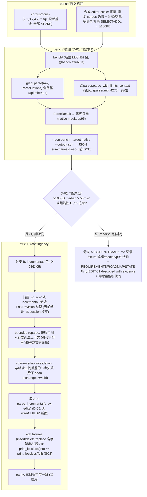

# Phase 8: Incremental Parsing (Benchmark-Gated) — Research

**Researched:** 2026-08-12
**Domain:** 基准门控的增量解析（EDIT-01）——`moon bench` 测量整文档重解析延迟，证据驱动 descope 或交付有界增量解析
**Confidence:** HIGH（parse 入口、limits、corpus 规模、`print_lossless` 签名、moon.mod 工具链 pin 全部本 session 直接读源验证）；MEDIUM（`@bench` API 在 pinned toolchain `moon 0.1.20260724` 上的可用性、bench 包语法细节——标 verify-at-execution）；LOW（增量实现细节为 contingency 设计，分支 B 触发才需落实）

## Summary

本阶段交付 **EDIT-01（基准门控的增量解析）**。核心不是"实现增量解析"，而是**先建立可复现的 benchmark 证据**（D-01 门禁先行，绝不先实现后补测量），再按证据走两条分支：**分支 A（descope）**——若 editor-scale（≥100KB）整文档重解析 median ≤ 50ms 且无超线性增长，则以 `08-BENCHMARK.md` 记录证据并把 EDIT-01 标记为 descoped with evidence（ROADMAP SC1 明文允许），**零增量解析代码**；**分支 B（实现）**——若 median > 50ms 或观察 O(n²) 迹象，则新建 `incremental/` 包（D-04/D-05），实现有界重解析 + span-overlap invalidation，以 `print_lossless(parse_incremental(x)) == print_lossless(parse_full(x))` 为硬不变量（SC2/SC3）。两条分支都要求产出可审计的 benchmark 数据与决策记录，绝不静默放弃（D-17 诚实 provenance）。

**本 session 直接读源验证的关键事实：** 被测对象 `@api.parse(raw : Bytes, options : ParseOptions) -> Result[ParseResult, ParseError]`（api.mbt:431）是公共 primitive 边界，内部走 `validate_limits → SourceText::new_with_limit → parse_document → ParseResult 序列化`；核心解析在 `@parser.parse_with_limits_context`/`@parser.parse`（parser.mbt:4275/4382）。`ParseLimits::default()` 的 `max_bytes = 8 MiB`、`max_recursion_depth = 128`（parser.mbt:38-45），故 **100KB editor-scale 输入在默认 limits 内通过**。corpus 现有 fixture 全部为 **392B–1.1KB 小文件**（doris-4.x 15 个合计 ≈ 8.9KB；3.x/2.1 各 8 个）——**全部拼接也不到 25KB，必须合成/重复拼接才能达到 100KB 目标**（D-01 设计本已预期）。`print_lossless(root, source) -> Bytes` 签名已确认（printer.mbt:28），SC2 不变量可直接比对 Bytes。**`source/` 目前没有任何 Edit/Revision 类型**（grep 零命中）——分支 B 需要先引入编辑/修订层，这是 contingency 计划必须显式纳入的任务。

**Primary recommendation:** 把 **benchmark 放在本阶段首个 tracer**（唯一 Wave 0 任务），用 `@api.parse`（全路径，含 envelope 序列化）为主测面、`@parser.parse`（纯核心 CST）为辅测面，native 下记录 median/p95；输入 = 既有 corpus fixture（现状基线）+ 合成 editor-scale 文档（≥100KB，含注释/空白/多语句/复杂 SELECT+DDL）；`moon bench --target native --output-json` 输出结构化 JSON。执行首步必须先验证 pinned `moon 0.1.20260724` 上 `@bench` attribute + `moon bench` 是否可用（本 session 无法从仓库内确认——仓库尚无 `bench/` 包与 `@bench` 先例，STACK.md 的 `@bench` 核验是 2026-08-05 针对官方文档而非 pinned toolchain）。

<user_constraints>
## User Constraints (from CONTEXT.md)

### Locked Decisions

- **D-01:** 新建 `bench/` MoonBit 包（`@bench` attribute），测量**整文档重解析延迟**：以仓库 `corpus/` 既有 Doris fixture 为基础，**合成/拼接 editor-scale 文档**（≥100KB 目标，覆盖典型编辑会话规模；含注释/空白/多语句/复杂 SELECT+DDL），记录 native 的 median/p95 延迟与输入规模关系。命令：`moon bench --target native --output-json`（`--target js`/`wasm` 若可行补充记录）。**门禁先行**——任何增量解析实现决策必须以 benchmark 数据为据，绝不先实现后补测量（研究 Pitfall 6 / EDIT-01 gated）。**Reversibility:** reversible — bench/ 包是独立测试面。
- **D-02:** "Measurable latency bottleneck" 判定阈值（EDIT-01 门禁）：**editor-scale 文档（≥100KB）整文档重解析 median > 50ms**（编辑器交互响应预算的可辩护上界；对齐 ARCHITECTURE "full-document parse is often adequate for short SQL files" 的规模假设），**或** 观察到延迟对输入规模呈超线性增长（O(n²) 迹象）。低于阈值 → 判为"reparse 足够快"，**descope EDIT-01 并记录证据**。**Reversibility:** one-way — 阈值决定 EDIT-01 去留；若后续需回改需重跑 benchmark 并迁移记录。
- **D-03:** 门禁结果走**证据驱动分支**：
  - **分支 A（descope）**——reparse 足够快：在 `08-BENCHMARK.md` 记录 benchmark 证据（fixture、规模、median/p95、结论），更新 REQUIREMENTS.md/ROADMAP/STATE 将 EDIT-01 标记为 **descoped with evidence**（SC1 允许："or the requirement is descoped with the benchmark evidence documented"），**不写任何增量解析代码**。
  - **分支 B（实现）**——reparse 明显瓶颈：新建 `incremental/` 包（D-04），实现有界增量解析 + 定向 CST 重构，并以 `print_lossless(parse_incremental(x)) == print_lossless(parse_full(x))` 为硬不变量（SC2/SC3）。
  - **本阶段 plan 必须把 benchmark 放在首个 tracer**，让结果决定后续 plan 是 descope 记录还是增量实现。**Reversibility:** one-way — descope 决策记录在 REQUIREMENTS/ROADMAP；改回需新证据。
- **D-04:** 若实现：`incremental/` 独立库，**只 import source + syntax + parser**（复用既有无损 CST 与 source revisions/LineIndex 基础，D-21 纪律延续）；**bounded reparse**——对编辑区间 + 必要词法上下文（引号字符串/注释/方言字面量）重 lex/re-parse，span-overlap invalidation（与编辑区间重叠的节点失效，绝不 "span unchanged ⇒ node valid" 假设，Pitfall 5）；**不做 tree-sitter 式全增量引擎**（本地 CST 复用，STACK.md 反面）。**Reversibility:** one-way — `incremental/` 是新的公共库边界；若后续改为全增量引擎需迁移。
- **D-05:** 若实现：交付面为**库 API**（`parse_incremental(prev : Document, edits : Array[Edit]) -> Document` 或等价）+ `_test.mbt` 快照（每个 edit fixture 断言 `print_lossless(incremental) == print_lossless(full)`）+ parity（三目标字节一致，若适用）。**不新增 wire 导出/CLI/LSP 面**（内部优化，LSP 在 TOOL-FUTURE 消费）。**Reversibility:** costly — 库 API 形状发布后影响调用方。

### Claude's Discretion
（`--auto` 模式：全部灰区由 Claude 依据既有决策链——研究 SUMMARY/ARCHITECTURE/STACK/PITFALLS 的 EDIT-01 门禁设计（`@bench`+`moon bench`、Pitfall 5 span-overlap、Pitfall 6 免过早复杂）、ARCHITECTURE "full-document reparse is often adequate" 规模假设、REQUIREMENTS SC1/SC2/SC3——选择推荐项；D-01..D-05 覆盖全部灰区，无 "you decide"。）

### Deferred Ideas (OUT OF SCOPE)
- 增量分析/血缘/Lint 的增量消费 → TOOL-FUTURE-01（incremental/ 就绪后）
- LSP 增量文档同步消费 → TOOL-FUTURE-01
- 跨库/跨文件结构化重构（broad renames with cross-file updates）→ EDIT-02（未来）
- tree-sitter 式全增量引擎 → 反面（本地 CST 复用，STACK.md）
</user_constraints>

<phase_requirements>
## Phase Requirements

| ID | Description | Research Support |
|----|-------------|------------------|
| EDIT-01 | Editor can use bounded incremental parsing and targeted CST refactors without reparsing the full document — **only when `moon bench` benchmarks demonstrate whole-document reparse is a measurable latency bottleneck**; incremental output must be byte-identical to whole-document reparse on the same input (`print_lossless(parse_incremental(x)) == print_lossless(parse_full(x))`) | RQ1 benchmark 门禁执行（`bench/` 包 + `@api.parse` 被测 + 合成 ≥100KB 输入 + median/p95）；RQ2 corpus 规模证据（现状 fixture 全部 <1.2KB，需合成）；RQ3 descope 证据打包（08-BENCHMARK.md + REQUIREMENTS/ROADMAP/STATE 更新，零增量代码）；RQ4 分支 B contingency（bounded reparse + span-overlap invalidation + edit fixtures 的 print_lossless 不变量） |

## Architectural Responsibility Map

| Capability | Primary Tier | Secondary Tier | Rationale |
|------------|-------------|----------------|-----------|
| 整文档重解析延迟测量（benchmark 门禁本体） | 工具链/测试面（新 `bench/` 包） | — | 门禁先行；bench 包独立测试面，reversible（D-01）——不进入任何运行时库路径 |
| 解析被测路径（全路径含 envelope） | API/Backend（`@api.parse`） | — | 编辑器调用方实际付出的成本 = `api.parse` 全路径（api.mbt:431，[VERIFIED]） |
| 解析被测路径（纯核心 CST） | API/Backend（`@parser.parse` / `parse_with_limits_context`） | — | 分离核心解析成本与 envelope 序列化成本；辅助定位瓶颈归属（parser.mbt:4275/4382，[VERIFIED]） |
| 有界增量解析 + span-overlap invalidation（分支 B） | API/Backend（新 `incremental/` 库） | `source/`（SourceText/LineIndex）+ `syntax/`（无损 CST）+ `parser/` | D-04/D-21 单向依赖：incremental 只 import source+syntax+parser，永不反向（D-04，[CITED]） |
| 编辑/修订层（分支 B 前置） | API/Backend（`source/` 或 `incremental/` 内新增 Edit/Revision 类型） | — | **`source/` 当前无任何 Edit/Revision 类型**（本 session grep 零命中）——分支 B 必须显式新增 |
| SC2 不变量验证 | 测试面（`incremental/` 的 `_test.mbt` + edit fixtures） | `printer.print_lossless`（printer.mbt:28，[VERIFIED]） | 每个 edit fixture 断言增量与全量输出 Bytes 相等 |
| 门禁决策记录（分支 A 或 B） | 流程工件（`08-BENCHMARK.md` + REQUIREMENTS/ROADMAP/STATE） | — | D-03/D-17：证据 + 决策记录，绝不静默放弃 |

## Standard Stack

### Core
本阶段**零新增外部运行时依赖**——benchmark 与增量实现全部复用既有 MoonBit 资产（同 Phase 6/7 纪律）：

| Library / Asset | Version / 位置 | Purpose | Why Standard |
|---------|---------|---------|--------------|
| `@bench` attribute + `moon bench` CLI | pinned toolchain `moon 0.1.20260724`（moon.mod:5-8，[VERIFIED]） | EDIT-01 门禁机制：`moon bench --target native --output-json`，JSON summaries；`keep()` 防 dead-code elimination | v1.0 research STACK.md 指定机制（[CITED: milestones/v1.0-research/STACK.md:231]）；**可用性需在 pinned toolchain 上 verify-at-execution**（本 session 无法从仓库确认） |
| `fathom/sql/api` `@api.parse` | 仓库内（api/api.mbt:431，[VERIFIED]） | 公共 primitive 解析边界：`parse(raw : Bytes, options : ParseOptions) -> Result[ParseResult, ParseError]` | 被测对象 = 编辑器调用方实际付出的整文档重解析成本（含 envelope 序列化） |
| `fathom/sql/parser` `@parser.parse` / `parse_with_limits_context` | 仓库内（parser/parser.mbt:4275/4382，[VERIFIED]） | 纯核心解析（不含序列化） | 辅助被测面：把 parse-core 成本与 envelope/序列化成本分开 |
| `fathom/sql/source` `SourceText`/`Span`/`LineIndex` | 仓库内（source/source.mbt:8-53，[VERIFIED]） | 字节快照、byte-offset span、行索引 | 增量坐标基础；`Span::checked` 已强制 span 边界（source.mbt:16-31） |
| `fathom/sql/printer` `print_lossless` | 仓库内（printer/printer.mbt:28，[VERIFIED]） | `print_lossless(root : @syntax.SyntaxNode, source : @source.SourceText) -> Bytes` | SC2 不变量比对目标（增量 vs 全量 Bytes 相等） |
| `moonbitlang/core` | `0.1.20260728+5e7afb0c0`（.claude/CLAUDE.md GSD:stack） | Bytes/String/Array 基础 | 输入拼接、结果收集；无新依赖 |

### Supporting
| Library | Version | Purpose | When to Use |
|---------|---------|---------|-------------|
| `corpus/` Doris fixtures | 仓库内（doris-2.1/3.x/4.x） | benchmark 输入的真实来源（现状基线） | 全部现有 fixture（RQ2） |
| 合成 editor-scale 文档 | bench/ 内构建 | 达到 ≥100KB 门禁规模（含注释/空白/多语句/复杂 SELECT+DDL） | 门禁主测输入（D-01，[CITED]） |
| `@mtest.Test` + snapshot | 内置 | 分支 B 的 edit fixture 快照与 print_lossless 断言 | 仅分支 B 触发（SC2） |

### Alternatives Considered
| Instead of | Could Use | Tradeoff |
|------------|-----------|----------|
| 测 `@api.parse` 全路径（推荐主测面） | 只测 `@parser.parse` 核心 | 全路径才是编辑器真实成本，但混入序列化；核心面帮助定位瓶颈归属——**两个都测** |
| 只用现有 corpus 小文件做 bench | 合成 ≥100KB editor-scale 文档 | 现有 fixture 全部 <1.2KB，无法展示 editor-scale 瓶颈（RQ2 实测）——合成是门禁必需（D-01） |
| tree-sitter / 全增量引擎（分支 B） | 本地 CST 有界复用 | 会 fork 单核心实现并放弃无损 CST 控制（STACK.md 反面；D-04） |
| 直接假设 descope（跳过 benchmark） | bench/ 包 + editor-scale 合成 | 违反 SC1 "benchmarks demonstrate" 与 D-01 门禁先行（08-DISCUSSION-LOG 已记录用户选择：bench/ + 合成） |

**Version verification:** 本阶段不引入新外部包。既有栈版本已核实：`moon.mod` 记录 `moon 0.1.20260724 (5f1406a 2026-07-24)`（[VERIFIED: moon.mod:5-8]）；`@bench` + `moon bench --target native|js|wasm|all` 来自 v1.0 STACK.md（[CITED: milestones/v1.0-research/STACK.md:231]，2026-08-05 对照官方 commands 文档核验）；核心依赖 `moonbitlang/core 0.1.20260728+5e7afb0c0`（[CITED: .claude/CLAUDE.md GSD:stack]）。

## Package Legitimacy Audit

> **N/A** — 本阶段**零新增外部包**（bench/ 只用既有仓库内模块 + 内置 `@bench`/core；分支 B 的 incremental/ 只 import source+syntax+parser）。无 [SLOP]/[SUS] 项，无 `npm view`/`pip index` 需执行。唯一需执行期核验的是 pinned toolchain 内置 `@bench` attribute 可用性（见 Common Pitfalls P1 与 Open Questions Q1）。

## Architecture Patterns

### System Architecture Diagram



### Recommended Project Structure
```
bench/                     # 新建: @bench attribute, 门禁本体 (reversible, D-01)
├── moon.pkg               # 只 import api/parser/source (被测面)
├── bench.mbt              # @bench fn: parse_full_<fixture> / parse_full_editor_scale; keep() 防 DCE
└── build_editor_scale.mbt # corpus 拼接 + 重复 → ≥100KB 合成文档 (含注释/空白/多语句)
incremental/               # 仅分支 B: 有界增量解析 (D-04, D-21 只 import source+syntax+parser)
├── moon.pkg
├── edit.mbt               # Edit/Revision 类型 (若放 incremental/; source/ 当前无此类型)
├── incremental.mbt        # parse_incremental(prev, edits) 库 API (D-05)
└── incremental_test.mbt   # 每个 edit fixture: print_lossless(inc) == print_lossless(full)
```
*(分支 A 下不创建 incremental/；08-BENCHMARK.md 落 `.planning/phases/08-incremental-parsing-benchmark-gated/`)*

### Pattern 1: 门禁先行（Benchmark Before Implementation）
**What:** 任何增量解析实现决策必须以 benchmark 数据为据（D-01/Pitfall 6）。bench 包是独立测试面（reversible），门禁结果决定后续 plan 是 descope 记录还是增量实现（D-03）。**本阶段 plan 必须把 benchmark 放在首个 tracer**。
**When to use:** 本阶段唯一 Wave 0 任务；门禁结果落在 plan tracer 分支点，plan 后续任务按 A/B 分支分别展开。
**Example:**
```moonbit
// bench/bench.mbt (示意骨架 — 精确 @bench 语法与 keep() 调用需在 pinned
// toolchain 上 verify-at-execution, [ASSUMED])
fn build_editor_scale_document() -> Bytes {
  // corpus 语句拼接 + 重复至 ≥100KB, 含注释/空白/多语句
}

@bench
fn parse_full_editor_scale() -> Unit {
  let raw = build_editor_scale_document()
  let options = @api.ParseOptions::for_profile(...)
  let _ = @api.parse(raw, options) // keep() 防止 DCE
}
```
**Source:** [CITED: milestones/v1.0-research/STACK.md:231]（`@bench` + `moon bench` + `keep()`）；精确语法 [ASSUMED]，执行期首步核验。

### Pattern 2: 双测面拆分（全路径 + 纯核心）
**What:** 主测 `@api.parse`（编辑器真实成本，含 envelope 序列化），辅测 `@parser.parse_with_limits_context`（纯 CST）。若全路径超阈值但核心不超，瓶颈在序列化而非解析——记录该拆分为 descope/实现决策提供归属证据。
**When to use:** 始终；帮助门禁结论可辩护（D-02 阈值适用主测面）。

### Pattern 3: 分支 B — Bounded Reparse + Span-Overlap Invalidation（contingency）
**What:** 对编辑区间 + 必要词法上下文（引号字符串/注释/方言字面量）重 lex/re-parse；与编辑区间**重叠**的节点失效（绝不 "span unchanged ⇒ node valid" 假设，Pitfall 5）；复用 `SourceText`/`LineIndex` byte-offset 坐标（source.mbt:8-53）。D-05 库 API：`parse_incremental(prev : Document, edits : Array[Edit]) -> Document`。
**When to use:** 仅当门禁判定"可测瓶颈"（分支 B）。**前置缺口：`source/` 当前无 Edit/Revision 类型**（本 session grep 零命中）——`Edit`/`Revision` 需在 `source/` 或 `incremental/` 内新增（修订层 + span 重映射）。
**Key invariant:** `print_lossless(parse_incremental(x)) == print_lossless(parse_full(x))` 对每个 edit fixture（SC2；`print_lossless` 签名 [VERIFIED: printer/printer.mbt:28]）。

## Don't Hand-Roll

| Problem | Don't Build | Use Instead | Why |
|---------|-------------|-------------|-----|
| 延迟测量基础设施 | 自写计时/统计循环 | 内置 `@bench` + `moon bench --output-json` | 官方支持 median 等汇总与 JSON 输出；`keep()` 防 dead-code elimination（STACK.md:231，[CITED]） |
| 增量引擎 | tree-sitter 式全增量引擎 / 任何第三方增量解析框架 | 本地 CST 有界复用（`incremental/` 仅当分支 B） | 会 fork 单核心实现并放弃无损 CST 控制；STACK.md 反面（D-04，[CITED]） |
| span 边界校验 | 手写越界检查 | `@source.Span::checked` / `SourceText::span` | 已有受测的边界实现（source.mbt:16-31，含 OutOfBounds/Reversed，[VERIFIED]） |

**Key insight:** 本阶段的"手造陷阱"在 benchmark 侧（DCE、合成输入代表性）而非解析侧——增量解析本身是**被门禁防御的过早复杂度**（Pitfall 6），只有在证据成立时才进入实现。

## Common Pitfalls

### Pitfall 1: `@bench` API 在 pinned toolchain 上的可用性
**What goes wrong:** `moon bench` 可能对 `moon 0.1.20260724` 不可用、`@bench` attribute 语法与 STACK.md 核验的官方文档（v0.10.5 线）不一致，或 `keep()` 语义有差异。
**Why it happens:** 仓库内**无任何 `bench/` 包或 `@bench` 先例**（本 session grep 零命中）；STACK.md 的核验是 2026-08-05 对照官方文档，非 pinned toolchain 实机验证；MoonBit 工具链快速演进。
**How to avoid:** **执行首步**跑 `moon bench --version` + 一个最小 `@bench` 探针（空函数）。不可用则记录 bench 工具降级路径（如 `moon test` + 手动计时循环 + JSON 手写汇总），并在 08-BENCHMARK.md 注明工具链与替代方法。
**Warning signs:** `moon bench` 报 unknown subcommand / attribute 解析错误。

### Pitfall 2: corpus fixtures 太小，无法展示 editor-scale 瓶颈
**What goes wrong:** 只用现有 fixture（全部 392B–1.1KB）bench，即使解析慢也测不出 editor-scale 门槛；或合成文档只做简单重复，触发不了真实大文档的路径（如多语句切分、recovery 预算）。
**Why it happens:** 现有 corpus 是"覆盖基准"而非"规模基准"——doris-4.x 15 个文件合计仅 ≈ 8.9KB，3.x/2.1 各 8 个（[VERIFIED: corpus 目录读源，本 session]）；**全部拼接 < 25KB**。
**How to avoid:** 按 D-01 合成 ≥100KB：corpus 语句拼接 + 重复 + 注释/空白/多语句/复杂 SELECT+DDL；同时测一组规模梯度（如 25KB/50KB/100KB/200KB）以观察是否超线性增长（D-02 第二判据）。
**Warning signs:** 100KB 输入构造后 `parse` 超时或触发 `max_recursion_depth=128`（parser.mbt:38-45，[VERIFIED]）——深嵌套合成输入需注意，超限会产出 resource 诊断而非正常解析。

### Pitfall 3: 死代码消除（DCE）吞掉被测路径
**What goes wrong:** bench 函数若返回值未被消费，编译器可能消除实际解析调用，测出"0ms"假象。
**Why it happens:** 优化编译下未使用结果会被 DCE。
**How to avoid:** 用 `keep()`（STACK.md:231，[CITED]）保留结果，或把 parse 结果写入一个累加值/`black_box` 式消费；并在 bench 冒烟中验证 median 非零且随规模合理增长。
**Warning signs:** 各规模延迟全部为 ~0ms 或完全相等。

### Pitfall 4: 门禁结论不诚实 / 静默 descope
**What goes wrong:** 测完不记录证据、或跳过 benchmark 直接判 descope（研究 Pitfall 6 / EDIT-01 gated 的反面）。
**Why it happens:** descope 更省事；08-DISCUSSION-LOG 已记录"跳过 benchmark 直接假设 descope"是被用户否决的选项。
**How to avoid:** 无论 A/B，`08-BENCHMARK.md` 必须含 fixture/规模/median/p95/结论五要素（D-03），REQUIREMENTS/ROADMAP/STATE 同步标注 descoped-with-evidence（分支 A）或实现记录（分支 B）。
**Warning signs:** 没有任何可复现 JSON/数据文件落库就宣称"已评估"。

### Pitfall 5: 分支 B — span 未失效 / trivia 漂移
**What goes wrong:** 编辑区间外的节点误判为有效（"span unchanged ⇒ valid"），导致 stale spans/trivia，`print_lossless(inc) != print_lossless(full)`。
**Why it happens:** 增量复用最经典陷阱（研究 Pitfall 5 / V3）；编辑会改变后续 span 的位移。
**How to avoid:** span-overlap invalidation（D-04）——凡与编辑区间重叠的节点一律失效；每个 edit fixture（insert/delete/replace，**含字符串字面量与注释内部**的编辑）断言 SC2 不变量。
**Warning signs:** 增量输出字节 ≠ 全量输出字节；`all_spans_in_bounds`（api.mbt:919，[VERIFIED]）类自检失败。

## Code Examples

### 被测入口签名（本 session 直接读源）
```moonbit
// api/api.mbt:431 — 公共 primitive 解析边界（benchmark 主测面）
pub fn parse(raw : Bytes, options : ParseOptions) -> Result[ParseResult, ParseError]

// parser/parser.mbt:4275 — 核心解析入口（benchmark 辅测面）
pub fn parse_with_limits_context(
  source : @source.SourceText,
  context : @dialect.DialectContext,
  mode : ParseMode,
  limits : ParserLimits,
) -> ParsedDocument
```
**Source:** [VERIFIED: api/api.mbt:431; parser/parser.mbt:4275-4388]

### `print_lossless` 不变量比对目标
```moonbit
// printer/printer.mbt:28
pub fn print_lossless(
  root : @syntax.SyntaxNode,
  source : @source.SourceText,
) -> Bytes
```
**Source:** [VERIFIED: printer/printer.mbt:28]

### 分支 B 的 edit fixture 断言（示意，[ASSUMED] 语法细节）
```moonbit
test "incremental_equals_full_replace_inside_comment" {
  let original = b"SELECT a, b FROM t -- comment\nWHERE a > 1"
  let edited   = b"SELECT a, b FROM t -- comment edited\nWHERE a > 1"
  let full     = parse_full(edited)          // 既有 @api.parse 路径
  let inc      = parse_incremental(parse_full(original), [Edit{...}])
  assert_eq(print_lossless(inc.root, inc.source), print_lossless(full.root, full.source))
}
```
**Source:** SC2 不变量来自 REQUIREMENTS.md §EDIT-01（[CITED]）；类型形状 [ASSUMED]，依赖分支 B 的 Edit/Revision 设计。

## State of the Art

| Old Approach | Current Approach | When Changed | Impact |
|--------------|------------------|--------------|--------|
| 编辑器每次键击整文档重解析 | 有界增量解析（仅重解析编辑区间 + span 失效） | 仅在 benchmark 证明瓶颈后（EDIT-01 gate） | 大文档编辑延迟显著下降；但增加正确性风险（trivia/span 漂移），故以 SC2 不变量强制 |
| tree-sitter 式通用增量引擎 | 本地无损 CST 有界复用（`incremental/`） | 本项目约束（单核心 MoonBit，无损 CST） | 保留 trivia/spans 的完全控制；代价是手写增量逻辑（D-04 反面） |

**Deprecated/outdated:**
- **无** — 本阶段不弃用既有 API；`@api.parse` 始终是正确性 oracle（全量路径），增量只是 benchmark 证明后的优化（ARCHITECTURE "whole-document parsing is the correctness oracle"）。

## Assumptions Log

| # | Claim | Section | Risk if Wrong |
|---|-------|---------|---------------|
| A1 | `@bench` attribute + `moon bench --target native --output-json` + `keep()` 在 pinned `moon 0.1.20260724` 上可用且语义如 STACK.md | Benchmark Gate Execution / Common Pitfalls P1 | bench 门禁无法按 D-01 命令执行 → 需降级计时方案并在 08-BENCHMARK.md 注明 |
| A2 | `@bench` 函数体的精确 MoonBit 语法（attribute 摆放、无参签名）如示例骨架 | Code Examples | 执行首步探针校正语法即可，不影响门禁设计 |
| A3 | 分支 B 的 `Edit`/`Revision` 类型与 `parse_incremental(prev, edits)` 签名形状（D-05 说"或等价"） | Incremental Path | 库 API 形状 one-way；但分支 B 是否触发本身由门禁决定，非本阶段必交付 |
| A4 | 100KB editor-scale 合成文档能在默认 limits 内解析（max_bytes=8MiB 通过；max_tokens=1M、recursion 128 可能对深嵌套合成输入构成约束） | Common Pitfalls P2 | 合成构造需避免病态深嵌套；否则测的是 recovery 而非正常路径 |
| A5 | `moon bench --target js/wasm` 补充记录可行（D-01 说"若可行"） | Benchmark Gate Execution | 不可行则 native 证据已满足 SC1；JS/Wasm 仅补充 |

**验证过（无需用户确认）：** `@api.parse` 入口与 limits（api.mbt:431; parser.mbt:38-45）、`@parser.parse_with_limits_context`（parser.mbt:4275）、`print_lossless`（printer.mbt:28）、`SourceText`/`Span`/`LineIndex`（source.mbt:8-53）、`DEFAULT_MAX_BYTES = 8MiB`（source.mbt:6）、corpus 规模（corpus/ 读源）、moon.mod 工具链 pin（moon.mod:5-8）、`source/` 无 Edit/Revision 类型（grep 零命中）。

## Open Questions (RESOLVED)

1. **`@bench`/`moon bench` 在 pinned `moon 0.1.20260724` 上是否可用？** **(RESOLVED — 08-01 Task 1 执行期探针：最小 `@bench` 探针 + `moon bench --version`；不可用则 `moon test` + 手动计时降级并记录)**
   - What we know: STACK.md 于 2026-08-05 对照官方 commands 文档核验 `@bench` + `moon bench --target native|js|wasm|all`（[CITED]）；仓库内无先例。
   - What's unclear: 该版本工具链的实机行为（attribute 语法、`--output-json`、`keep()`）。
   - Recommendation: 执行首步 = 最小 `@bench` 探针 + `moon bench --version`；不可用则降级为 `moon test` + 手动计时循环（文档记录降级）。

2. **门禁结果落在哪支？（分支 A 还是 B）** **(RESOLVED — 08-01 门禁 tracer 按 D-02 阈值实测判定；08-02（A descope）/08-03/08-04（B 增量）以 08-01 SUMMARY 记录的 fired branch 路由)**
   - What we know: 判据是 D-02 阈值（≥100KB median > 50ms 或 O(n²) 迹象）；现有 corpus 全部 <1.2KB，无法预判大文档行为。
   - What's unclear: 真实 100KB 文档的解析延迟量级。
   - Recommendation: plan 必须以 benchmark 为首个 tracer（D-03），A/B 分支各占后续 plan 槽位；不预设结论。

3. **分支 B 的 `Edit`/`Revision` 层放哪？** **(RESOLVED — 08-03：`Edit`/`Revision` 层置于 `incremental/edit.mbt`；若探针显示 @dialect 类型面被复用时按 D-04 记录修正)**
   - What we know: `source/` 当前无此类型（grep 零命中）；D-21 纪律要求 incremental 只 import source+syntax+parser。
   - What's unclear: 放 `source/`（坐标/版本基础归属）还是 `incremental/`（编辑语义归属）。
   - Recommendation: 若分支 B 触发，plan 时按依赖方向决定——`Edit` 若被 parser/source 复用则放 `source/`，仅增量消费则放 `incremental/`。当前不做决定（非必交付）。

## Environment Availability

| Dependency | Required By | Available | Version | Fallback |
|------------|------------|-----------|---------|----------|
| `moon` toolchain（native） | benchmark 门禁 | ✓（moon.mod 已 pin） | `0.1.20260724 (5f1406a 2026-07-24)`（moon.mod:5-8，[VERIFIED]） | — |
| `@bench` + `moon bench --output-json` | D-01 门禁命令 | ⚠️ 未确认（无仓库先例） | — | `moon test` + 手动计时循环（注明降级） |
| `corpus/doris-{2.1,3.x,4.x}/*.sql` | 基准输入（现状基线） | ✓ | 15+8+8 个文件，392B–1.1KB（[VERIFIED: corpus/ 读源]） | 合成拼接至 ≥100KB（D-01 必需） |
| `@api.parse` / `@parser.parse` | 被测入口 | ✓ | 见 Code Examples（[VERIFIED]） | — |
| `moonbitlang/core` | 基础 | ✓ | `0.1.20260728+5e7afb0c0`（[CITED]） | — |

**Missing dependencies with no fallback:** 无（bench 门禁所需全部为本仓库 + pinned toolchain 资产）。
**Missing dependencies with fallback:** `@bench`/`moon bench`（若不可用 → 手动计时降级，08-BENCHMARK.md 记录工具链与替代方法）。

## Validation Architecture

> SKIPPED — `.planning/config.json` 显式 `workflow.nyquist_validation: false`（本 session 读源，[VERIFIED]）。

## Security Domain

> `workflow.security_enforcement: true`（config.json，[VERIFIED]）。本阶段安全面极小——bench 包是独立测试面，无网络/无外部输入面；分支 B 才触及 span 处理（防御现有 `Span::checked`/`all_spans_in_bounds`，不新增攻击面）。按模板列出适用类别：

### Applicable ASVS Categories

| ASVS Category | Applies | Standard Control |
|---------------|---------|-----------------|
| V2 Authentication | no | 无认证面（库内 benchmark/解析路径） |
| V3 Session Management | no | 无会话 |
| V4 Access Control | no | 无授权面 |
| V5 Input Validation | yes | 分支 B 的 Edit span 边界经 `@source.Span::checked`（source.mbt:16-31，[VERIFIED]）；bench 输入为本地固定 fixture，无外部注入 |
| V6 Cryptography | no | 无加密 |

### Known Threat Patterns

| Pattern | STRIDE | Standard Mitigation |
|---------|--------|---------------------|
| 分支 B 增量解析的 stale span/越界访问（编辑区间失效不完整） | Tampering / DoS | span-overlap invalidation（D-04）+ `Span::checked` 边界 + SC2 不变量逐 fixture 断言；`all_spans_in_bounds`（api.mbt:919，[VERIFIED]）类自检 |
| bench 合成输入病态（深嵌套触发 recursion/recovery 预算） | DoS | 合成构造避开病态嵌套；记录 resource 诊断行为而非当作正常延迟 |

## Sources

### Primary (HIGH confidence, 本 session 直接读源)
- [VERIFIED: api/api.mbt:431] — `pub fn parse(raw, options) -> Result[ParseResult, ParseError]` 公共解析入口
- [VERIFIED: parser/parser.mbt:38-45] — `ParserLimits::default()`: max_bytes=8MiB, max_tokens=1M, max_recursion_depth=128, max_recovery_steps=10K（逐字）：
  ```
  max_bytes: 8 * 1024 * 1024, max_tokens: 1_000_000,
  max_recursion_depth: 128, max_recovery_steps: 10_000
  ```
- [VERIFIED: parser/parser.mbt:4275-4388] — `parse_with_limits_context` / `parse` / `parse_with_limits` 核心解析入口
- [VERIFIED: printer/printer.mbt:28-31] — `pub fn print_lossless(root : @syntax.SyntaxNode, source : @source.SourceText) -> Bytes`
- [VERIFIED: source/source.mbt:6,8-53] — `DEFAULT_MAX_BYTES : Int = 8 * 1024 * 1024`；`Span`/`Span::checked`/`LineIndex`/`SourceText` 全签名
- [VERIFIED: moon.mod:5-8] — `moon 0.1.20260724 (5f1406a 2026-07-24)` pin
- [VERIFIED: corpus/（doris-4.x/3.x/2.1 目录读源）] — fixture 规模 392B–1.1KB；doris-4.x 15 文件
- [VERIFIED: source/ grep] — 无 `Edit`/`Revision` 类型
- [VERIFIED: .planning/config.json] — `nyquist_validation: false`、`security_enforcement: true`

### Secondary (MEDIUM confidence, 引用既有研究)
- [CITED: milestones/v1.0-research/STACK.md:231] — `@bench` + `moon bench --target native|js|wasm|all` + `keep()`（2026-08-05 对照官方 commands 文档核验；非 pinned toolchain 实机）
- [CITED: 08-CONTEXT.md D-01..D-05] — 门禁设计、阈值、A/B 分支、增量实现边界、交付面
- [CITED: REQUIREMENTS.md §EDIT-01; ROADMAP.md §Phase 8 SC1/SC2/SC3] — 需求与成功判据
- [CITED: milestones/v1.0-research/SUMMARY.md / ARCHITECTURE.md / PITFALLS.md] — EDIT-01 门禁设计、span-overlap（Pitfall 5）、免过早复杂（Pitfall 6）、规模假设

### Tertiary (LOW confidence)
- [ASSUMED: A1/A2/A3/A4/A5] — `@bench` 实机行为、语法细节、分支 B 类型形状、合成输入 limits 行为、JS/Wasm 补充记录可行——详见 Assumptions Log

## Metadata

**Confidence breakdown:**
- Standard stack: HIGH（parse 入口/limits/print_lossless/corpus/moon.mod 全部读源验证）；MEDIUM（`@bench` 实机可用性标 verify-at-execution）
- Architecture: HIGH（门禁流程、A/B 分支、双测面拆分、D-21 依赖纪律）；LOW（分支 B 实现细节——contingency）
- Pitfalls: HIGH（DCE、corpus 过小、span 失效等均有仓库证据支撑）；MEDIUM（`@bench` 工具链行为为引用级）

**Research date:** 2026-08-12
**Valid until:** 2026-08-19（MoonBit toolchain 快速演进；执行首任务须核实 `@bench`/`moon bench` 在 pinned `moon 0.1.20260724` 上的可用性）
