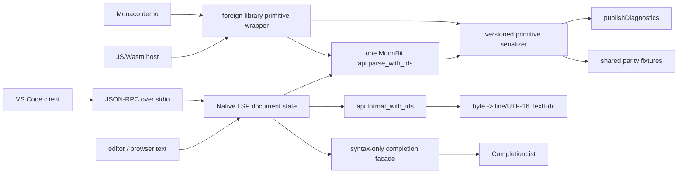

# Phase 4: Ecosystem and Multi-Target Delivery - Research

**Researched:** 2026-08-04  
**Domain:** MoonBit Native LSP, JSON-RPC/LSP coordinate adapters, JavaScript/linear-Wasm foreign boundaries, browser/Monaco and VS Code packaging  
**Confidence:** HIGH for existing in-repo contracts and official protocol/toolchain capabilities; MEDIUM for the exact public package layout and final host ABI, which require a cross-target prototype

<user_constraints>
## User Constraints (from CONTEXT.md)

### Locked Decisions
- One MoonBit core must serve Native, JavaScript, and linear Wasm; no parser forks.
- Native LSP is a thin JSON-RPC-over-stdio adapter around the core.
- JS is the primary browser wrapper; linear Wasm is also required. Use serialized primitive boundary values rather than exposing internal MoonBit ADTs.
- Phase 3 `api.format_with_ids` and `statement_offsets` are the intended LSP formatting core entrypoints.
- Scope is exactly ECO-01 through ECO-07 in `.planning/REQUIREMENTS.md`; do not add unrelated semantic analysis, linting, lineage, or fingerprinting.

### Claude's Discretion
- Exact package directory names, JSON codec placement, LSP document-state representation, completion context algorithm, Web/Monaco bundler choice, VS Code extension client implementation details, and vertical task slicing are open for research recommendations, subject to the locked decisions above.

### Deferred Ideas (OUT OF SCOPE)
- Unrelated semantic analysis, linting, lineage, and fingerprinting are out of scope for this phase.
- Parser forks, runtime Doris FE/database dependencies, multi-dialect fallback, and internal MoonBit ADT exposure are prohibited by the project contract.
</user_constraints>

<phase_requirements>
## Phase Requirements

| ID | Description | Research Support |
|----|-------------|------------------|
| ECO-01 | Editor can connect to a Native Doris LSP server that implements lifecycle, document synchronization, versioned documents, and diagnostics without a live Doris FE. | The existing Native executable pattern and pure `api.parse_with_ids` boundary support a new stdio executable; LSP 3.17 initialize, synchronization, and publish-diagnostics contracts define the adapter messages. |
| ECO-02 | LSP client can request comment-preserving formatting for a document and receive ranges/edits using a documented byte-to-line/UTF-16 coordinate conversion policy. | `api.format_with_ids` returns formatted bytes and `statement_offsets`; the formatter preserves comments and returns per-statement output offsets. LSP `TextEdit` and `Position` require host ranges, so a new centralized byte/UTF-16 adapter is needed. |
| ECO-03 | LSP client can receive syntax-aware completion suggestions for Doris keywords, clauses, and parser-known contexts while the SQL document is incomplete. | The token classification table and editor-mode recoverable CST are reusable context signals, but no completion API exists yet; completion must be a new syntax-only core facade plus LSP mapping. |
| ECO-04 | Web application can use a Wasm/JavaScript SDK to parse the same Doris profiles and obtain the stable CST/diagnostic results without exposing internal MoonBit ADT or backend-specific types. | `api.parse_with_ids` already returns primitive fields but not a host serialization function or foreign exports. MoonBit documents `foreign_library`, `#export_name`, JS `Bytes` as `Uint8Array`, and explicit JS/Wasm exports. |
| ECO-05 | Native, JavaScript, and linear-Wasm targets expose a versioned serialized schema for CST nodes, trivia, spans, diagnostics, and profile selection with parity fixtures across targets. | `ParseResult` has the version and primitive fields in source, while native CLI is currently the only adapter. Freeze a JSON/bytes schema before wrappers, then execute identical fixtures through all three targets. |
| ECO-06 | Project provides a working Web/Monaco demonstration that uses the Wasm/JavaScript SDK for Doris diagnostics and formatting without a database connection. | No Web/Monaco application or package exists in the repository. A thin JS ESM package plus a browser demo is required; Monaco should remain host-side and call the serialized facade. |
| ECO-07 | Project provides a VS Code extension that connects to the Native LSP using the standard client protocol and exposes Doris diagnostics and formatting. | No extension package exists. Official VS Code guidance separates a JS/TS language client from a separate native server; `vscode-languageclient` is the standard client reference, while the server remains the MoonBit executable. |
</phase_requirements>

## Summary

Phase 4 should freeze the wire contracts first, then build one vertical LSP slice, then add JS/linear-Wasm wrappers and parity, and only then package the browser and VS Code consumers. The repository already has the essential parser/formatter core: `api.parse_with_ids` creates a primitive `ParseResult`, and `api.format_with_ids` is explicitly the Phase 3 shared formatting entrypoint. The public result is still a MoonBit value, not a JSON/bytes wire encoding, and `FormatResult` contains output offsets but not editor ranges. [VERIFIED: api/api.mbt:162-193,418-428] The existing CLI is deliberately native-only and confines libc FFI to `doris-sql/ffi.mbt`; that boundary must not leak into JS/Wasm packages. [VERIFIED: doris-sql/moon.pkg:1-13; doris-sql/ffi.mbt:14-38]

Use a stable serialized primitive schema containing profile metadata, validity/recovery, source bytes or an explicit source transport, recursive CST nodes with byte spans, trivia/error leaf kinds, diagnostics, and formatter offsets. Keep the core coordinate truth as UTF-8 byte offsets and derive LSP positions in one host adapter. LSP 3.17 positions are zero-based and use a negotiated encoding; UTF-16 is the default and must be supported. [CITED: https://raw.githubusercontent.com/microsoft/language-server-protocol/gh-pages/_specifications/lsp/3.17/types/position.md] JSON-RPC framing is a strict `Content-Length` header plus UTF-8 JSON content; framing and JSON validation belong only to the Native LSP edge. [CITED: https://raw.githubusercontent.com/microsoft/language-server-protocol/gh-pages/_specifications/lsp/3.17/specification.md]

**Primary recommendation:** freeze `doris.parse.v1`/`doris.format.v1`-compatible serialized schemas and byte-coordinate rules, implement a full-document LSP formatting edit first, expose the same schemas through a `foreign_library` JS/linear-Wasm wrapper, and make Web/Monaco and VS Code thin clients of those two proven boundaries.

## Architectural Responsibility Map

| Capability | Primary Tier | Secondary Tier | Rationale |
|------------|-------------|----------------|-----------|
| JSON-RPC framing and lifecycle | Native adapter (`doris-lsp` executable) | — | stdio headers, request IDs, shutdown, and malformed-message handling are transport concerns, not parser concerns. [CITED: https://raw.githubusercontent.com/microsoft/language-server-protocol/gh-pages/_specifications/lsp/3.17/specification.md; VERIFIED: doris-sql/moon.pkg:6-13] |
| Document state and version checks | Native adapter | `api` parse/format calls | LSP owns URI/version/content synchronization; the core remains a pure snapshot parser. [CITED: https://raw.githubusercontent.com/microsoft/language-server-protocol/gh-pages/_specifications/lsp/3.17/textDocument/didChange.md; VERIFIED: api/api.mbt:273-337] |
| Serialized CST/diagnostic schema | API/core facade | JS/Wasm/Native adapters | The same primitive shape must cross every backend; internal CST/ADT values must not become the ABI. [VERIFIED: api/api.mbt:162-193,223-251; VERIFIED: syntax/syntax.mbt:1-52] |
| Byte-to-line/UTF-16 conversion | Shared source-coordinate adapter | Native LSP and VS Code client | `SourceText` owns byte spans and `LineIndex` owns line starts; only the host edge should calculate LSP character units. [VERIFIED: source/source.mbt:35-81; VERIFIED: .planning/phases/01-core-kernel/01-CONTEXT.md:16-18; CITED: https://raw.githubusercontent.com/microsoft/language-server-protocol/gh-pages/_specifications/lsp/3.17/types/position.md] |
| Formatting edit generation | Native LSP adapter | `api.format_with_ids` / formatter | Formatting policy already lives in `formatter/`; the adapter translates formatted output into one or more `TextEdit` ranges. [VERIFIED: api/api.mbt:418-428; VERIFIED: formatter/format.mbt:22-64; CITED: https://raw.githubusercontent.com/microsoft/language-server-protocol/gh-pages/_specifications/lsp/3.17/types/textEdit.md] |
| Completion context and candidates | Core syntax facade | Native LSP mapping | Parser-known keyword/clause context is reusable core knowledge; transport only serializes `CompletionItem` values. No catalog or semantic analysis is needed. [VERIFIED: token/token.mbt:1-53; VERIFIED: syntax/syntax.mbt:1-44; ASSUMED: the first completion implementation can use parser context without a new semantic analyzer] |
| JS browser API | JS `foreign_library` wrapper | Browser application | The wrapper owns strings/`Uint8Array` conversion and stable exported function names; browser scheduling and UI remain outside MoonBit. [CITED: https://docs.moonbitlang.com/en/latest/toolchain/moon/package.html; https://docs.moonbitlang.com/en/latest/language/ffi.html] |
| Linear Wasm API | Wasm `foreign_library` wrapper | Host loader | Linear Wasm requires explicit exports and host memory/ABI handling; do not assume JS object/reference types or `println` portability. [CITED: https://docs.moonbitlang.com/en/latest/toolchain/moon/package.html; https://docs.moonbitlang.com/en/latest/toolchain/wasm/index.html] |
| Monaco integration | Browser/client tier | JS SDK | Monaco should consume diagnostics and formatting edits from the JS facade; it must not know MoonBit CST internals or host LSP transport. [CITED: https://github.com/microsoft/monaco-editor; ASSUMED: the demo can use a minimal static bundler or npm-based browser build] |
| VS Code integration | TypeScript extension client | Native LSP executable | VS Code's documented architecture is a normal extension client plus a separate language-server process. [CITED: https://code.visualstudio.com/api/language-extensions/language-server-extension-guide] |

## Existing Assets and Exact Missing Boundaries

### Reusable existing APIs/files

| Asset | Exact observed contract | Phase 4 use |
|-------|-------------------------|--------------|
| `api.parse_with_ids` | `pub fn parse_with_ids(raw : Bytes, profile_id : String, mode_id_value : String) -> Result[ParseResult, ParseError]`. [VERIFIED: api/api.mbt:327-337] | Native LSP diagnostics, completion context input, JS/Wasm parse facade. |
| `ParseResult` | Source quote: `schema_version`, `source_transport`, `profile`, `exact_release`, `feature_introduction`, `mode`, `valid`, `recovered`, `source_bytes`, `source_byte_length`, `root`, `diagnostics`. [VERIFIED: api/api.mbt:180-193] | Canonical source for the ECO-05 schema; preserve names and semantics unless a deliberate schema version bump is recorded. |
| `PrimitiveNode` | Source quote: `kind`, `start_byte`, `end_byte`, `text_len`, `children`. [VERIFIED: api/api.mbt:162-168] | Recursive CST serialization without exposing `SyntaxNode`. |
| `PrimitiveDiagnostic` | Source quote: `severity`, `code`, `message`, `expected_class`, `start_byte`, `end_byte`, `statement_id`. [VERIFIED: api/api.mbt:170-178] | Stable parser diagnostic payload and LSP diagnostic conversion. |
| `api.format_with_ids` | `pub fn format_with_ids(raw : Bytes, profile_id : String, mode_id_value : String, format_options : FormatOptions) -> Result[FormatResult, ParseError]`. [VERIFIED: api/api.mbt:418-428] | ECO-02 formatting core; adapter must build `FormatOptions` and translate output bytes. |
| `FormatResult` | Source quote: `accepted`, `output`, `diagnostics`, `statement_offsets`. [VERIFIED: formatter/error.mbt:27-36] | Formatting output and output-statement offset metadata; ranges still require coordinate conversion. |
| `statement_offsets` | Formatter records `out.buf.length()` before each statement layout and returns it. [VERIFIED: formatter/format.mbt:22-39] | Optional per-statement edit partitioning; do not treat it as original source spans or line/UTF-16 positions. |
| `SourceText`/`LineIndex` | `Span` has `start_byte`/`end_byte`; `line_col` returns `(line, byte_offset - line_start)` and line construction treats CRLF as one line break. [VERIFIED: source/source.mbt:5-8,35-81] | One source of truth for byte spans and line starts; add UTF-16 conversion beside it rather than changing spans. |
| CST model | `SyntaxNode` owns kind/span/text length/children; nodes never own source bytes. Leaves have `SourceToken`, `SourceTrivia`, `SourceError`, or `SourceSkipped`. [VERIFIED: syntax/syntax.mbt:1-52] | Serialize primitive views and retain raw bytes once at the top-level transport. |
| Doris profile enum | Source quote: `V2_1`, `V3_X`, `V4_X`. [VERIFIED: token/token.mbt:3-7] | Schema profile validation; reject every other ID and never add generic MySQL fallback. |
| Native executable and FFI pattern | `pkgtype(kind: "executable")`; imports API/core utilities only, while libc externs are in `doris-sql/ffi.mbt`. [VERIFIED: doris-sql/moon.pkg:1-13; VERIFIED: doris-sql/ffi.mbt:14-38] | New LSP executable should follow the same native-only IO confinement and thin-adapter pattern. |

### Missing boundaries that must be planned explicitly

1. **No serialized encoder/decoder exists.** `ParseResult` and `FormatResult` are MoonBit structs, and no package currently emits the ECO-05 wire schema. [VERIFIED: api/api.mbt:162-193; VERIFIED: formatter/error.mbt:27-36; VERIFIED: repository top-level package listing]
2. **No Native LSP executable or JSON-RPC codec exists.** The existing executable is `doris-sql format`; it has no LSP method dispatch, message framing, or document store. [VERIFIED: doris-sql/moon.pkg:1-13; VERIFIED: doris-sql/run.mbt:24-87]
3. **No UTF-16 adapter exists.** `LineIndex::line_col` returns byte columns, and Phase 1 explicitly defers UTF-16 to host adapters. [VERIFIED: source/source.mbt:67-81; VERIFIED: .planning/phases/01-core-kernel/01-CONTEXT.md:16-18]
4. **No completion API exists.** Searches of the core packages found classification and parser APIs but no completion symbol or context facade. [VERIFIED: token/token.mbt:1-53; VERIFIED: api/api.mbt:1-337; ASSUMED: absence is based on the inspected package/source surface, not a proof about future generated artifacts]
5. **No JS/Wasm export package exists.** No repository package currently declares `foreign_library`, `#export_name`, or JS/Wasm link exports. [VERIFIED: repository package listing and package search this session]
6. **No browser/Monaco or VS Code project exists.** The repository has no `package.json`, TypeScript extension manifest, web demo directory, or Monaco application in the inspected top-level tree. [VERIFIED: repository directory listing and targeted glob this session]
7. **`source_bytes` and `Bytes` transport policy is unresolved at the host boundary.** MoonBit documents JS `Bytes` as `Uint8Array`, while linear Wasm uses a different ABI; use a serialized UTF-8/byte result rather than exposing `ParseResult` or backend objects. [CITED: https://docs.moonbitlang.com/en/latest/language/ffi.html; VERIFIED: api/api.mbt:180-193]

## Standard Stack

### Core

| Library/technology | Version | Purpose | Why standard |
|--------------------|---------|---------|--------------|
| MoonBit `moon`/`moonc` | Local `moon 0.1.20260724`, `moonc v0.10.5+5e7afb0c0` observed 2026-08-04; `moon.mod` records `moon 0.1.20260724` and `preferred_target = "native"`. [VERIFIED: environment probe; VERIFIED: moon.mod:1-7] | Build Native, JS, and Wasm artifacts from one source tree. | Official docs list `wasm`, `wasm-gc`, `js`, `native`, and `llvm` targets and the build command accepts these target IDs. [CITED: https://docs.moonbitlang.com/en/latest/toolchain/moon/commands.html] |
| `moon.mod`/`moon.pkg` DSL | Current format; JSON forms deprecated since v0.10.4. [CITED: https://docs.moonbitlang.com/en/latest/toolchain/moon/module.html; https://docs.moonbitlang.com/en/latest/toolchain/moon/package.html] | Target/package configuration. | Existing project already uses the new DSL and the official package docs define `library`, `executable`, and `foreign_library`. [VERIFIED: moon.mod:5-7; VERIFIED: api/moon.pkg:1-8; CITED: official package docs] |
| Existing `fathom/doris-sql/api` | Local package, no versioned external install. [VERIFIED: api/moon.pkg:1-8] | Single parse/format core entrypoint. | Already reuses parser and formatter without target-specific IO. [VERIFIED: api/api.mbt:273-337,369-428] |
| `moonbitlang/core/json` | Local core package present in the installed toolchain; no new registry package required. [VERIFIED: /opt/moonbit/lib/core/json/moon.pkg:1-18] | JSON-RPC edge codec and deterministic serialized result construction. | JSON escaping/number/string parsing is a solved boundary problem; keep it out of parser-core and use it only at adapter packages. [VERIFIED: /opt/moonbit/lib/core/json/json.mbt:18-87,276-300; ASSUMED: its exact API and target behavior must be smoke-probed before locking the implementation]
| LSP 3.17 protocol schema | 3.17 baseline. [CITED: https://microsoft.github.io/language-server-protocol/specifications/lsp/3.17/specification/] | Lifecycle, synchronization, diagnostics, formatting edits, and completion message shapes. | It is the protocol compatibility contract; no MoonBit LSP framework is required. [CITED: official LSP 3.17 specification]

### Supporting

| Library/technology | Version | Purpose | When to use |
|--------------------|---------|---------|-------------|
| `vscode-languageclient` | `10.1.0` observed in npm registry 2026-08-04; repository `Microsoft/vscode-languageserver-node`, created 2015-10-22. [VERIFIED: npm registry metadata; CITED: https://code.visualstudio.com/api/language-extensions/language-server-extension-guide] | VS Code extension client that launches/connects to the Native LSP. | Use only in the VS Code client package; never in MoonBit core or Native server. The legitimacy seam was unavailable in this environment, so installation requires a human verification checkpoint. |
| `monaco-editor` | `0.56.0` observed in npm registry 2026-08-04; repository `microsoft/monaco-editor`. [VERIFIED: npm registry metadata; CITED: https://github.com/microsoft/monaco-editor] | Web demo editor surface. | Use only in the demo/client package, or explicitly choose a CDN/static distribution. It must call the JS facade, not LSP stdio. Legitimacy verification is still required before installation. |
| `@vscode/vsce` | `3.9.2` observed in npm registry 2026-08-04; repository `Microsoft/vsce`. [VERIFIED: npm registry metadata; CITED: https://code.visualstudio.com/api/working-with-extensions/publishing-extension] | Package a VS Code extension into VSIX. | Use as release/dev tooling only if the phase acceptance requires a generated VSIX; do not make it a runtime dependency. Legitimacy verification is still required before installation. |
| Native libc FFI pattern | Existing code, no external package. [VERIFIED: doris-sql/ffi.mbt:14-38] | stdio/file operations for Native LSP. | Reuse only in the executable package; keep `#borrow`, byte buffers, and UTF-8 encoding rules. |

### Alternatives Considered

| Instead of | Could use | Tradeoff / decision |
|------------|------------|---------------------|
| `moonbitlang/core/json` at adapter edge | `moonbitlang/x` JSON or hand-written JSON | Do not add experimental `moonbitlang/x` to parser-core; do not hand-roll escaping/framing. Core JSON is already installed, but its exact cross-target surface must be probed. [VERIFIED: /opt/moonbit/lib/core/json/moon.pkg:1-18; ASSUMED: target smoke test remains necessary] |
| Native MoonBit LSP adapter | Node `vscode-languageserver` server | Use MoonBit Native for ECO-01 and keep Node only for VS Code client. A Node server would violate the Native LSP deliverable and introduce a second transport implementation. [CITED: https://code.visualstudio.com/api/language-extensions/language-server-extension-guide; VERIFIED: `.planning` locked decision] |
| Full-document formatting edit | Minimal per-statement edits | Start with one full-document `TextEdit`; it is valid LSP, preserves every formatter output byte, and avoids incorrectly mapping `statement_offsets` to original ranges. Add per-statement edits only after offset/range invariants are proven. [CITED: https://raw.githubusercontent.com/microsoft/language-server-protocol/gh-pages/_specifications/lsp/3.17/types/textEdit.md; VERIFIED: formatter/format.mbt:24-39] |
| JS ESM wrapper | CJS/IIFE | ESM is the browser-primary default; official MoonBit package docs expose `format: "esm"`, while CJS/IIFE can be added only if a consumer requires them. [CITED: https://docs.moonbitlang.com/en/latest/toolchain/moon/package.html] |
| Linear Wasm | Wasm GC | Linear Wasm is locked for ECO-04/ECO-05; Wasm GC remains optional because its reference-type/string-host assumptions need a separate runtime matrix. [CITED: https://docs.moonbitlang.com/en/latest/language/ffi.html; https://docs.moonbitlang.com/en/latest/toolchain/wasm/index.html] |
| Static browser demo | Large frontend framework | Use a minimal browser package/demo to reduce dependencies and keep the SDK boundary visible. A framework is not required by any ECO requirement. [ASSUMED: the project accepts a minimal static demo as a working Web/Monaco demonstration]

**Installation:** No MoonBit dependency installation is required for the core, API, formatter, or Native LSP. The VS Code/Monaco packages would require npm dependencies and must pass the Package Legitimacy Audit before installation. [VERIFIED: moon.mod:1-7; environment npm probe; package table above]

## Package Legitimacy Audit

The required `gsd-tools query package-legitimacy check` seam was not available (`gsd-tools` was not on PATH) in this research environment. npm registry metadata was checked, but registry existence alone does not approve a package. The planner MUST add `checkpoint:human-verify` before installing each external npm package below, or remove the dependency by using a static/browser-host alternative. [VERIFIED: environment command probe; VERIFIED: npm registry metadata]

| Package | Registry | Age | Downloads | Source Repo | Verdict | Disposition |
|---------|----------|-----|-----------|-------------|---------|-------------|
| `vscode-languageclient` | npm | Created 2015-10-22; current observed 10.1.0. [VERIFIED: npm registry] | Not queried in this session. | `github.com/Microsoft/vscode-languageserver-node`. [VERIFIED: npm registry; CITED: VS Code guide] | PENDING — legitimacy seam unavailable | Keep only behind `checkpoint:human-verify`; runtime dependency of VS Code client only. |
| `monaco-editor` | npm | Created 2016-05-31; current observed 0.56.0. [VERIFIED: npm registry] | Not queried in this session. | `github.com/microsoft/monaco-editor`. [VERIFIED: npm registry; CITED: official repository] | PENDING — legitimacy seam unavailable | Keep only behind `checkpoint:human-verify`, or use a documented static/CDN demo choice. |
| `@vscode/vsce` | npm | Created 2022-12-02; current observed 3.9.2. [VERIFIED: npm registry] | Not queried in this session. | `github.com/Microsoft/vsce`. [VERIFIED: npm registry; CITED: VS Code publishing docs] | PENDING — legitimacy seam unavailable | Optional dev/release tool behind `checkpoint:human-verify`; never runtime. |
| `moonbitlang/core/json` | local core | Installed with the toolchain; not a new registry install. [VERIFIED: /opt/moonbit/lib/core/json/moon.pkg:1-18] | n/a | MoonBit core. [VERIFIED: local package] | Approved for evaluation, not yet cross-target-approved | Use at adapter edge after target smoke probes; no `moon add` needed. |

**Packages removed due to [SLOP] verdict:** none; no package received a SLOP result.  
**Packages flagged as suspicious [SUS]:** none; the seam could not classify them, so all npm installs remain human-gated rather than being called approved.

## Architecture Patterns

### System Architecture Diagram



The parser, formatter, serializer model, and completion context must stay backend-neutral. JSON-RPC framing, URI/version state, UTF-16 conversion, and process IO belong at the Native adapter. Browser UI and VS Code client code must not import or reconstruct MoonBit ADTs. [VERIFIED: api/api.mbt:162-193,273-337; VERIFIED: doris-sql/moon.pkg:1-13; CITED: https://code.visualstudio.com/api/language-extensions/language-server-extension-guide]

### Recommended Project Structure

```text
lsp/
├── moon.pkg                 # Native executable; imports api + JSON/core + native IO edge
├── framing.mbt              # Content-Length/UTF-8 stdio framing
├── protocol.mbt             # Minimal LSP 3.17 request/notification/value records
├── documents.mbt            # URI -> versioned raw Bytes snapshot
├── coordinates.mbt          # byte spans <-> line/UTF-16 Position/Range
├── handlers.mbt             # initialize, shutdown/exit, sync, diagnostics, formatting, completion
└── main.mbt                # thin argv/stdin/stdout wiring
binding/
├── moon.pkg                 # foreign_library with JS and linear-Wasm exports
├── schema.mbt               # versioned serialized primitive schema
├── json.mbt                # edge JSON encode/decode, no parser-core dependency
└── exports.mbt              # non-generic #export_name wrapper functions
web/
├── package.json             # browser demo package only
├── src/                     # JS/TS SDK usage and Monaco adapter
└── index.html               # offline demonstration entry
vscode/
├── package.json             # extension manifest + client dependency
├── src/extension.ts         # LanguageClient startup/disposal
└── README.md                # extension-local usage, if required by packaging
parity/
└── fixtures/                # shared input/profile/serialized output expectations
```

The directory names above are recommendations, not existing paths; the repository currently has none of these Phase 4 adapter packages. [VERIFIED: repository listing this session; ASSUMED: planner may choose equivalent names while preserving tier boundaries]

### Pattern 1: Versioned primitive schema at the outermost boundary

**What:** Keep the existing field names and primitive shapes as the starting wire contract. Add an explicit schema version and transport marker, never a backend-specific object handle. Source bytes are carried once at the root or returned as a documented `Uint8Array`/linear-memory byte region with a distinct transport version. [VERIFIED: api/api.mbt:180-193,223-251; VERIFIED: .planning/phases/01-core-kernel/01-CONTEXT.md:16-18; CITED: https://docs.moonbitlang.com/en/latest/language/ffi.html]

**Recommended schema skeleton:**

```json
{
  "schema_version": "doris.parse.v1",
  "source_transport": "inline-root-v1",
  "profile": "2.1",
  "mode": "editor",
  "valid": true,
  "recovered": false,
  "source_byte_length": 0,
  "root": { "kind": "document", "start_byte": 0, "end_byte": 0, "text_len": 0, "children": [] },
  "diagnostics": []
}
```

The skeleton values are copied from existing result conventions where observed (`schema_version: "doris.parse.v1"`, `source_transport: "inline-root-v1"`, `kind: "document"`) and the zero/empty example is illustrative. [VERIFIED: api/api.mbt:195-220,297-310; ASSUMED: `source_byte_length: 0` and the shown empty payload are example values, not a new locked fixture]

**When to use:** All Native/JS/Wasm public entrypoints and parity fixtures. Keep a separate formatter result schema or a discriminated operation field; do not make clients depend on the MoonBit `FormatResult` type name. [VERIFIED: formatter/error.mbt:27-36]

### Pattern 2: JSON-RPC framing as a hostile byte stream

**What:** Read ASCII headers terminated by CRLF, require `Content-Length`, then read exactly that many UTF-8 content bytes and decode JSON-RPC 2.0. Do not use line-delimited JSON: SQL text and JSON strings may contain newlines, while the LSP base protocol requires the header/content split and UTF-8 content. [CITED: https://raw.githubusercontent.com/microsoft/language-server-protocol/gh-pages/_specifications/lsp/3.17/specification.md]

**Implementation rule:** Reuse the existing native byte-buffer/FFI style (`Bytes`, bounded reads, `#borrow`, UTF-8 encoding) but place all IO and process exits in the LSP executable. [VERIFIED: doris-sql/ffi.mbt:14-73; VERIFIED: doris-sql/moon.pkg:1-13]

**When to use:** Every request/notification, including malformed input. Enforce a header/content size cap no larger than the parser's configured input limit unless a separate LSP transport limit is deliberately documented. [VERIFIED: parser/parser.mbt:30-44; VERIFIED: source/source.mbt:3,95-103; ASSUMED: the planner should choose and document the exact LSP frame cap]

### Pattern 3: Versioned full-document synchronization first

**What:** Implement `initialize`, `initialized`, `shutdown`, `exit`, `textDocument/didOpen`, `textDocument/didChange`, and `textDocument/didClose`. Store one raw UTF-8 snapshot and integer version per URI. Start with full-content changes (`TextDocumentContentChangeEvent` containing only `text`) to remove range-application ambiguity; advertise full synchronization. Incremental changes can be added only after a dedicated range-application test. [CITED: https://raw.githubusercontent.com/microsoft/language-server-protocol/gh-pages/_specifications/lsp/3.17/general/initialize.md; https://raw.githubusercontent.com/microsoft/language-server-protocol/gh-pages/_specifications/lsp/3.17/textDocument/didChange.md]

**Version rule:** Accept an open document as its supplied version; accept a change only when it advances the stored version, and never publish diagnostics computed from an older snapshot after a newer change. LSP explicitly ties the `didChange` version to the state after all content changes and requires synchronization before requests such as completion. [CITED: https://raw.githubusercontent.com/microsoft/language-server-protocol/gh-pages/_specifications/lsp/3.17/textDocument/didChange.md]

**When to use:** ECO-01, ECO-02, and ECO-03. Keep no global project/catalog state; this phase is syntax-only and offline. [VERIFIED: .claude/CLAUDE.md:15-20; VERIFIED: .planning/REQUIREMENTS.md:73-77]

### Pattern 4: Centralized byte-to-LSP coordinate conversion

**What:** Preserve half-open UTF-8 byte spans in the core. Convert a byte offset to `(line, character)` by looking up the source line start and counting the negotiated encoding from that line's decoded text. LSP line and character are zero-based; UTF-16 is the default and must be supported, while UTF-8 and UTF-32 are protocol-defined alternatives. [VERIFIED: source/source.mbt:5-8,35-81; CITED: https://raw.githubusercontent.com/microsoft/language-server-protocol/gh-pages/_specifications/lsp/3.17/types/position.md]

**Policy recommendation:** Server advertises and tests UTF-16 as the required baseline. Keep a conversion enum internally so the initialize capability negotiation can select UTF-8 only if a client explicitly offers it. For CRLF, use `LineIndex`'s one-line treatment and never count `\r` as a second line. For non-ASCII, count UTF-16 code units, not Unicode scalar values. Reject malformed JSON/UTF-8 frames before they reach this adapter; invalid SQL bytes remain supported by the core/parity fixtures but do not become valid LSP JSON strings. [VERIFIED: source/source.mbt:40-56; CITED: https://raw.githubusercontent.com/microsoft/language-server-protocol/gh-pages/_specifications/lsp/3.17/types/position.md; CITED: https://raw.githubusercontent.com/microsoft/language-server-protocol/gh-pages/_specifications/lsp/3.17/specification.md]

**When to use:** Diagnostics, formatting edits, completion ranges, and any future LSP feature. There must be one converter, not separate arithmetic in each handler. [VERIFIED: .planning/phases/01-core-kernel/01-CONTEXT.md:16-18]

### Pattern 5: Full-document formatting edit before granular edits

**What:** Call `api.format_with_ids(raw, profile_id, "strict", options)`. If `accepted` is false, return the existing diagnostics as an LSP error/result policy without an edit. If accepted and output differs, return a single `TextEdit` replacing the complete document range; map byte `0` and byte `source_byte_length` to LSP positions using the centralized converter. [VERIFIED: api/api.mbt:418-428; VERIFIED: formatter/format.mbt:1-18,60-64; CITED: https://raw.githubusercontent.com/microsoft/language-server-protocol/gh-pages/_specifications/lsp/3.17/types/textEdit.md]

This is intentionally not a claim that `statement_offsets` are source ranges: the formatter offsets refer to the output buffer before each statement and have no end offsets. [VERIFIED: formatter/format.mbt:24-39] After parity and coordinate tests pass, per-statement edits may be derived by matching source/output statement boundaries; that is not required to establish ECO-02 and must not be fabricated in the first slice. [ASSUMED: full-document replacement is acceptable to the target editor clients because LSP `TextEdit` permits any valid range]

### Pattern 6: Syntax-aware completion from parser context, not semantics

**What:** Parse the current text in editor mode, identify the cursor's token/statement context, and produce a bounded list from the existing keyword classification and parser clause context. Use `CompletionItem` labels/text edits only; do not call analyzer/catalog code or invent table/column metadata. [VERIFIED: token/token.mbt:1-53; VERIFIED: syntax/syntax.mbt:20-44; CITED: https://raw.githubusercontent.com/microsoft/language-server-protocol/gh-pages/_specifications/lsp/3.17/language/completion.md]

**Minimum context set:** statement start, after `SELECT`, after `FROM`, after `WHERE`, after `GROUP BY`, after `ORDER BY`, after `JOIN ... ON`, and incomplete clause/error regions. The exact list is an implementation choice and must be backed by editor-mode fixtures that prove no panic and stable labels. [ASSUMED: this minimum context set is sufficient for ECO-03 and should be confirmed against the existing parser's clause functions before implementation]

### Pattern 7: Foreign-library wrapper with explicit exports

**What:** Add a dedicated wrapper package of `pkgtype(kind: "foreign_library")`, export stable non-generic functions with `#export_name`, and configure JS/Wasm exports in `moon.pkg` only where needed. MoonBit's official docs require exports to be declared in the package that produces the artifact; an export attribute in a dependency does not add symbols to a downstream artifact. [CITED: https://docs.moonbitlang.com/en/latest/toolchain/moon/package.html]

**Wrapper API recommendation:** expose functions that accept primitive text/profile/mode/options and return serialized result bytes (or a documented result handle for linear Wasm only if a smoke-tested ABI requires it). Do not export `ParseResult`, `SyntaxNode`, `FormatResult`, `Array[PrimitiveNode]`, or generic functions directly. MoonBit documents JS `String` as `string`, `Bytes` as `Uint8Array`, and ordinary Wasm types/exports separately; internal ADT representations are not stable foreign ABIs. [CITED: https://docs.moonbitlang.com/en/latest/language/ffi.html]

**JS configuration evidence:** official package documentation shows `options(link: { "js": { "exports": [ ... ], "format": "esm" } })`; use ESM as the primary browser artifact. [CITED: https://docs.moonbitlang.com/en/latest/toolchain/moon/package.html]

**Linear-Wasm configuration evidence:** official docs show `options(link: { "wasm": { "exports": [ ... ] } })` and a `heap-start-address` option for the linear backend. Exact memory/byte ownership must be proven with the generated artifact before publishing the ABI. [CITED: https://docs.moonbitlang.com/en/latest/toolchain/moon/package.html]

### Pattern 8: VS Code client/server split

**What:** The extension is a normal JavaScript/TypeScript client. It launches the native `doris-lsp` process with stdio transport, registers a Doris language selector, starts/disposes the client in `activate`/`deactivate`, and relies on LSP diagnostics/formatting. Official VS Code guidance explicitly describes the client and server as separate parts and demonstrates `LanguageClient`, `ServerOptions`, `TransportKind`, `documentSelector`, and lifecycle methods. [CITED: https://code.visualstudio.com/api/language-extensions/language-server-extension-guide]

**When to use:** ECO-07 only. Keep the extension's package/runtime concerns out of the MoonBit module. Package the native binary for supported host platforms only after the executable path, permissions, and toolchain matrix are agreed. [ASSUMED: target platform matrix and binary bundling policy are not specified in the phase context]

## Don't Hand-Roll

| Problem | Don't build | Use instead | Why |
|---------|-------------|-------------|-----|
| JSON escaping and structural validation | String concatenation for JSON | `moonbitlang/core/json` at the adapter edge, after target probe | Quotes, backslashes, Unicode, nulls, and malformed input are protocol correctness boundaries. [VERIFIED: /opt/moonbit/lib/core/json/json.mbt:18-87,276-300] |
| JSON-RPC framing | Newline-delimited JSON or ad-hoc `split("\\n")` | LSP `Content-Length` framing with bounded byte reads | Headers and body are separately delimited by CRLF; body length is a byte transport concern. [CITED: https://raw.githubusercontent.com/microsoft/language-server-protocol/gh-pages/_specifications/lsp/3.17/specification.md] |
| LSP coordinate math | Separate line/column arithmetic per handler | One source-coordinate adapter built over `LineIndex` | CRLF, multibyte UTF-8, and UTF-16 surrogate pairs otherwise diverge across diagnostics, edits, and completion. [VERIFIED: source/source.mbt:35-81; CITED: LSP Position spec] |
| Parser/CST serialization | Export MoonBit ADTs or generated backend object graphs | Explicit primitive schema (`kind`, spans, children, diagnostics, metadata) | The project already defines a primitive result boundary and MoonBit warns that unlisted type ABIs are unstable. [VERIFIED: api/api.mbt:162-193; CITED: https://docs.moonbitlang.com/en/latest/language/ffi.html] |
| Formatting policy | Reimplement formatting in LSP or JS | `api.format_with_ids` and existing formatter | Phase 3 explicitly made this the shared core entrypoint. [VERIFIED: api/api.mbt:418-428; VERIFIED: .planning/phases/03-formatting-and-safe-edits/03-04-SUMMARY.md:14-17] |
| VS Code protocol client | Manual raw JSON-RPC client inside the extension | Official `vscode-languageclient` client library, pending legitimacy gate | The official VS Code guide uses the language-client architecture and package; a custom client duplicates lifecycle/transport edge cases. [CITED: https://code.visualstudio.com/api/language-extensions/language-server-extension-guide] |
| Monaco editor | Build a text editor/diagnostics UI from scratch | Monaco Editor, pending legitimacy gate | Monaco supplies the editor surface; the project only needs to bridge model text, diagnostics, and formatting edits. [CITED: https://github.com/microsoft/monaco-editor] |
| Native file/process IO in core | Add libc/env/fs dependencies to API/formatter | Keep FFI in the executable adapter | Existing CLI proves the confinement and the project requires backend-neutral core. [VERIFIED: doris-sql/moon.pkg:1-13; VERIFIED: doris-sql/ffi.mbt:1-16; VERIFIED: .claude/CLAUDE.md:15-20] |

**Key insight:** The difficult Phase 4 bugs are boundary mismatches—bytes versus characters, output offsets versus source ranges, stale document versions, and backend object ABIs—not parser grammar. Freeze and test those boundaries before adding convenience wrappers.

## Common Pitfalls

### Pitfall 1: Treating a MoonBit value as a stable JS/Wasm ABI

**What goes wrong:** A wrapper returns `ParseResult` or a `SyntaxNode` directly and works for one backend/build, then changes representation or cannot be consumed by linear Wasm. [CITED: https://docs.moonbitlang.com/en/latest/language/ffi.html]

**Why it happens:** MoonBit only documents stable foreign ABI types and explicit exports; arbitrary types are not a public serialized schema. [CITED: official MoonBit FFI docs]

**How to avoid:** Export only non-generic primitive wrapper functions and serialize the schema before crossing the backend boundary. [CITED: https://docs.moonbitlang.com/en/latest/toolchain/moon/package.html]

**Warning signs:** JS sees opaque objects, Wasm requires undocumented heap offsets, or parity fixtures compare host-specific object dumps. [ASSUMED]

### Pitfall 2: Mapping `statement_offsets` as if they were source ranges

**What goes wrong:** LSP edits replace the wrong source region because formatter offsets are output positions only. [VERIFIED: formatter/format.mbt:24-39]

**How to avoid:** Begin with one full-document edit. If granular edits are later added, retain explicit source and output spans and verify non-overlap after conversion. [CITED: LSP TextEdit spec; ASSUMED: full-document edit is the safe first implementation]

### Pitfall 3: Counting UTF-8 bytes as LSP UTF-16 characters

**What goes wrong:** Diagnostics and edits shift after CJK text or emoji. LSP positions are zero-based and character units use a negotiated encoding, with UTF-16 default. [CITED: https://raw.githubusercontent.com/microsoft/language-server-protocol/gh-pages/_specifications/lsp/3.17/types/position.md]

**How to avoid:** Keep byte spans as source truth, add one UTF-16 converter, and test ASCII, CJK, supplementary-plane emoji, CRLF, and end-of-line positions. [VERIFIED: source/source.mbt:40-81]

### Pitfall 4: Re-parsing stale document versions

**What goes wrong:** A slow parse for version N publishes diagnostics after version N+1 has already arrived. [CITED: https://raw.githubusercontent.com/microsoft/language-server-protocol/gh-pages/_specifications/lsp/3.17/textDocument/didChange.md]

**How to avoid:** Store version with raw bytes, process messages in order, and include the document version in `publishDiagnostics` when supported. Drop or mark stale results. [CITED: official LSP didChange/publishDiagnostics specs]

### Pitfall 5: Losing comments while returning formatting edits

**What goes wrong:** The adapter reconstructs SQL or returns only changed tokens, losing formatter-preserved trivia. [VERIFIED: formatter/format.mbt:1-18; VERIFIED: syntax/syntax.mbt:28-39]

**How to avoid:** Call the formatter once and return its full `output`; use a full-document edit until a proven diff algorithm exists. [VERIFIED: api/api.mbt:402-415]

### Pitfall 6: Reading LSP frames with String APIs

**What goes wrong:** Non-ASCII byte lengths, CRLF, or partial reads corrupt framing. [CITED: LSP base protocol; VERIFIED: existing FFI reads bytes in bounded chunks in `doris-sql/ffi.mbt:43-73`]

**How to avoid:** Read raw `Bytes` exactly, parse ASCII headers, enforce a maximum frame body, then decode UTF-8 JSON. [CITED: LSP base protocol; ASSUMED: planner chooses exact frame cap]

### Pitfall 7: Using native-only packages in JS/Wasm builds

**What goes wrong:** `env`, libc FFI, `exit`, or `println` assumptions make the wrapper fail or require host imports. MoonBit warns that Wasm host interactions rely on host functions and portability may be lost. [CITED: https://docs.moonbitlang.com/en/latest/language/ffi.html; https://docs.moonbitlang.com/en/latest/toolchain/wasm/index.html]

**How to avoid:** Keep `doris-sql/ffi.mbt` and the new LSP IO package native-only; build a separate pure wrapper package for JS/Wasm that uses bytes and explicit exports. [VERIFIED: doris-sql/ffi.mbt:14-38; VERIFIED: doris-sql/moon.pkg:1-13]

### Pitfall 8: Installing an unverified ecosystem dependency

**What goes wrong:** A package is present on npm but is not approved by the package-legitimacy policy. [VERIFIED: package-legitimacy protocol in shared task context]

**How to avoid:** Run the legitimacy seam, inspect postinstall scripts, and add a human checkpoint for every package that the unavailable seam cannot classify. [VERIFIED: research protocol; VERIFIED: npm metadata probes]

### Pitfall 9: Letting completion become semantic analysis

**What goes wrong:** Completion starts resolving tables/columns or requiring a catalog, violating the syntax-only boundary. [VERIFIED: .claude/CLAUDE.md:19-20; VERIFIED: .planning/REQUIREMENTS.md:61-77]

**How to avoid:** Limit ECO-03 to versioned keyword/clause/parser-known contexts and editor-mode recovery. No lineage, type inference, catalog requirement, or FE calls. [VERIFIED: requirement scope; ASSUMED: exact completion ranking remains planner discretion]

## Code Examples

### Existing core call to preserve

```moonbit
let parsed = @api.parse_with_ids(raw, profile_id, "editor")
let formatted = @api.format_with_ids(raw, profile_id, "strict", format_options)
```

The first signature is verified at `api/api.mbt:327-337`; the second is verified at `api/api.mbt:418-428`. The mode values `"editor"` and `"strict"` are accepted by the existing `ParseOptions::new` match. [VERIFIED: api/api.mbt:64-74,327-337,418-428]

### Existing primitive fields to serialize

```moonbit
// PrimitiveNode fields:
// kind, start_byte, end_byte, text_len, children
// PrimitiveDiagnostic fields:
// severity, code, message, expected_class,
// start_byte, end_byte, statement_id
```

These names and fields are verbatim from the public structs. [VERIFIED: api/api.mbt:162-178]

### Official MoonBit export shape

```moonbit
pkgtype(kind: "foreign_library")

#export_name("doris_parse_json")
pub fn parse_json(raw : Bytes, profile : String) -> Bytes {
  // wrapper body is Phase 4 implementation work
  b""
}
```

The `foreign_library` kind and `#export_name` requirement are from official MoonBit docs; the function name/body above are a proposed skeleton and the empty output is not an acceptable implementation. [CITED: https://docs.moonbitlang.com/en/latest/toolchain/moon/package.html; ASSUMED: proposed wrapper signature/name]

### Official LSP framing shape

```text
Content-Length: <UTF-8 body byte length>\r\n
\r\n
{"jsonrpc":"2.0","id":1,"method":"initialize","params":{...}}
```

The header/content separation, `Content-Length`, UTF-8 body, and JSON-RPC 2.0 content are specified by the official LSP base protocol. [CITED: https://raw.githubusercontent.com/microsoft/language-server-protocol/gh-pages/_specifications/lsp/3.17/specification.md]

### LSP edit mapping contract

```text
source byte span [0, source_byte_length)
    -> Position(line=0, character=0) to Position(last_line, last_UTF16_column)
    -> one TextEdit { range, newText: formatted_output }
```

`Position` and `TextEdit` shapes are official; the full-document strategy is a project recommendation because `statement_offsets` are output-only. [CITED: https://raw.githubusercontent.com/microsoft/language-server-protocol/gh-pages/_specifications/lsp/3.17/types/position.md; https://raw.githubusercontent.com/microsoft/language-server-protocol/gh-pages/_specifications/lsp/3.17/types/textEdit.md; VERIFIED: formatter/format.mbt:24-39]

## Vertical Implementation Order and Verification Risks

### Wave 0 — Freeze schema and coordinates before adapters

1. Write the versioned parse/format wire schema from the existing primitive fields, including source transport, profile metadata, CST leaf kinds, diagnostics, and formatter offsets. [VERIFIED: api/api.mbt:162-193,223-251; VERIFIED: formatter/error.mbt:27-36]
2. Define byte spans as half-open UTF-8 offsets, CRLF line handling, UTF-16 conversion, invalid-wire UTF-8 behavior, and schema/version error behavior. [VERIFIED: source/source.mbt:5-81; CITED: LSP Position spec]
3. Choose core JSON package usage or a deliberately verified alternate only after target probes; do not write a custom escaping layer. [VERIFIED: /opt/moonbit/lib/core/json/moon.pkg:1-18; ASSUMED: probe outcome]

**Verification risks:** schema fields accidentally drift from existing names; source bytes are copied into every node; UTF-16 conversion differs at emoji/CRLF boundaries; JSON object key ordering causes false parity failures. [VERIFIED: existing field shapes; ASSUMED: key-order risk]

### Wave 1 — Native LSP diagnostic vertical slice (ECO-01)

1. Add a Native executable package with the existing libc byte IO pattern. [VERIFIED: doris-sql/ffi.mbt:14-73]
2. Implement framing, JSON-RPC IDs, initialize/initialized, shutdown/exit, didOpen/didChange/didClose, and full-content versioned document state. [CITED: LSP initialize and didChange specs]
3. Parse editor-mode snapshots with selected profile and publish diagnostics converted from `PrimitiveDiagnostic`. [VERIFIED: api/api.mbt:273-337; CITED: LSP publishDiagnostics spec]

**Verification risks:** malformed frames, oversized body, duplicate initialize, shutdown semantics, stale versions, stderr logs corrupting stdout, and diagnostic order instability. [CITED: LSP base/initialize specs; VERIFIED: existing bounded FFI pattern]

### Wave 2 — Formatting edits and completion (ECO-02/ECO-03)

1. Add the centralized byte/UTF-16 converter and tests for ASCII, CJK, emoji, CRLF, EOF, and zero-width spans. [VERIFIED: source/source.mbt:35-81; CITED: LSP Position spec]
2. Implement `textDocument/formatting` using `api.format_with_ids`; return a full-document `TextEdit` first and no edit on formatter refusal. [VERIFIED: api/api.mbt:418-428; VERIFIED: formatter/format.mbt:1-18; CITED: LSP TextEdit spec]
3. Add a syntax-only completion facade backed by existing profile/classification/parser context, then serialize bounded `CompletionList`/`CompletionItem` responses. [VERIFIED: token/token.mbt:1-53; CITED: LSP completion spec]

**Verification risks:** output/source range confusion, comments moved by a client-side diff, cursor byte/UTF-16 mismatch, completions emitted for wrong profile, and editor-mode missing nodes causing panics. [VERIFIED: formatter offsets; VERIFIED: syntax error node model; ASSUMED: completion algorithm details]

### Wave 3 — JS and linear-Wasm wrapper plus parity (ECO-04/ECO-05)

1. Create a dedicated foreign-library wrapper and export only stable primitive serialization functions. [CITED: MoonBit package/FFI docs]
2. Build `--target js` ESM and `--target wasm` artifacts; avoid native FFI/env/println assumptions. [CITED: https://docs.moonbitlang.com/en/latest/toolchain/moon/commands.html; https://docs.moonbitlang.com/en/latest/language/ffi.html]
3. Run identical profile/input fixtures through Native serializer, JS wrapper, and linear-Wasm host; compare decoded schemas, raw bytes, spans, diagnostics, and formatting outputs. [VERIFIED: project parity requirement in `.planning/REQUIREMENTS.md:51`; ASSUMED: host harness implementation]

**Verification risks:** exported symbols not reachable because exports are declared in the wrong package, JS ESM import shape differs from expected, linear-Wasm memory ownership is unclear, Bytes lifetime is mishandled, and error results differ across targets. [CITED: MoonBit package docs; ASSUMED: final ABI behavior]

### Wave 4 — Web/Monaco demo (ECO-06)

1. Package the JS ESM wrapper and a minimal browser demo; keep Monaco as a host/client dependency. [CITED: MoonBit package docs; CITED: https://github.com/microsoft/monaco-editor]
2. Show explicit profile selection, diagnostics for incomplete SQL, comment-preserving formatting, and no network/database/FE requirement. [VERIFIED: requirements ECO-04/ECO-06; VERIFIED: `.claude/CLAUDE.md:15-20`]
3. Smoke-test a built browser artifact in the chosen supported browser/runtime matrix. [ASSUMED: exact browser matrix is unresolved]

**Verification risks:** bundler expects Node-only APIs, generated JS uses an unexpected module shape, Wasm is loaded without required host imports, or demo silently uses a different parser path. [CITED: MoonBit FFI/Wasm docs; ASSUMED: bundler/runtime details]

### Wave 5 — VS Code extension (ECO-07)

1. Create a TypeScript client manifest and activation function using the standard LanguageClient/server-process split. [CITED: https://code.visualstudio.com/api/language-extensions/language-server-extension-guide]
2. Launch the Native LSP with stdio, register the Doris language/document selector, and surface diagnostics and formatting. [CITED: official VS Code guide; LSP specs]
3. Package a VSIX only after native binary path/platform and npm legitimacy decisions are locked. [CITED: https://code.visualstudio.com/api/working-with-extensions/publishing-extension]

**Verification risks:** extension cannot find a bundled binary, executable permissions differ by platform, language ID does not match the selector, diagnostics use wrong UTF-16 coordinates, or package scripts install unverified dependencies. [CITED: VS Code guide/publishing docs; ASSUMED: platform packaging details]

## State of the Art

| Old approach | Current approach | When changed | Impact |
|--------------|------------------|-------------|--------|
| `moon.mod.json` / `moon.pkg.json` | `moon.mod` / `moon.pkg` DSL | Deprecated in MoonBit v0.10.4. [CITED: official module/package docs] | New Phase 4 packages should use the existing DSL, not add legacy JSON manifests. |
| Export arbitrary MoonBit package values | Explicit `foreign_library` + `#export_name` primitive wrappers | Current MoonBit v0.10.5 docs. [CITED: official package/FFI docs] | Freeze serialized values before JS/Wasm publication. |
| Assume one universal LSP character unit | Negotiate `PositionEncodingKind`; UTF-16 default and required | LSP 3.17. [CITED: official Position spec] | Keep byte offsets internally; convert at the edge. |
| Newline-delimited JSON | `Content-Length`/CRLF framing with UTF-8 JSON-RPC body | LSP base protocol. [CITED: official LSP base spec] | Native LSP needs a framed byte reader, not line parsing. |
| Extension embeds server logic | VS Code client + separate server process | Official VS Code language-server guide. [CITED: VS Code guide] | VS Code package remains a thin client to `doris-lsp`. |

**Deprecated/outdated:**
- MoonBit legacy JSON package manifests are deprecated. [CITED: official module/package docs]
- LSP `rootPath` is deprecated in favor of `rootUri`/workspace folders in the 3.17 initialize model. [CITED: https://raw.githubusercontent.com/microsoft/language-server-protocol/gh-pages/_specifications/lsp/3.17/general/initialize.md]
- The existing `doris-sql format` CLI is not an LSP or Web facade; extending it in place would mix native IO with backend-neutral wrappers. [VERIFIED: doris-sql/moon.pkg:1-13]

## Assumptions Log

| # | Claim | Section | Risk if wrong |
|---|-------|---------|---------------|
| A1 | `moonbitlang/core/json` can be used with the required API on all three target builds. | Standard Stack / Pattern 2 | A core JSON adapter may need a small target-specific shim or a different verified codec. |
| A2 | A single full-document `TextEdit` is acceptable for ECO-02's initial formatting result. | Pattern 5 / Vertical Order | If the acceptance test requires minimal edits, output/source diff and statement ranges must be designed before implementation. |
| A3 | A bounded completion list from parser-known contexts satisfies ECO-03 without semantic/catalog analysis. | Pattern 6 | If the requirement expects richer clause or snippet semantics, the completion context contract must be expanded without adding v2 analysis. |
| A4 | A minimal static/bundled Monaco demo is acceptable without a specific frontend framework. | Standard Stack / Wave 4 | A required browser toolchain would add packages and a human-gated legitimacy decision. |
| A5 | The target browser/runtime matrix and VS Code host platforms are not yet fixed. | Wave 4 / Wave 5 | Artifact packaging and Wasm host smoke tests cannot be finalized until platforms are selected. |
| A6 | Package registry existence plus official repository metadata is not sufficient for the required legitimacy verdict because the seam was unavailable. | Package Legitimacy Audit | Planner must either run the seam or add human verification before install. |
| A7 | The existing `doris.parse.v1` field names should remain unchanged for Phase 4. | Existing Assets / Pattern 1 | A deliberate schema bump may be needed if serialized bytes/source transport semantics change. |

## Open Questions

1. **What exact serialized transport should linear Wasm use for result bytes?**
   - What we know: MoonBit documents `Bytes` ABI separately for JS, Wasm, and C; arbitrary types are not stable. [CITED: https://docs.moonbitlang.com/en/latest/language/ffi.html]
   - What's unclear: whether the chosen toolchain's generated linear-Wasm artifact exposes a convenient returned byte buffer or requires explicit memory/export helpers.
   - Recommendation: make a tiny parse/format wrapper prototype the first verification task; do not publish an ABI based only on documentation.

2. **Should the public serialized schema include `source_bytes` inline or a separate byte transport?**
   - What we know: current `ParseResult` owns source bytes once and has `source_transport: "inline-root-v1"`. [VERIFIED: api/api.mbt:180-193,297-310]
   - What's unclear: memory and JSON size tradeoffs for browser and LSP responses.
   - Recommendation: preserve inline-root-v1 for schema parity first; if omission is needed, introduce a distinct schema/transport version rather than silently dropping bytes.

3. **Should LSP advertise only UTF-16 or negotiate UTF-8 when offered?**
   - What we know: UTF-16 is the default and must always be supported; UTF-8/UTF-32 are protocol-defined options. [CITED: LSP Position spec]
   - What's unclear: desired support level and client matrix.
   - Recommendation: implement and test UTF-16 first; expose UTF-8 only after the same converter and parity tests cover both.

4. **Are granular formatting edits required, or is a full-document edit sufficient?**
   - What we know: LSP `TextEdit` accepts a range and replacement text, and formatter currently returns only output offsets. [CITED: LSP TextEdit spec; VERIFIED: formatter/format.mbt:24-39]
   - What's unclear: hidden acceptance expectations for edit minimality.
   - Recommendation: full-document edit for the first vertical slice; lock granular diff only if acceptance explicitly requires it.

5. **Which host platforms must the VS Code extension bundle?**
   - What we know: VS Code clients launch a separate server process and extensions are packaged as VSIX. [CITED: VS Code language-server/publishing docs]
   - What's unclear: Linux/macOS/Windows architecture matrix and whether the user expects Marketplace publication or an installable local VSIX.
   - Recommendation: first prove local VSIX with a documented Native binary path; defer multi-platform bundling until platform requirements are confirmed.

6. **Which browser/runtime matrix is required for linear Wasm?**
   - What we know: MoonBit supports ordinary Wasm, Wasm GC, and JS, but host imports/strings differ. [CITED: MoonBit FFI/Wasm docs]
   - What's unclear: browser-only versus Node/Deno/Wasmtime host expectations.
   - Recommendation: require JS ESM in the browser demo and test linear Wasm in one explicit host harness before adding more runtimes.

## Environment Availability

| Dependency | Required by | Available | Version | Fallback |
|------------|-------------|-----------|---------|----------|
| `moon` / `moonc` | All MoonBit targets and Native LSP | ✓ | `moon 0.1.20260724`; `moonc v0.10.5+5e7afb0c0`. [VERIFIED: environment probe 2026-08-04] | — |
| Node.js | VS Code client, browser bundling/tooling | ✓ | `v25.2.0`. [VERIFIED: environment probe] | — |
| npm | VS Code/Monaco package installation and optional VSIX tooling | ✓ | `11.6.2`. [VERIFIED: environment probe] | Static/CDN demo for Monaco; local extension client still needs its package decision. |
| VS Code `code` CLI | Extension host smoke tests | ✗ (no executable found in probe) | — | Run protocol-level stdio harness; planner must add a human-hosted VS Code verification step for ECO-07. [VERIFIED: environment probe] |
| Browser runtime | Web/Monaco demo | Not probed as a CLI dependency | — | Use a documented browser/manual verification checkpoint. [ASSUMED] |
| npm registry | Package metadata and installs | ✓ for metadata queries | npm registry returned versions for three candidates. [VERIFIED: npm probe] | Offline vendored/static alternative, subject to policy. |
| Doris FE/database | All requirements | Not required | — | None; parser/LSP/Web must stay offline. [VERIFIED: .planning/REQUIREMENTS.md:73-77] |

**Missing dependencies with no fallback:**
- A local VS Code executable is missing for automated extension-host smoke testing; ECO-07 requires a human-hosted verification step or CI image with VS Code. [VERIFIED: environment probe]

**Missing dependencies with fallback:**
- Monaco can be demonstrated with a static/CDN or prebuilt browser path if npm package installation is not approved, but the exact choice must be documented. [ASSUMED]
- A browser can be tested manually or in a CI browser image; no browser CLI was available in this session. [ASSUMED]

## Security Domain

Security enforcement is enabled in `.planning/config.json` (`security_enforcement: true`, ASVS level 1). [VERIFIED: .planning/config.json:47-49]

### Applicable ASVS Categories

| ASVS Category | Applies | Standard control |
|----------------|---------|------------------|
| V2 Authentication | No for the offline local server | No network authentication; do not add remote service credentials. [VERIFIED: .planning/REQUIREMENTS.md:73-77] |
| V3 Session Management | No | LSP document versions are consistency state, not user sessions. [CITED: LSP didChange spec; VERIFIED: requirements offline boundary] |
| V4 Access Control | Limited | Restrict LSP process to local stdio and avoid filesystem/network/catalog access in the core; extension controls process launch. [VERIFIED: doris-sql/ffi.mbt:1-16; VERIFIED: `.claude/CLAUDE.md:15-20`] |
| V5 Input Validation | Yes | Bound `Content-Length`, validate JSON-RPC shape/IDs/methods, profile IDs, document versions, UTF-8, and parser limits; use structured errors and no panics. [CITED: LSP base/initialize specs; VERIFIED: api/api.mbt:48-62,273-292; VERIFIED: parser/parser.mbt:30-75] |
| V6 Cryptography | No | No cryptographic feature or secret transport is in scope. [VERIFIED: phase scope and requirements] |

### Known Threat Patterns for MoonBit/LSP stack

| Pattern | STRIDE | Standard mitigation |
|---------|--------|---------------------|
| Oversized `Content-Length` or never-ending stdin | Denial of Service | Enforce a bounded frame size before allocation; reuse parser `max_bytes` discipline and EOF handling. [VERIFIED: source/source.mbt:95-103; VERIFIED: doris-sql/ffi.mbt:43-73] |
| Malformed JSON/unknown method/invalid request ID | Tampering / DoS | Return JSON-RPC parse/invalid-request/method-not-found errors; never panic or write unframed output. [CITED: LSP base protocol] |
| Stale `didChange` result published after a newer version | Tampering | Associate bytes/version with every parse, discard stale results, and include diagnostic version when supported. [CITED: LSP didChange/publishDiagnostics specs] |
| JSON string/diagnostic injection | Tampering | Use a real JSON encoder; never concatenate diagnostic messages into JSON. [VERIFIED: /opt/moonbit/lib/core/json/json.mbt:276-300] |
| Wrong byte/UTF-16 range | Tampering / incorrect edit | Centralize conversion and test CRLF/CJK/emoji/EOF. [VERIFIED: source/source.mbt:35-81; CITED: LSP Position spec] |
| Backend FFI exposing host pointers/objects | Information disclosure / memory safety | Export only documented primitive types and serialized bytes; no arbitrary ADT or pointer handles. [CITED: MoonBit FFI docs] |
| Native logs contaminating LSP stdout | Tampering / protocol failure | Reserve stdout for framed responses; send debug logs to stderr only and make them opt-in. [ASSUMED: adapter logging policy; required by LSP framing correctness] |

## Validation Architecture

The project explicitly sets `workflow.nyquist_validation` to `false`, so the standard Nyquist Validation Architecture section is intentionally omitted. [VERIFIED: .planning/config.json:20-28]

Phase research still recommends focused, non-project-wide verification for the planner:

| Requirement | Focused verification |
|-------------|-----------------------|
| ECO-01 | Feed framed initialize/open/change/close/shutdown messages to the Native executable; assert response IDs, document version handling, and diagnostic replacement. [CITED: LSP initialize/didChange/publishDiagnostics specs] |
| ECO-02 | Send formatting request with comments, CRLF, CJK, and emoji; assert one valid full-document `TextEdit`, preserved output bytes, and UTF-16 endpoints. [VERIFIED: formatter/API contracts; CITED: LSP Position/TextEdit specs] |
| ECO-03 | Request completion at incomplete SELECT/FROM/WHERE/ORDER contexts under each profile; assert bounded labels, stable range, and no catalog/FE calls. [VERIFIED: profile and syntax boundaries; ASSUMED: exact fixture list] |
| ECO-04 | Call JS and linear-Wasm primitive wrappers with the same three profile IDs and compare decoded schema. [VERIFIED: token/token.mbt:3-7; CITED: MoonBit target docs] |
| ECO-05 | Compare normalized serialized fixtures across Native/JS/linear-Wasm, including trivia/error/missing nodes, spans, diagnostics, and source bytes. [VERIFIED: syntax/api shapes] |
| ECO-06 | Browser-load ESM, parse incomplete SQL, display diagnostics, apply format edits in Monaco offline. [CITED: Monaco repository; ASSUMED: browser harness] |
| ECO-07 | In a VS Code host, open a Doris document, observe diagnostics, invoke document formatting, and confirm the client starts/stops Native LSP. [CITED: VS Code language-server guide] |

## Sources

### Primary (HIGH confidence)

- Existing API and primitive schema: `api/api.mbt:162-193,223-251,273-337,418-428`. [VERIFIED: source read this session]
- Existing source coordinate model: `source/source.mbt:5-8,35-81,86-127`. [VERIFIED: source read this session]
- Existing lossless CST model: `syntax/syntax.mbt:1-52,168-184`. [VERIFIED: source read this session]
- Existing formatter result/offset behavior: `formatter/error.mbt:14-36`, `formatter/format.mbt:1-64`. [VERIFIED: source read this session]
- Existing profile enum/metadata: `token/token.mbt:1-53,107-123`. [VERIFIED: source read this session]
- Existing Native executable and libc FFI pattern: `doris-sql/moon.pkg:1-13`, `doris-sql/ffi.mbt:1-73`. [VERIFIED: source read this session]
- MoonBit package/module/FFI/Wasm docs: [https://docs.moonbitlang.com/en/latest/toolchain/moon/module.html](https://docs.moonbitlang.com/en/latest/toolchain/moon/module.html), [https://docs.moonbitlang.com/en/latest/toolchain/moon/package.html](https://docs.moonbitlang.com/en/latest/toolchain/moon/package.html), [https://docs.moonbitlang.com/en/latest/language/ffi.html](https://docs.moonbitlang.com/en/latest/language/ffi.html), [https://docs.moonbitlang.com/en/latest/toolchain/wasm/index.html](https://docs.moonbitlang.com/en/latest/toolchain/wasm/index.html). [CITED: official docs read this session]
- MoonBit command target docs: [https://docs.moonbitlang.com/en/latest/toolchain/moon/commands.html](https://docs.moonbitlang.com/en/latest/toolchain/moon/commands.html). [CITED: official docs read this session]
- LSP 3.17 base/JSON-RPC, initialize, position, sync, formatting edit, diagnostics, and completion docs: [https://microsoft.github.io/language-server-protocol/specifications/lsp/3.17/specification/](https://microsoft.github.io/language-server-protocol/specifications/lsp/3.17/specification/), [Position](https://raw.githubusercontent.com/microsoft/language-server-protocol/gh-pages/_specifications/lsp/3.17/types/position.md), [TextEdit](https://raw.githubusercontent.com/microsoft/language-server-protocol/gh-pages/_specifications/lsp/3.17/types/textEdit.md), [Initialize](https://raw.githubusercontent.com/microsoft/language-server-protocol/gh-pages/_specifications/lsp/3.17/general/initialize.md), [didChange](https://raw.githubusercontent.com/microsoft/language-server-protocol/gh-pages/_specifications/lsp/3.17/textDocument/didChange.md), [publishDiagnostics](https://raw.githubusercontent.com/microsoft/language-server-protocol/gh-pages/_specifications/lsp/3.17/language/publishDiagnostics.md), [completion](https://raw.githubusercontent.com/microsoft/language-server-protocol/gh-pages/_specifications/lsp/3.17/language/completion.md). [CITED: official protocol docs read this session]
- VS Code language-server architecture: [https://code.visualstudio.com/api/language-extensions/language-server-extension-guide](https://code.visualstudio.com/api/language-extensions/language-server-extension-guide). [CITED: official docs read this session]
- VS Code packaging: [https://code.visualstudio.com/api/working-with-extensions/publishing-extension](https://code.visualstudio.com/api/working-with-extensions/publishing-extension). [CITED: official docs read this session]
- npm package metadata: `vscode-languageclient` 10.1.0, `monaco-editor` 0.56.0, `@vscode/vsce` 3.9.2 observed via npm registry on 2026-08-04. [VERIFIED: npm registry; package-legitimacy verdict remains pending]

### Secondary (MEDIUM confidence)

- Phase 1-3 artifacts and locked cross-phase decisions: `.planning/phases/01-core-kernel/01-CONTEXT.md`, `.planning/phases/02-doris-completeness-and-corpus/02-CONTEXT.md`, `.planning/phases/03-formatting-and-safe-edits/03-04-SUMMARY.md`, `.planning/STATE.md`, `.planning/ROADMAP.md`. [VERIFIED: files read this session]
- Local MoonBit core JSON source/package: `/opt/moonbit/lib/core/json/moon.pkg`, `/opt/moonbit/lib/core/json/json.mbt`. [VERIFIED: files read this session; target support not yet proven]

### Tertiary (LOW confidence)

- Exact npm/browser/VS Code platform packaging choices, exact linear-Wasm memory ownership, and completion-ranking semantics remain assumptions until the Wave 0/3 prototypes and human-hosted checks are run. [ASSUMED: explicitly listed in Assumptions Log]

## Metadata

**Confidence breakdown:**
- Existing API and reusable core: HIGH — source-of-truth files were read directly this session, including exact field values and signatures. [VERIFIED: cited in-repo ranges]
- LSP protocol and MoonBit target capabilities: HIGH — official specifications/docs were read directly this session. [CITED: official URLs]
- JSON codec and final linear-Wasm ABI: MEDIUM — local core package exists, but exact cross-target behavior was not built or smoke-tested by this research task. [VERIFIED: local package presence; ASSUMED: final ABI]
- Browser/Monaco and VS Code packaging: MEDIUM — official architecture is clear, but this repository has no existing frontend/extension and no local VS Code executable. [VERIFIED: environment/repository probes; CITED: official VS Code docs]
- Completion algorithm: MEDIUM/LOW — parser/classification assets are present, but no existing completion facade or locked ranking/context contract was found. [VERIFIED: source search; ASSUMED: recommended minimum contexts]

**Research date:** 2026-08-04  
**Valid until:** 2026-08-11 for fast-moving MoonBit/npm/VS Code details; protocol and in-repo API claims remain valid until their source files change.
