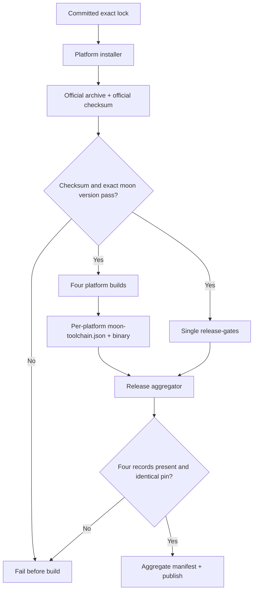

# Phase 14: Release Hygiene & Toolchain Pinning - Research

**Researched:** 2026-08-13
**Domain:** MoonBit 发布供应链、GitHub Actions 发布门禁与工作树卫生
**Confidence:** MEDIUM — 仓库拓扑/门禁为 HIGH；官方 `latest` 内容和安装器语义已验证，但未能证明一个完整、长期可寻址的四平台静态版本，故必须先执行 fail-closed 冻结探针。

<user_constraints>
## User Constraints (from CONTEXT.md)

### Locked Decisions

### Toolchain Identity and Acquisition
- **D-01:** 普通 CI 与 release CI 使用同一个、当前可从官方渠道为 Linux/macOS/Windows 全部 runner 获取的**精确稳定 MoonBit 版本**。不得继续使用 `latest`，也不得把已确认无法下载的历史本地 `0.1.20260724` 归档强行作为 release pin。研究/规划必须先验证候选版本在所有目标平台的官方工件与 core 工件均可获取，再锁定具体值。— **Reversibility:** costly — 更换 compiler pin 会使全部平台工件与 parity 证据重新生成并重新验证。
- **D-02:** 工具链安装复用一个仓库内的统一 CI 安装入口或等价单一配置源，避免 `ci.yml` 与 `fathom-native-release.yml` 各自漂移；Unix 与 Windows 可以保留平台专属解包步骤，但必须消费相同版本常量与验证规则。
- **D-03:** 只使用官方版本化工件，并在执行构建前验证官方校验和和精确 `moon version` 输出；下载失败、checksum 不符或报告版本不符均立即失败。不得用安装器的移动 channel 伪装成 pin。— **Reversibility:** one-way — 这是 1.0 发布供应链与可重复构建承诺，放宽需要公开修改发布安全政策。

### Release Gate Topology
- **D-04:** `fathom-native-release.yml` 增加独立、fail-closed 的 `release-gates` job；最终 publish job 必须通过显式 `needs` 依赖它和全部平台 build。门禁不依赖另一个 workflow 的历史成功状态，也不在四个平台中重复运行。
- **D-05:** release gate 复用现有真实命令，至少覆盖：Native/JS/linear-Wasm `parity` 测试、`scripts/compare_backends.py`、`scripts/diff_parity.py --frozen-only`、`scripts/check_naming.py`、`scripts/verify_corpus.py --check`、`corpus/tools/generate_corpus_report.py --check`、`corpus/tools/check_keywords.py corpus/keywords.tsv`。不得使用 `--update`、`continue-on-error` 或空结果容错。— **Reversibility:** one-way — 这些门禁是发布资格契约，删除或旁路会降低已承诺的 1.0 保证。
- **D-06:** tag 与 `workflow_dispatch` 两条发布路径运行完全相同的门禁；不提供 skip/bypass 输入。正式 `v1.0.0` tag 与 GitHub Release 的创建仍留给 Phase 20。

### Toolchain Evidence in Release Artifacts
- **D-07:** 每个平台 build 生成结构相同、机器可读的 `moon-toolchain.json`（或同等稳定名称），至少记录请求的精确版本、完整 `moon version` 原始输出、runner OS/arch 与目标平台；该记录与对应 Native binary 放入同一上传 artifact。
- **D-08:** publish job 下载四个平台记录，验证全部存在、请求版本一致、报告版本符合 pin，并生成一个聚合工具链清单作为最终 release asset。日志输出仅作诊断，不满足 TC-01 的“记录到发布工件”。
- **D-09:** 缺少工具链记录、requested/reported 不一致或跨平台版本不一致均阻断发布；不允许警告后继续。— **Reversibility:** one-way — 发布消费者和后续复现流程将依赖该证据格式；破坏性改动需版本化迁移。

### Working-Tree Hygiene
- **D-10:** `.gitignore` 使用仓库级 `pkg.generated.mbti` 规则覆盖任意 MoonBit package 的 `moon info` 生成接口，而不是只列 `fathom-sql/pkg.generated.mbti`；若存在已跟踪副本，规划必须显式解除跟踪。保留源代码接口文件与其他手写 `.mbti`（如有）。
- **D-11:** `.planning/research/.cache/` 是可再生缓存：删除并加入忽略。两个历史 quick 目录保留已提交的 `SUMMARY.md`，删除未跟踪、重复且不属于 canonical artifact 的 `PLAN.md`。不得删除已提交的历史总结。
- **D-12:** `.planning/milestones/v1.0-research/` 包含完整研究集且被后续上下文引用：作为正式 milestone archive 提交，不作为 stray 删除。— **Reversibility:** costly — 删除会破坏已有阶段上下文的 canonical refs 和历史审计链。
- **D-13:** `.planning/.omp-next-action.json` 与 `.planning/.omp-task-results.json` 是运行时状态，不属于发布产品变更；Phase 14 计划不得把会话漂移混入发布提交。对工作树使用显式 allowlist 和 fail-closed 状态检查，绝不运行 `git clean`、reset 或 stash 去吞掉未知用户工作。
- **D-14:** HYG-01 的 JetBrains action 变更按当前工作树原样收口：`actions/checkout@v7`、`actions/setup-java@v5`、`actions/upload-artifact@v7`。不顺手改 Gradle、Kotlin、IDE 兼容范围或插件发布逻辑。

### Claude's Discretion
`--auto` 模式下四个灰区均采用上述推荐方案。研究者/规划者可决定统一安装入口的文件名、JSON 字段附加项、release-gates job 内步骤拆分与具体可获取版本，但不得改变 D-01..D-14 的边界或失败语义。

### Deferred Ideas (OUT OF SCOPE)
- Product semver source and `fathom-sql`/`fathom-lsp --version` behavior → Phase 15.
- README/GETTING-STARTED release installation instructions → Phase 16.
- CHANGELOG and release boundary disclosure → Phase 17.
- npm and editor marketplace publishing → Phases 18–19.
- Creating the formal `v1.0.0` tag/GitHub Release and downloading published assets for post-release smoke → Phase 20.
</user_constraints>

<phase_requirements>
## Phase Requirements

| ID | Description | Research Support |
|---|---|---|
| HYG-01 | Commit JetBrains action bumps (`checkout@v7`, `setup-java@v5`, `upload-artifact@v7`) | D-14 + hygiene inventory isolate this exact change. [VERIFIED: .planning/REQUIREMENTS.md:16-20; .github/workflows/jetbrains-plugin.yml:25-46] |
| HYG-02 | Ignore `pkg.generated.mbti` outputs repository-wide | D-10 + current `.gitignore` gap/untracked artifact. [VERIFIED: .planning/REQUIREMENTS.md:16-20; .gitignore:1-12] |
| HYG-03 | Clean/archive `.planning` strays without polluting release commits | D-11..D-13 classify caches, duplicate plans, canonical archive/summaries, OMP state. [VERIFIED: .planning/phases/14-release-hygiene-toolchain-pinning/14-CONTEXT.md:35-40] |
| TC-01 | Exact MoonBit pin and toolchain evidence in artifacts | D-01..D-03 and D-07..D-09; freeze official acquisition first, then emit per-platform and aggregate evidence. [VERIFIED: .planning/REQUIREMENTS.md:11-15] |
| TC-02 | Full release gate matrix blocks publish | D-04..D-06; dedicated `release-gates` reuses existing commands and becomes explicit publish dependency. [VERIFIED: .planning/REQUIREMENTS.md:11-15; .github/workflows/ci.yml:70-223] |
</phase_requirements>

## Summary

本阶段将当前“移动 `latest` + 分散门禁 + 混杂工作树”改为单一精确工具链源、每平台可审计证据、独立发布资格门禁及显式卫生 allowlist。[VERIFIED: .github/workflows/ci.yml:12-16; .github/workflows/fathom-native-release.yml:17-20,136-197]

官方 Unix 安装器接受 `[VERSION]`/`MOONBIT_INSTALL_VERSION` 并下载 `binaries/$version/...` 与 `cores/core-$version.tar.gz`；Windows 安装器同样消费该变量，下载 `moonbit-windows-x86_64.zip` 与 `core-$Version.zip`。[CITED: https://cli.moonbitlang.com/install/unix.sh] [CITED: https://cli.moonbitlang.com/install/powershell.ps1] 官方下载页提供 archive `.sha256` 端点与 `sha256sum -c` 语义。[CITED: https://www.moonbitlang.com/download/#verifying-binaries]

但本次不能证明一个满足 D-01/D-03 的 static release：2026-08-13 的 Linux `latest` archive 报告 `moon 0.1.20260807 (4da23f8 2026-08-07)`，对应猜测的 `binaries/0.1.20260807/...` 返回 403；`latest/moonbit-darwin-x86_64.tar.gz` 也返回 403，且 Unix installer 只映射 Darwin arm64/Linux x86_64/Linux aarch64。[VERIFIED: direct official CLI probes, 2026-08-13] 因而不得推荐 `0.1.20260807` 或 `latest`；第一规划任务必须执行下述 deterministic freeze preflight，完成前不编辑 workflows。

**Primary recommendation:** 先冻结完整官方 exact version/URLs/checksums/expected `moon version`，再让普通 CI、四平台 build、单一 Ubuntu `release-gates` 只消费该 lock；publish 显式依赖 `build` 与 `release-gates`。[VERIFIED: D-01..D-09]

## Project Constraints (from CLAUDE.md)

- 保持同一 MoonBit core 的 Native/JS/Wasm 交付；本阶段不改产品实现或引入第二语言实现。[VERIFIED: injected .claude/CLAUDE.md]
- 发布工具链必须精确记录版本，不能跟随未记录的 `latest`。[VERIFIED: injected .claude/CLAUDE.md]
- 工具 bootstrap 后 parity/corpus checks 应本地、确定、离线；不引入 runtime service/package。[VERIFIED: injected .claude/CLAUDE.md]
- 按现有 workflows/scripts 模式复用，不新建重复 gate convention。[VERIFIED: injected .claude/CLAUDE.md]

## Architectural Responsibility Map

| Capability | Primary Tier | Secondary Tier | Rationale |
|---|---|---|---|
| Exact toolchain identity/acquisition | Repository CI policy | Official MoonBit distribution | Repo freezes identity/rules; official endpoints supply archive/core/checksum. |
| Four-platform Native build/evidence | GitHub Actions platform runners | Artifact storage | Each runner validates and emits its own evidence beside binary. |
| Parity/frozen/naming/corpus qualification | Single Ubuntu `release-gates` | Checked-in snapshots/manifests | Runs once for current release checkout and directly gates publish. |
| Aggregate validation/publish | `release` job | `build` + `release-gates` | `needs` is upload barrier; aggregator rejects missing/inconsistent evidence. |
| Working-tree hygiene | Git tracking/ignore policy | Planning archive policy | Ignore/delete regeneration, retain canonical history, exclude runtime state. |

## Standard Stack

### Core

| Component | Version/status | Purpose | Why |
|---|---|---|---|
| MoonBit toolchain | **Resolved only by Freeze Preflight; no floating fallback** | Native/JS/Wasm gates/builds | Current static four-platform acquisition not proven. |
| Official binary/core archives | Exact URLs in committed lock | Toolchain installation | Installer uses one version for binary and core. [CITED: official installers] |
| Official `.sha256` sidecars | Exact URLs/digests in lock | Verify before extraction | Official verification mechanism. [CITED: download verification page] |
| GitHub Actions | Existing workflows | CI/build/gate/publish DAG | Existing insertion points require no service. |
| Python stdlib | CI uses Python 3.11 | Gate/evidence validation | Existing scripts are local/fail-closed. |

### Supporting

| Component | Version | Use |
|---|---|---|
| `actions/checkout` | v7 | Checkout |
| `actions/setup-python` | v6 / Python 3.11 | Gate scripts |
| `actions/upload-artifact` | v7 | Binary + evidence upload |
| `actions/download-artifact` | v8 | Aggregate downloads |

No package installation or package legitimacy audit is required.

## Official Toolchain Acquisition Findings

### Proven official semantics

- Unix: optional `[VERSION]`, fallback order argument → `MOONBIT_INSTALL_VERSION` → `latest`; URLs `binaries/$version/moonbit-$target.tar.gz` and `cores/core-$version.tar.gz`.[CITED: https://cli.moonbitlang.com/install/unix.sh]
- Windows: `MOONBIT_INSTALL_VERSION` else `latest`; URLs `binaries/$Version/moonbit-windows-x86_64.zip` and `cores/core-$Version.zip`.[CITED: https://cli.moonbitlang.com/install/powershell.ps1]
- Unix target mapping verbatim: `Darwin arm64` → `darwin-aarch64`, `Linux x86_64` → `linux-x86_64`, `Linux aarch64` → `linux-aarch64`; no Darwin x86_64 arm.[CITED: Unix installer]
- Binary archives extract into `$MOON_HOME` with root `bin/`, `lib/`, `include/`, `share/`; core archive has root `core/` and extracts into `$MOON_HOME/lib`, then runs `bundle --warn-list -a --all` and wasm-gc bundle.[VERIFIED: official archive inspection + installers, 2026-08-13]
- Official checksum form is `<archive>.sha256`, validated via `sha256sum -c` (or Windows equivalent).[CITED: https://www.moonbitlang.com/download/#verifying-binaries]

### Observed moving snapshot — evidence only, never the pin

| Target | Moving URL result | Observed evidence |
|---|---|---|
| Linux x86_64 | HTTP 200 | raw version: `moon 0.1.20260807 (4da23f8 2026-08-07)`; archive SHA-256 sidecar: `36f5e7cf1545594e17cd3f1c0b757fe6e86ad0218bc96f419369cbb8502e62ba`. |
| macOS aarch64 | HTTP 200 | archive sidecar: `b4781a1e38c800d1fd65693b1970b2d2429faef31d8933d266a1f6e2693a96ef`. |
| Windows x86_64 | HTTP 200 | zip root includes `bin/moon.exe`; archive sidecar: `c659625f5c3a9fca5d17866bff3de07b6328c59628d74df5d5b4d79b78524880`. |
| macOS x86_64 | HTTP 403 | Not proven; installer has no target mapping. |
| Unix/Windows core | moving archives HTTP 200 | Core `.sha256` sidecars were not proven; local hashes are not vendor authority. |

All rows: [VERIFIED: direct official endpoint probes, 2026-08-13]. `0.1.20260807` guessed static binary/core paths returned 403, so compiler output is not assumed to be storage channel key.

### Mandatory Task 1: deterministic freeze preflight

Before any workflow/helper/`moon.mod` edit:

1. Obtain an official **static channel key**; reject `latest`, `nightly`, redirects to moving aliases, and version keys guessed solely from `moon version`.
2. GET (not only HEAD), require HTTP 200/non-empty, and record final URLs for:
   - `moonbit-linux-x86_64.tar.gz`
   - `moonbit-darwin-x86_64.tar.gz`
   - `moonbit-darwin-aarch64.tar.gz`
   - `moonbit-windows-x86_64.zip`
   - `core-<version>.tar.gz`
   - `core-<version>.zip`
   - all six official checksum sidecars.
3. Validate sidecar filename/digest before extraction; reject empty/error bodies, absolute/`..` archive entries, and unexpected root layout.
4. Execute the installed tool on native runners; capture complete raw `moon version`; require identical output on all four rows and exact equality to committed expected value. For macOS x86_64, prove executable/runner architecture rather than relabel an arm64 compiler.
5. Commit one lock source (recommended `.github/moonbit-toolchain.json`) containing schema version, static channel key, expected raw version, six archive URLs, six checksum URLs, six expected SHA-256 values. Installers/workflows have no fallback.
6. If Darwin x86_64 or any official core checksum remains unavailable, fail and stop Phase 14 implementation. No mirror, local historical toolchain, warning-only check, platform removal, or `latest` fallback is allowed.

This is the resolved handling of the unavailable official detail, not an open question.[VERIFIED: D-01/D-03]

## Architecture Patterns



### Pattern 1: Verify before execute
Download with `--fail`, fetch official sidecar, verify SHA-256, then extract, then exact-string assert the complete `moon version`, all before `moon check/build/test`.[CITED: official verification page]

### Pattern 2: Single-source installers
Unix and PowerShell helpers may differ in extraction syntax but must read the same lock and implement identical no-fallback/checksum/version semantics.[VERIFIED: D-02/D-03]

### Pattern 3: Evidence beside binary
Each build writes stable JSON with at least `schemaVersion`, `requestedVersion`, complete `reportedVersion`, `runnerOS`, `runnerArch`, `targetPlatform`; recommended additions are binary/core URL and verified digest. Put it in the same uploaded `dist` artifact.[VERIFIED: D-07]

### Pattern 4: Explicit publish barrier
`release.needs: [build, release-gates]`; no `always()`, bypass input, warning-only evidence path, or dependency on another workflow's past status.[VERIFIED: D-04/D-06/D-09]

### Anti-patterns
- `latest` plus a log line masquerading as reproducibility.
- Compiler-reported version guessed as official static URL key.
- Binary checksum verified but core left unverified.
- arm64 compiler evidence relabeled `macos-x86_64`.
- `--update`, `continue-on-error`, empty-tree tolerance, skip inputs.
- `git clean`, reset, stash, broad `git add -A`, or broad `.planning/` ignore.

## Existing Gate Inventory and Dedicated Topology

| Capability | Exact existing command | Fail-closed contract |
|---|---|---|
| Native parity | `moon test --target native --package parity` | Same committed snapshots; nonzero on divergence. |
| JS parity | `moon test --target js --package parity` | Runtime parity target. |
| linear-Wasm parity | `moon test --target wasm --package parity` | Executes wasm, not build-only. |
| Aggregate parity | `python3 scripts/compare_backends.py` | Defaults native/js/wasm; fails missing/failed target, empty tree, tree mutation. [VERIFIED: scripts/compare_backends.py:24-46,161-191] |
| Frozen regeneration | `python3 scripts/diff_parity.py --frozen-only` | Regenerates temp tree, byte/path compares, no approval register. [VERIFIED: scripts/diff_parity.py:10-38,101-168,211-235] |
| Naming | `python3 scripts/check_naming.py` | Product scope + zero-file guard + forbidden hit failure. [VERIFIED: scripts/check_naming.py:84-124,142-183] |
| Flink corpus | `python3 scripts/verify_corpus.py --check` | Offline/read-only manifest, pin, enum, hash, completeness, non-empty checks. [VERIFIED: scripts/verify_corpus.py:1-43] |
| Corpus report | `python3 corpus/tools/generate_corpus_report.py --check` | Staleness/invariants/claims/known-gaps checks. [VERIFIED: corpus/tools/generate_corpus_report.py:15-24] |
| Keywords | `python3 corpus/tools/check_keywords.py corpus/keywords.tsv` | Header/shape/enum/source/coverage checks. [VERIFIED: corpus/tools/check_keywords.py:4-18,44-104] |

`release-gates` runs all nine commands on one Ubuntu checkout with the same exact toolchain and Python 3.11. It does not run in the four-row build matrix. `release` explicitly needs `[build, release-gates]`, downloads four artifacts, rejects any absent/duplicate/unknown platform record, requires identical requested/reported versions, writes an aggregate toolchain manifest, then generates the existing product SHA-256 manifest/uploads. Tag and `workflow_dispatch` share this DAG and no bypass input.[VERIFIED: D-04..D-09; .github/workflows/fathom-native-release.yml:136-197]

## Toolchain Evidence Contract

Per-platform `moon-toolchain.json` minimum:

```json
{
  "schemaVersion": 1,
  "requestedVersion": "<exact static channel key>",
  "reportedVersion": "<complete raw moon version output>",
  "runnerOS": "<runner.os>",
  "runnerArch": "<observed architecture>",
  "targetPlatform": "<matrix platform>",
  "binaryArchiveSha256": "<verified vendor digest>",
  "coreArchiveSha256": "<verified vendor digest>"
}
```

The exact allowed target set, quoted verbatim from the workflow matrix, is: `linux-x86_64`, `macos-x86_64`, `macos-aarch64`, `windows-x86_64`.[VERIFIED: .github/workflows/fathom-native-release.yml:27-36] Aggregation accepts exactly this set, validates field types/non-empty raw output/schema, requires one requested/reported value across records and exact match to lock, then retains the four source records plus lock identity in a final asset. Missing/mismatch is fatal.[VERIFIED: D-07..D-09]

## Hygiene Artifact Classification

| Artifact | Observed state | Classification | Required action |
|---|---|---|---|
| `.github/workflows/jetbrains-plugin.yml` | modified; exact action values v7/v5/v7 | Canonical HYG-01 | Commit as-is; no Gradle/Kotlin/IDE/publish widening. |
| `fathom-sql/pkg.generated.mbti` | untracked | Regenerable `moon info` output | Add repo-level `pkg.generated.mbti` ignore and delete generated copy; explicitly untrack only if any tracked generated copies exist. |
| `.planning/research/.cache/` | untracked, five JSON files | Regenerable cache | Delete and ignore `.planning/research/.cache/`. |
| quick `260805-df9.../SUMMARY.md` | tracked | Canonical history | Keep unchanged. |
| quick `260805-df9.../PLAN.md` | untracked | Duplicate/non-canonical | Delete only PLAN. |
| quick `260805-e28.../SUMMARY.md` | tracked | Canonical history | Keep unchanged. |
| quick `260805-e28.../PLAN.md` | untracked | Duplicate/non-canonical | Delete only PLAN. |
| `.planning/milestones/v1.0-research/{STACK,FEATURES,ARCHITECTURE,PITFALLS,SUMMARY}.md` | five staged additions | Canonical milestone archive | Retain and commit as formal archive. |
| `.planning/.omp-next-action.json` | modified | Runtime state | Exclude; do not revert. |
| `.planning/.omp-task-results.json` | modified | Runtime state | Exclude; do not revert. |
| `.planning/.omp-checkpoint.json` | present, no scoped status row | Runtime state | Exclude unless owning workflow separately classifies it. |

Observed state: [VERIFIED: scoped filesystem/git status inventory, 2026-08-13]. Decisions: [VERIFIED: D-10..D-14]. Use path-explicit commits and fail on unexpected paths; never broad cleanup/staging.

## Don't Hand-Roll

| Problem | Don't build | Use instead |
|---|---|---|
| Vendor integrity | Local “official” hashes/custom crypto | Official sidecars + OS/Python SHA-256 verifier. |
| Platform archive naming | Guessed URLs | Installer templates + successful freeze GET/execution. |
| Cross-target comparison | New parity harness | Existing target tests + `compare_backends.py`. |
| Snapshot freeze | Self-diff or CI `--update` | `diff_parity.py --frozen-only`. |
| Naming/corpus rules | Inline workflow grep/JSON | Existing four Python gates. |
| Cleanup | `git clean`/reset/stash | Explicit inventory/allowlist. |

## Common Pitfalls

1. **Reported version ≠ channel key:** observed `0.1.20260807` static guess failed. Freeze by successful official endpoints, not string inference.
2. **macOS x86_64 evidence mislabeled:** both current macOS rows use `macos-14`, installer only maps arm64. Require executable/runner architecture evidence.
3. **Core unverified:** core is executable source input too; absent official sidecar blocks the phase.
4. **Gate exists but publish ignores it:** exact `needs` must include both build and release-gates, without `always()`.
5. **Evidence only in logs:** TC-01 requires per-platform artifact records plus aggregate asset.
6. **Cleanup destroys history/runtime work:** retain tracked summaries/archive, exclude `.omp-*`, never broad-clean.

## Environment Availability

| Dependency | Required by | Available | Evidence/fallback |
|---|---|---|---|
| Local MoonBit | research provenance | ✓ | `moon 0.1.20260724 (5f1406a 2026-07-24)`; not eligible release pin. |
| Official HTTP endpoints | freeze | partial | Three moving platform archives/core available; complete static set not proven. No fallback. |
| macOS x86_64 official archive | D-01 | ✗ not proven | moving URL 403 and no installer target. Freeze must block. |
| Official core sidecars | D-03 | ✗ not proven | probes did not prove them. Freeze must block. |
| `curl` | Unix/preflight | ✓ | local 7.76.1. |
| Python | gates | ✓ | local 3.9.23; existing CI pins 3.11. |

Missing without fallback: an immutable official channel with four binaries, two cores, all sidecars, and native exact-version proof. `latest`, mirrors, local history, warning-only checksum, or platform removal are forbidden.

## Security Domain

`security_enforcement` is enabled, ASVS level 1.[VERIFIED: .planning/config.json:20-49]

| ASVS category | Applies | Control |
|---|---|---|
| V2 Authentication | No | No auth surface change. |
| V3 Session Management | No | No sessions. |
| V4 Access Control | Yes | Top-level contents read; publish job alone gets contents write; upload after needs barrier. |
| V5 Input Validation | Yes | Validate downloads, sidecars, archive paths, JSON schema, tag/platform membership. |
| V6 Cryptography | Yes | Standard SHA-256 only; vendor sidecar is trust input. |
| V14 Configuration | Yes | One exact lock, least privilege, no moving fallback/bypass. |

Threats: moving alias/archive tampering (immutable URLs + vendor SHA + exact version), error-page archive/path traversal (`--fail`, archive validation, isolated extraction), omitted/relabelled evidence (exact four-key set + arch fields), dispatch bypass (same DAG/no skip), `.omp-*` commit pollution (path allowlist). Archive traversal hardening is [ASSUMED] but recommended; all locked supply-chain controls are verified from D-01..D-09.

## Assumptions Log

| # | Claim | Risk if wrong |
|---|---|---|
| A1 | Lock/helper filenames may be `.github/moonbit-toolchain.json`, `install-moonbit.sh`, `install-moonbit.ps1`. | Low; names are discretionary, contract is not. |
| A2 | A native environment capable of executing an official Darwin x86_64 archive can be selected. | High; freeze correctly blocks if false. |
| A3 | Archive path traversal check is needed in addition to checksum. | Low; defense in depth, does not change locked scope. |

## Open Questions (RESOLVED)

1. **Exact pin:** not honestly derivable from current official static evidence. Resolved by mandatory Task 1 freeze; failure stops implementation.
2. **Darwin x86_64:** current installer does not support it and moving archive probe failed. Direct official archive/native execution must be proven or phase blocks.
3. **Core checksums:** local hashes cannot substitute vendor authority. Missing official checksum blocks.
4. **Validation Architecture:** omitted because `workflow.nyquist_validation` is explicitly `false`.[VERIFIED: .planning/config.json:20-25]

## Sources

### Primary (HIGH)
- [Official Unix installer](https://cli.moonbitlang.com/install/unix.sh) — version/target/URL/layout/bundle semantics.
- [Official PowerShell installer](https://cli.moonbitlang.com/install/powershell.ps1) — Windows URL/layout semantics.
- [Official verification page](https://www.moonbitlang.com/download/#verifying-binaries) — `.sha256` and verification.
- [Official MoonBit docs v0.10.7](https://docs.moonbitlang.com/en/latest/) — current official documentation/backends.
- Direct official CLI archive/core/checksum probes, 2026-08-13.
- `.planning/phases/14-release-hygiene-toolchain-pinning/14-CONTEXT.md:17-44,121-128` — D-01..D-14 and scope.
- `.planning/REQUIREMENTS.md:11-20` — five requirements.
- `.github/workflows/ci.yml:12-223` — current pin and gate commands.
- `.github/workflows/fathom-native-release.yml:17-197` — current release DAG.
- `.github/workflows/jetbrains-plugin.yml:25-46` — HYG-01 action values.
- `.gitignore:1-12`; `moon.mod:1-4` — policy gaps/historical provenance.
- `scripts/compare_backends.py:1-27,43-46,161-191`.
- `scripts/diff_parity.py:1-38,101-168,211-235`.
- `scripts/check_naming.py:84-124,142-183`.
- `scripts/verify_corpus.py:1-43,53-122`.
- `corpus/tools/generate_corpus_report.py:1-24`.
- `corpus/tools/check_keywords.py:1-18,44-104`.

### Secondary (MEDIUM)
None; external research was restricted to direct official MoonBit sources.

### Tertiary (LOW)
Only A1..A3 above; none may bypass freeze.

## Metadata

- Standard stack: HIGH policy/components, MEDIUM acquisition.
- Architecture/gates/hygiene: HIGH, read from source/locked decisions.
- Exact toolchain pin: LOW until freeze succeeds; intentionally not recommended.
- Research date: 2026-08-13.
- Valid until: 2026-08-20 for official toolchain availability.

## RESEARCH COMPLETE

- D-01..D-14 and HYG-01/02/03 + TC-01/02 are fully mapped.
- `latest` and observed `0.1.20260807` are not accepted as pins; deterministic freeze is Task 1 and fail-closed.
- `release-gates` runs all existing parity/frozen/naming/corpus gates once and blocks publish with all platform builds.
- Per-platform and aggregate toolchain evidence contracts are defined.
- Every current hygiene artifact is classified without broad cleanup or runtime-state pollution.
