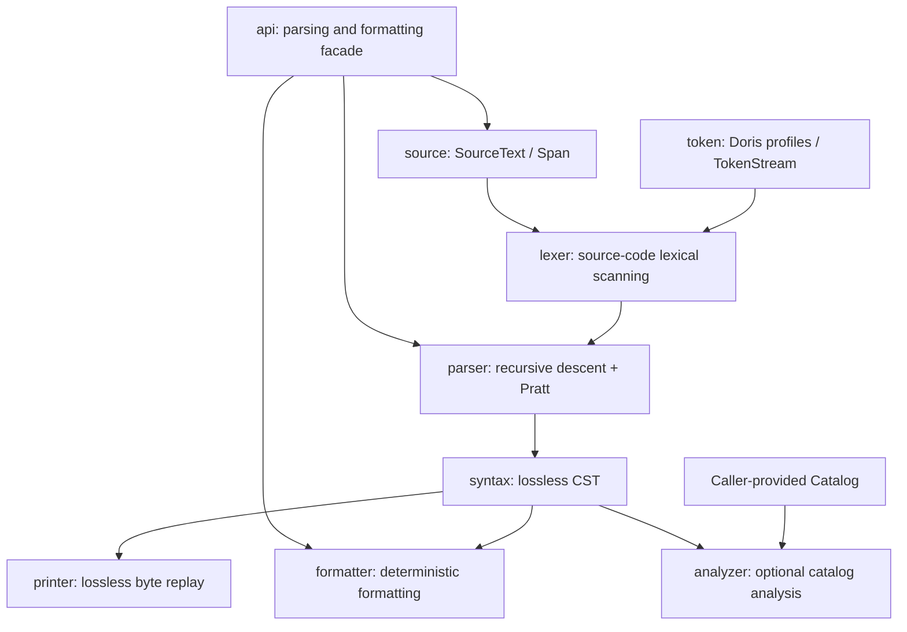

<!-- GSD:generated -->
English | [简体中文](zh-CN/ARCHITECTURE.md)
# System Architecture

## System Overview

Fathom is a Doris SQL Parser SDK implemented in MoonBit: it accepts source bytes (typically UTF-8; invalid encoding produces lexical diagnostics), a Doris version profile, a parsing mode, and resource limits, and outputs a lossless concrete syntax tree (CST) with byte positions, diagnostics, and recovery status. Based on the same parse result, callers can choose lossless printing, deterministic formatting, or limited table-reference resolution by injecting a catalog. The system uses a layered pipeline architecture. Its core path is `SourceText → Lexer → TokenStream → Parser → Syntax CST`; the `api` package provides a stable facade across layers, while `printer`, `formatter`, and the optional `analyzer` branch from the CST without introducing Doris execution semantics into the parsing core.

`moon.mod` declares the module as `fathom/doris-sql`, with version `0.1.0` and preferred target `native`; the core library package manifest explicitly declares `pkgtype(kind: "library")`, while `test/moon.pkg` does not declare a package type; `doris-sql/moon.pkg` declares `pkgtype(kind: "executable")` and provides a thin CLI adapter. The MoonBit toolchain version recorded in `moon.mod` is `moon 0.1.20260724`.

## Component Diagram



### Dependency Boundaries

- `source` is the lowest-level source snapshot and byte-coordinate package; it depends on no other repository package.
- `token` depends on `source` and centrally defines `DorisProfile`, version metadata, keyword classifications, token types, and `TokenStream`.
- `lexer` depends on `source` and `token` and provides the parser with a source-backed token stream; it does not construct a syntax tree.
- `syntax` depends only on `source` and defines immutable CST nodes and leaves that do not own source bytes.
- `parser` depends on `source`, `token`, `lexer`, and `syntax`; it is the only core package responsible for grammar productions, expression precedence, and recovery.
- `api` depends on `parser`, `formatter`, and the lower-level data packages. It validates parameters, converts results into primitive transport structures, and provides the `parse` / `format_text` facades.
- `printer` depends on the CST and source snapshot; it can replay a primitive tree through `api.ParseResult`, but does not modify the tree.
- `formatter` depends on the CST, source snapshot, and token classifications. It does not depend on `analyzer`, so formatting does not require a catalog.
- `analyzer` depends only on `syntax`; its `Catalog` is injected by the caller, and the parsing packages do not depend on it in return, keeping syntax validation separate from name resolution.

## Data Flow

An `api.parse` request follows this path:

1. **Build parsing options**: The caller uses `ParseOptions` to specify the `2.1`, `3.x`, or `4.x` profile, select `Strict` or `Editor` mode, and optionally set maximum byte count, token count, recursion depth, recovery steps, and diagnostic count. Profile metadata is validated in `token`; an unknown profile or mode, or mismatched release metadata, returns `ParseError` before parsing begins.
2. **Create the source snapshot**: `api.parse` calls `SourceText::new_with_limit`. Input size is checked before the line index is built; on success, `SourceText` stores the original `Bytes` and a `LineIndex` that supports mixed LF and CRLF input. All `Span` values use byte offsets and must fall within the source snapshot boundaries.
3. **Lexical scanning**: `parser.parse_with_limits_context` calls `lexer.lex_with_limit`. The lexer reads characters from the same `SourceText` and generates a `TokenStream` with spans, preserving whitespace, newlines, comments, and BOM. Unknown characters, invalid UTF-8, and unterminated literals are retained as error or unknown tokens, and a truncation position can be recorded when the token limit is reached.
4. **Parse by statement**: The parser splits the document into statement fragments at semicolons, ignores trivia for syntax decisions, and retains trivia in the tree as source-bound leaves. Keywords first select `SELECT`, DML, DDL, or another statement family; queries and subqueries are handled through recursive descent, while expressions use a single Pratt path for operator precedence, postfixes, and list structures.
5. **Error recovery**: In `Editor` mode, the parser creates `Error`, `Skipped`, or zero-width `Missing` nodes at missing tokens, invalid expressions, or clause boundaries, then continues to a statement-level semicolon or a clause boundary for the statement family. Recovery steps, recursion depth, and diagnostic count are limited. `Strict` mode still returns diagnostics and a tree, but does not mark an erroneous result as recoverable. Resource-limit and lexical problems use stable diagnostic structures.
6. **CST and public result**: The parser generates a `Document` root node and ordered child nodes. `api` checks the root node's span/child-node invariants, projects the `SyntaxNode` into a `PrimitiveNode`, and returns a `ParseResult`. The result also carries profile metadata, `valid`, `recovered`, the original source bytes, a diagnostic array, and the `doris.parse.v1` schema identifier.
7. **Consume on demand**: `printer.print_lossless` slices and precisely concatenates bytes from `SourceText` along the CST leaves, so it can verify `print_lossless(parsed.root, parsed.source) == input`, where `parsed = parser.parse(source, profile, mode)`. `formatter.format` applies layout, keyword casing, indentation, comma, line-break, and trailing-newline policies to trees with no error, missing, or skipped material; it refuses to output an unsafe tree. `analyzer.resolve_table_references` uses caller-provided bytes and a catalog to resolve target table names in supported DML/DDL statements, and does not participate in syntax-validity checks.

## Key Abstractions

| Abstraction | Location | Purpose |
|---|---|---|
| `SourceText`, `Span`, `LineIndex` | `source/source.mbt` | Stores one immutable source snapshot and provides byte-range validation, slicing, and line/column indexing; nodes reference spans rather than copying the entire source. |
| `DorisProfile`, `ProfileMetadata`, `ValidatedProfileContext` | `token/token.mbt` | Represents the three released profiles, `2.1`, `3.x`, and `4.x`, and validates release and feature-introduction metadata before parsing. |
| `ClassificationEntry` / `TokenKind` / `TokenStream` | `token/token.mbt` | Uses table-driven keyword classification to distinguish reserved, non-reserved, and contextual words, and provides the lexer/parser with a token stream carrying source positions. |
| `lex_with_limit` / `lex` | `lexer/lexer.mbt` | Performs synchronous, source-bound lexical scanning and recognizes identifiers, numbers, quoted material, strings, symbols, trivia, unknown material, and errors. |
| `SyntaxKind`, `SyntaxLeaf`, `SyntaxNode` | `syntax/syntax.mbt` | Defines CST nodes for `Document`, statement families, expressions, trivia, errors, skipped material, and missing material; construction validates span containment and source order. |
| `ParserLimits`, `ParsedDocument`, `ParserDiagnostic` | `parser/parser.mbt` | Constrains parsing resources and carries the parser's internal CST, diagnostics, profile, mode, `valid`, and `recovered` state. |
| `parse` / `parse_with_limits_context` | `parser/parser.mbt`, `api/api.mbt` | The parser package's `parse` / `parse_with_limits_context` functions return `ParsedDocument`; `api.parse` then converts its structured CST into a `PrimitiveNode`. |
| `ParseResult` / `PrimitiveNode` / `PrimitiveDiagnostic` | `api/api.mbt` | Provides a stable cross-boundary result shape containing byte spans, source, schema version, diagnostics, and nodes that can be queried by statement id. |
| `print_lossless` / `print_result` | `printer/printer.mbt` | Replays source bytes losslessly from either the real CST or a primitive parse result; missing nodes are zero-width and do not fabricate bytes. |
| `FormatOptions` / `FormatResult` / `format` | `formatter/options.mbt`, `formatter/error.mbt`, `formatter/format.mbt` | Provides keyword-casing, indentation, line-width, comma, line-break, and trailing-newline policies; layout is a one-way deterministic scan, and error trees use a refusal-first policy. |
| `Catalog` / `StaticCatalog` / `resolve_table_references` | `analyzer/analyzer.mbt` | Defines the injectable metadata boundary; the current implementation provides table-to-column lookup and target-table reference resolution for supported DML/DDL, without type inference or execution-semantic analysis. |

## Directory Structure and Responsibilities

```text
.
├── moon.mod              # MoonBit module name, version, and preferred build target
├── moon.pkg              # Root library package declaration
├── source/               # SourceText, Span, LineIndex, and source-input limits
├── token/                # Doris profiles, keyword classifications, Token, and TokenStream
├── lexer/                # Lexer that preserves trivia and error material
├── syntax/               # Immutable lossless CST that does not own source bytes
├── parser/               # Recursive-descent statement parsing, Pratt expressions, and recovery
├── api/                  # Public parse/format facades and primitive result model
├── printer/              # Lossless byte replay from a CST or ParseResult
├── formatter/            # CST layout, formatting policies, and refusal diagnostics
├── analyzer/             # Optional analysis based only on syntax and an external catalog
├── corpus/               # SQL fixtures, manifests, and coverage reports organized by Doris version and category
├── test/                 # MoonBit integration tests, parsing/recovery/formatting/analysis tests, and corpus oracles
├── _build/               # MoonBit-generated build output and dependency lock information
└── docs/                 # Project architecture and other development documentation
```

This organization separates “source-byte fidelity” and “syntax-tree structure” into two loosely coupled layers: `source` manages coordinates and original text, while `syntax` manages tree invariants. As a result, the printer can replay input losslessly without requiring the parser to copy text into every node. `token` carries both Doris version and keyword facts, so the lexer and parser share the same classifications; `parser` does not depend on `analyzer`, ensuring that pure syntax checking works without a catalog. `api` sits at the top of the package graph and converts MoonBit internal objects into primitive results suitable for consumption across Native, Wasm, or JavaScript boundaries; formatting, printing, and analysis remain independently callable post-processing branches. `corpus/` and `test/` separate versioned corpus data from test-execution logic, making it possible to review the coverage matrix and regression behavior independently.
