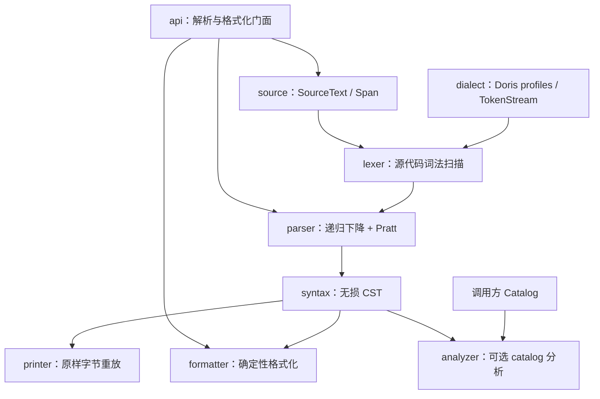

<!-- GSD:generated -->
English: [English architecture](../ARCHITECTURE.md) | 简体中文
# 系统架构

## 系统概览

Fathom 是一个使用 MoonBit 实现的 Doris SQL Parser SDK：它接收源字节序列（通常为 UTF-8；非法编码会产生词法诊断）、Doris 版本 profile、解析模式和资源限制，输出带字节位置的无损具体语法树（CST）、诊断信息及恢复状态；在同一解析结果之上，调用方可以选择原样打印、确定性格式化或注入 catalog 做有限的表引用解析。系统采用分层流水线架构，核心链路是 `SourceText → Lexer → TokenStream → Parser → Syntax CST`，`api` 包提供跨层的稳定门面，`printer`、`formatter` 和可选的 `analyzer` 从 CST 分叉，彼此不把 Doris 执行语义引入解析核心。

`moon.mod` 将模块声明为 `fathom/sql`，版本为 `1.0.5`，首选目标为 `native`；核心库包的 manifest 显式声明为 `pkgtype(kind: "library")`，`test/moon.pkg` 未声明包类型；`fathom-sql/moon.pkg` 声明 `pkgtype(kind: "executable")`，提供薄 CLI 适配器。`moon.mod` 中记录的 MoonBit 工具链版本为 `moon 0.1.20260827`。

## 组件图



### 依赖边界

- `source` 是最底层的源快照与字节坐标包，不依赖其他仓库包。
- `dialect` 依赖 `source`，定义 `DorisProfile`、`FlinkProfile`、`ProfileMetadata` 和 `ValidatedProfileContext`；是 profile 身份与 release/feature 元数据的唯一权威来源。
- `token` 依赖 `source` 与 `dialect`，集中定义关键字分类、token 类型和 `TokenStream`。
- `lexer` 依赖 `source`、`token` 与 `dialect`，为 parser 提供 source-backed 的词法流；它不构造语法树。
- `syntax` 仅依赖 `source`，定义不持有源字节的不可变 CST 节点和叶子。
- `parser` 依赖 `source`、`token`、`lexer`、`syntax` 和 `dialect`，是唯一负责语法产生式、表达式优先级和恢复的核心包。
- `api` 依赖 `parser`、`formatter` 以及底层数据包，负责参数校验、结果转为 primitive 传输结构，并提供 `parse` / `format_text` 门面。
- `printer` 依赖 CST 与源快照；它可通过 `api.ParseResult` 重放 primitive 树，但不改变树。
- `formatter` 依赖 CST、源快照和 token 分类，未依赖 analyzer，因此格式化不需要 catalog。
- `analyzer` 只依赖 `syntax`；其 `Catalog` 由调用方注入，解析包不反向依赖它，保持语法校验与名字解析解耦。

## 数据流

一次 `api.parse` 请求按以下路径执行：
1. **建立解析选项**：调用方用 `ParseOptions` 指定 `2.1`、`3.x` 或 `4.x` profile，选择 `Strict` 或 `Editor` 模式，并可设置最大字节数、token 数、递归深度、恢复步数和诊断数。profile 元数据在 `dialect` 中校验，未知 profile、模式或不匹配的发布元数据在进入解析前返回 `ParseError`。
2. **创建源快照**：`api.parse` 调用 `SourceText::new_with_limit`。输入大小先于行索引构建进行检查；成功后，`SourceText` 保存原始 `Bytes` 与支持 LF、CRLF 混合输入的 `LineIndex`。所有 `Span` 使用字节偏移，并且必须落在源快照边界内。
3. **词法扫描**：`parser.parse_with_limits_context` 调用 `lexer.lex_with_limit`。lexer 从同一份 `SourceText` 读取字符，生成带 span 的 `TokenStream`，保留空白、换行、注释和 BOM；未知字符、非法 UTF-8 和未闭合字面量保留为错误或未知 token，并可在 token 限制下记录截断位置。
4. **按语句解析**：parser 按分号切分文档中的语句片段，忽略 trivia 参与语法判断但把 trivia 作为源绑定叶子保留在树中。关键字首先选择 `SELECT`、DML、DDL 或其他语句族；查询和子查询通过递归下降处理，表达式通过单一 Pratt 路径处理运算符优先级、后缀和列表结构。
5. **错误恢复**：在 `Editor` 模式下，parser 在缺失 token、非法表达式或子句边界处生成 `Error`、`Skipped` 或零宽 `Missing` 节点，并继续到语句级分号或语句族的子句边界；恢复步数、递归深度和诊断数量受限。`Strict` 模式仍返回诊断和树，但不会把错误结果标记为可恢复。资源限制和词法问题使用稳定的诊断结构。
6. **CST 与公共结果**：parser 生成 `Document` 根节点及有序子节点，`api` 检查根节点的 span/子节点不变量，然后将 `SyntaxNode` 投影为 `PrimitiveNode`，返回 `ParseResult`。结果同时携带 profile 元数据、`valid`、`recovered`、原始 source bytes、诊断数组和 `fathom.parse.v1` schema 标识。
7. **按需消费**：`printer.print_lossless` 沿 CST 叶子从 `SourceText` 切片并精确拼接，因此可验证 `print_lossless(parsed.root, parsed.source) == input`，其中 `parsed = parser.parse(source, profile, mode)`；`formatter.format` 对无错误/无缺失/无跳过材料的树执行布局、关键字大小写、缩进、逗号、换行和尾换行策略，遇到不安全树则拒绝输出；`analyzer.resolve_table_references` 使用调用方字节和 catalog，对已支持的 DML/DDL 语句解析目标表名，不参与语法有效性判断。

## 关键抽象

| 抽象 | 位置 | 作用 |
|---|---|---|
| `SourceText`、`Span`、`LineIndex` | `source/source.mbt` | 保存一次不可变源快照，提供字节范围校验、切片和行列索引；节点只引用 span，不复制整段源码。 |
| `DorisProfile`、`ProfileMetadata`、`ValidatedProfileContext` | `dialect/doris.mbt` | 表示 `2.1`、`3.x`、`4.x` 三个已发布 profile，并在解析前验证 release 与 feature introduction 元数据。 |
| `ClassificationEntry` / `TokenKind` / `TokenStream` | `token/token.mbt` | 以表驱动的关键字分类区分 reserved、non-reserved、contextual 词，并为 lexer/parser 提供带源位置的 token 流。 |
| `lex_with_limit` / `lex` | `lexer/lexer.mbt` | 执行同步、源绑定的词法扫描，识别标识符、数字、引号、字符串、符号、trivia、未知和错误材料。 |
| `SyntaxKind`、`SyntaxLeaf`、`SyntaxNode` | `syntax/syntax.mbt` | 定义 `Document`、语句族、表达式、trivia、error、skipped、missing 等 CST 节点；构造时验证 span 包含关系和源码顺序。 |
| `ParserLimits`、`ParsedDocument`、`ParserDiagnostic` | `parser/parser.mbt` | 约束解析资源并承载 parser 内部的 CST、诊断、profile、模式、`valid` 和 `recovered` 状态。 |
| `parse` / `parse_with_limits_context` | `parser/parser.mbt`、`api/api.mbt` | parser 包的 `parse` / `parse_with_limits_context` 返回 `ParsedDocument`；`api.parse` 再将其中的结构化 CST 转成 `PrimitiveNode`。|
| `ParseResult` / `PrimitiveNode` / `PrimitiveDiagnostic` | `api/api.mbt` | 稳定的跨边界结果形状，包含 byte span、源码、schema 版本、诊断和可按 statement id 查询的节点。 |
| `print_lossless` / `print_result` | `printer/printer.mbt` | 分别从真实 CST 或 primitive parse result 原样重放源字节；缺失节点是零宽且不会伪造字节。 |
| `FormatOptions` / `FormatResult` / `format` | `formatter/options.mbt`、`formatter/error.mbt`、`formatter/format.mbt` | 提供关键字大小写、缩进、行宽、逗号、换行和尾换行策略；布局是单向确定性扫描，错误树采用拒绝优先。|
| `Catalog` / `StaticCatalog` / `resolve_table_references` | `analyzer/analyzer.mbt` | 注入式元数据边界；当前实现提供表到列的查找以及已支持 DML/DDL 的目标表引用解析，不做类型推断或执行语义分析。 |

## 目录结构与职责

```text
.
├── moon.mod              # MoonBit 模块名、版本和首选构建目标
├── moon.pkg              # 根 library 包声明
├── source/               # SourceText、Span、LineIndex 和源输入限制
├── dialect/             # Doris 和 Flink profile、profile 元数据与 feature introduction 门控
├── token/                # 关键字分类、Token 类型和 TokenStream
├── lexer/                # 保留 trivia 与错误材料的词法扫描器
├── syntax/               # 不拥有源字节的不可变 lossless CST
├── parser/               # 递归下降语句解析、Pratt 表达式和恢复
├── api/                  # parse/format 公共门面与 primitive 结果模型
├── printer/              # 从 CST 或 ParseResult 原样重放源字节
├── formatter/            # CST 布局、格式化策略与拒绝诊断
├── analyzer/             # 仅基于 syntax 与外部 catalog 的可选分析
├── corpus/               # 按 Doris 版本与类别组织的 SQL fixture、manifest 和覆盖报告
├── test/                 # MoonBit 集成测试、解析/恢复/格式化/分析与 corpus oracle
├── _build/               # MoonBit 生成的构建输出和依赖锁定信息
└── docs/                 # 项目架构及其他开发文档
```
这种组织把"源字节保真"和"语法树结构"拆成两个低耦合层：`source` 管理坐标与原文，`syntax` 管理树不变量，因而 printer 可以无损重放而 parser 不需要在每个节点中复制文本。`dialect` 承载 Doris 和 Flink 版本事实，`token` 承载关键字分类，lexer 与 parser 共享同一套分类；`parser` 不依赖 analyzer，确保没有 catalog 时仍能完成纯语法检查。`api` 位于包图上层，把 MoonBit 内部对象转换为适合 Native、Wasm 或 JavaScript 边界消费的 primitive 结果；格式化、打印和分析则保持为可单独调用的后处理分支。`corpus/` 与 `test/` 分离了版本化语料和执行测试逻辑，便于分别审查覆盖矩阵与回归行为。
